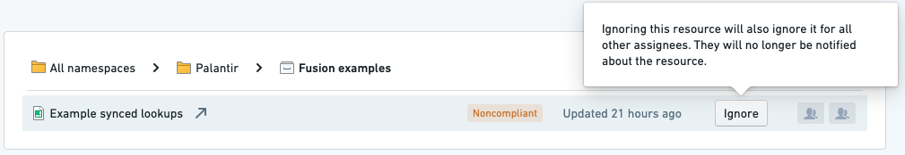

<!-- source: https://palantir.com/docs/foundry/upgrade-assistant/ignore-resources/ · mirrored 2026-08-16 from Palantir Foundry docs -->

# Ignoring resources

Upgrade Assistant can be configured to ignore resources; ignored resources are excluded from a campaign.

There are two primary consequences of ignoring a resource:

1. When Upgrade Assistant tracks progress, an ignored resource will be counted as if action had been taken for that resource, even if no action has been taken. This counting is intended to ensure that the progress percentage accurately reflects the resources which still require action.
2. Notifications will not be sent for ignored resources.

:::callout{theme="warning" title="Warning"}
If a resource is ignored in Upgrade Assistant, it is unlikely that any action will be taken on the resource as part of the campaign. Therefore, it is likely that an ignored resource will stop working after the campaign's due date, which may cause further issues.
:::

Ignoring a resource is an action that applies to all users viewing the ignored resource. You should only ignore a resource if you are sure that no action should be taken for the resource in the campaign.
