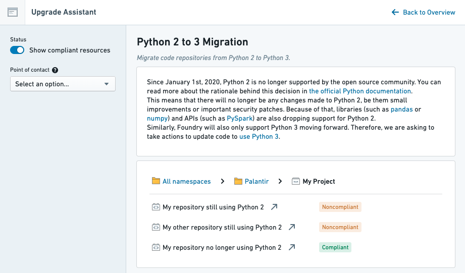

<!-- source: https://palantir.com/docs/foundry/upgrade-assistant/impacted-resources/ · mirrored 2026-08-16 from Palantir Foundry docs -->

# Identifying impacted resources

Before announcing a [platform change](/docs/foundry/upgrade-assistant/platform-changes/), Palantir writes telemetry that identifies any potentially impacted resource.
For example, before announcing the platform's deprecation of Python 2 in favor of Python 3, Palantir identified all repositories still using Python 2 and made the list of repositories available in Upgrade Assistant.

Most of the telemetry powering Upgrade Assistant is implemented as a background task, so it is not updated in real time.
Taking the Python 2 deprecation as an example: if you upgraded one of the repositories to Python 3 in preparation for the Python 2 deprecation, you would need to wait up to 24 hours for the repository to show as compliant in Upgrade Assistant.

Additionally, because each platform change is different, there is no standard way to identify potentially-impacted resources. However, changes announced in Upgrade Assistant may contain details about the telemetry in their description.
