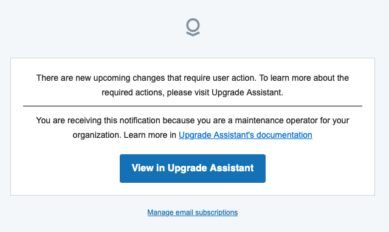
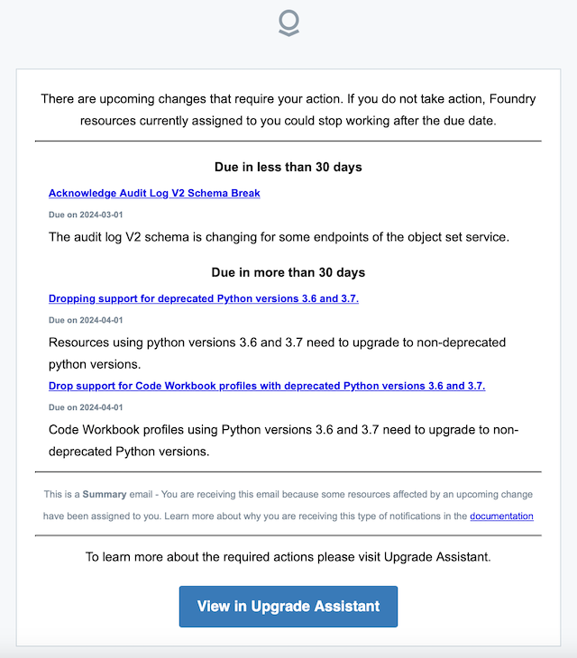
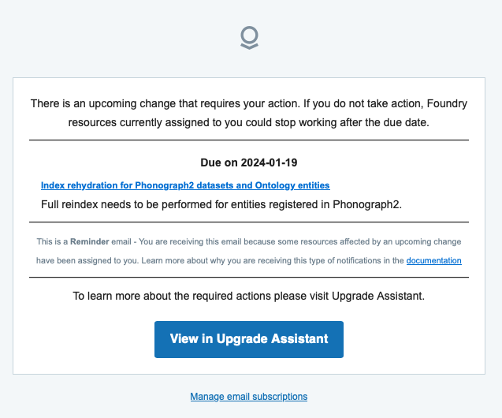
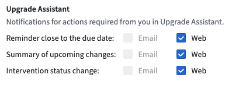

<!-- source: https://palantir.com/docs/foundry/upgrade-assistant/notifications/ · mirrored 2026-08-16 from Palantir Foundry docs -->

# Upgrade Assistant notifications

Upgrade Assistant sends email and in-platform notifications to alert relevant users on pending upgrades requiring action.

There are three types of upgrade assistant notifications, which are summarized below:

| Notification type | Audience | Purpose | Scope | Frequency |
| --- | --- | --- | --- | --- |
| [Status change](#status-change-notifications) | [Maintenance Operators](/docs/foundry/upgrade-assistant/technical-maintenance-operators/) | Announce a new platform change | For each platform change impacting your Organization | When an upgrade campaign becomes [`Pre-Published`](/docs/foundry/upgrade-assistant/technical-maintenance-operators/#review-pre-published-status-platform-changes) or `Published` |
| [Summary](#summary-notifications) | Users with at least one [assigned resource](/docs/foundry/upgrade-assistant/resource-assignment/) | Summarize all platform changes where the user has a pending action  | One summary including all platform changes where the user is assigned an open action that is not [ignored](/docs/foundry/upgrade-assistant/ignore-resources/) | Every 30 days per user |
| [Reminder](#reminder-notifications) | Users with at least one [assigned resource](/docs/foundry/upgrade-assistant/resource-assignment/) | Announce new upgrade campaign | For each platform change where the user is assigned an open action that is not [ignored](/docs/foundry/upgrade-assistant/ignore-resources/) | 30, 21, 14, 7, 5, 3, 2, 1 days before deadline \* |

*\* Note: The above table documents the standard reminder notification frequency. On rare occasions, your Organization may have configured a custom reminder frequency for a particular platform change.*

## Status change notifications

**Status change notifications** are sent only to [Maintenance Operators](/docs/foundry/upgrade-assistant/technical-maintenance-operators/). In the case where a platform change enters the [`Pre-published`](/docs/foundry/upgrade-assistant/technical-maintenance-operators/#review-pre-published-status-platform-changes) status, the subject of the email is "Review the new upgrade to Palantir Foundry: <Name of Platform Change>". In the case where a platform change enters the `Published` status, the subject of the email is "User action is required for new upcoming changes".

Status change notifications are intended to provide awareness of platform changes that have recently been added to Upgrade Assistant. No specific action is required of Operators that receive these notifications.

## Summary notifications

**Summary notifications** are sent, at maximum, once per a month. The subject of a summary notification email is "Your action is required for X upcoming changes". Summary notifications are intended to provide awareness of all ongoing platform changes where the user has been assigned at least one open action.

## Reminder notifications

**Reminder notifications** are specific to each platform change and warn users that resources will break unless appropriate action is taken. By default, reminder notifications are sent more frequently as the due date for taking action approaches. These notifications are sent to all users who have at least one assigned, pending resource to action for the upgrade.

Reminder notification emails are typically titled "A change affecting X resources assigned to you and due on Y is coming soon".

## Unsubscribing from notifications

If you no longer wish to receive notifications, you can unsubscribe from all further Upgrade Assistant notifications. **We discourage unsubscribing** as failing to meet platform change deadlines can disrupt workflows and cause problems with resources.

To unsubscribe from notification emails, follow the **Manage email subscription** link in a notification email or navigate to **Settings > Notifications** in Foundry, then make a selection for notification preference.

