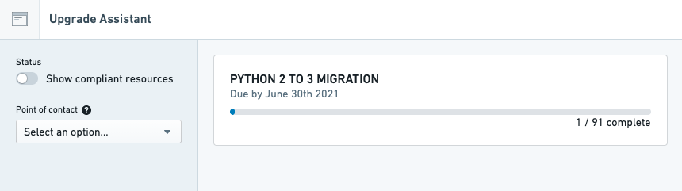

<!-- source: https://palantir.com/docs/foundry/upgrade-assistant/platform-changes/ · mirrored 2026-08-16 from Palantir Foundry docs -->

# Platform changes

**Platform changes** occur when a platform component, such as a backend service or a frontend application, is upgraded or has its configuration changed. Upgrade Assistant tracks platform changes and provides a [list of resources](/docs/foundry/upgrade-assistant/impacted-resources/) that are affected or may be affected by upcoming changes.

Example platform changes include:

* Modifications of endpoints, such as a change in semantics, URL, payload format, or a full deprecation;
* Modifications of libraries, such as a change in semantics, function names or arguments, or a full deprecation;
* Important bug fixes, such as platform security fixes or Spark fixes that could change the result of a job.

These platform changes may require extra attention because:

* The change is not backward-compatible (as is sometimes the case with modifications of endpoints or libraries).
  * Changes that are not backward-compatible may cause platform or workflow issues if appropriate steps are not taken before the change goes into effect.
* The change may affect workflow, pipeline, or analysis results (as may occur with a Spark correctness fix).
  * Users should review the impact of a change that may affect the results of their work.

## Due date

Each platform change announced in Upgrade Assistant has a due date, which is the scheduled date that the change will go into effect. As the due date gets closer, Upgrade Assistant will send [reminders](/docs/foundry/upgrade-assistant/notifications/) to users who are [assigned resources](/docs/foundry/upgrade-assistant/resource-assignment/).

:::callout{theme="neutral"}
Due to deployment constraints and scheduling, a change may be applied after its due date. However, the due date should still be considered the definitive time by which preparations for a change should be completed.
:::
