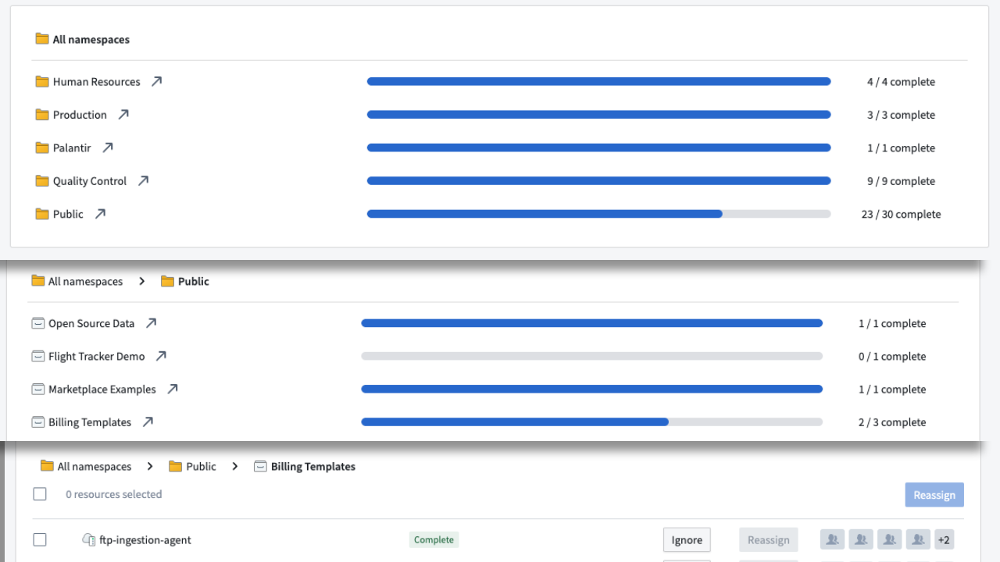
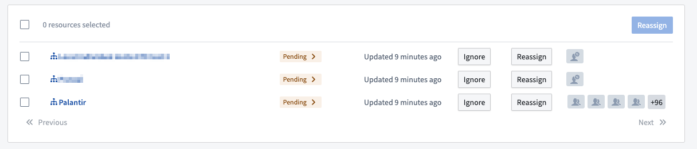
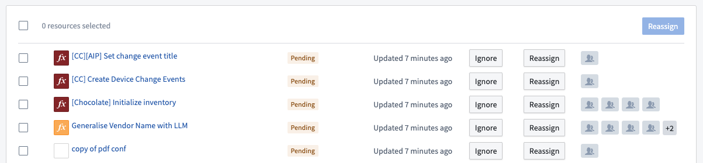

<!-- source: https://palantir.com/docs/foundry/upgrade-assistant/resource-type/ · mirrored 2026-08-16 from Palantir Foundry docs -->

# Resource Types in Upgrade Assistant

## Compass resources

Compass resources can be datasets, code repositories, data connection sources and agents, or any other resource usually accessible through Compass. These resources are displayed in a hierarchical view, first displaying the [space](/docs/foundry/security/orgs-and-spaces/#spaces), then the Project, then a list of resources.

## Enrollment resources

Enrollments are displayed with a specific   icon.

Enrollment resources are never updated automatically and must be manually marked as resolved by a [Maintenance Operator](/docs/foundry/upgrade-assistant/technical-maintenance-operators/).

The **Pending >** label has an arrow indicating that enrollments need to be manually marked as compliant.

## Other resources

Other resources are displayed in a list. Depending on the specific resource type, we may display additional information such as the name of the resource, the type of the resource, the Project it belongs to, and so on.

