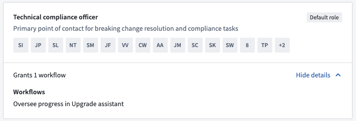
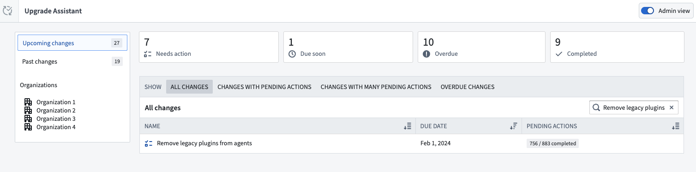
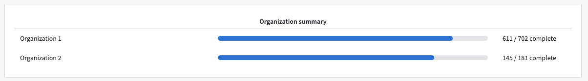
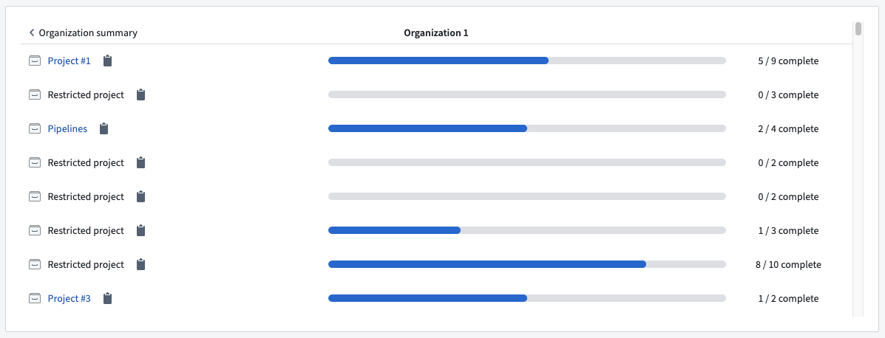
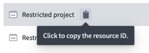

<!-- source: https://palantir.com/docs/foundry/upgrade-assistant/technical-maintenance-operators/ · mirrored 2026-08-16 from Palantir Foundry docs -->

# Maintenance Operator and Technical Compliance Officer

Certain users are granted special permissions to assist with tracking ongoing platform upgrades and supporting other users in making necessary changes for a smooth upgrade process. These users are known as Maintenance Operators who have a unique set of permissions shown as the `Oversee progress in Upgrade Assistant` workflow in Control Panel.

Maintenance Operators receive additional [notifications](/docs/foundry/upgrade-assistant/notifications/#status-change-notifications) alerting them to new upgrades as they become available on the platform. They also have access to comprehensive metadata, which aids them in tracking and understanding the progress of remediation for ongoing upgrades.

In addition, Maintenance Operators are given a preview of upcoming changes before they are officially published to the platform. This allows them to prepare and plan for these changes in advance.

## Becoming a Maintenance Operator

Maintenance Operator permissions are granted by Organization Administrators. These permissions can be accessed from the **Organization permission** section of Control Panel.

By default, these permissions are associated with two roles:

* Organization Administrator
* [Technical Compliance Officer](./../administration/enrollments-and-organizations-permissions.md#technical-compliance-officer-role)

A user assigned to either role will automatically receive the `Oversee progress in Upgrade Assistant` workflow, designating them as a Maintenance Operator.

For effective management of ongoing changes in the Upgrade Assistant, we recommend that Administrators appoint one or more Technical Compliance Officers specifically for this task.

## Identifying your Organization's Maintenance Operator

To find out who holds the Maintenance Operator permissions for your Organization, check the **Organization permissions** tab in Control Panel for users granted the [Technical Compliance Officer](./../administration/enrollments-and-organizations-permissions.md#technical-compliance-officer-role) role. This tab is only accessible to users with the Organization Administrator role.

If you do not have access to the **Organization permissions** tab, or if no user has been explicitly granted the Technical Compliance Officer role, contact your Organization Administrator. By default, the Organization Administrator is considered the Technical Compliance Officer.

## Review `Pre-published` status platform changes

Where possible, Palantir teams may make certain platform changes available for early review by Maintenance Operators by "pre-publishing" the platform change communications.

During the `Pre-published` period (typically 14 days), the platform change communications and list of affected resources will be available for Maintenance Operators to review, ahead of the information being `Published` for all affected Palantir users.

The `Pre-published` period provides an opportunity for Maintenance Operators to make inquiries with support, re-assign resources, or [ignore](/docs/foundry/upgrade-assistant/ignore-resources/) resources ahead of the broader publication date.

## Reassign any resources

Maintenance Operators can reassign any resource to another user. This is useful for resources that might have been wrongly assigned when using our [heuristics.](/docs/foundry/upgrade-assistant/resource-assignment/)

## Admin view

Maintenance Operators can switch to an **Admin view** from the Upgrade Assistant home page.

The admin view shows the total number of actions across all Organizations required for upcoming upgrades including:

* Actions not assigned to the current user
* Actions beyond the current user's permission scope

If the option does not appear on your screen, you lack the necessary permissions and will need to contact your Organization Administrator to request the `Technical Compliance Officer` role.

### Organization summary

Selecting an upgrade shows a summary of each Organization's progress. The numbers here represent aggregates across the entire Organization, regardless of the current user's permissions.

### Project summary

Selecting an organization reveals a summary of each affected Project's progress. This is only available for [Compass Resources](/docs/foundry/upgrade-assistant/resource-type/#compass-resources) upgrades. If the Maintenance Operator lacks access to some Projects, these Projects are listed as **Restricted projects**. However, the Maintenance Operator can still view and copy the unique resource identifier of the Project.

The Admin view is designed for Maintenance Operators to monitor the overall progress of ongoing upgrades. The view provides aggregate information and does not display individual resource details. This design allows the Upgrade Assistant to show data about the upgrade's impact on resources to which the Maintenance Operator may not have direct access.

### Export summary

Maintenance Operators can download a summary of the admin view data by selecting the **Export summary** option in the top-right corner. This action generates a CSV file detailing the remediation progress for the Organizations overseen.
