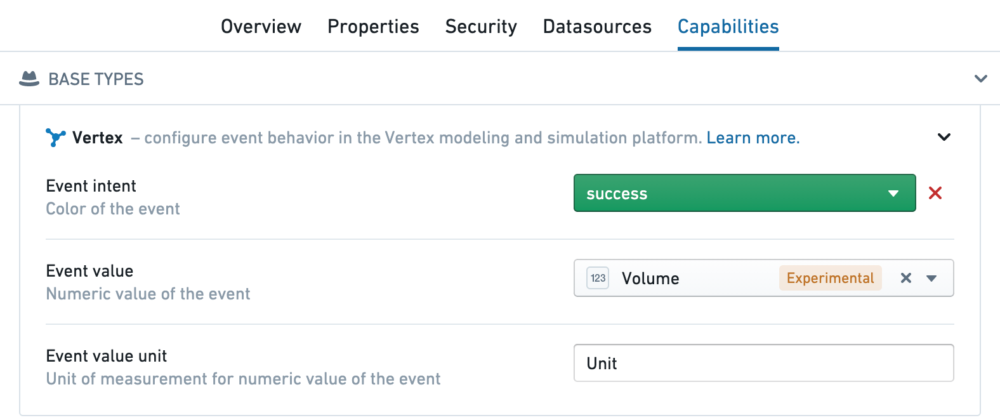

<!-- source: https://palantir.com/docs/foundry/vertex/configure-events/ · mirrored 2026-08-26 from Palantir Foundry docs -->

# Configure events

## Event configuration

To use events in Vertex, create a time series event object type and add one additional Vertex type class to set the color and/or severity of the alert (this can be on any column, but typically the primary key):

* Orange: `kind`: `vertex`, `name`: `event_intent.warning`
* Red: `kind`: `vertex`, `name`: `event_intent.danger`
* Blue: `kind`: `vertex`, `name`: `event_intent.primary`
* Green: `kind`: `vertex`, `name`: `event_intent.success`

You can configure these type classes in the **Capabilities** tab for the event object in the Ontology Manager or directly in the type classes for the properties of the object.

