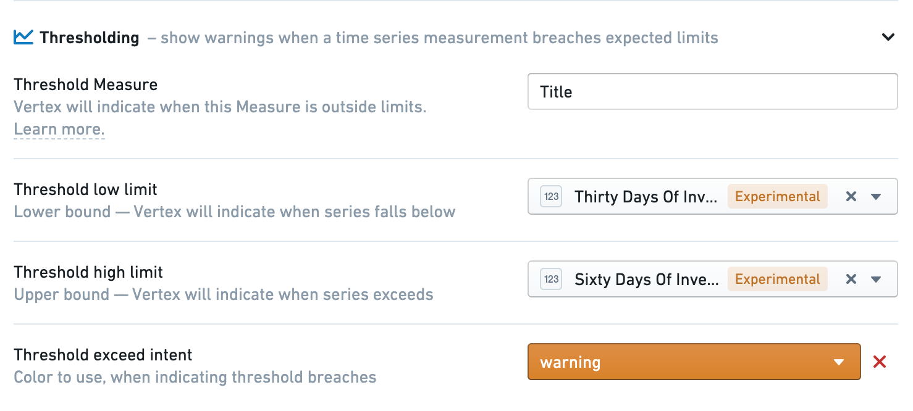

<!-- source: https://palantir.com/docs/foundry/vertex/configure-thresholds/ · mirrored 2026-08-26 from Palantir Foundry docs -->

# Configure thresholds

Within the Vertex Capabilities in Ontology Manager, you can configure Thresholds on time series measures which will indicate when a threshold has been breached.

