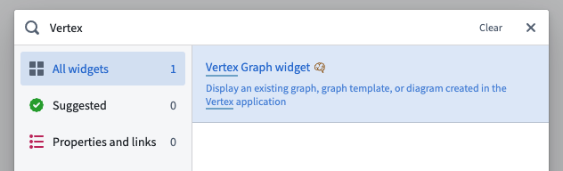
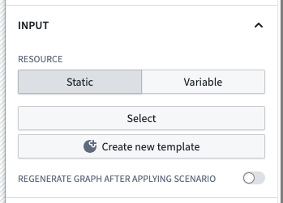
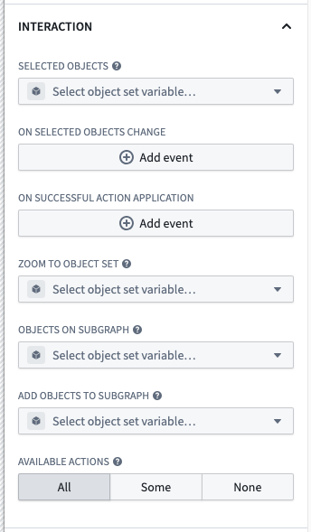
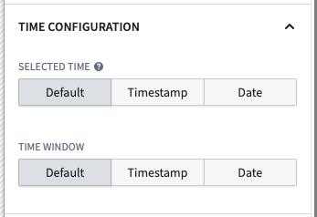
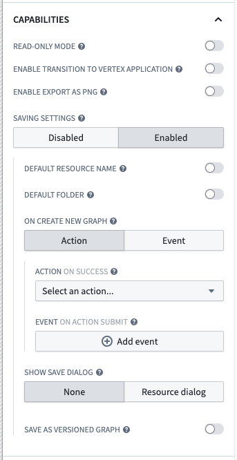
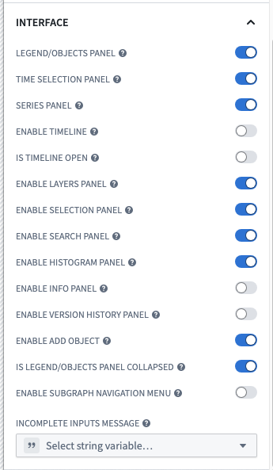

<!-- source: https://palantir.com/docs/foundry/vertex/embed-graph-workshop/ · mirrored 2026-08-26 from Palantir Foundry docs -->

# Embed a graph in a Workshop module

Graphs, graph templates, and diagrams can be embedded in Workshop modules, allowing users to interact with Vertex visualizations directly within Workshop workflows. This integration enables powerful data exploration and visualization experiences as part of broader Workshop modules.

Graph templates can be passed parameter values directly from Workshop variables, enabling dynamic data-driven visualization experiences that update based on user interactions or workflow state.

There are three main steps to embed a template in a Workshop module:

1. [Add a Vertex graph widget in Workshop](#add-a-vertex-graph-widget-in-workshop)
2. [Choose a resource](#choose-a-resource)
3. [Configure the widget](#configure-the-widget)

## Add a Vertex graph widget in Workshop

In a section of your choice in the Workshop module, click the **+** icon or the **+Add widget** button to open the widget menu, and search for the **Vertex Graph** widget.

## Choose a resource

In the widget editor, choose the graph, graph template or diagram resource you want to embed by clicking **Select**. Only compatible resources will show in the resource selector.

## Configure the widget

For the **Vertex graph** widget, configuration is organized into several sections. Each section controls different aspects of the widget's behavior and appearance.

### Input

The **Input** section controls the displayed graph or template and how it receives data.

* **Resource**
  * **Static:** When this resource mode is selected, a single input resource is chosen using a resource picker. This can be a graph, graph template, or diagram.
  * **Variable:** When this resource mode is selected, the input resource is provided by a string variable which should contain a graph, graph pointer or graph template RID.
  * **Override graph RID:** (Optional) If the chosen resource is a graph template, you can provide a graph RID to display instead of generating a graph using the template and its parameters. This allows loading an existing graph from an RID saved in a property on an object. Refer to the [saving and sharing graph explorations](#save-and-share-graph-explorations) section for more details.
* **Parameters**
  * When embedding a graph template, you can supply values for template parameters using Workshop variables. Each parameter defined in the template will appear here for configuration.
  * For object type parameters, select an object set variable from Workshop.
  * For non-object parameters, provide appropriate values based on the parameter type.
* **Sub-graph**
  * When embedding an existing graph or diagram resource with multiple sub-graphs, you can choose which sub-graph to display by selecting an object set variable from Workshop that contains any object from that sub-graph.
* **Refresh key**
  * Whenever this variable's value changes, the widget will perform a complete reload of the graph. This is useful for triggering refreshes based on workflow state changes.
* **Append on parameter change**
  * When enabled, changing the parameters will append new objects to the existing graph instead of regenerating it from scratch.
* **Scenario**
  * **Load data from scenario:** Enable this toggle to load the given resource using a scenario instead of the base Ontology.
  * **Regenerate graph after applying scenario:** When set, the graph will be refreshed after each scenario modification.

:::callout{theme="neutral"}
Previously, template inputs were supplied using a single input object set variable that contained all of the required object types defined in the graph template. This is now discouraged, as it only works for templates without non-object parameters and one object parameter per object type. If you wish to use this feature, select the **Use legacy input object set** checkbox and supply an object set variable.
:::

### Interaction

The **Interaction** section configures how users interact with the graph and how the graph interacts with other Workshop components.

* **Selected objects**
  * This option outputs an object set of the currently selected object(s). This object set can then be used in downstream widgets within the current module.
  * When a user selects objects in the graph, this variable will be automatically populated with the selection.
* **On selected objects change**
  * Configure Workshop events to trigger when the selected objects on the graphs change.
  * This can be used to open a drawer with a more detailed view of the selected objects, trigger a refresh of another widget, or any other Workshop event action.
* **On successful action application**
  * Configure Workshop events to trigger when a user successfully applies an action in the graph.
  * This event fires after the underlying action is executed successfully.
* **Zoom to object set**
  * Sets the viewport to display the objects in the given object set whenever the inputs change.
  * This allows you to programmatically focus the graph on specific objects.
* **Objects on subgraph**
  * Outputs an object set containing all the objects on the currently selected subgraph.
  * This is useful for capturing all objects visible on the current view for use in other widgets.
* **Add objects to subgraph**
  * Adds the given objects to the currently selected subgraph.
  * This allows you to programmatically add objects to the graph from other widgets.
* **Available actions**
  * Controls which actions are available to users directly within the graph interface.
  * Options include:
    * **All:** All actions on any object on the graph are available.
    * **Some:** Only the specifically selected actions are available.
    * **None:** No actions are available.

### Time Configuration

The **Time configuration** section controls how time is represented and interacted with in the graph.

* **Selected time**
  * Controls the selected time on the graph.
  * The selected time determines any readouts from temporal data displayed on the graph or in the selection panel.
  * Selecting a time is only available when one of the timeline, the time selection panel or the series panel are enabled.
  * The selected time defaults to the time the graph is loaded.
  * Options:
    * **Default:** Time selection is not synchronized using a variable.
    * **Timestamp variable:** Synchronize graph visuals with a Workshop variable of type `Timestamp`.
    * **Date variable:** Synchronize graph visuals with a Workshop variable of type `Date`.
* **Time window**
  * Controls the time window used on the graph. The time window determines the range of data displayed on any temporal charts.
  * Selecting a time window is only available when one of the timeline, the time selection panel or the series panel are enabled.
  * The default time window is configured in Control Panel.
  * Options:
    * **Default:** The time window is not synchronized with a variable.
    * **Timestamp:** Define a time window using two Workshop variables of type `Timestamp`.
      * **Start:** The beginning of the time window.
      * **End:** The end of the time window.
    * **Date:** Define a time window using two Workshop variables of type `Date`.
      * **Start:** The beginning of the time window.
      * **End:** The end of the time window.

### Capabilities

The **Capabilities** section controls the functional features that are available to users of the widget.

* **Read-only mode**
  * When enabled, this setting removes editing capabilities and hides the editing toolbar.
  * This is useful for creating view-only visualizations where users should not be able to modify the graph.
* **Enable transition to Vertex application**
  * When enabled, this displays a button allowing users to open the Vertex application with their current graph state.
  * This provides a seamless transition from the embedded graph in Workshop to the full Vertex application for more advanced operations.
* **Enable export as PNG**
  * When enabled, this allows users to export the current graph as a PNG image.
  * Users need to have frontend export permissions on the embedded resource to use this feature.
* **Saving settings**
  * Controls whether users can save the current graph state.
  * Options:
    * **Disabled:** Users cannot save the graph.
    * **Enabled:** Users can save the graph with additional configuration:
      * **Default resource name:** Specifies the name for newly saved graphs.
        * **Static:** Use a fixed text string as the name.
        * **Variable:** Use a Workshop string variable as the name.
      * **Default folder:** Specifies where newly saved graphs will be stored.
        * **Folder reference:** Select a specific folder.
        * **Static RID:** Use a specific folder RID.
        * **Variable:** Use a Workshop variable containing a folder RID or path.
      * **On create new graph:** Configure what happens when a graph is saved.
        * **Event:** Trigger a Workshop event when a graph is saved.
        * **Action:** Execute a Foundry action when a graph is saved.
          * The saved graph RID, saved graph name, and the current user's ID are available as a special inputs to the action.
          * All required parameters must have default values configured.
      * **Show save dialog:** Controls whether a resource dialog is shown when saving.
        * **None:** No dialog is shown; save the resource using the default name and location.
        * **Resource dialog:** User is prompted to choose a name and location.
      * **Save as versioned graph:** When enabled, saves the graph as a versioned graph even if it was previously unversioned. Versioned graphs allow autosaving and version history.

### Interface

The **Interface** section controls the UI elements and panels that are visible to users of the widget.

* **Legend/objects panel**
  * When enabled, this toggle will display the left-side panel, containing the layers, selection, search, histogram and info panels when enabled below.
* **Series panel**
  * When enabled, this toggle will display the series panel on the bottom of the widget.
  * The series panel shows time series data related to selected objects.
* **Time selection panel**
  * When enabled, this toggle will display the time scrubber on the top-right of the widget.
  * This panel allows users to interact with temporal data and select specific time points.
* **Enable timeline**
  * When enabled, this toggle will display the timeline view of the data.
  * This provides a chronological view of events and data points.
* **Is timeline open**
  * Controls whether the timeline is open or closed on first load of the module.
* **Enable layers panel**
  * When enabled, this toggle allows the layers panel to be displayed.
  * The layers panel provides controls for toggling visibility of different data layers.
* **Enable selection panel**
  * When enabled, this toggle allows the selection panel to be displayed.
  * The selection panel shows details about currently selected objects.
* **Enable search panel**
  * When enabled, this toggle allows the search panel to be displayed.
  * The search panel provides functionality to find objects in the graph.
* **Enable histogram panel**
  * When enabled, this toggle allows the histogram panel to be displayed.
  * The histogram panel shows distributions of property values across objects on the graph.
* **Enable info panel**
  * When enabled, this toggle allows the information panel to be displayed.
  * The info panel provides a high-level overview metadata about the graph, including a legend for its layers.
* **Enable version history panel**
  * When enabled, this toggle allows the version history panel to be displayed.
  * The version history panel shows previous versions of versioned graphs.
* **Enable add object**
  * When enabled, this toggle allows users to add new objects to the graph.
* **Is legend/objects panel collapsed**
  * Controls whether the legend/objects panel is collapsed or expanded on first load of the module.
  * This helps manage the initial visual space allocation in the widget.
* **Enable subgraph navigation menu**
  * When enabled, this toggle allows users to navigate between and create new subgraphs.
  * If the graph contains multiple subgraphs, the navigation menu will always appear regardless of this setting.
* **Incomplete inputs message**
  * When a graph template cannot run due to missing required inputs, this message is displayed to the user in a dialog.
  * Use this field to customize the message shown to users when required template parameters are not provided.

## Patterns

### Graph template parameterization

When embedding a graph template, you can parameterize it using Workshop variables. This allows you to create dynamic visualizations that update based on user inputs or other data in the workflow.

### Save and share graph explorations

A common pattern is to have a graph template that users can apply to some initial object, and then save their current exploration to continue exploration later.
This allows users to start from a templatized workflow, perform some additional investigation, and capture interesting insights or relationships discovered while interacting with the graph.
The saved graph can then be added as a reference to an object, allowing it to be easily shared with others or revisited later.

To implement this pattern, use the following steps:

1. **Add a property to the object type** that will hold the saved graph RID.
   * This property must be a string with **Value Formatting** using the **Resource RID** option.
   * This property must have an associated **Action** for setting the value, which will be used after saving the graph as a resource.
   * This object is typically the same object being passed as parameter to the graph template, but it could also be a separate specific object type that is used to hold saved graphs, often linked to the object being explored.
2. **Create a graph template** configured to perform the initial exploration.
3. **Embed the graph template in a Workshop module** using the Vertex graph widget.
   1. Select the graph template in the **Resource** section using the **Static** option.
   2. Configure any parameters to the template.
   3. Use the **Override graph RID** option to specify the object property that holds the saved graph RID.
      * This could be the same object as the one passed to the template, or in the case where the graphs are referenced on a linked object, discovered using a Workshop variable from searching links or a separate list of saved graphs.
4. **Enable saving settings** in the widget configuration to allow users to save their current graph state.
   * Use the **On create new graph** option to run the action that sets the property value to the saved graph RID.
   * When configuring the action parameters, make sure to pass the special **Saved graph RID** value to the appropriate parameter.

Following this pattern, when a user selects the save icon, the current graph state will be saved as a resource, and the property on the object will be updated with the RID of the saved graph. When the user revisits the object, the saved graph will be loaded using the **Override graph RID** option.
