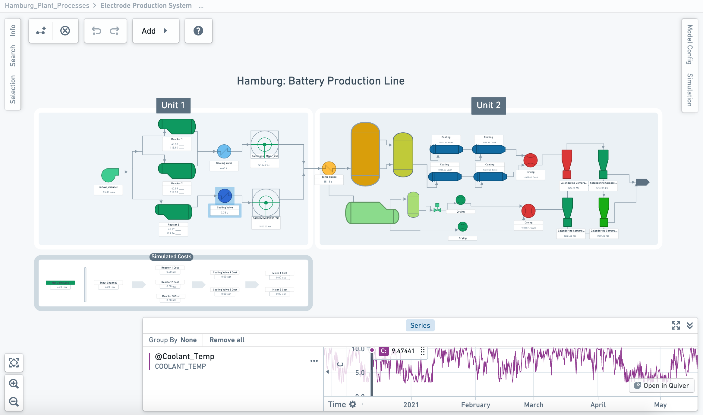
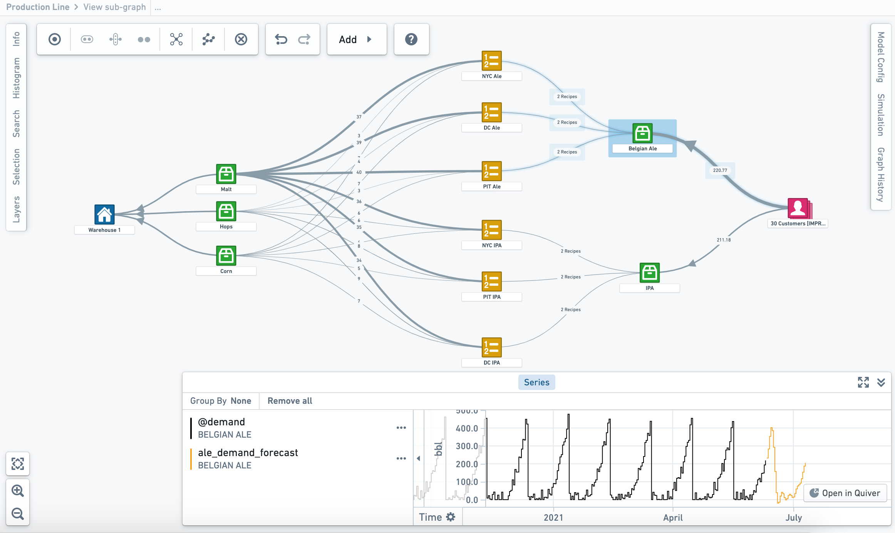

<!-- source: https://palantir.com/docs/foundry/vertex/example-use-cases/ · mirrored 2026-08-26 from Palantir Foundry docs -->

# Example use cases

This page describes several examples of how Vertex can be used in an organization.

## Point-and-click process flow diagramming \[Beta]

:::callout{theme="neutral" title="Beta"}
Diagramming in Vertex is in the [beta](/docs/foundry/platform-overview/development-life-cycle/) phase of development and may not be available on your enrollment. Functionality may change during active development. To enable this feature, contact your platform administrator to modify Vertex settings in Control Panel.
:::

* Create a dynamic, integrated digital twin of your operations that allows you to test conditions that maximize organizational outcomes.
* Rapidly configure object-backed system graphs or production diagrams for any type of workflow, from material processing and equipment tuning to production and supply chain management.
* Leverage pre-defined relationships between your modeled objects and processes to visualize material flow and events across your system.
* Configure and style your object graph or diagram based on key properties, metrics, or measures in order to tailor your system visualizations.

**Production diagrams:**

*This screenshot uses notional data.*

**System graph:**

*This screenshot uses notional data.*

## Simulation, dynamic analysis, and decision optimization

Vertex allows you to interact and interrogate your digital twin through integration with any model, forecast, or business logic published in Foundry.

* Run “what-if” analyses and simulations across your entire network to understand and compare the implications of decisions, events, or potential changes impacting your systems.
* Configure and run simulations to apply the real-world context necessary to accurately quantify the impact of proposed changes to your modelled universe.
* Connect processes and systems across your digital twin to break through operational and data silos and drive new multi-disciplinary innovation across your organization.
