<!-- source: https://palantir.com/docs/foundry/vertex/explore-object-relationships/ · mirrored 2026-08-26 from Palantir Foundry docs -->

# Explore object relationships

Vertex allows you to visualize and quantify cause and effect across the digital twin of your real-world organization. Using Vertex, you can access and explore existing graphs that have been published by your organization or build new graphs.

## Start a new exploration

Vertex can be launched from the Foundry workspace sidebar's **Apps** section, under the **Operational Applications** header. To launch a new exploration, select **Vertex** from the list of applications and click on the **+ New Graph** icon.

When starting a new exploration, a blank workspace will open where you can choose to **+ add objects** to get started. From the object search pop-up, select the object(s) you are interested in exploring to begin creating your graph.

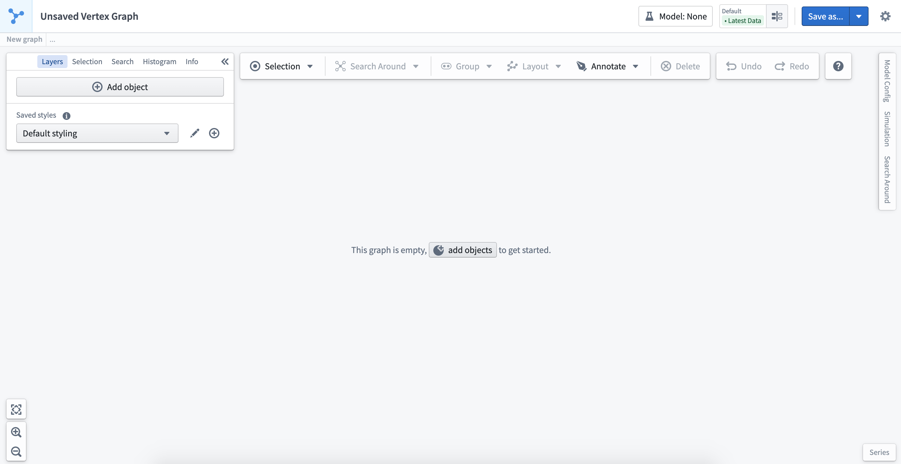

### Object selection panel

When you click on an object on the graph, the selection panel will automatically open to display the properties of the object.

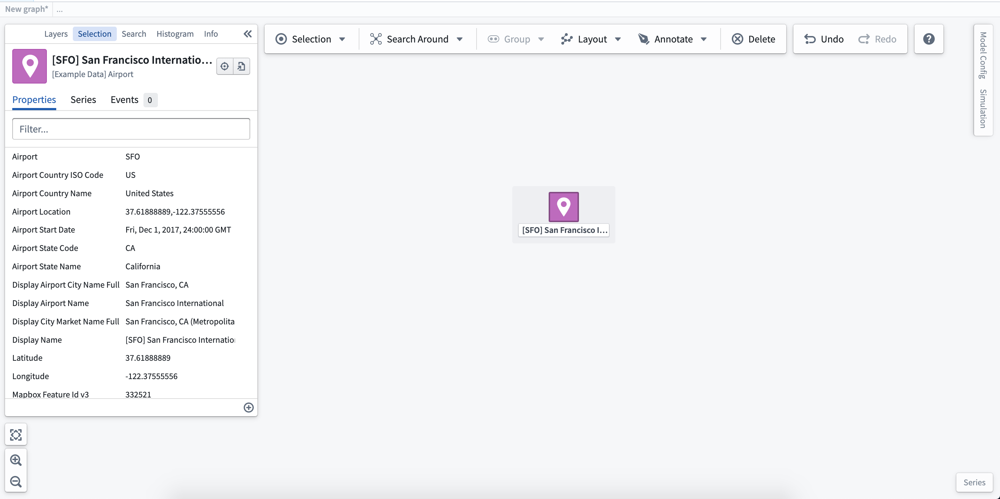

Selecting the **(+)** symbol at the bottom right corner of the selection panel will allow you to add [derived property functions](/docs/foundry/vertex/derive-property-functions/). In this case, a simple function calculates the total number of alerts on routes related to the airport. Derived properties are shown at the top of the selection panel.

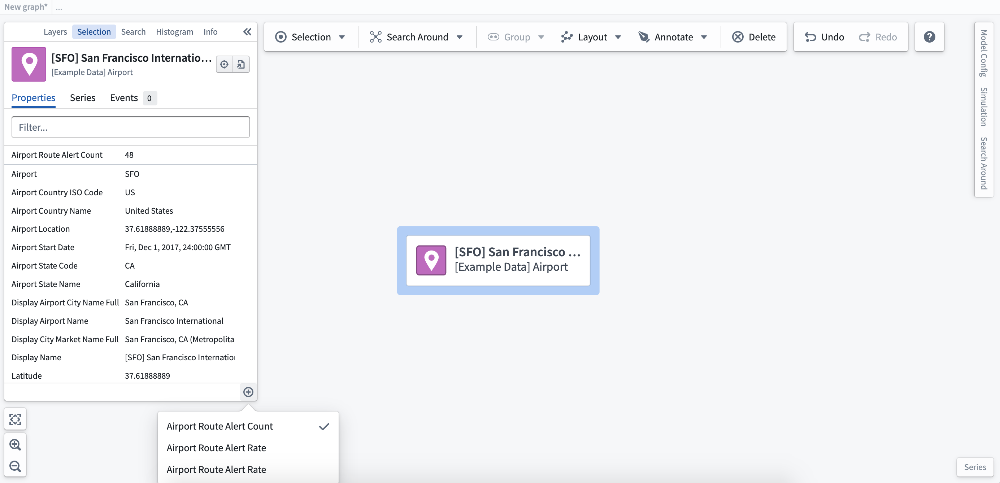

## Explore related objects

Vertex allows you to traverse operational relationships to build out your graph visualization. From an individual node or group of nodes, you can right-click to see your selection, layout, and exploration options.

### Search Around

Select from the list of related objects to add them to the graph. The total number of objects of each type is shown within the dropdown list. With a large number of objects, you should consider using the filter icon next to the number of objects to include additional filters. This will open the **Search Around** panel where you can add filters and search across multiple steps.

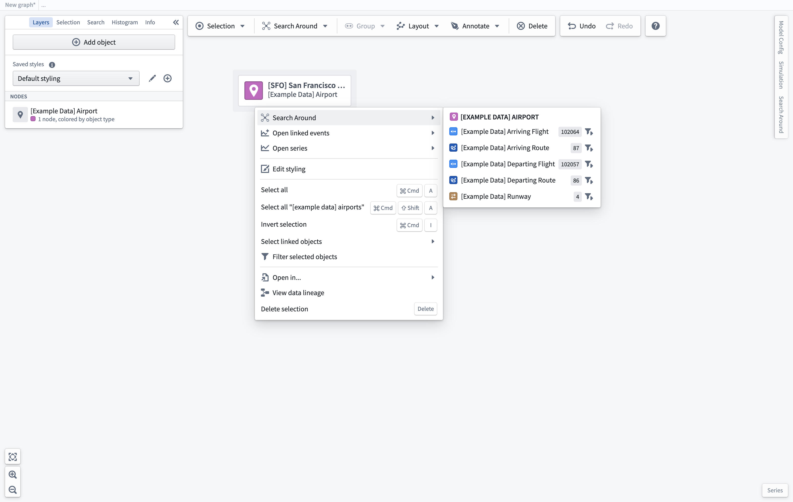

### Build multi-step Search Arounds

Running basic Search Arounds from objects on your graph can be a great way to explore your Ontology and quickly add relevant related objects to the graph. In cases where you want to create a multi-step, filtered graph that crosses different object types, the **Search Around** panel provides a point-and-click interface to build out logic as you generate a new graph.

You can access the **Search Around** panel by selecting the filter icon within the basic **Search Around** dropdown list or through the tabs available on the right side of the workspace. To start the Search Around, select a single object or objects of the same type; then, you will be able to create a Search Around from your selection by choosing a link.

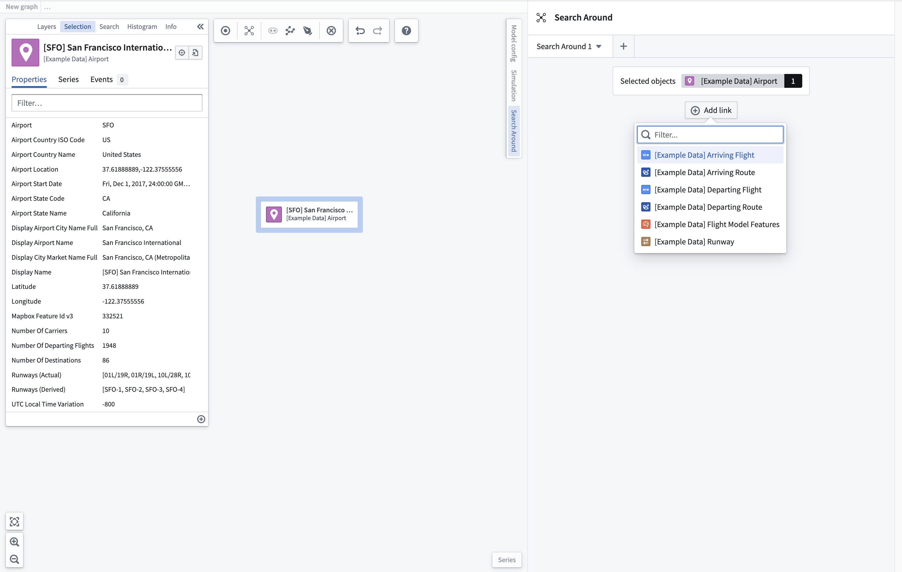

If you would like to update your starting set of objects, select a new object (or group of objects) and click the **Set starting objects** option which appears when hovering over the starting objects box.

### Find related objects

Once you have selected the related object(s) to add, the number of objects found will be shown next to the resulting object type. To further filter the returned objects, click the **Add filter** button and select the property you wish to use to filter the resulting object set.

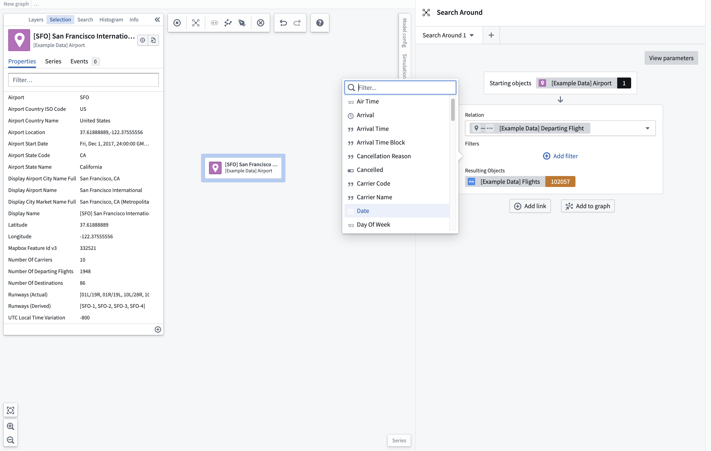

Once you have filtered your object set, you can choose to add this to your graph immediately, or continue building a multi-step Search Around across multiple objects using the **Add link** button.

The next link in the Search Around will take the resulting object set from the previous link as its starting object set. Using the object set resulting from this new Search Around, you can find additional related objects to add to the graph; in this case, the destination airport for the flights generated in Link 1.

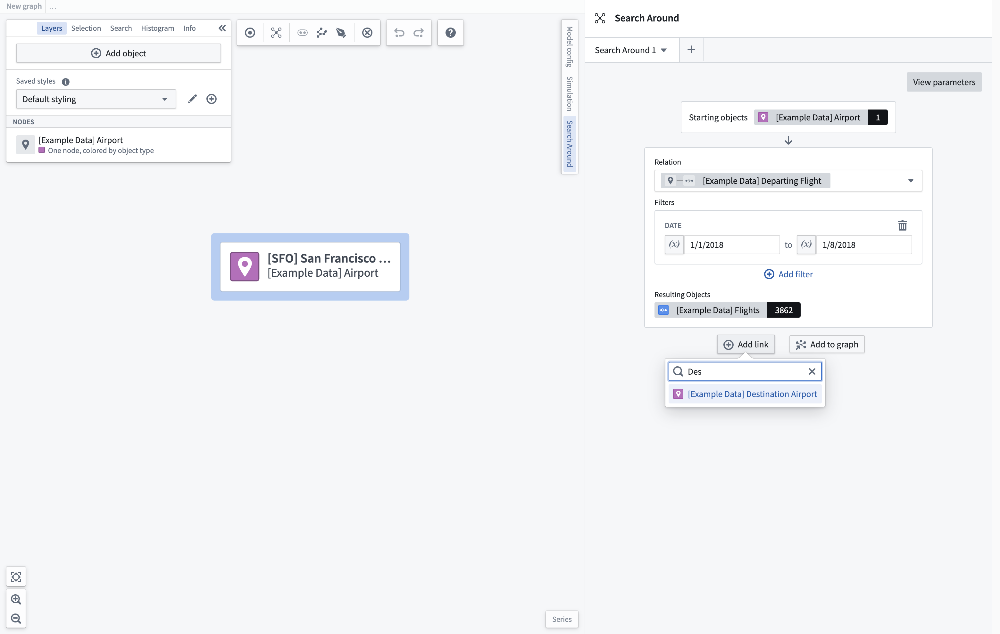

Once you have added the new related object set, you can filter this object set further. Once a filter has been applied, the starting object set will be filtered to those objects connected to the filtered resulting object set. In this case, 157 flights are departing to a NY state airport.

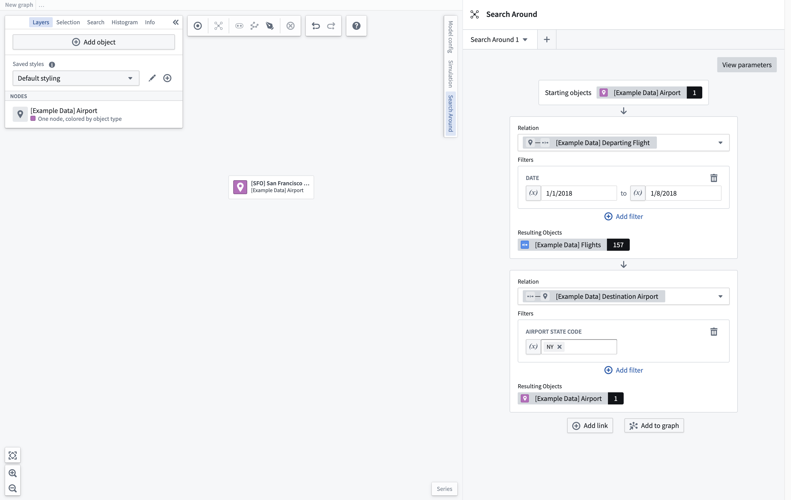

Select **Add to graph** to generate a new graph based on the traversals defined in the Search Around panel. It may take some time to generate the graph, depending on the complexity of the Search Around.

### Add parameters

To enhance reusability of Search Arounds, you can define parameters which can be used throughout the Search Around. Select the **View parameters** button in the top right corner of the panel to view any existing parameters or create new ones. Select the **Add parameter** button to choose the type of parameter to add.

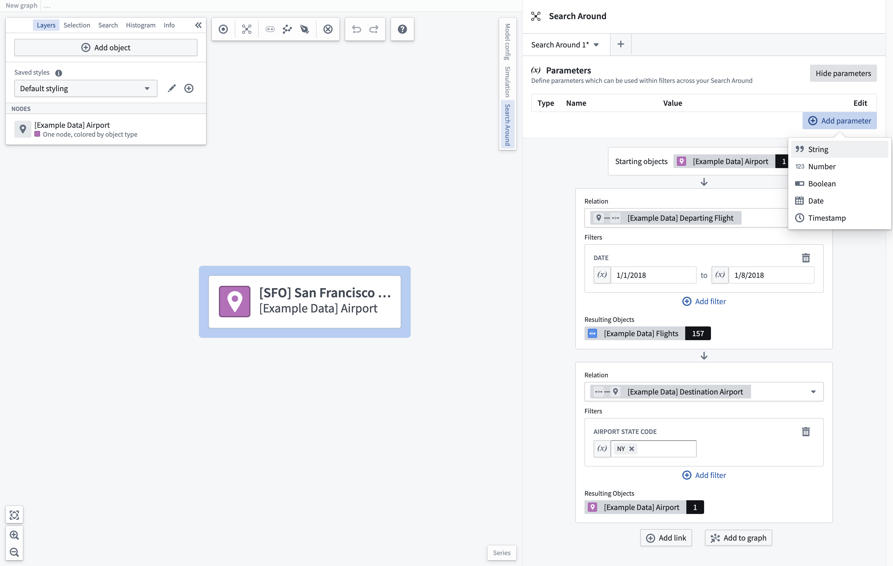

Once you add a parameter, you can give it a value or select the edit button to change its name, description, and default value which will be used when loading this Search Around.

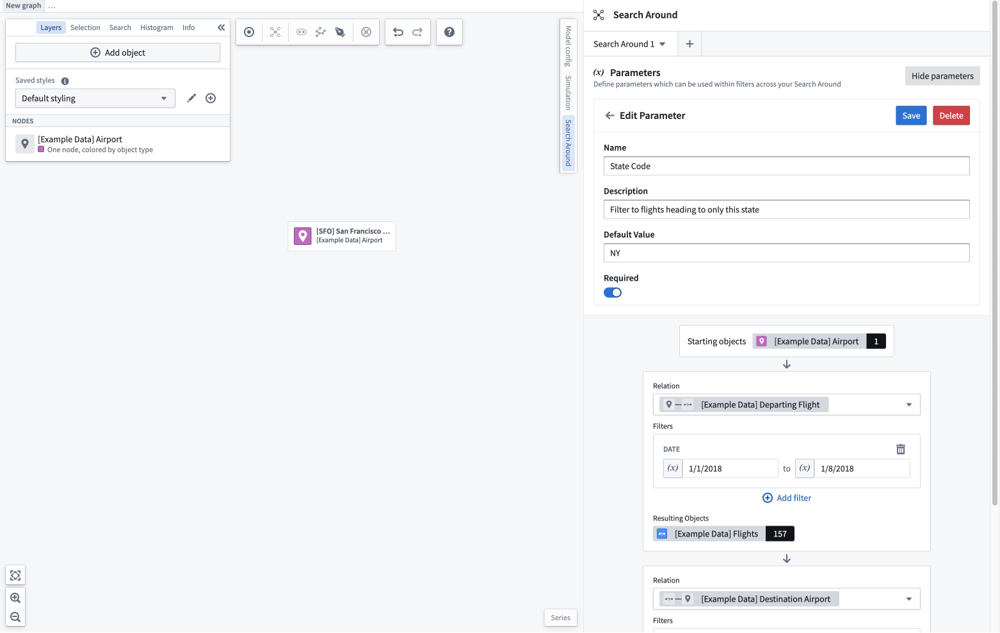

You can then use this parameter in any filter field of an appropriate type. To use a parameter, select the parameter toggle next to the filter field and then choose a parameter from the dropdown. When changing the value of the parameter, the Search Around will be updated to reflect the new value in any spot where that parameter is used.

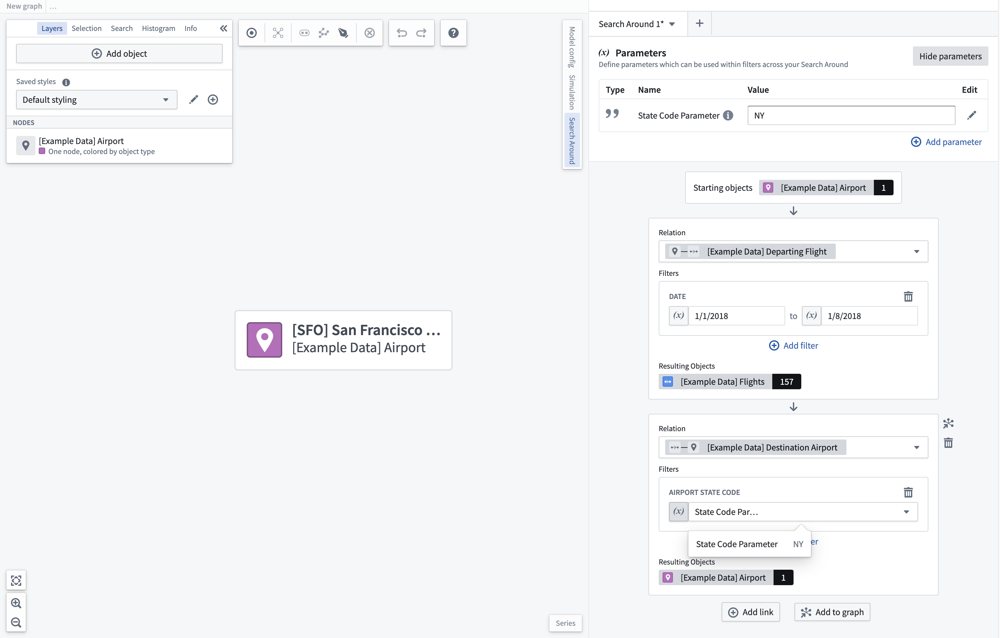

### Save and load

If you would like to reuse this Search Around in other graphs or within graph templates, you can save it as a resource. To do this, select the dropdown next to the tab for the Search Around you would like to save. This will open a modal where you can choose the name and location to save the Search Around.

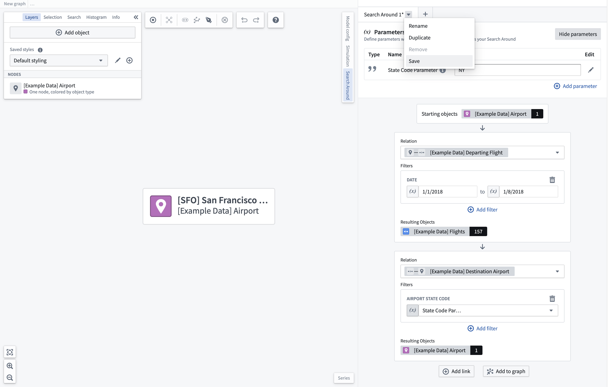

When adding a new Search Around through the **+** icon in the Search Around tab header, selecting the **Load Search Around** option will open a resource picker to allow you to choose the Search Around to open. Upon loading the Search Around, you will be prompted to select objects from the graph to be used as the starting object set for the search around. Only objects of the appropriate type can be selected.

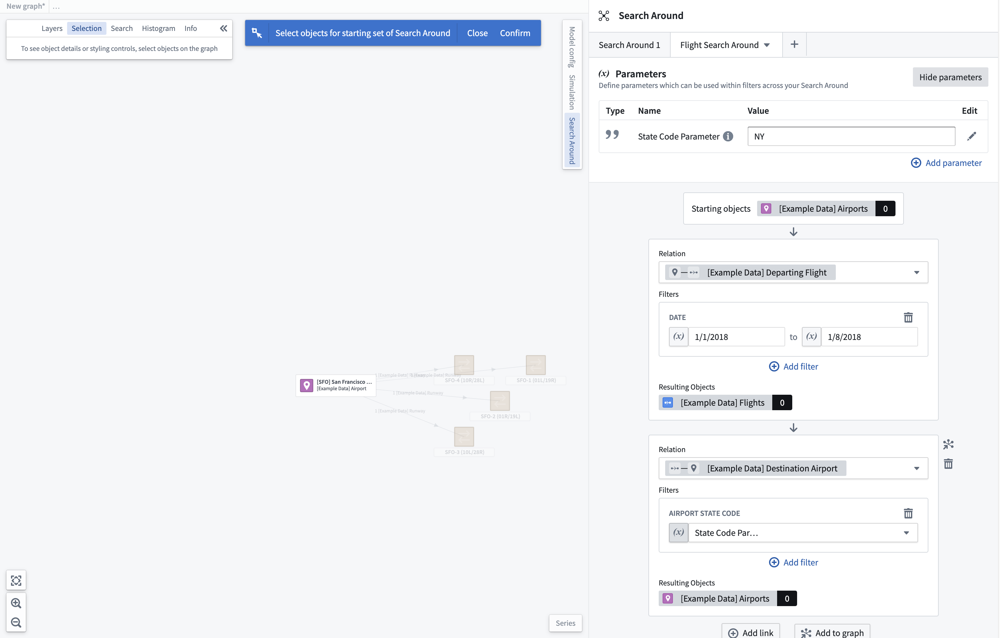

## Histogram filters

Once you have built your object graph, you can explore and filter the graph using the histogram filters. The histogram displays the properties for selected objects and provides the total values for each. Selections made in the histogram will be reflected in the graph, giving you additional granularity in exploration.

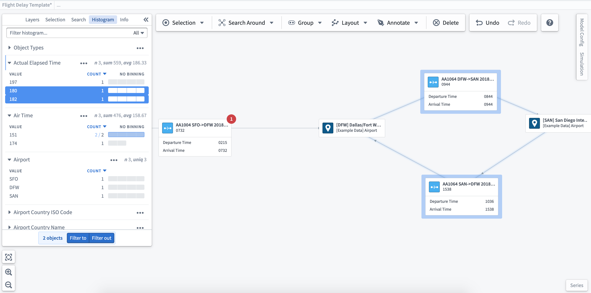
