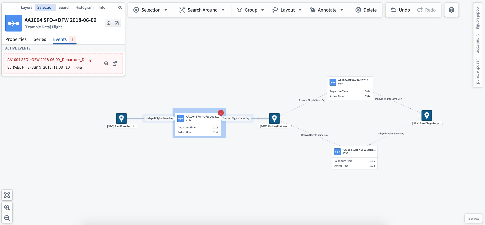
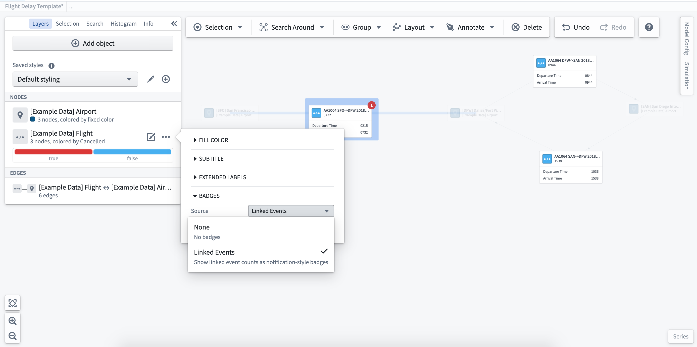
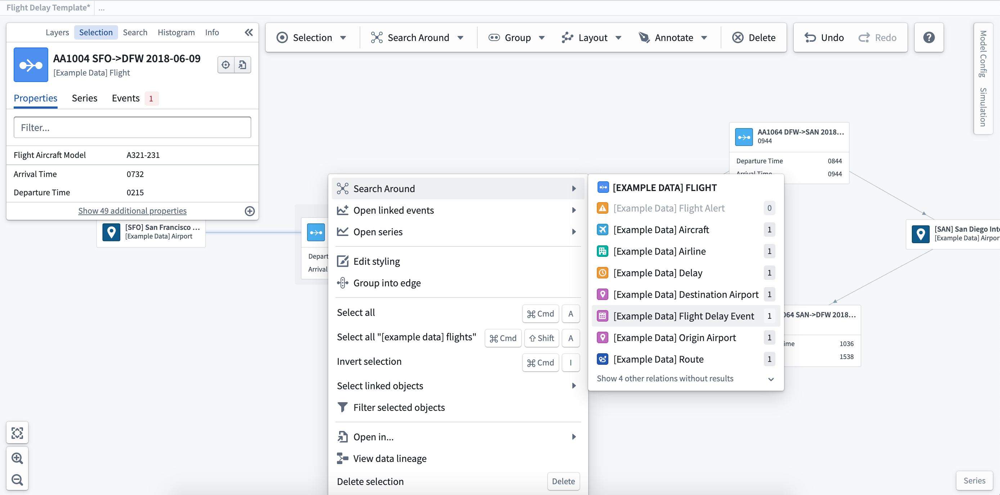
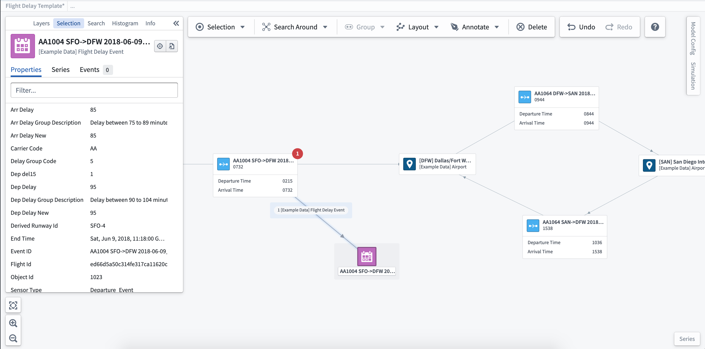
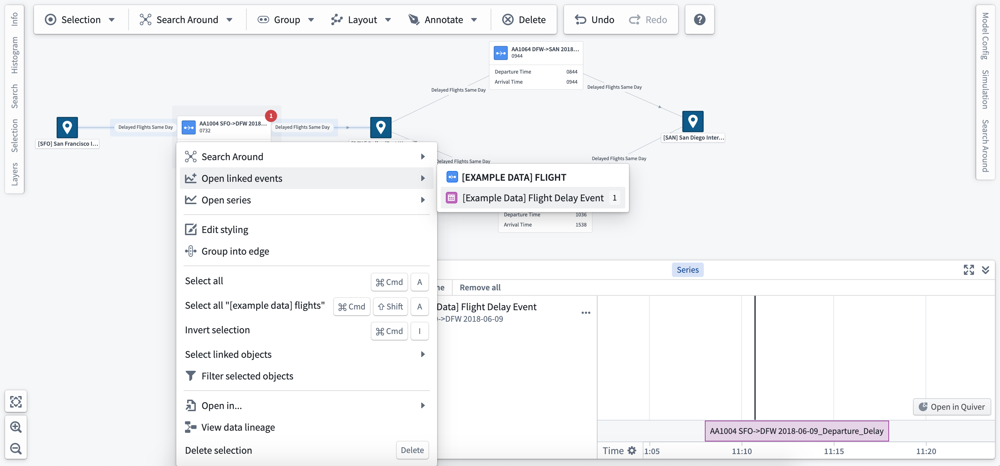

<!-- source: https://palantir.com/docs/foundry/vertex/explore-related-events/ · mirrored 2026-08-26 from Palantir Foundry docs -->

# Explore related events

An **event** is defined and configured within the Ontology. All events must have a distinct start and end time and can be configured with specific thresholds to define the color shown for the event. [Read more about setting up and configuring events](/docs/foundry/vertex/configure-events/).

Once you create and configure your event objects, you can interact with them dynamically through your system graph.

### View events

Events linked to a selected object will show up in the selection panel and as badges on the object for the duration of the event.

### Event badges

Event badges are configured within the layer styling options. Select the object type for which you want to show event badges, and choose the **linked events** option to add badges to nodes or edges on the graph.

### Event objects

To see the full detail of the event, you can add the associated object to the graph. Right-click on the object to which the event is related, and select the **Search Around** option to find the event object (in this case, a Flight Delay event).

Once added to the graph, you can select the event object to see the full details and properties in the selection panel.

### Events in the series panel

Right-click on an object and select **Open linked events** to open and add the event to the series panel. From here, you can use the time selection to scrub through time and move through multiple events.

