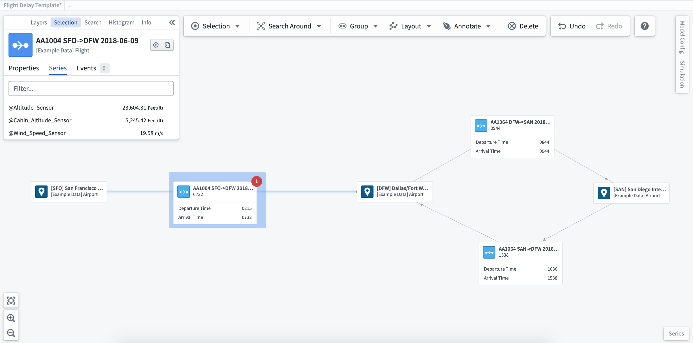
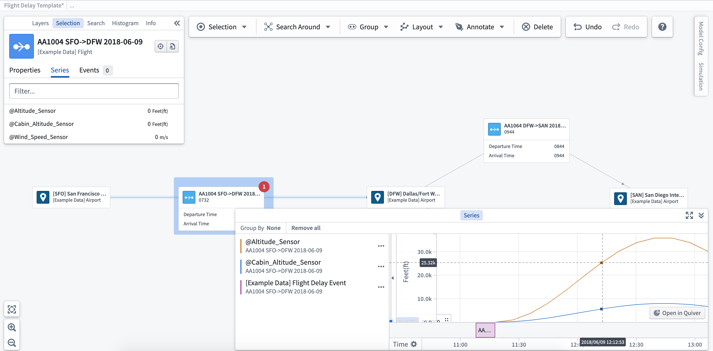
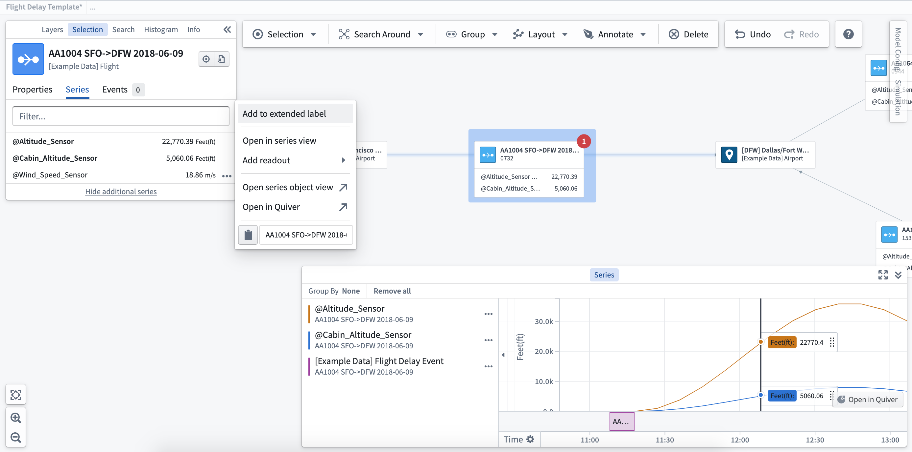

<!-- source: https://palantir.com/docs/foundry/vertex/explore-time-series/ · mirrored 2026-08-26 from Palantir Foundry docs -->

# Explore related time series

Vertex graphs allow you to interact with [time series](/docs/foundry/time-series/time-series-overview/) to visualize changes across your system and deepen your analysis to show the impact of past decisions, current state, and future potential.

:::callout
Not all customer installations include time series. If you would like to learn more about these capabilities, contact your Palantir representative.
:::

**View related time series:** Once you select an object, you will see any related time series on the **Series** tab of the selection sidebar. After selecting the **...** next to the individual time series shown for your object, you will see a number of options appear in the menu.

**Open in series view:** When you add a time series to the series view, the timeline visualization will display at the bottom of the graph. You can use the series view to move through time by clicking on the point in time you wish to view, or scrolling using the timeline at the bottom of the series panel.

**Open in Quiver / Object Explorer:** Selecting the option to **Open in Quiver** or **Open in Object Explorer** will open a new window to allow you to view the time series in more detail.

**Add to extended label/readout:** This will display the time series value on the label for the object selected. Selecting **Add to readout** allows you to add the time series value to the graph without attaching to the object label, so that you can place these values where they are most relevant within the system or process.

