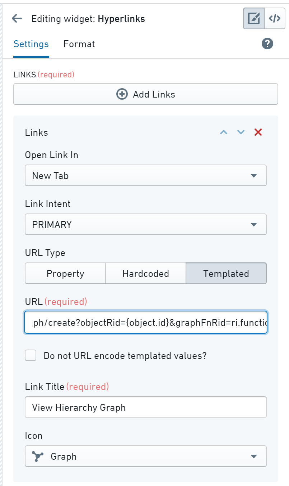

<!-- source: https://palantir.com/docs/foundry/vertex/generate-graph-apps/ · mirrored 2026-08-26 from Palantir Foundry docs -->

# Generate a graph from other applications

You can configure a link within other Foundry applications that will automatically generate a pre-populated Vertex graph.

## Using URL parameters to generate a graph

You can use URL parameters to perform the following actions:

* Start with an existing graph or create a new graph.
* Add objects to the graph by specifying an object ID or object set ID.
* Running a [**Search Around** function](/docs/foundry/vertex/generate-graph-functions/).
* Setting the time range of the time selector.

These parameters apply only to the URL that creates new graphs (`/workspace/vertex/graph/create`):

* `selectObjectRid`: Selects and centers the graph on the specified object, if it is present.
* `objectRid`: Adds the specified object as a node to the graph.
* `objectSetRid`: Adds all objects in the specified object set as nodes to the graph.
* `searchAroundFnRid`: Adds to the graph the result of the specified **Search Around** function. The function will be called with either a single object if used with the `objectRid` parameter, or all the objects from the `objectSetRid` object set.
  * Must be used in conjunction with either the `objectSetRid` or the `objectRid` URL parameter.

The following parameters apply to URLs both for existing graphs (`/workspace/vertex/graph/{graphRid}`) and newly-created ones (`/workspace/vertex/graph/create`):

* `selectedTime`: Sets the selected time.
* `startTime`: Sets the start time for a time range.
* `endTime`: Sets the end time for a time range.

:::callout
All times can be either UNIX timestamps in milliseconds or ISO-formatted dates/datetimes (e.g. `2020-02-15/2020-02-15 13:45:00 UTC`). If `selectedTime` is specified but at least one of `startTime` and `endTime` is not, the time range will have the default duration and be centered around the selected time. If `startTime` and `endTime` are specified but `selectedTime` is not, the selected time will be the same as `startTime`.
:::

## Generate a Vertex graph from other applications

Once you set your URL parameter, you can use this link to generate the pre-configured graph from other applications. For example, using the Hyperlinks Widget in Object Explorer:

