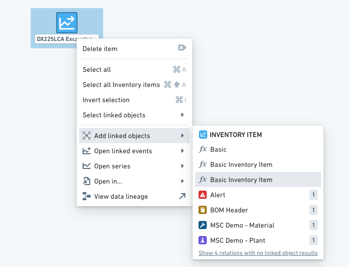
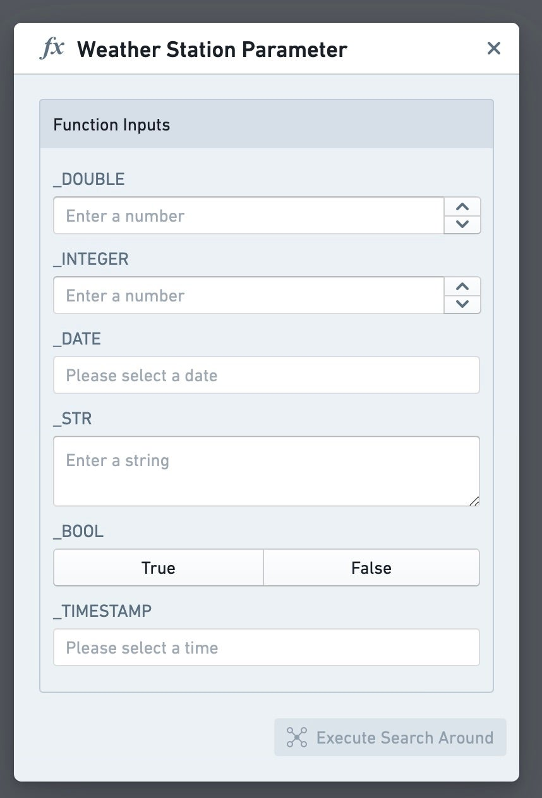
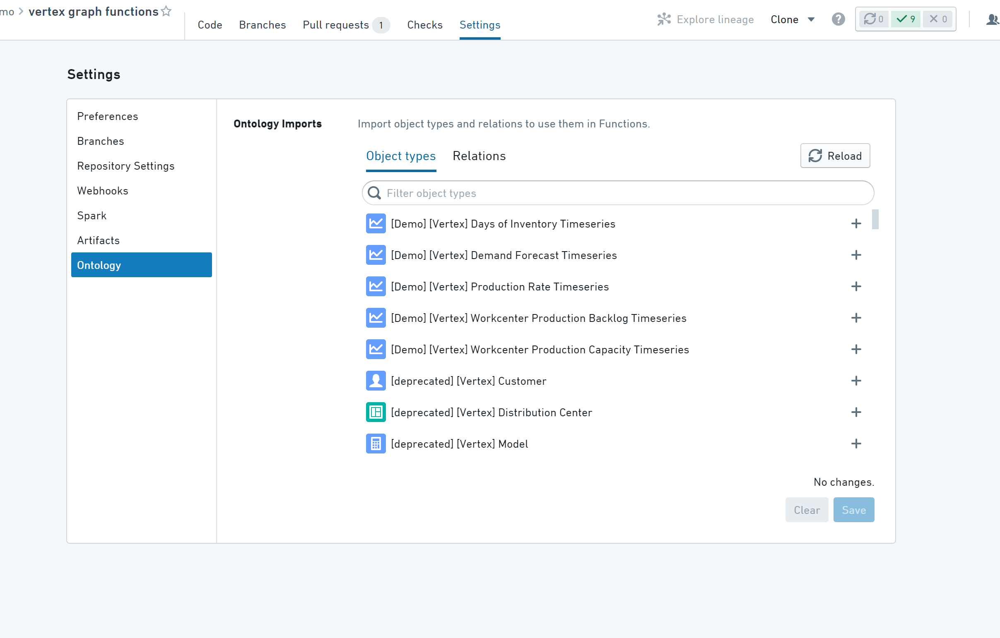
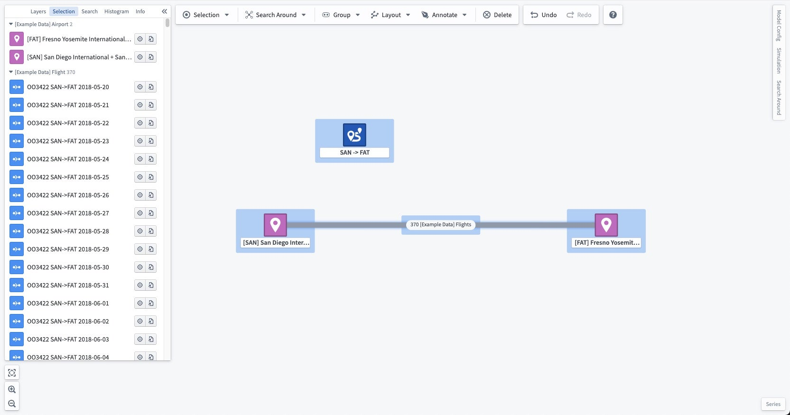
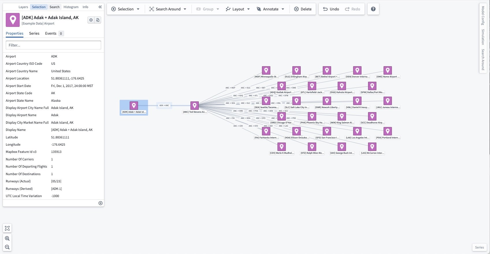

<!-- source: https://palantir.com/docs/foundry/vertex/generate-graph-functions/ · mirrored 2026-08-26 from Palantir Foundry docs -->

# Generate graphs using Functions

[Functions](/docs/foundry/functions/overview/) can be used to write complex **Search Around** functions, starting from one or more objects, and returning a graph of results. These functions can be executed from the **Search Around** toolbar menu, the right click menu, or [when creating a graph using URL parameters](/docs/foundry/vertex/generate-graph-apps/). Each function must have exactly one argument that is an Ontology object type or a list of Ontology objects, and the function must have the return type `IGraphSearchAroundResultV1`, as detailed below.



When used through the toolbar or right click menus, functions may have additional arguments of type `Integer`, `Double`, `Float`, `string`, `boolean`, `Timestamp` or `Date`. When running these Search Arounds, a form will be generated for the user to input those parameters.



### Search Around functions

**Search Around** functions are written in a TypeScript functions repository. For more information, see the [Functions documentation](/docs/foundry/functions/overview/).

A **Search Around** function must declare a return type of `IGraphSearchAroundResultV1` or `Promise<IGraphSearchAroundResultV1>`. Vertex will discover the Search Around function using the name and structure of its return type, so it must be declared exactly as follows:

```typescript
export interface IGraphSearchAroundResultV1 {
    directEdges?: IGraphSearchAroundResultDirectEdgeV1[];
    intermediateEdges?: IGraphSearchAroundResultIntermediateEdgeV1[];
    orphanObjectRids?: string[];
    objectRidsToGroup?: string[][];
    layout?: string;
}

export interface IGraphSearchAroundResultDirectEdgeV1 {
    sourceObjectRid: string;
    targetObjectRid: string;
    linkTypeRid?: string;
    label?: string;
    direction?: string;
}

export interface IGraphSearchAroundResultIntermediateEdgeV1 {
    sourceObjectRid: string;
    sourceToIntermediateLinkTypeRid?: string;
    intermediateObjectRid: string;
    intermediateToTargetLinkTypeRid?: string;
    targetObjectRid: string;
    label?: string;
    direction?: string;
}
```

* `directEdges` will be represented on the graph as an edge directly between two objects. If this edge is based on a link, its `linkTypeRid` as found in the Ontology can be supplied to show the link type's display name along this edge and make Vertex aware of the edge direction.
* `intermediateEdges` allow you to create edges between two objects based on events or other intermediate objects. An intermediate edge will be represented as an edge between two objects, with the intermediate object grouped into the edge. If many intermediate edges are returned between the same two objects, all intermediate objects will be grouped onto a single edge. As with direct edges, if the relationship represented is based on a pair of links (one from the source object to intermediate object, and a second from the intermediate object to target object), these link type RIDs can be supplied. Vertex only groups an object into an edge if the function adds that object to the graph, so an object that is already on the graph, including any object you pass as an input to the function, remains its own node.
* `orphanObjectRids` allow you to return objects that do not have any links to other objects in your response. Any objects that take part in either an edge in `directEdges` or `intermediateEdges` do not need to be returned in here.
* `objectRidsToGroup` allows you to group objects into a single node by returning an array of groups, where each group is an array of object RIDs. Note: If you add the same RID to multiple groups, the groups will be merged together.
* `label` allows you to specify a custom label for the functional link generated between the source and target object.
* `direction` allows you to alter the directionality of the functional link produced by your search around function. The provided value must be one of `NONE`, `FORWARD`, or `REVERSE`. Defaults to `FORWARD` if omitted. Links that appear due to the presence of a `linkTypeRid` are not affected by `direction`.
* `layout` allows you to alter the layout which the resulting objects use when being added to the graph. The provided value must be one of `auto`, `auto-grid`, `grid`, `linear-row`, `linear-column`, or `circular`. Defaults to a hierarchy layout if omitted.
  * This option is only available when executing a Search Around directly in the application, and not available when generating a graph from a template.

## Tips & troubleshooting

* To maximize performance, all code should be as asynchronous as possible.
* Vertex will use the latest published version of a function. To publish your Function, you need to tag the branch/commit you want with a semantic version, for example `1.0.0`.
* Your repository needs access to all the Ontology objects & links you want to use in your function. This is configurable under the **Ontology** section of the **Repository Settings**.
* If the object types and their backing datasets are defined in a different project to the repository, the project containing your repository will need a reference to the backing datasets and those object types.



## Reference Examples:

The following example contains two **Search Around** functions.

The first function `allFlights` returns all flights along a route, merged onto a single edge between the Airports. For example, when run on route "SAN -> FAT", it produces the following:



The second function `destinations` allows the user to choose a distance and returns all airports within that number of flights from the initial airport. For example, when run on airport "\[ADK] Adak + Adak Island, AK" with a distance of 2, it produces the following:



```typescript tab="TypeScript v1"
import { Function, Integer, OntologyObject } from "@foundry/functions-api"
import { ExampleDataAirport, ExampleDataRoute } from "@foundry/ontology-api";

export interface IGraphSearchAroundResultV1 {
    directEdges?: IGraphSearchAroundResultDirectEdgeV1[];
    intermediateEdges?: IGraphSearchAroundResultIntermediateEdgeV1[];
    orphanObjectRids?: string[];
    objectRidsToGroup?: string[][];
}

export interface IGraphSearchAroundResultDirectEdgeV1 {
    sourceObjectRid: string;
    targetObjectRid: string;
    linkTypeRid?: string;
}

export interface IGraphSearchAroundResultIntermediateEdgeV1 {
    sourceObjectRid: string;
    sourceToIntermediateLinkTypeRid?: string;
    intermediateObjectRid: string;
    intermediateToTargetLinkTypeRid?: string;
    targetObjectRid: string;
}

export class VertexSearchArounds {

    @Function()
    public async allFlights(routes: ExampleDataRoute[]): Promise<IGraphSearchAroundResultV1> {
        const flights = await Promise.all(routes.map(route => route.flights.allAsync());

        const intermediateEdges: IGraphSearchAroundResultIntermediateEdgeV1[] = [];

        for (let i = 0; i < routes.length; i++) {
            const route = routes[i];
            const flightBetweenOriginAndDestination = flights[i];

            const sourceObjectRid = route.departingAirport.get().rid!;
            const targetObjectRid = route.arrivingAirport.get().rid!;

            for (const flight of flightBetweenOriginAndDestination) {
                intermediateEdges.push({
                    sourceObjectRid,
                    intermediateObjectRid: flight.rid!,
                    targetObjectRid,
                });
            }
        }

        const result: IGraphSearchAroundResultV1 = {
            intermediateEdges,
        };
        return result;
    }

    @Function()
    public async destinations(airport: ExampleDataAirport, distance: Integer): Promise<IGraphSearchAroundResultV1> {
        let currentDistance = 0;
        let currentAirports = [airport];

        const directEdges: IGraphSearchAroundResultDirectEdgeV1[] = [];

        while (currentDistance < distance) {
            let nextAirports = new Set<ExampleDataAirport>();

            const routesByAirport = await Promise.all(currentAirports.map(airport => airport.routes.allAsync()));
            const destinationsByAirport = await Promise.all(
                routesByAirport.map(routes =>
                    Promise.all(routes.map(route => route.arrivingAirport.getAsync()))
                )
            );

            for (let i = 0; i < currentAirports.length; i++) {
                const airport = currentAirports[i];
                const destinations = destinationsByAirport[i];
                for (const destination of destinations) {
                    directEdges.push({
                        sourceObjectRid: airport.rid!,
                        targetObjectRid: destination!.rid!,
                    });
                }
                nextAirports.add(destination!);
            }

            currentAirports = Array.from(nextAirports);
            currentDistance++;
        }

        return { directEdges };
    }
}
```

```typescript tab="TypeScript v2"
import { ObjectSet, Osdk } from "@osdk/client";
import { Integer } from "@osdk/functions";
import { ExampleDataAirport, ExampleDataRoute } from "@ontology/sdk";

export interface IGraphSearchAroundResultV1 {
    directEdges?: IGraphSearchAroundResultDirectEdgeV1[];
    intermediateEdges?: IGraphSearchAroundResultIntermediateEdgeV1[];
    orphanObjectRids?: string[];
    objectRidsToGroup?: string[][];
}

export interface IGraphSearchAroundResultDirectEdgeV1 {
    sourceObjectRid: string;
    targetObjectRid: string;
    linkTypeRid?: string;
}

export interface IGraphSearchAroundResultIntermediateEdgeV1 {
    sourceObjectRid: string;
    sourceToIntermediateLinkTypeRid?: string;
    intermediateObjectRid: string;
    intermediateToTargetLinkTypeRid?: string;
    targetObjectRid: string;
}

export async function allFlights(
    routes: ObjectSet<ExampleDataRoute>,
): Promise<IGraphSearchAroundResultV1> {
    const intermediateEdges: IGraphSearchAroundResultIntermediateEdgeV1[] = [];

    for await (const route of routes.asyncIter()) {
        const [departure] = await Array.fromAsync(
            route.$link.departingAirport.asyncIter(),
        );
        const [arrival] = await Array.fromAsync(
            route.$link.arrivingAirport.asyncIter(),
        );
        if (!departure || !arrival) continue;

        for await (const flight of route.$link.flights.asyncIter()) {
            intermediateEdges.push({
                sourceObjectRid: departure.$rid!,
                intermediateObjectRid: flight.$rid!,
                targetObjectRid: arrival.$rid!,
            });
        }
    }

    return { intermediateEdges };
}

export default allFlights;
```
