<!-- source: https://palantir.com/docs/foundry/vertex/graphs-display-options/ · mirrored 2026-08-26 from Palantir Foundry docs -->

# Object and edge display options

Vertex allows you to configure dynamic styling for the objects and edges on your graph. After setting styling and configuring key property readouts, you can see how these key properties change over time by using the time selection windows.

## Graph layout

### Automatic layout options

You will find a number of predefined layout options in the toolbar at the top of the workspace. Once selected, objects and edges will automatically move, allowing you to order the graph as you explore relations. Many of these layouts contain advanced parameters for modifying their behavior. These parameters can be accessed by selecting the gear icon next to the respective layout.

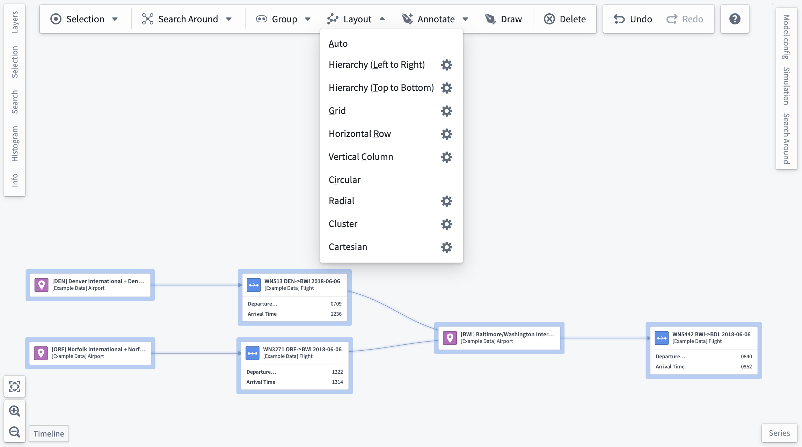

Below are the advanced parameters for each layout. Note that **Auto** and **Circular** layouts do not have advanced parameters.

#### Hierarchy (Left to Right/Top to Bottom)

* **Reverse:** Inverts the order of the hierarchy; left-right becomes right-left and top-bottom becomes bottom-top.
* **Root nodes:** Choose a node to occupy the root of the hierarchy. If `Automatic` is selected, a root node will be selected for you based on edge directions.

#### Grid

* **Staggered:** Provides the option to offset odd rows of elements.
* **Grid dimensions:** Specify a constraint on the number of rows or columns in the grid. `Automatic` mode will attempt to use an equal number of rows and columns.

#### Horizontal Row/Vertical Column

* **Order by:** An object property by which to sort nodes.
  * Uses ascending order by default.
  * If no `Order by` property is selected, the layout will maintain the pre-existing horizontal node order for rows, or vertical node order for columns.
  * Grouped nodes and any nodes backed by objects that do not contain the specified property will be placed at the beginning when ascending and at the end when descending.
  * Only numeric properties will appear in this select list.
  * Matching property names on different objects will be sorted together.
* **Reverse:** Toggle the sort order between ascending and descending. This option will only appear if an `Order by` property is selected.

#### Radial

* **Central node:** Specify the node that should appear at the center of the layout.
* **Density:** A value between one and five (inclusive) that determines spacing between nodes.

#### Cluster

* **Cluster by:** Specify a property by which nodes should be clustered.
  * If no property is selected, this layout will cluster by object type.
  * Grouped nodes and any nodes backed by objects that do not have the selected property will be clustered together.
  * Only properties that have the [render hints](/docs/foundry/object-link-types/metadata-render-hints/) `Selectable` or `Low Cardinality` will appear in this dropdown.
  * Matching property names of different objects will be clustered together.

#### Cartesian

* **X/Y property:** Properties to use as the x and y coordinates of the nodes in the layout.
  * Coordinates will be normalized so that nodes fit within the viewport when the layout is executed.
  * The cartesian layout will not be executed unless an x property, y property, or both are selected.
  * Grouped nodes and any nodes backed by objects that do not have the selected property will remain in their pre-layout locations.
  * Only properties that have the [render hints](/docs/foundry/object-link-types/metadata-render-hints/) `Selectable` or `Low Cardinality` will appear in this dropdown.
  * Matching property names on different objects will be sorted together.
* **X/Y reverse:** Invert x and y coordinates. The reverse toggle will only appear after a property selection is made.

### Group nodes by object type

As you add more related objects, you may want to begin grouping objects into a single node on the graph. Once you have selected the objects you wish to group, use the layout toolbar at the top of the Workspace to group or ungroup the selected objects.

Once you have grouped a number of objects into a single node, you will see the full list of objects that have been grouped in the selection panel at the left of the workspace. If you only want to ungroup a subset of the objects in a node, use the selection panel to select those objects and choose **Ungroup** as seen below. This can also be done using the **Filter to** functionality in the histogram.

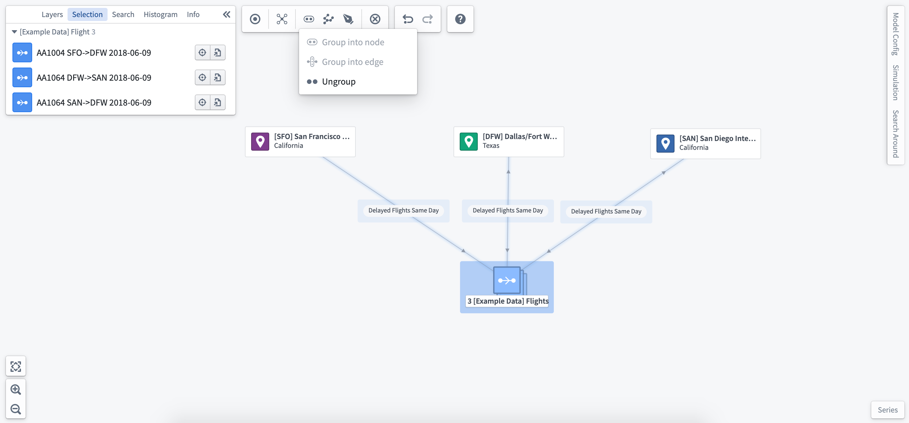

### Group by a property of the object type

Using the histogram, you can explore the properties of selected objects as well as group objects by the values displayed. This will change the object layout on your graph to reflect the new groupings.

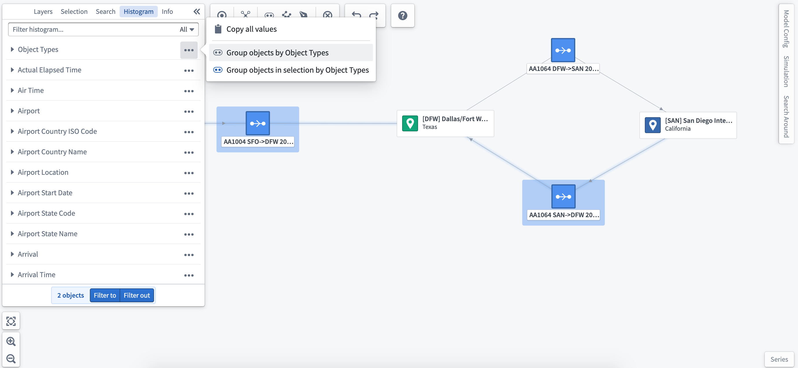

### Group nodes into edge

Some objects are transactional and move between other nodes/objects in your system. For example, a Flight moves between a `Departure Airport` and a `Destination Airport` as a transactional object. In this instance, you can group the order objects onto the edge, with the ability to style edges based on key properties/metrics.

Select the edge and choose **Ungroup** from the right-click menu to show all objects previously grouped in the edge. Alternatively, you can ungroup a subset by first selecting objects to ungroup using the histogram or selection panel.

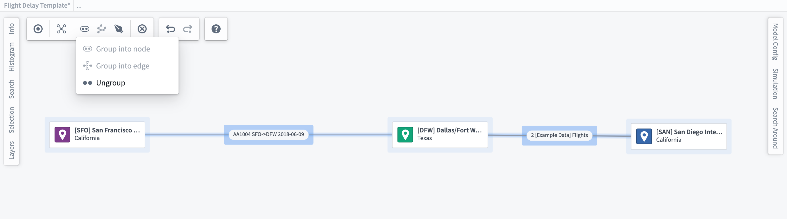

:::callout
You can automatically group transactional objects into the related edge in the Ontology Manager → Capabilities tab. [Learn more about link merging.](/docs/foundry/vertex/link-merging/)
:::

## Layer styling options

Layers refer to the object node(s) of the same object type or the edge relationships between nodes. These can be configured individually with a number of layout options to allow flexible visualization and intuitive interaction with the digital twin of your system.

Using the layer styling panel in the left sidebar, you can style nodes and edges individually or style by properties of the object and related time series/measured values. Layer styling allows you to visualize key information, calculate metrics, and style by parameterized conditions to show current or simulated system state.

### Object styling

Select **Styling Options** next to the object type you wish to configure to open the styling menu.

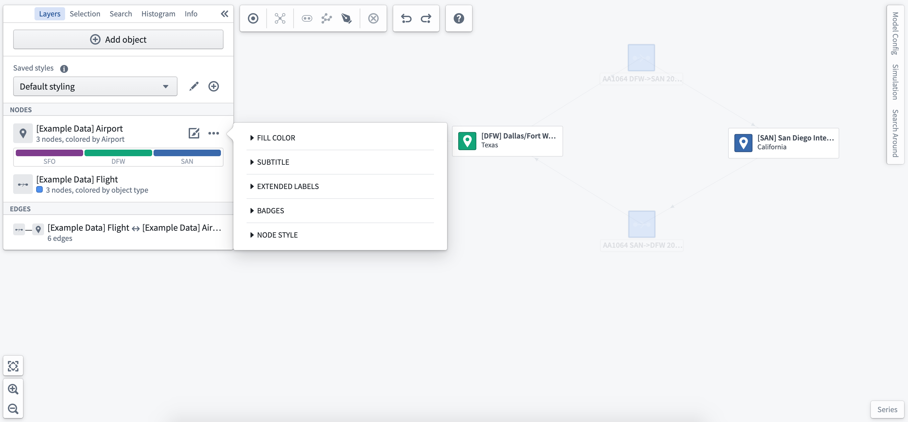

#### Color by

Select the **Fill Color** dropdown to choose the parameter by which to style as well as the color selection for all objects in this layer. You can select a time series measure as the **Color by** parameter, which will dynamically update the styling based on the selected time window. You can also color nodes using [derived property functions](/docs/foundry/vertex/derive-property-functions/).

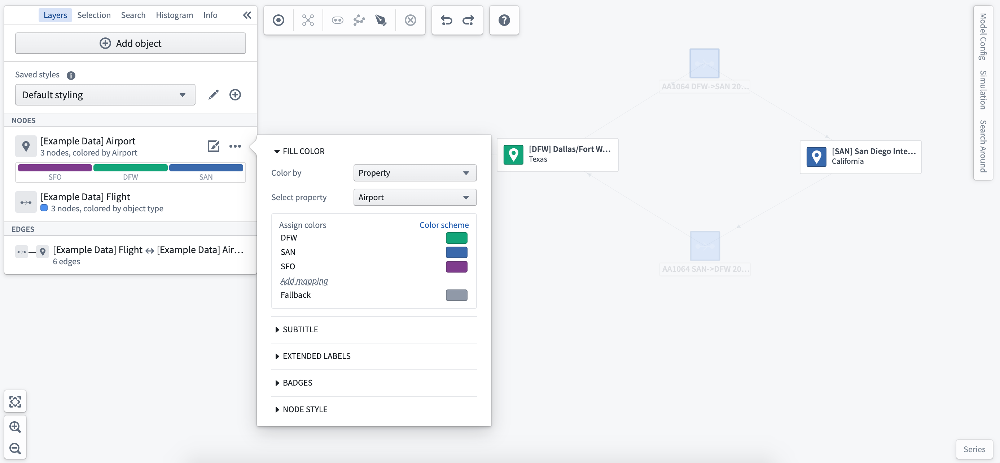

#### Subtitle

You can add subtitles to each object on the object type or a selected property of the object. Subtitles will display on all objects of the same type on the graph.

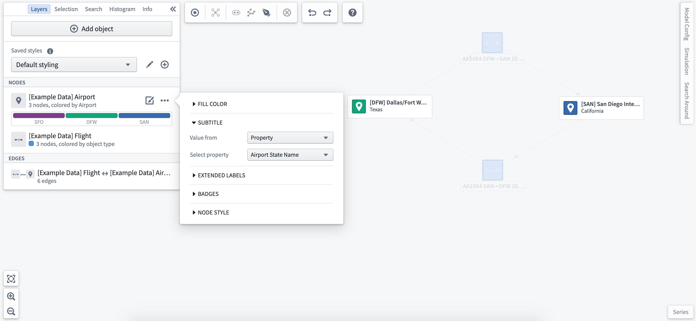

#### Extended labels

Selecting **Extended Labels** allows you to add specific readouts to the object nodes selected. You can select from real-world time series readings or simulated values to allow you to compare current and modeled conditions in a single view.

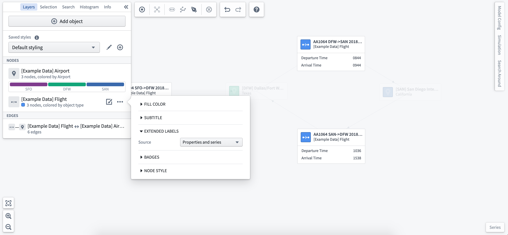

Once you have set the extended label styling, you can select the properties or time series to display from the object selection panel at the left of the workspace.

#### Badges

Add badges to indicate the number of linked events to a specific object type. In the screenshot below, you can see that there is one delayed flight event.

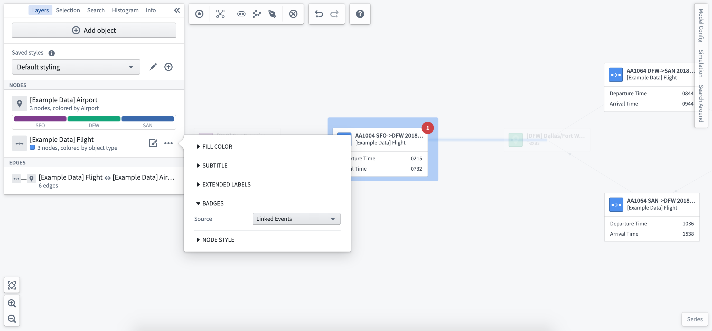

#### Node style

You can choose to display objects as the default node or as a full object card.

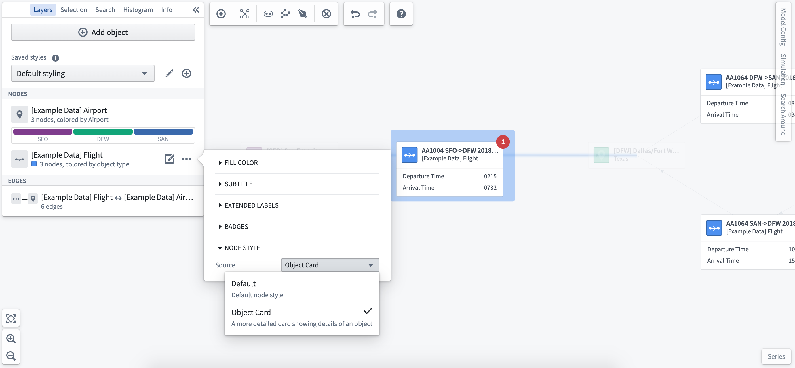

### Edge styling

The edge represents the relationship between objects and can be styled to visualize the interactions between nodes in your system or process.

Select the **Styling Options** from the edge you would like to configure.

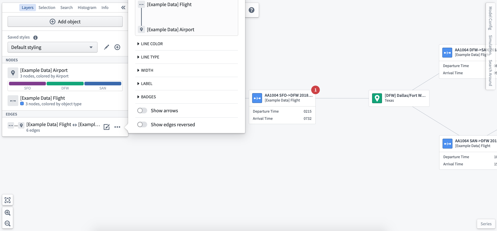

#### Line color

You can set the color of edges based on object types or a common property of related objects.

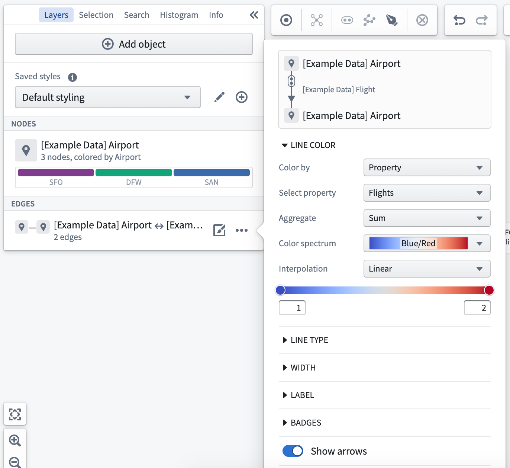

#### Line type

You can format the lines drawn to be straight, curved, or orthogonal.

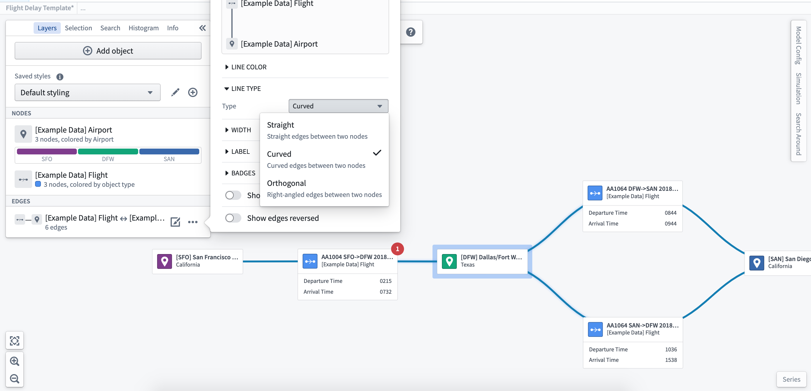

#### Labels

Where there are objects grouped in the edges, you can configure labels based on individual or aggregated properties of the object to show key metrics.

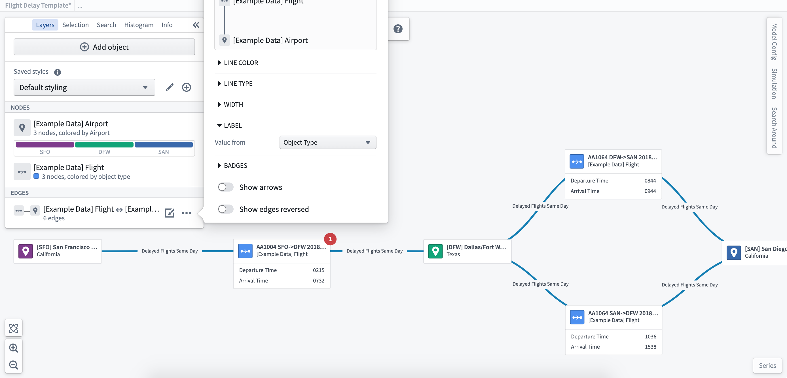

#### Line width

You can apply a different width to the edges based on properties of the objects. Applying different line widths allows you to indicate the movement and volume of transactions (such as flights) between objects (such as airports).

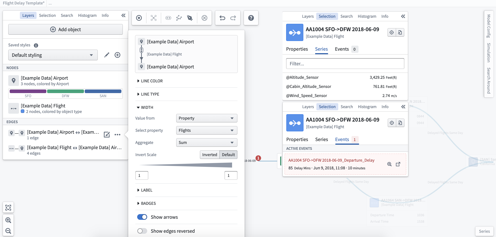

#### Badges

As with the object nodes, you can add badges to indicate the number of linked events to a specific edge relation. Here you can see there is one delayed flight event.

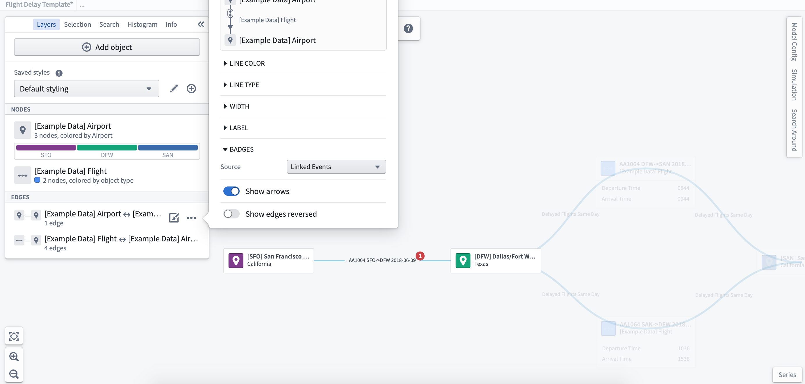

#### Ontology-level edge direction configuration

When adding links to the graph, by default the edge arrows are shown from the right side of the link pointing to the left. For example, for a link configured in the Ontology as a many-to-one link type, the arrows will point from the one side to the many side. This can be configured per link type using the following Ontology type classes:

* Primary Direction: `kind`: `vertex`, `name`: `link_primary_direction`
  * When placed on one side of a link, indicates that the edge arrow should point towards the object on this side of the link.
* Undirectional: `kind`: `vertex`, `name`: `link_undirectional`
  * When placed on either side of a link, indicates that no arrows should be shown on an edge.
* Bidirectional: `kind`: `vertex`, `name`: `link_bidirectional`
  * When placed on either side of a link, indicates that arrows should be shown on both sides of an edge.

Edge arrows can also be hidden or reversed per-graph using the layer styling options.

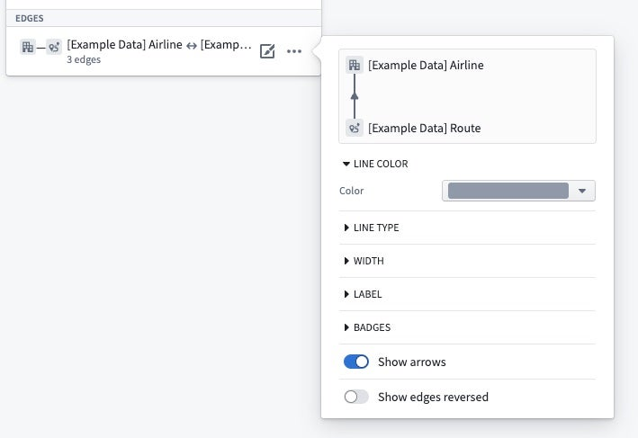

### Saved styles

Once configured, you can save different styling options for the same graph to provide different views of your system. For example, you could configure a view of flights between a set of airports to be styled by the key performance metrics of airline carriers. You can then use the same graph with different styling to show customer satisfaction over the same routes.

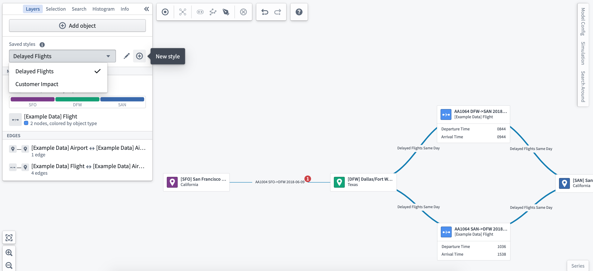

## Saved selections

You can also save groups of objects that you have selected on the graph in a saved selection. To do this, select any number of nodes and edges that contain the desired objects and choose **Save objects in current selection** in the right-click menu or in the **Selection** menu in the toolbar.

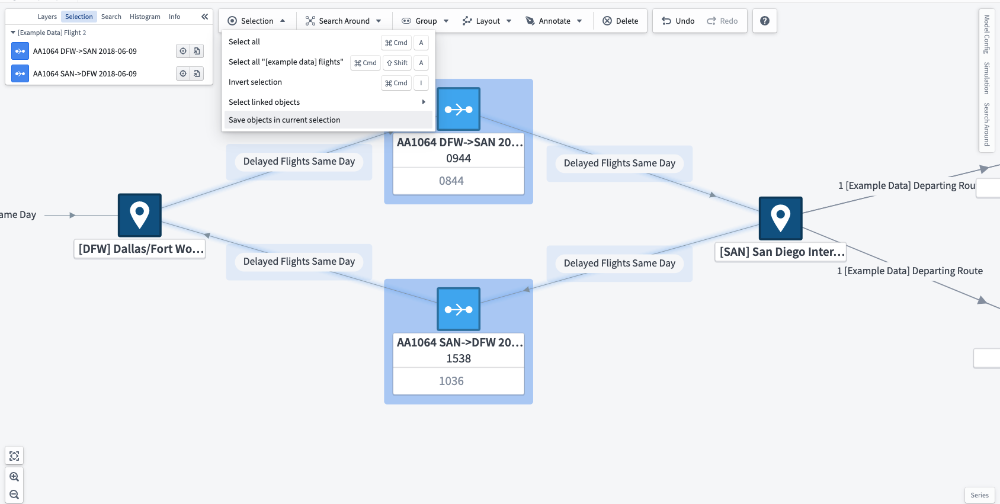

Each saved selection has an associated name and color which appears in the **Saved selections** section of the layers panel. Each object on the graph, represented as either an edge or a node, will have a split border around it in the colors of the saved selections to which the object belongs. Each object can be part of as many saved selections as needed, but the border will only show the color of the first three saved selections.

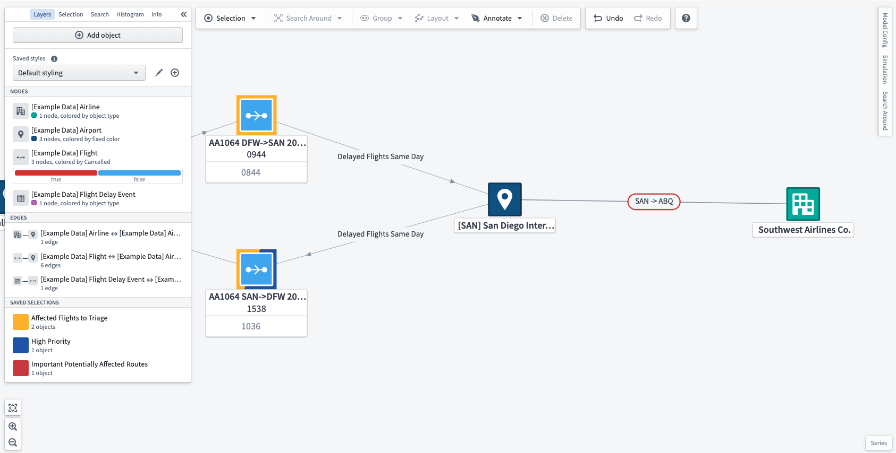

To quickly select all the objects stored in a saved selection, choose the quick select action when hovering over the saved selection.

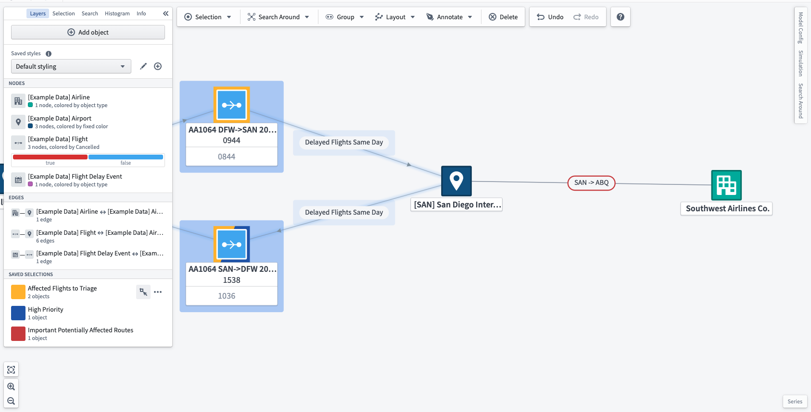

You can edit a saved selection in the layers panel. To edit the name of a saved selection, simply select the name, input a new name, and use the Enter key. To delete or edit the color of a saved selection, choose the **...** icon () when hovering over the saved selection. You can also toggle borders on and off for each saved selection with the eye icon ().

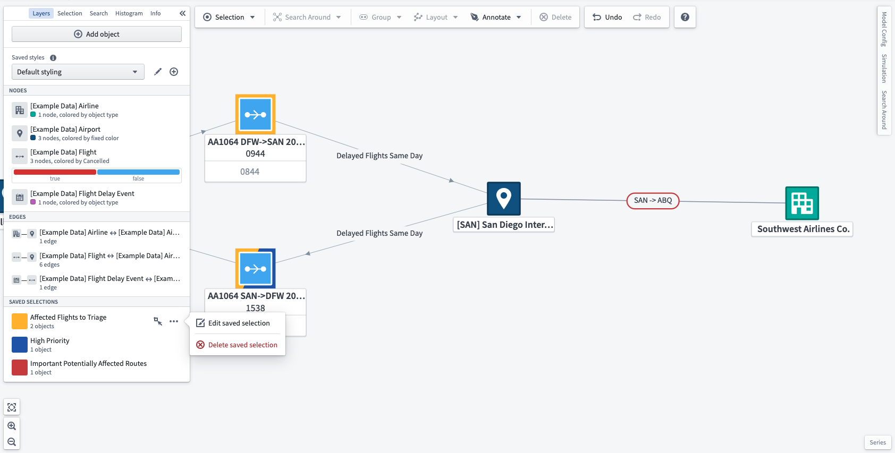

The objects in a saved selection can be edited by choosing objects on the graph, selecting the **...** () button, then using the **Add selected objects** or **Remove selected objects** options.

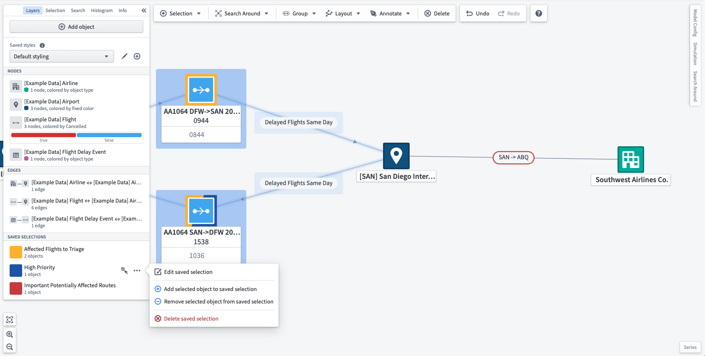
