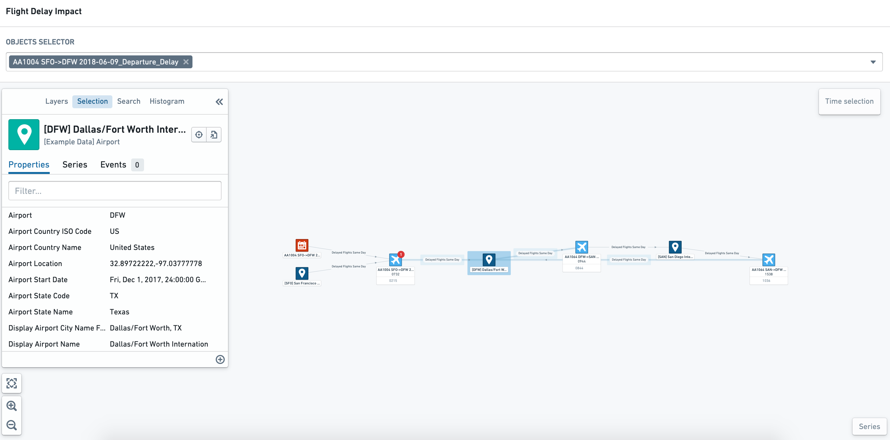
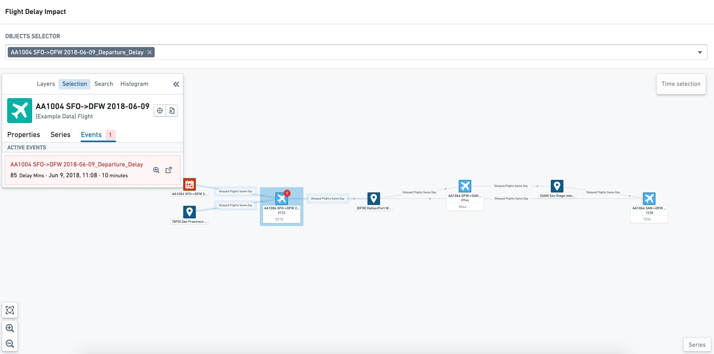
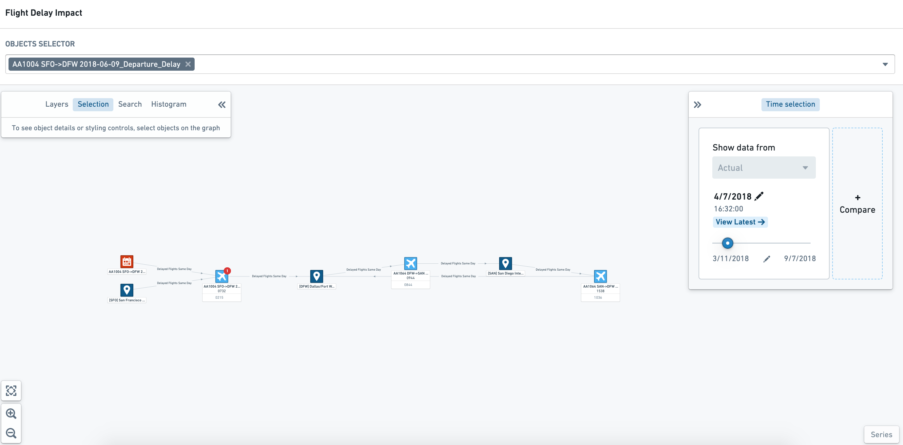
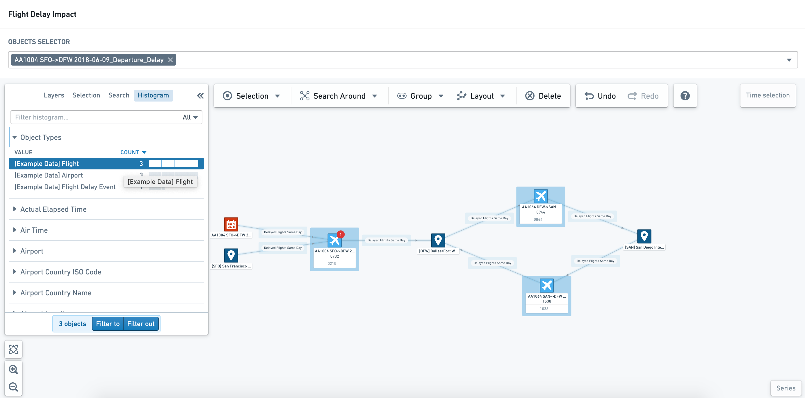
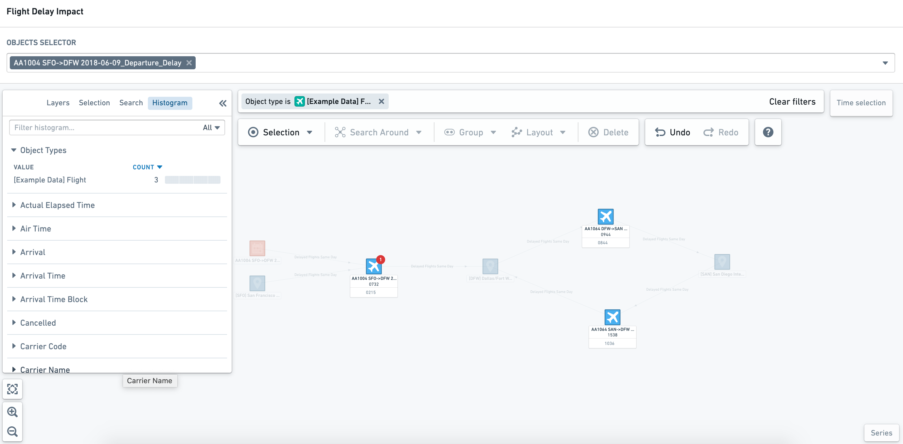
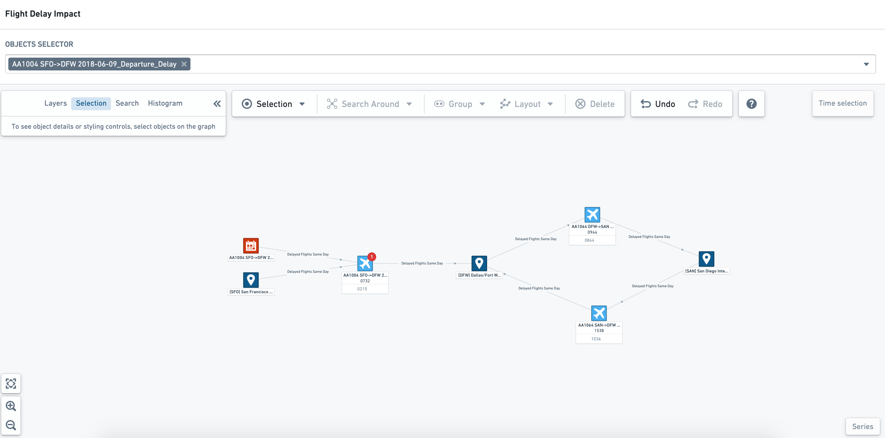
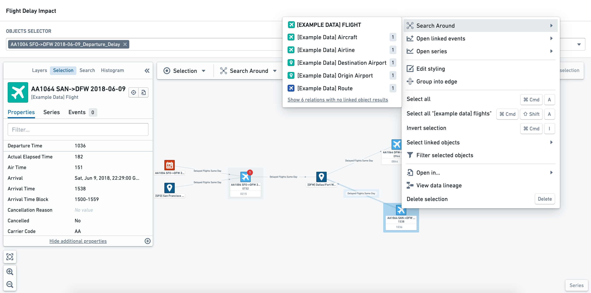
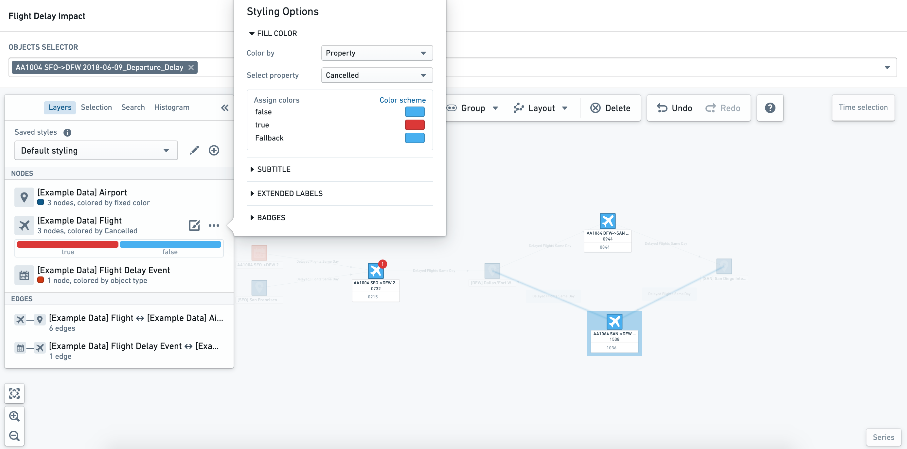

<!-- source: https://palantir.com/docs/foundry/vertex/graphs-explore/ · mirrored 2026-08-26 from Palantir Foundry docs -->

# Explore existing graphs

## Object exploration

If you select an object of interest on the graph, you will see its properties in the **Selection** tab of the sidebar.

Objects may also have key information or metrics shown in the node labels. The example below shows the departure and arrival times of the flights.

## Associated events

If an object has an associated event, the event can be configured to show as a *badge* against the impacted object. If you click on an object node with related events, you can see the details in the **Events** tab of the **object selection** sidebar.

### Understand current state and changes over time

Objects can be styled by object type, property value, time series, or events. In the example below, the following styling is applied:

* Airport objects are colored dark blue
* Flights are colored light blue, and will show red if the `Cancelled Status` is `True`.
* Flight Delay events are colored red
* Flight Delay events are shown as a red badge on the **Flight object** node.

Using the time selection panel, you can "scrub" (drag the cursor) through to see, with dynamic styling, how properties change. The screenshot below shows that the event badge only appears when the event is in progress (that is, between the start and end time of the event).

### Filter and explore object properties

Within read-only mode, you can use the **Histogram** tab in the sidebar to filter the graph view by object type and properties.

Once you have selected the objects of interest, you can select **Filter to** or **Filter out** to apply the histogram selections to the graph. The top of the graph canvas displays the applied filters; you can remove individual object filters by clicking on the **x** symbol next to the specific parameter, or you can remove all filters by selecting **Clear filters**.

## Exploring object relationships

For more exploratory workflows, you may want to interact with the graph view to understand wider relationships and different metrics. In these editable views of an object graph, you can take many actions available in the full Vertex application, including Search Arounds, styling, and layout changes.

:::callout{theme="neutral"}
Changes made to a graph within a Workshop module will not update the underlying template used to generate the graph. If you wish to permanently change a view within Workshop, you will need to update the underlying template.
:::

At the top of the Graph canvas, you can see the additional exploration toolbar as shown below.

### Explore relationships

Select an object and right-click to open the **Actions** menu. This menu lets you Search Around to find related objects and events to add additional nodes to the graph view.

### Object and edge node styling

Once you have selected an object node or edge of interest, you can update and change the styling in the **Layers** tab of the sidebar.

:::callout
Changes made to styling within a Workshop module are not persisted. You can, however, configure multiple *saved styles* within the underlying template.
:::

