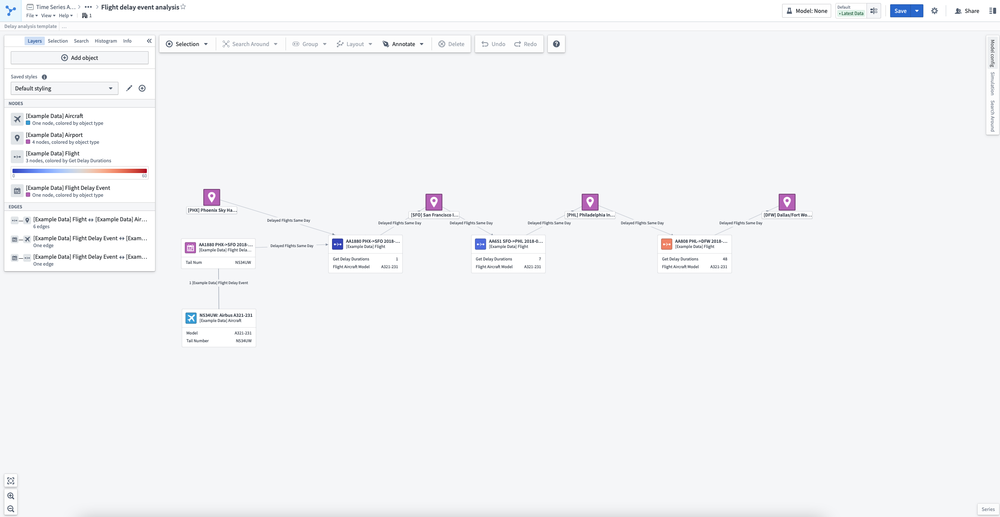
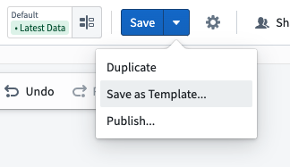
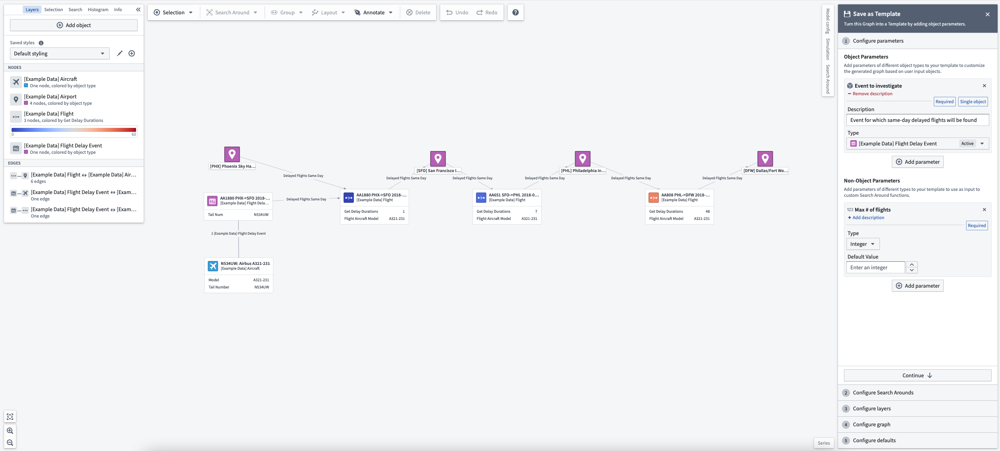
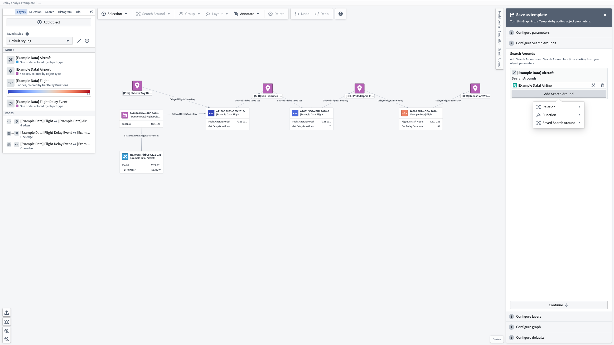
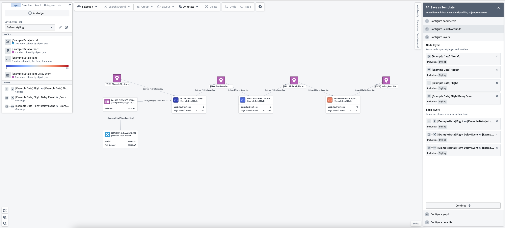
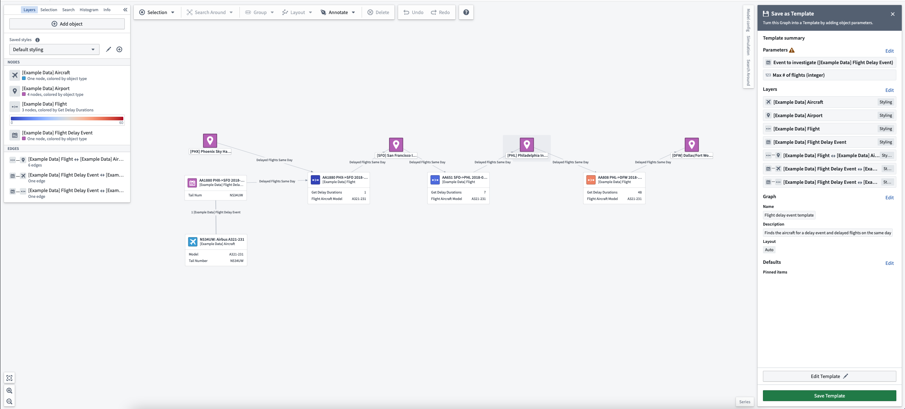
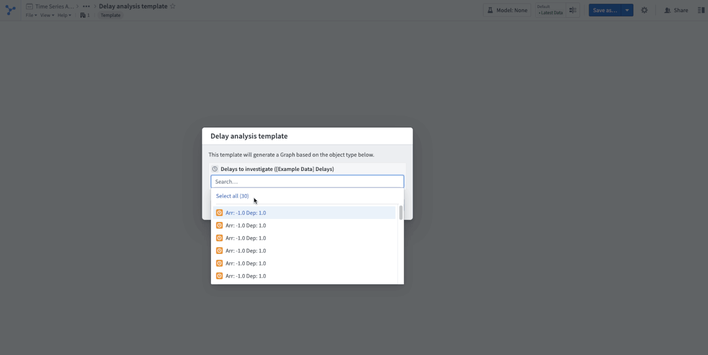

<!-- source: https://palantir.com/docs/foundry/vertex/graphs-template/ · mirrored 2026-08-26 from Palantir Foundry docs -->

# Create a graph template

Vertex graph templates are resources that generate graphs with a defined styling based on parameters. They enable workflows such as:

* Pivoting a graph analysis on one object/object set to another object/object set.
* Creating a reusable resource encoding a graph generation workflow for consumers.
* Embedding a graph template in another Foundry application, such as an Object View or a Workshop application.

Any Vertex analysis can be converted into a graph template. Transforming an analysis into a template makes it easier to conduct future analyses of the same nature.

In this example, we are exploring airline delays with an analysis of a flight `Delay Event` linked to `Aircrafts` and other delayed `Flights` (at `Airports`) on the same day using a Search Around function. The analysis that generated the flight delay investigation graph shown below was performed in a free-form way without an imposed structure. By creating a graph template from the analysis, we enable reuse of this analysis template in future investigations.

To convert this analysis into a graph template, open the save options in the top-right toolbar and select **Save as Template...**.

This will open a helper with the option to **Configure parameters**. There are two kinds of graph template parameters: **object parameters** and **non-object parameters**.

Object parameters are object inputs to your template which will be added to the graph when the template is used. Adding object parameters also allows you to perform Search Arounds and functions on the objects provided by the graph template user.

Non-object parameters are additional parameters that can be used as arguments to custom Search Around functions or saved Search Arounds. The supported types for non-object parameters mirror the non-object arguments supported by Search Around functions.

Next, you can **configure Search Arounds** associated with your template. Each object parameter can be associated with Search Arounds, which can be either simple Search Arounds using Ontology links, Search Around functions, or saved Search Arounds which were built using the Search Around sidebar. Any non-object arguments to Search Around functions or saved Search Arounds can be mapped to a value, which can be either a constant or a parameter. To map an input to a parameter, choose the parameter button on the left side of the input box and select a parameter from the dropdown.

After adding any desired parameters and Search Arounds, you can **configure layers** and layer styling associated with your template. Styling layers will save the current styling as it exists on your graph. Excluded layers will leave out the layer style in the saved template.

Lastly, after choosing a layout to apply and which graph settings from your current analysis to keep, you can view a **template summary** and choose to save your template.

## Use a graph template

Once the template is opened, you will be prompted to supply values for the template parameters.

An object or an object set can also be preloaded into a template using URL query parameters:

* **Object:** Use query parameter `objectRid=<your_object_rid_here>`
* **Object set:** Use query parameter `objectSetRid=<your_object_set_rid_here>`

To interact with the given parameter values, use the **Parameters** button in the top toolbar. This will allow you to select all the objects used as values for a given object parameter, or change the parameter values to regenerate your graph.

:::callout{theme="neutral"}
Templates can also be embedded in Workshop using the [Vertex widget](/docs/foundry/vertex/embed-graph-workshop/).
:::
