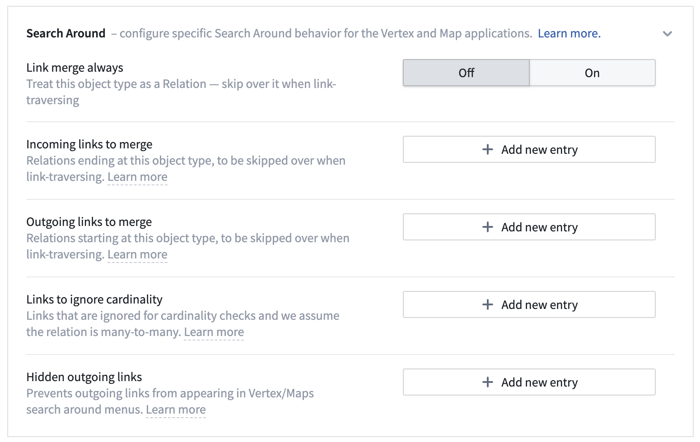
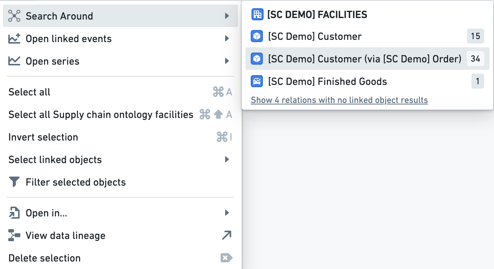

<!-- source: https://palantir.com/docs/foundry/vertex/link-merging/ · mirrored 2026-08-26 from Palantir Foundry docs -->

# Configure link merging

Configuring **Link Merge** in the Vertex Ontology Capabilities section in the Ontology Manager will allow objects to be automatically grouped into the edge between two nodes. This configuration helps visualize transactional flow between nodes and allows simplification of graph generation.

Users can access this through **link via** options in the **Search Around** menu.

