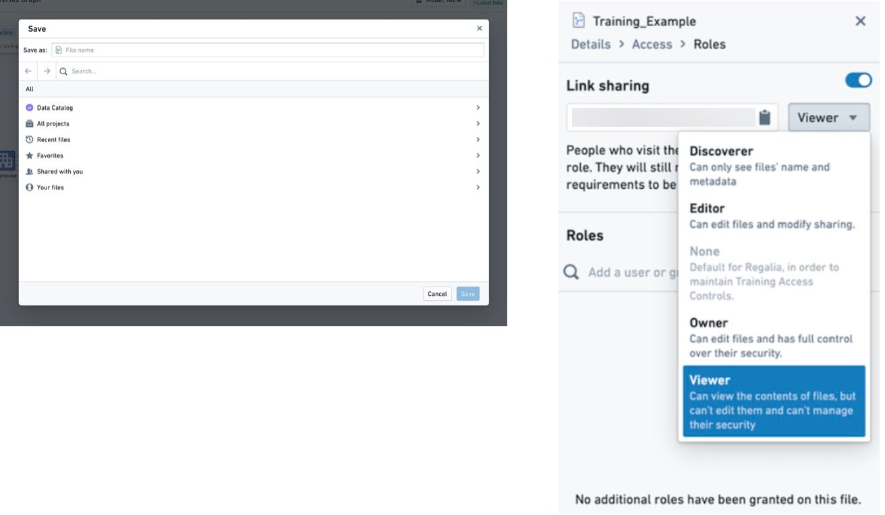
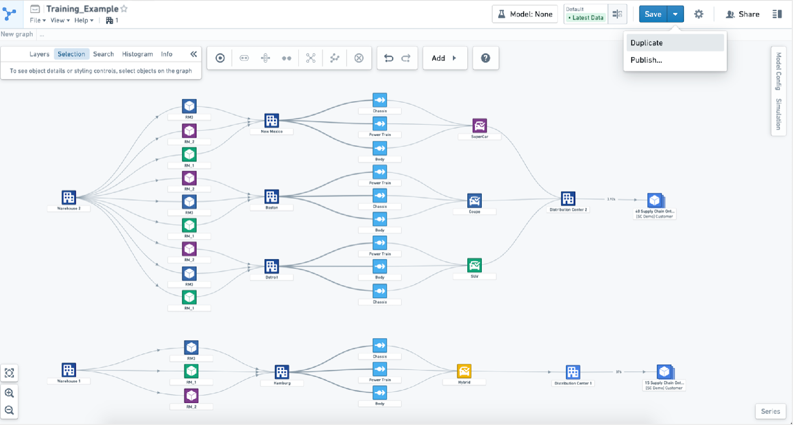
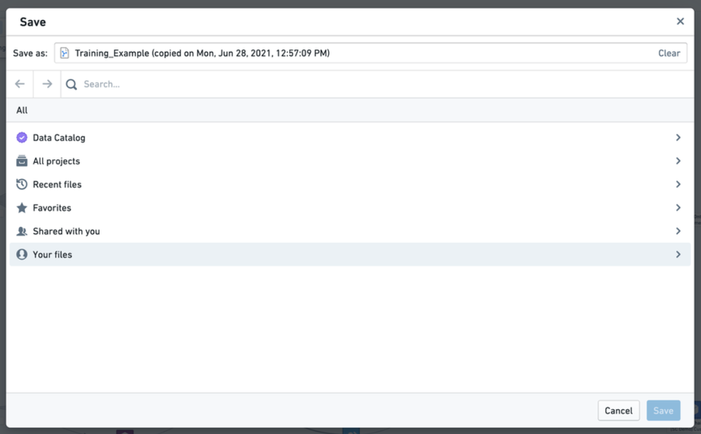
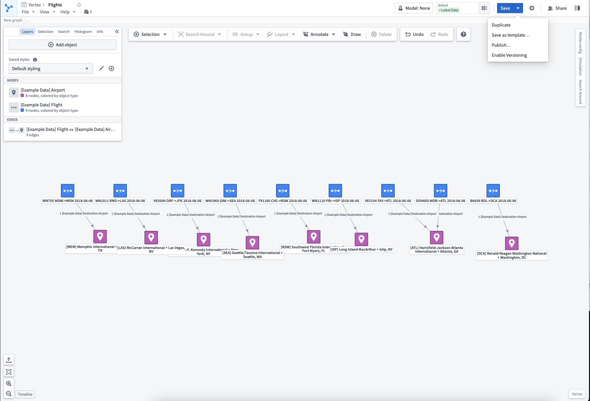
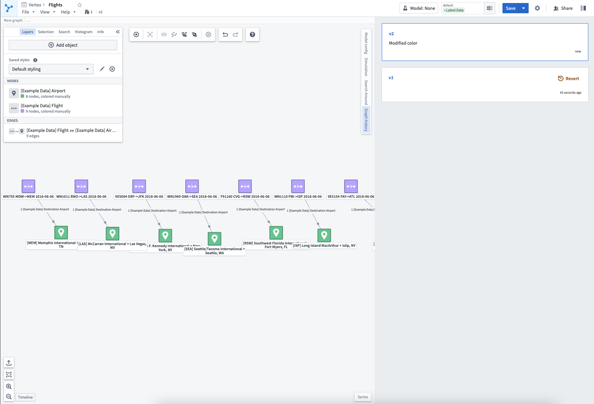

<!-- source: https://palantir.com/docs/foundry/vertex/save-share/ · mirrored 2026-08-26 from Palantir Foundry docs -->

# Save, share, and collaborate

There are many ways to save and share your system graph or case study.

## Save a draft

Selecting **Save as** on the top toolbar will prompt you to save a graph within a relevant Foundry project. A graph is only visible to those who have access to the project where it is saved. Once a draft has been saved for the first time, selecting **Save** will update the state.

If you wish to share this graph more broadly, you can turn on link sharing from the **Share** menu in the top toolbar. From this menu, you can select the relevant permission role you want to allow users when using the share link. When others access the link you will see their usernames under **Roles**.

Sharing a graph will not grant users access to any other resources to which a user does not already have access. When opening a graph, if a user does not have access to any objects or time series referenced in the graph due to permissions or deleted data, they will still see the structure and shape of the graph. The user will not see the specific data pertaining to the objects.

## Duplicate existing graphs

If you would like to work from an existing graph, you can select **Duplicate** from the dropdown **Save** menu. This action will prompt you to save a copy of the graph in a new project of your choice. Duplicating creates a new graph that you can work from without making changes to the original.

## Version control

If you would like to keep track of changes to your graph over time, you can select **Enable versioning** from the dropdown **Save** menu. Subsequent saves will create a new version of the graph.

A full version history can be viewed in the **Graph History** sidebar. Previous versions of the graph can be accessed in read-only mode (the current version number will be visible in the resource header).

By selecting **Revert** from the Graph History sidebar, a new version will be created with the same contents of the selected version.
