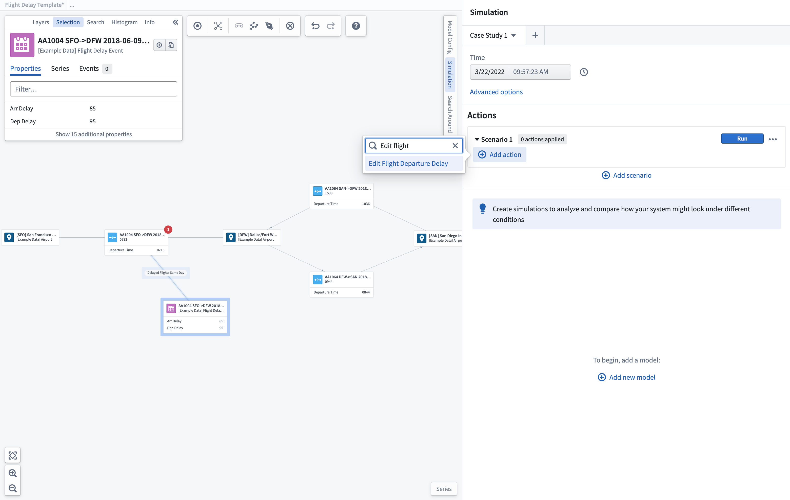
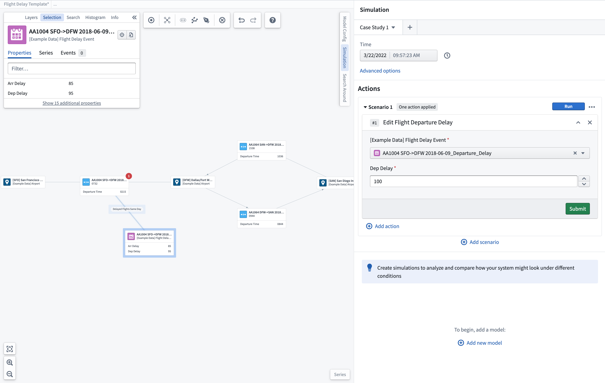
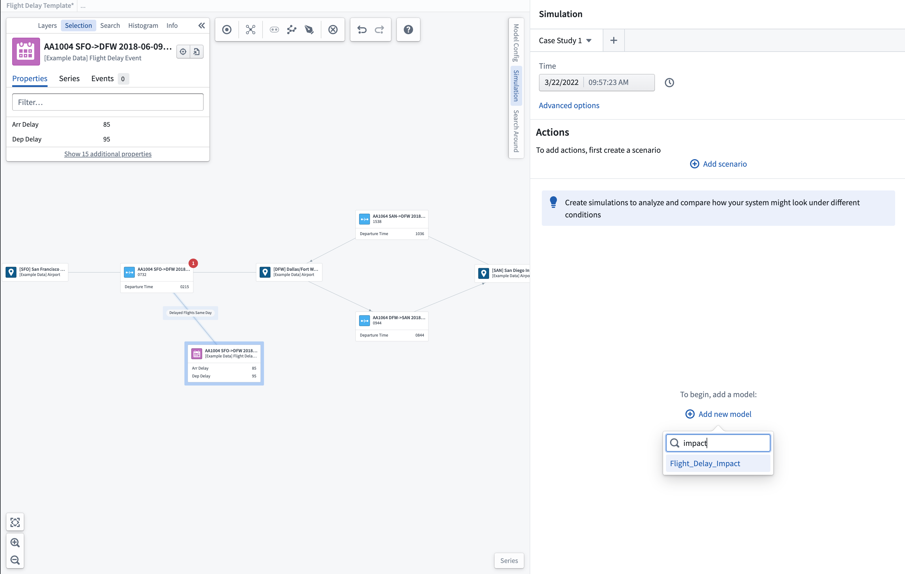
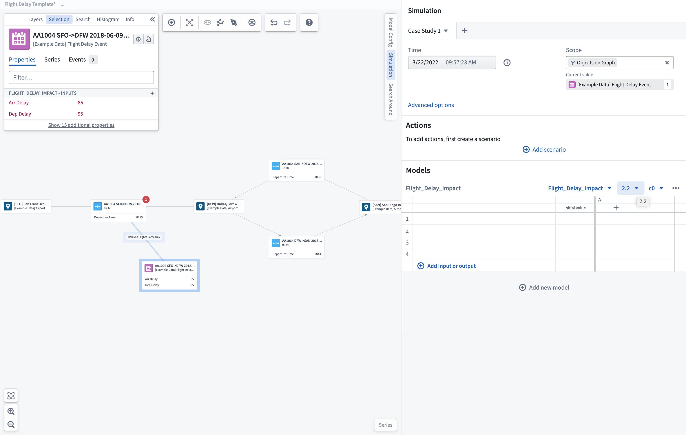
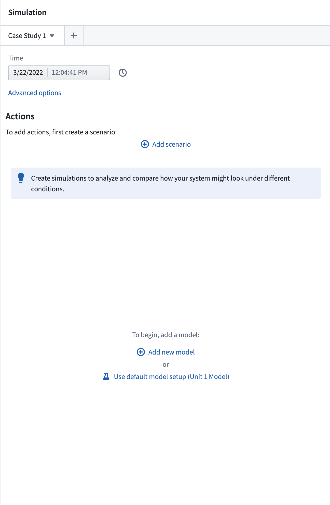
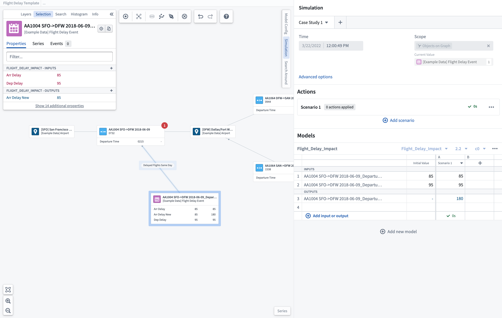
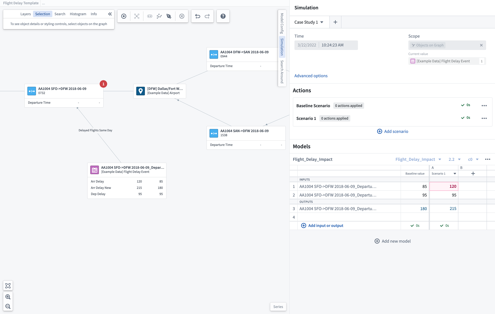
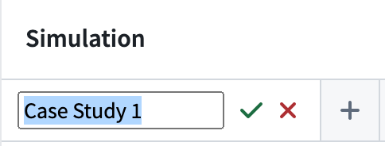

<!-- source: https://palantir.com/docs/foundry/vertex/scenarios-getting-started/ · mirrored 2026-08-26 from Palantir Foundry docs -->

# Getting started

[Scenarios](/docs/foundry/vertex/scenarios-overview/) allow you to understand the impact of different conditions or decision paths by asking "What if?" questions of your system. Vertex leverages existing models authored, published, and orchestrated within Foundry to provide an interface for visualizing modeled interactions across your system and selectively overriding key parameters to understand alternative Actions that can be taken to reach optimal outputs.

## Add Actions

You can test how using pre-configured Actions to modify objects in your Ontology may potentially impact both your local and overall system.

### Select Actions

To begin adding Actions, first select the **Add scenario** button. This will create a new scenario to which you can add Actions. You can expand the scenario section by selecting the scenario and selecting the **Add Action** button.

After choosing which Action to add, you must update the parameters of the Action and select **Submit** to save this Action within your scenario.

You may then run this scenario and view the effects of the Actions you created.

You may also add additional Actions or continue on to add models to a scenario to further simulate the effects on your system.

## Select models \[Sunset]

:::callout{theme="warning" title="Sunset"}
The model selection, configuration, and run process described below is in the [sunset](/docs/foundry/platform-overview/development-life-cycle/) phase of development and will be deprecated at a future date. Full support remains available. To continue using models in Vertex scenarios, we recommend [configuring a function for the model](/docs/foundry/model-integration/functions-on-models/), [importing that function](/docs/foundry/functions/functions-on-models/) into a [function-backed Action](/docs/foundry/action-types/function-actions-getting-started/), then following [the instructions listed above](#add-actions).
:::

You can select from existing models or functions that have been published within Foundry and bound to the Ontology using [Modeling Objectives](/docs/foundry/model-integration/objectives/). Within Vertex, you can create a scenario case study to investigate and understand the local processes and quantify how individual changes may impact local and connected systems.

### New model selection

To start a new investigation, you can select from any published models. Select **Add new model** and search for the relevant model for your process.

This will add the selected model to the scenario pane and allow you to select the correct model and configuration versions to start your new case study.

### Default model selection

When exploring an existing system or process, you can choose to run scenarios from the recommended pre-configured default models.

This will add the relevant models to the scenario pane and allow you to select the correct model and configuration versions to start your new case study.

[Learn more about the options that can be configured for your scenario.](/docs/foundry/vertex/scenarios-options/)

## Select input/output parameters

You can add the parameters you want to display within the scenario table using the **+ Add input or output** option. From here, you can choose to add individual time series, object properties, or measures to your scenario. This will open a search and selection box with the configured inputs/outputs available for the selected model. You can also default to **Add all parameters** that have been pre-configured. Any parameters chosen will be shown within the scenario table; if the parameter is an input, it can be overridden by manually editing the value within the scenario table prior to running a scenario.

:::callout
Once the model is selected, any properties used as input/output parameters will be shown in the object selection panel.
:::

## Run a scenario

Once parameters have been added, the current value of the parameter will be shown for the inputs using the currently selected time for any time series parameters. Selecting **Run** will generate a scenario to calculate the modeled outputs based on the input values shown. Once completed, the scenario will show a green checkmark and the time taken for outputs to be generated.

## Build your "what if" case study

To test possible solutions, you can build your case study and iterate through "what if" scenarios.

Input override conditions by selecting the parameter to override and inputting the new simulated input. This will highlight the box with the override.

Running a scenario with override values will show the newly calculated outputs for comparison to the baseline scenario that was run. You can continue to add different scenario runs to investigate the optimal outputs.

Simulated values will be shown as comparisons to the readouts added to the object node extended labels.

Once you have completed a set case study, you can rename this at the top of the scenario pane. You may want to create multiple different case studies to investigate different conditions across the same system. You may also rename individual scenarios to better capture the Actions which are involved.

## Chained models

[Learn how to configure chained models.](/docs/foundry/vertex/chained-models/)
