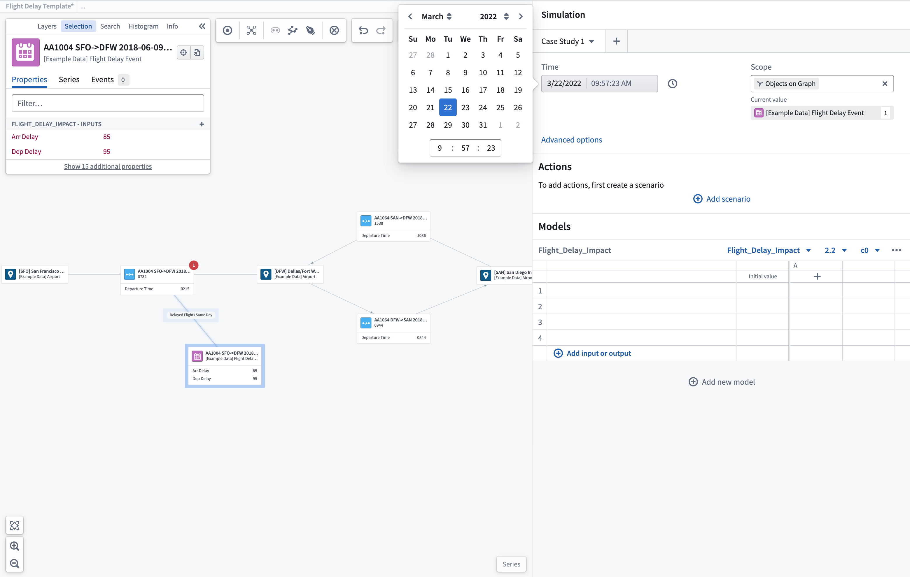
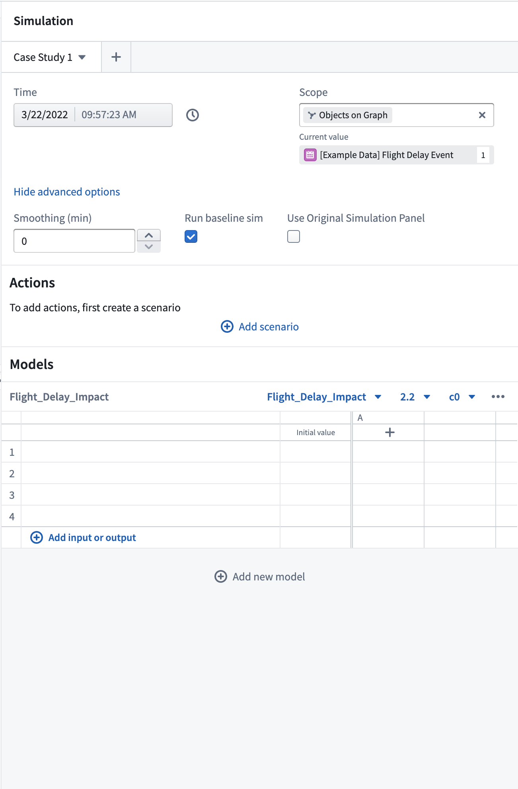
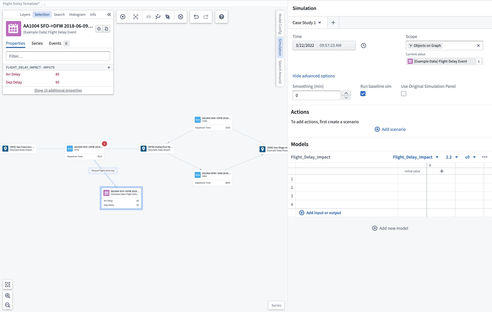
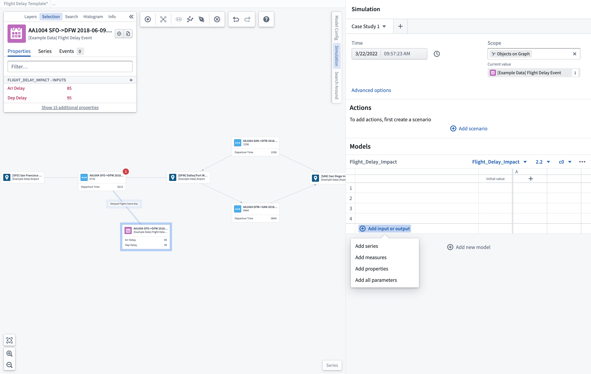
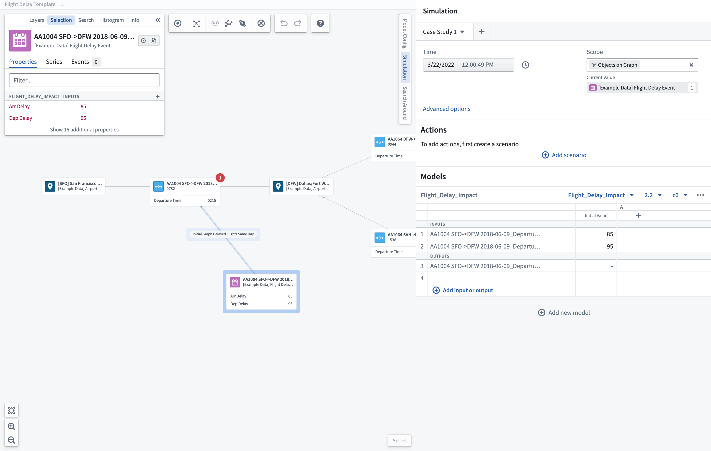

<!-- source: https://palantir.com/docs/foundry/vertex/scenarios-options/ · mirrored 2026-08-26 from Palantir Foundry docs -->

# Scenario options

### Time window selection

You can specify the time window for running your scenario. You should select a time where there is known data for the objects in scope of the scenario.

### Advanced options

You can configure time series smoothing over set periods (minutes).

### Scope

For object-based System Graphs, you can choose to set the scope of the scenario to objects shown only in the graph to limit available input/output parameters.

### Run baseline scenario

You may choose whether you want to run an additional baseline scenario whenever you are running a scenario which contains either actions or overrides. This baseline scenario will run the models you have chosen without any actions or overrides, providing you with a baseline against which to compare your other scenarios and better judge the impacts of your actions.

## Select input/output parameters

You can add the parameters you want to display within the scenario table using the **+ Add input or output** option. From here, you can choose to add individual time series, object properties, or measures to your scenario. This action will open a search and selection box with the configured inputs/outputs available for the selected model. You can also default to **Add all parameters** that have been pre-configured. Any parameters chosen will be shown within the scenario table. If the parameter is an input, you can override it by manually editing the value within the scenario table prior to running a scenario.

:::callout
Once the model is selected, any properties used as input/output parameters will be shown in the object selection panel.
:::

