<!-- source: https://palantir.com/docs/foundry/vertex/timeline/ · mirrored 2026-08-26 from Palantir Foundry docs -->

# View and filter events on a timeline

The timeline can be used to inspect the time properties of objects and filter to specific events in a given time range.

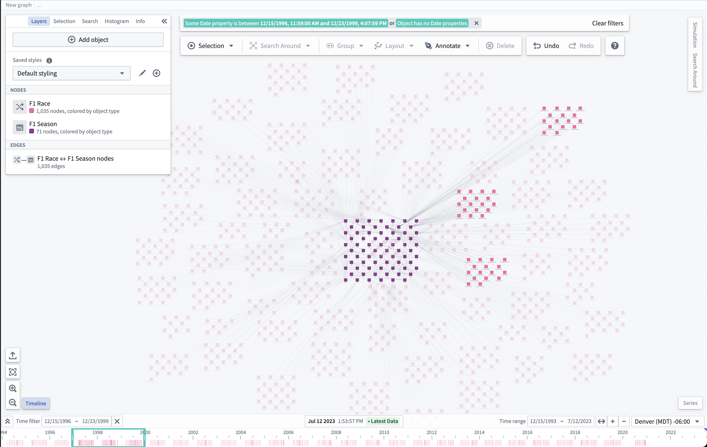

## View time events

The **Timeline** button in the lower-left of the interface can be used to show or hide the timeline.

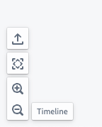

If nothing is visible on the timeline, the **Zoom to fit** button can be helpful to show time events on the graph in the timeline's **Time range**.

When visible, the timeline will show lines for an object's time properties and bars for time ranges in an object's properties.

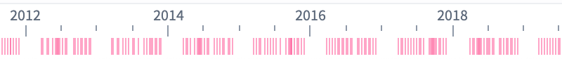

## Filter time events

Events can be filtered on the graph by either holding Shift and left-click dragging on the timeline to create a time filter window, or by using the **Time filter** button in the control bar of the timeline.

The **Time filter** is also available on the top of the application. Nodes on the graph that match the filter are fully opaque, while nodes that do not match the time filter are faded out.

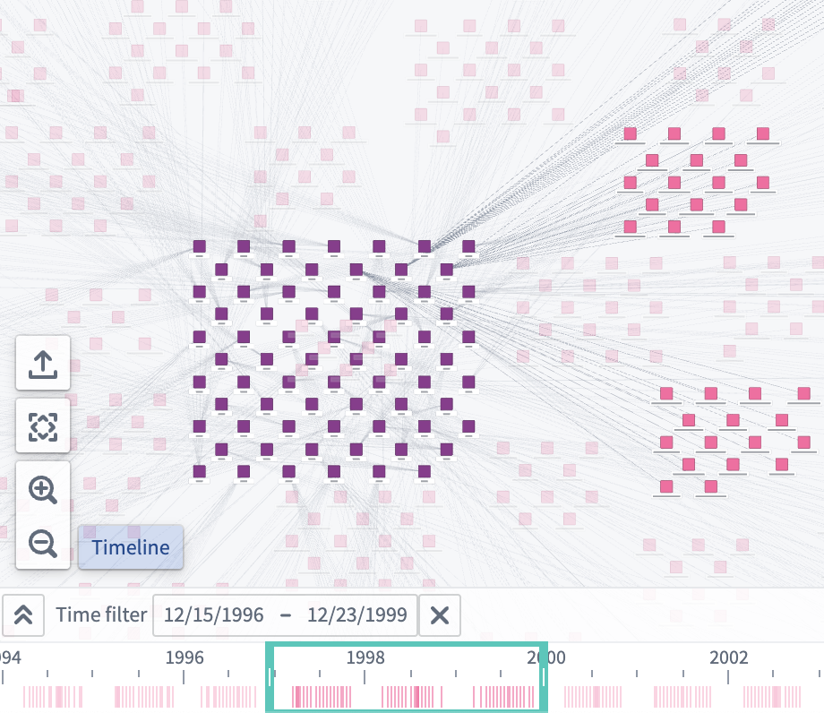

## Change cursor position

The cursor position on the timeline can be changed by double-left-clicking on the timeline, dragging the cursor to a new position, or by using the input in the middle of the control bar.

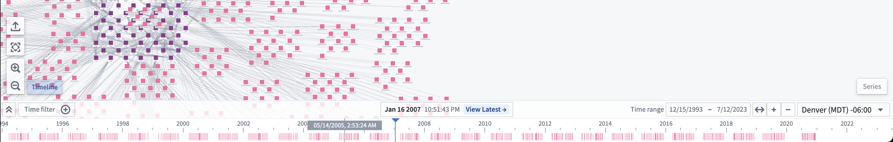

To get a more specific date for the cursor, you can click the cursor form to input a specific date and time.

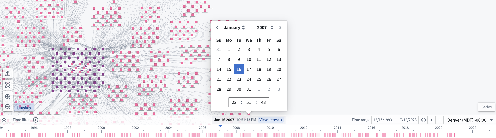

## Expand the timeline

To show each object type on its own timeline row, click the "expand" button () in the control bar of the timeline.

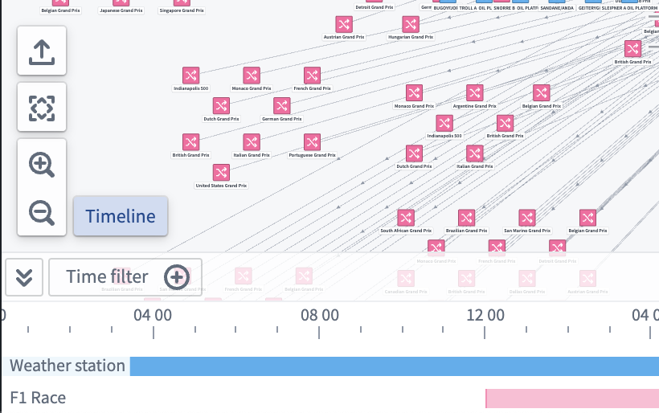

## Style the timeline

To change how objects appear on the timeline, select the brush icon next to the object node in the **Layers** panel to the left of your screen. Then, expand the **Timeline shape** section.

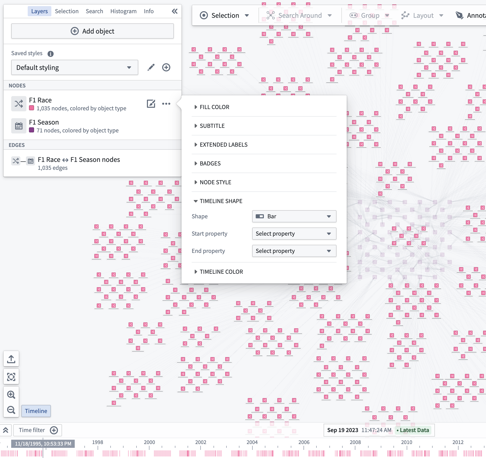

You can change the properties used when drawing the selected shape on the timeline; select the **Start property** and **End property** dropdown menus for shapes that use two time properties, or select **Time property** for shapes that use a single property.

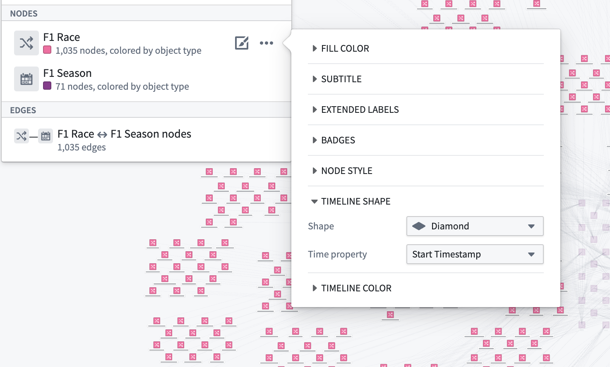

The shape chosen in the timeline style configuration will appear for every instance of the object type in the timeline.

Select the **Timeline Color** menu to configure how shape colors are represented on your timeline.

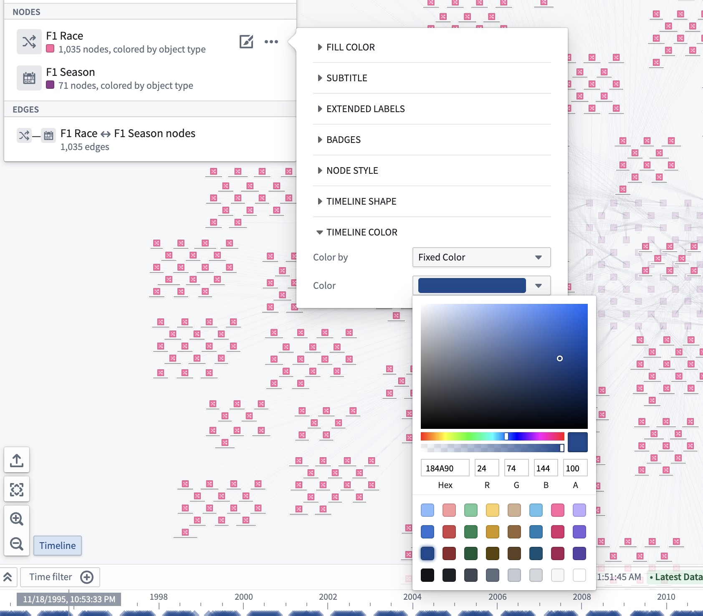

You can also use properties and measures to configure timeline [color styling](/docs/foundry/vertex/graphs-display-options/#color-by) by changing the selected option in the **Color by** dropdown menu. For example, the image below is configured to color by the `Year` property with a rainbow color spectrum:

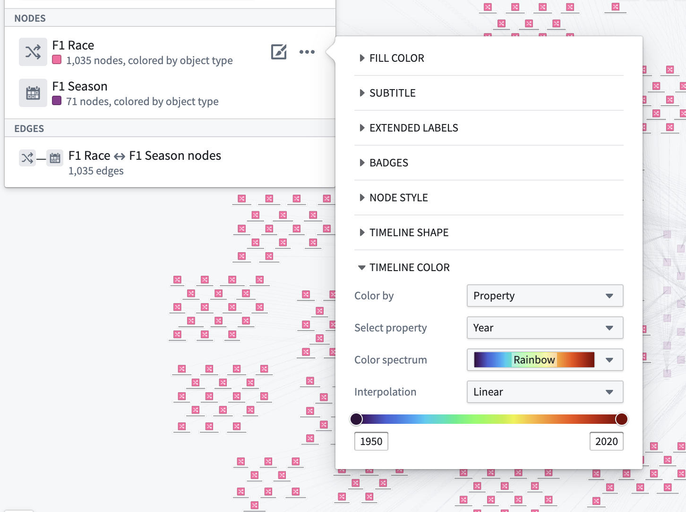

## Timeline playback

You can use the play button (⏵) to move the time cursor automatically; playback speed can be adjusted with the speed presets (1x, 2x, 5x, 10x, 100x, and so on).

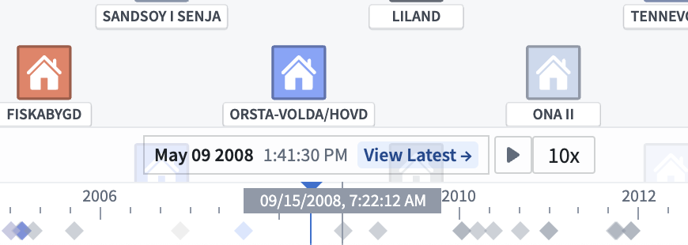

The cursor will loop automatically through the time window on the timeline or a time filter if it exists.

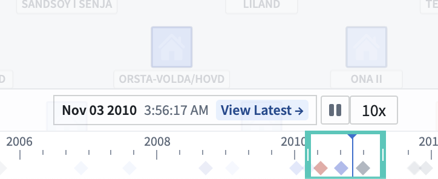
