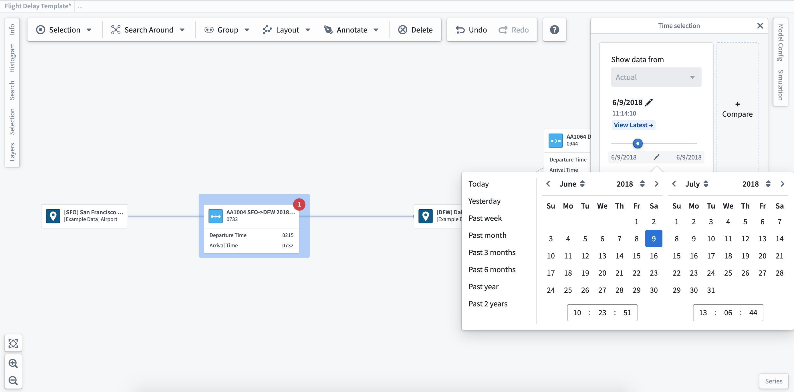
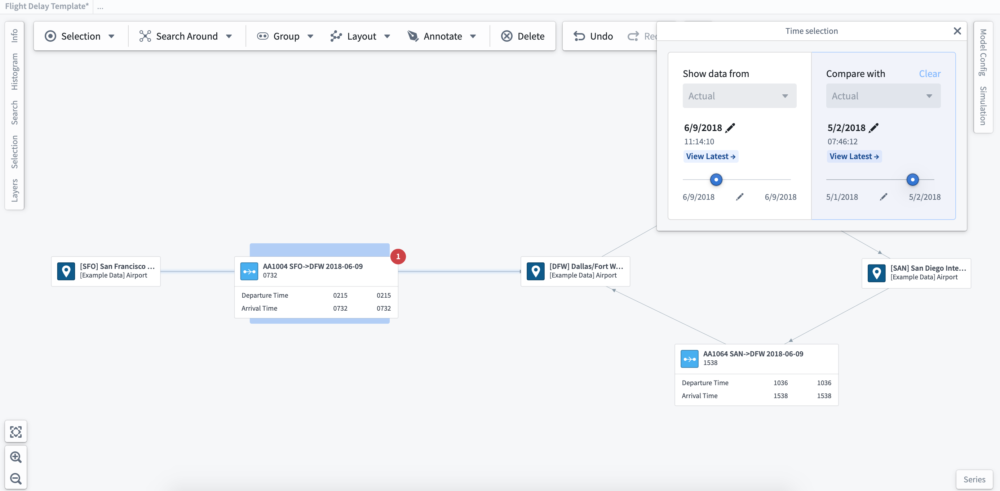

<!-- source: https://palantir.com/docs/foundry/vertex/use-time-selection/ · mirrored 2026-08-26 from Palantir Foundry docs -->

# Use time selection

By choosing the **Time selection** bar at the top of the workspace, you can set a time window and scroll through to understand how your system changes over time. You can also use the date selector to set a time window if there is a specific time range of interest.

You can choose to create multiple time selections for comparison. Click on the **+ Compare** button to the right of the **Time selection** pane to create additional time selections. As you compare selected time windows, the values shown on the extended labels/readouts on the graph will update. These updates allow you to visualize and compare changes over time.

:::callout
If you have a simulation case study, you can select it from the dropdown to compare modeled values.
:::
