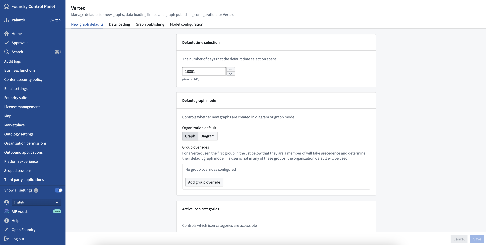

<!-- source: https://palantir.com/docs/foundry/vertex/vertex-settings-control-panel/ · mirrored 2026-08-26 from Palantir Foundry docs -->

# Configure Vertex settings in Control Panel

Various organization-wide Vertex settings can be configured using [Control Panel](/docs/foundry/administration/control-panel/). To modify Vertex settings, you will need the `Vertex Admin` role.

## Graph defaults

* **Default time selection:** The number of days that the default time selection spans.
* **Default graph mode:** Controls whether new graphs are created in diagram mode \[beta] or graph mode.
* **Active icon categories:** Controls which icon categories are accessible in diagram mode \[beta].

:::callout{theme="neutral" title="Beta"}
Diagram mode is in the [beta](/docs/foundry/platform-overview/development-life-cycle/) phase of development and may not be available on your enrollment. Functionality may change during active development. To enable diagram mode, contact your platform administrator to [modify application access](/docs/foundry/administration/configure-application-access/) in Control Panel.
:::

## Data loading

* **Time series polling interval:** How frequently (in seconds) Vertex will check for updated time series values when in live mode.
* **Time series missing data warning:** Vertex will display warnings when time series do not have recent observations. This setting controls the maximum period of time allowed (in hours) between the selected time and the nearest time series value before the warning will appear.
* **Object search limits:** Controls the maximum number of objects a user can add to a graph from the search dialog.
* **Search around limits:** Controls the behavior of adding objects to a graph via search arounds.
  * **Maximum number of objects:** The maximum number of objects Vertex will load as a result of a single Search Around.
  * **Maximum number of ungrouped objects:** The maximum number of objects resulting from a search around that Vertex will add to the graph as individual nodes, rather than groups. If more objects than this limit would be added to the graph, the objects will be automatically grouped.
  * **Template search around max depth:** The maximum number of nested Search Arounds allowed when creating a template.

## Model configurations

* **Legacy model configuration:** An updated model configuration experience is available through the Modeling objectives application. While support for models configured directly through Vertex will remain, configuring new models in the Vertex configuration panel is now discouraged.
* **Model configuration mappings:** Select which types of data mappings are available to model configurers.
