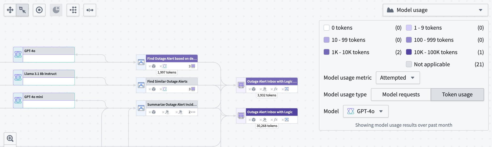
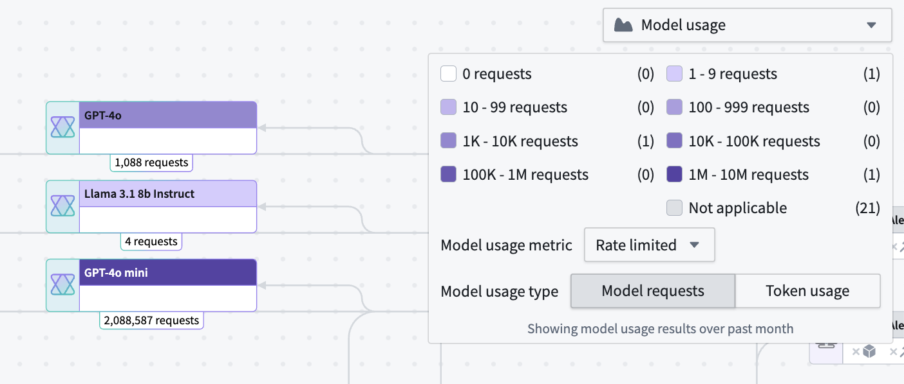
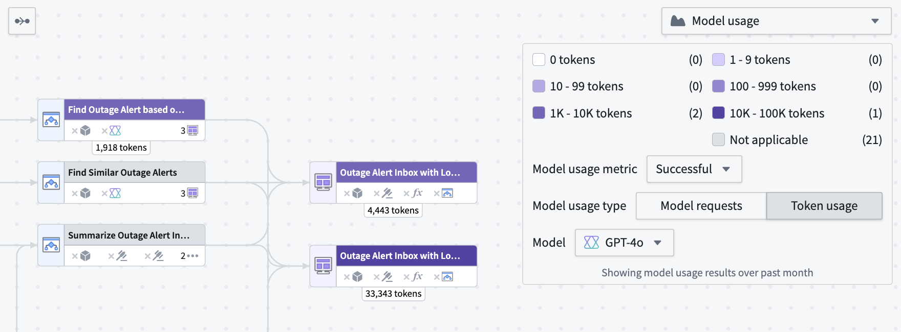
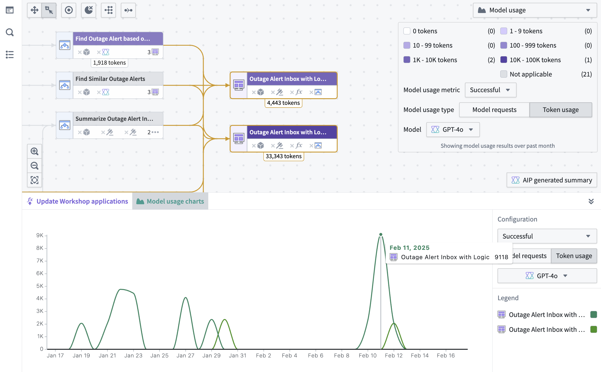

<!-- source: https://palantir.com/docs/foundry/workflow-lineage/aip-usage-observability/ · mirrored 2026-08-14 from Palantir Foundry docs -->

# AIP usage metrics and observability

:::callout{theme="neutral"}
The application previously known as Workflow Builder is now called Workflow Lineage.
:::

To start using Workflow Lineage, open a Workshop application or functions repository and use the keyboard shortcut `Command + I` (macOS) or `Ctrl + I` (Windows) to view the relevant Workflow Lineage graph depicting the objects, actions, and functions that back the application.

## AIP usage metrics

The following sections will help you understand the various AIP usage metrics viewable in Workflow Lineage.

### Model usage coloring

Workflow Lineage allows you to view model metrics for model requests and token usage. There are three types of model usage metrics:

* **Successful:** Total successful model requests or tokens used in attempts made by the specified model.
* **Attempted:** Total attempts made by the model, including successful and rate-limited attempts.
* **Rate-limited:** Total [rate-limited attempts](../aip/llm-capacity-management.md/#enrollment-capacity-and-rate-limits) made.

Under **Model usage**, specify whether you want to view **Model requests** or **Token usage** metrics.

**Model requests** shows the total number of specified requests on model nodes in your Workflow Lineage.

**Token usage** shows the number of tokens used for Workshop applications, Automations, or third-party OSDK applications. Token counts on Logic nodes are the token counts used in the Logic application debugger.

### Model usage charts

You can view the token usage or model requests over time for Workshop applications, Automations, and third-party applications (Ontology SDK applications) over time in a line chart by selecting the nodes and opening the **Model usage charts** panel at the bottom.

To view the specific value for a particular resource, hover over the graph itself. The same filters that are used in the color legend explained above also appear in the charts panel.

## Bulk replace models

Once you identify model usage you want to migrate or replace, open the **Replace model** tab in the bottom panel to replace a language model across multiple AIP Logic functions in a single action. For step-by-step instructions, see the [bulk replace models](/docs/foundry/workflow-lineage/refactor-and-understand-workflows/#bulk-replace-models) documentation.

## AIP observability

Workflow Lineage provides observability features to help you monitor and debug your AIP workflows. You can track execution history, visualize distributed traces, access detailed logs, and analyze performance metrics for your functions, actions, language models, and automations.

For detailed information about AIP observability features, view the [AIP observability documentation](/docs/foundry/aip-observability/overview/).
