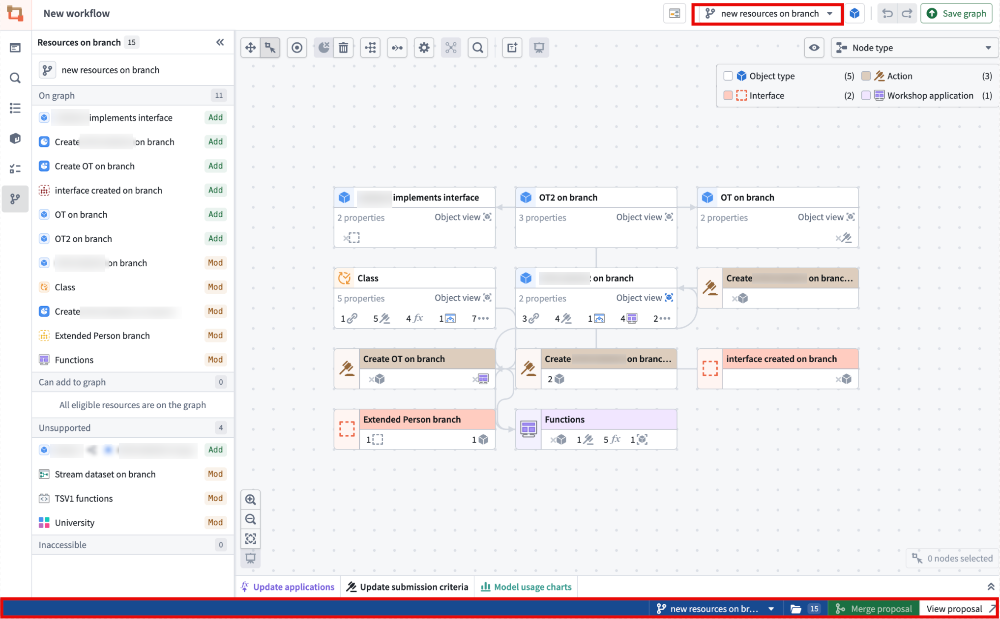
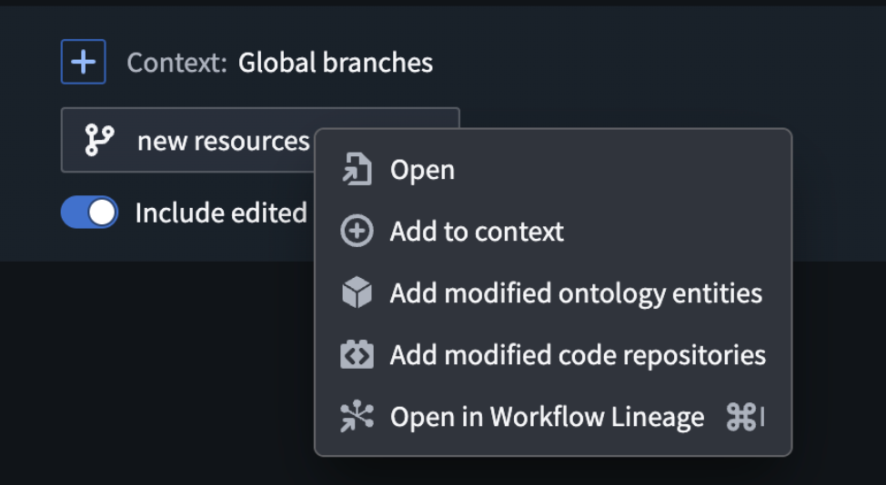
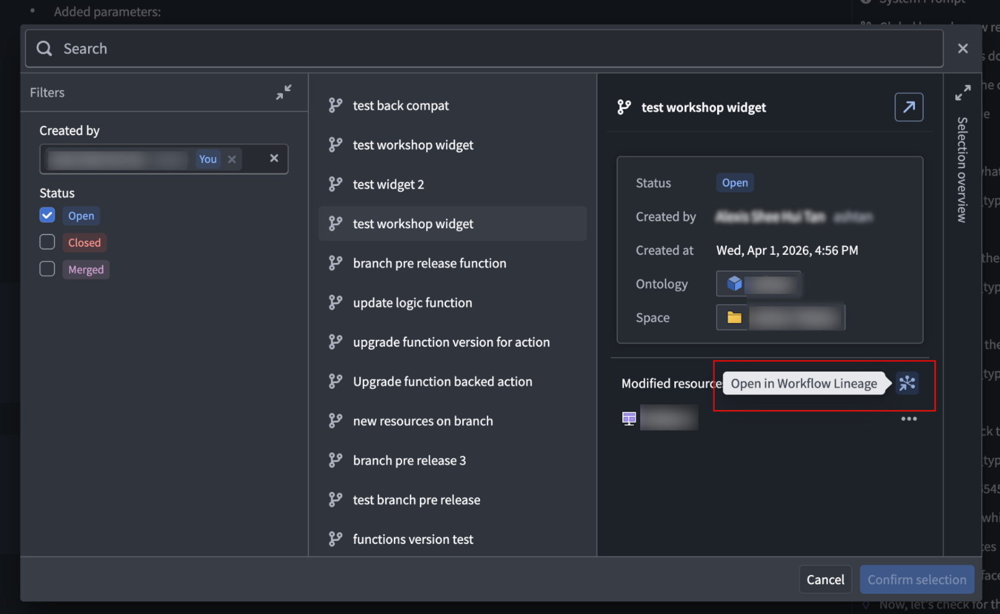
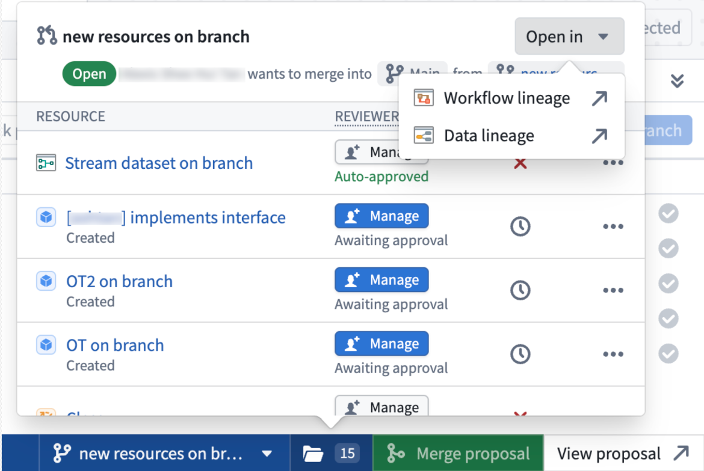
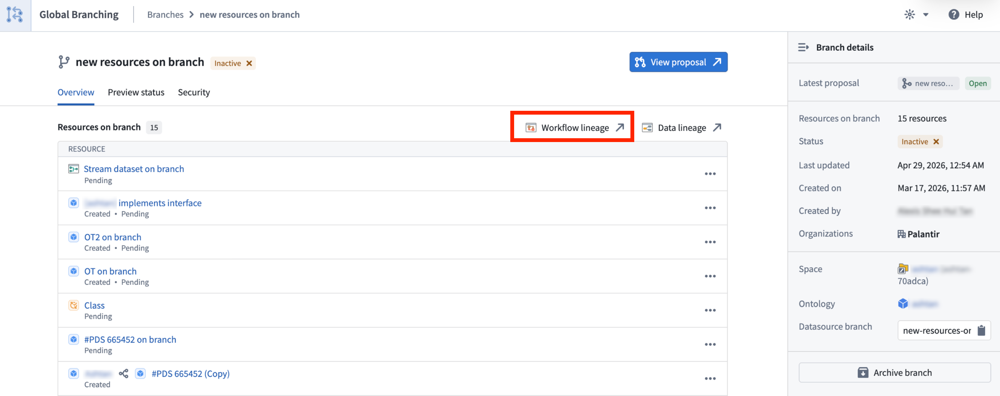
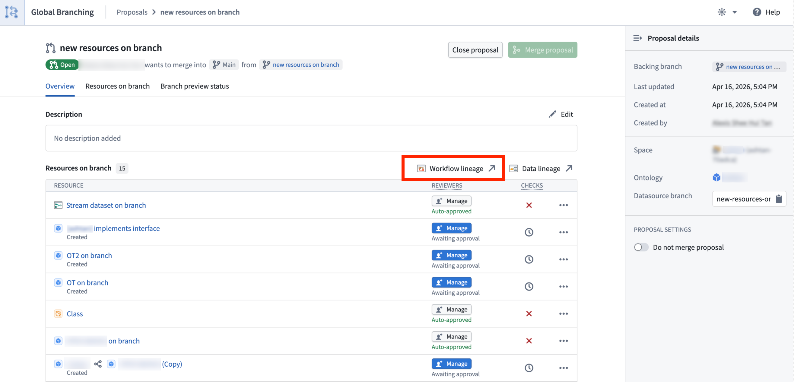
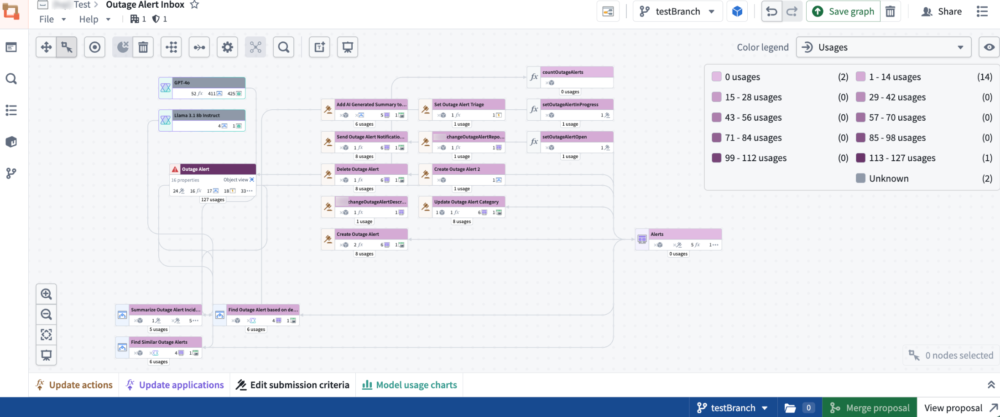
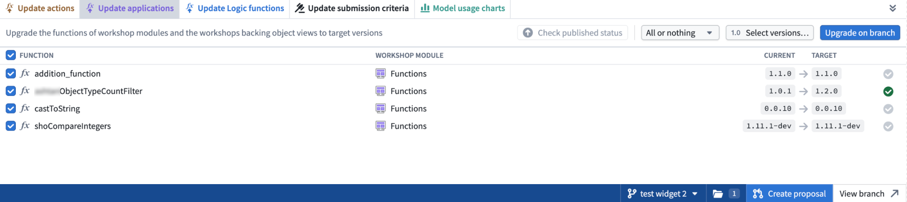

<!-- source: https://palantir.com/docs/foundry/workflow-lineage/branching-workflow-lineage/ · mirrored 2026-08-14 from Palantir Foundry docs -->

# Branching in Workflow Lineage

Workflow Lineage supports Global Branching, allowing you to inspect, edit, and validate workflow resources on a branch before merging changes into `main`. This makes it easier to develop and test end-to-end workflow changes in an isolated branch context before promoting them to production.

For general information on Global Branching concepts and workflows, refer to the [Global Branching documentation](/docs/foundry/global-branching/core-concepts/).

 

 

## Adding, removing, and modifying resources

When working on a global branch, you can open Workflow Lineage from a variety of supported branch-aware entry points, including:

* The AI FDE panel, by right-clicking a global branch tag or when selecting a global branch context to add.

     

    

     

    

     

* The global branch bottom bar.

     

    

     

* The global branch main branch page.

     

  

     

* The global branch proposal page.

     

  

     

Eligible resources are added to the graph automatically, and the branch side panel helps you review any added or modified resources. You can also use `Cmd+I` (macOS) or `Ctrl+I` (Windows) from supported resources on a branch to open Workflow Lineage in the same branch context. This is supported from Workshop, Ontology Manager, AIP Logic, and Pipeline Builder object type outputs.

## Cross-application compatibility

With Global Branching in Workflow Lineage, you can use branch-aware color modes for function repositories, action rules, Ontology status, usages, and out-of-date dependencies.

 

 

You can also perform supported bulk edits, including upgrading function versions for action types or Workshops, deleting Ontology resources, and updating action type submission criteria.

 

 

In addition, you can search for and add resources created on a branch, including object types, action types, functions, and interfaces. The side panel helps you review modified resources and add modified resources that are not already displayed on the graph.

## Known limitations

* Object type groups in search only reflect those apart of the `main` branch.
* Bulk upgrading logic on a branch is not currently supported.
