<!-- source: https://palantir.com/docs/foundry/workflow-lineage/getting-started/ · mirrored 2026-08-14 from Palantir Foundry docs -->

# Getting started

To get started with Workflow Lineage, use the keyboard shortcut `Cmd + i` (macOS) or `Ctrl + i` (Windows) to view the Workflow Lineage graph depicting the objects, actions, and functions that back your resource. You can also navigate to Workflow Lineage from the following applications with the **Open in Workflow Lineage** navigation option commonly found under **File** or **Actions**.

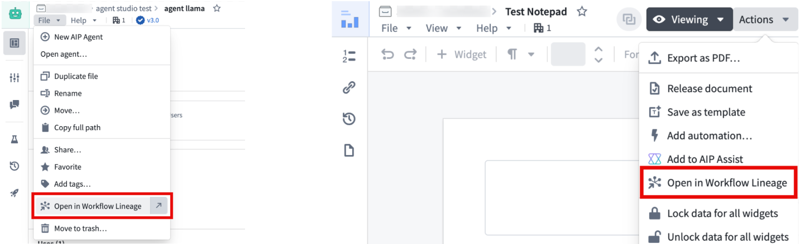

The following applications support these features:

* Workshop
* Objects in Ontology Manager
* Function repositories
* Quiver dashboards
* Machinery
* Slate
* Chatbot Studio
* Automate
* Third-party applications
* Developer Console (Keyboard shortcut only)
* Marketplace (Keyboard shortcut only, in a draft resource's overview tab.)
* Notepad (Navigation option only)
* Object types in Pipeline Builder (Navigation option only)

## Interface

Workflow Lineage's interface consists of the two main components, as seen in the following notional screenshot:

1. **Graph panel:** An interactive graphical view of the entities backing your workflow and the relationships between them.
2. **Workshop panel:** An interactive view of the selected Workshop applications.

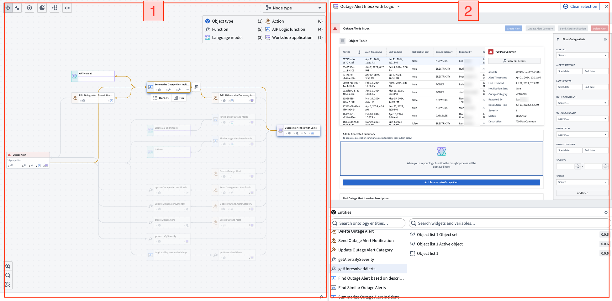

### Graph panel

When you select nodes on the graph panel, you can see the corresponding Workshop components highlighted on the Workshop panel. This makes it easy to see the exact places that are using specific nodes and can help show you where specific objects are being used.

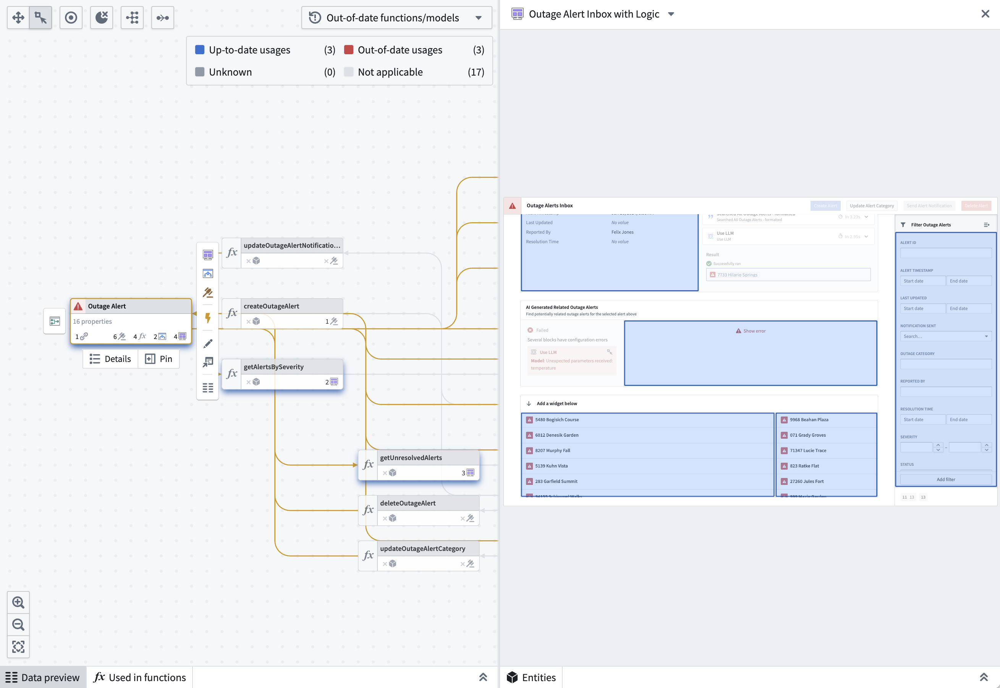

When you select a specific node on the graph, you can use the **Pin** option to pin it to the left sidebar or view more details about the node.

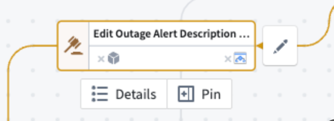

To see all linked dependencies for a particular node, select the icon corresponding to the input type you want to see on the graph.

You can view the icons of each node type in the legend at the top right of the graph panel. Object type nodes are represented using the icon specified in the Ontology.

In the example below, we want to see the nine actions dependent on the `Outage Alert` object. Select the same icon location inline on the object to show and hide those dependencies from view.

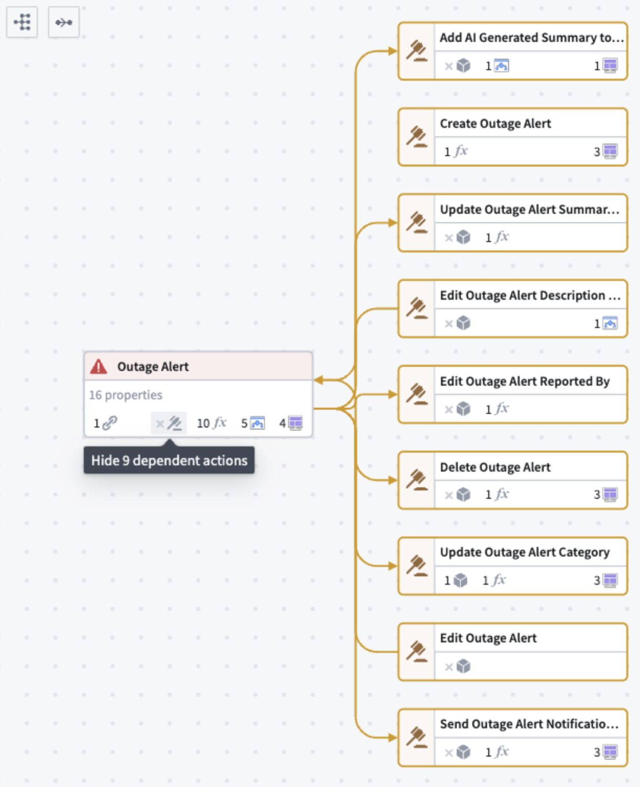

Review details of a specific node by selecting the node and then opening the selection details panel on the left side of the screen. Details displayed vary depending on the type of node selected. The following is a list of sample details that can be found for each resource:

* **Objects:** A list of properties and where those properties are used throughout the workflow (see property provenance linked below), linkages, backing data source, and so on.
* **Object links:** Resource usage by objects, functions, actions, Workshop applications, and more.
* **Functions:** Inputs, outputs, dependencies, repository, and other relevant metadata.
* **Actions:** API, RID, input data, Ontology edits, and submission criteria.
* **AIP Logic functions:** Dependencies, automations, and metadata about creation details.
* **Language models:** Model descriptions and metadata on model creator and context windows.
* **Workshop applications:** Metadata about creation and action, function, and object dependencies.

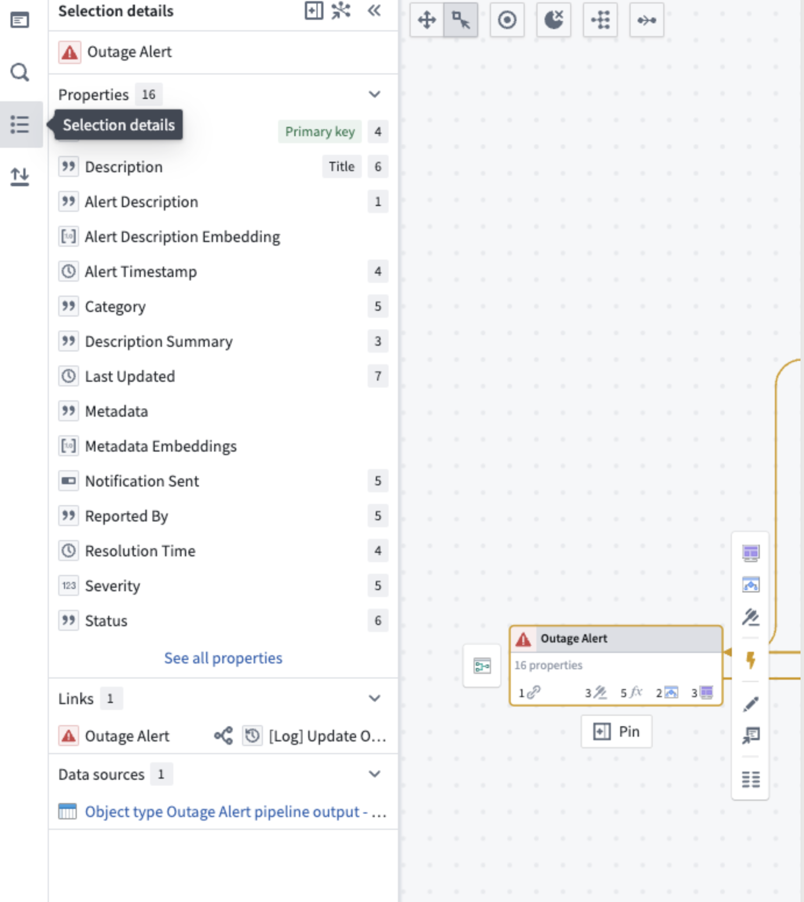

### Support for multiple ontologies

The Workflow Lineage graph displays resources from all relevant ontologies, allowing you to visualize cross-ontology relationships.

If an object, interface or action node belongs to a different ontology, that node will be gray and a warning icon will appear in the upper right corner of the node.

:::callout{theme="neutral"}
Action type nodes and object nodes will have limited functionality when you select an ontology different from their own. For example, you can only perform bulk updates on function-backed actions within the currently selected ontology.
:::

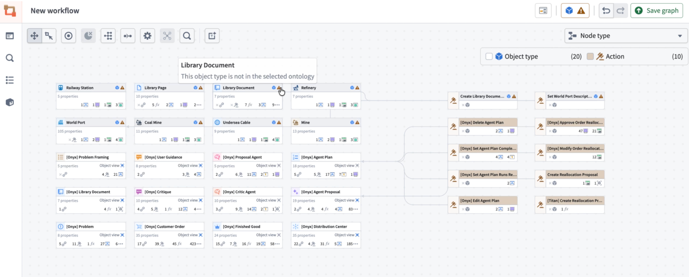

If multiple ontologies are present, a warning icon will also appear next to the blue cube in the upper right corner of the graph. Though you can only select one ontology at a time, you can view the ontologies present in your graph and switch between them by selecting the cube icon.

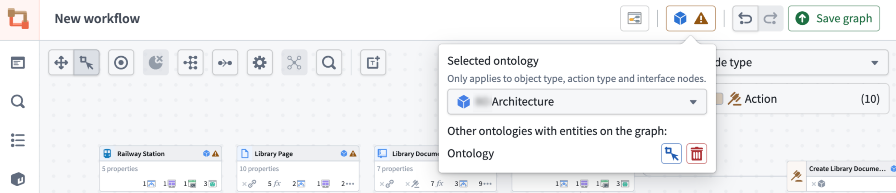

### Additional details

For **Functions**, you can view the code when you select the node. This includes the objects from which your function reads and a description of the logic. You can also [bulk upgrade functions used in Workshop applications and automations](/docs/foundry/workflow-lineage/refactor-and-understand-workflows/#function-backed-automation-upgrades).

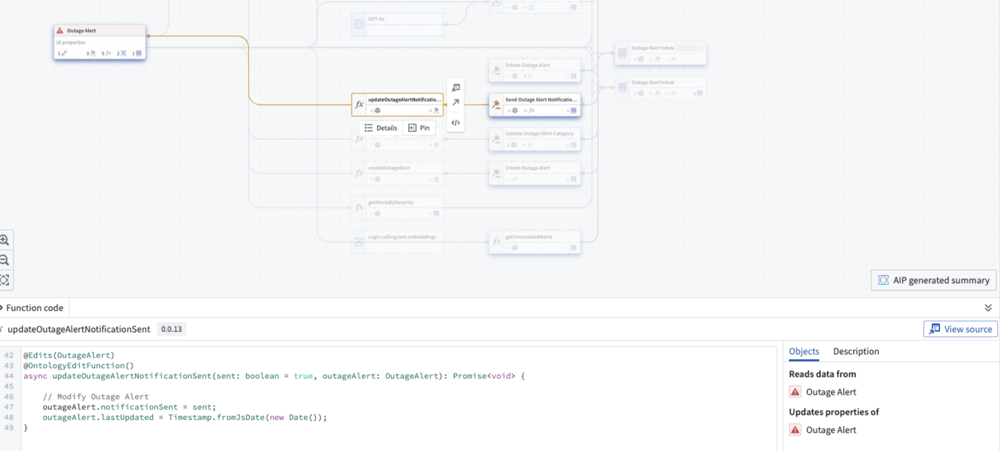

For **Actions**, you can view the action function code, the action log, and the option to [upgrade the action](/docs/foundry/workflow-lineage/refactor-and-understand-workflows/#property-provenance). You can also [bulk update the submission criteria on actions](/docs/foundry/workflow-lineage/manage-security/#bulk-update-action-submission-criteria) and [bulk delete actions and objects](/docs/foundry/workflow-lineage/refactor-and-understand-workflows/#bulk-delete-objects-and-actions).

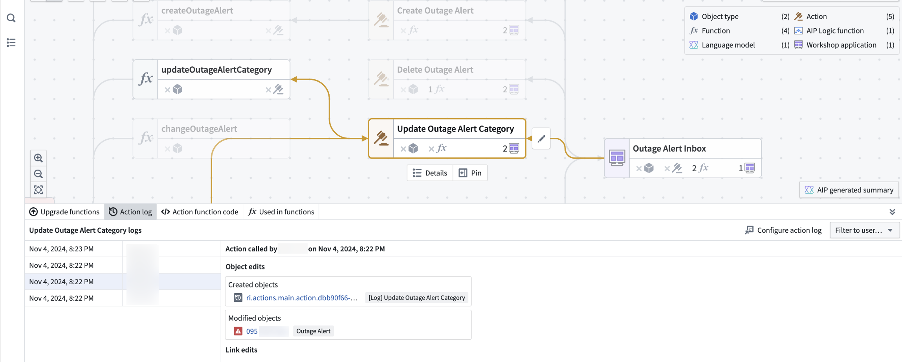

For **objects**, you can view a preview of the object data. You can also [bulk delete actions and objects](/docs/foundry/workflow-lineage/refactor-and-understand-workflows/#bulk-delete-objects-and-actions).

:::callout{theme="warning"}
By default, the lines denoting object links and objects that are inputs to actions are not shown on the graph. To see these relationships, select the object nodes. You can use `Cmd + A` on macOS and `Ctrl + A` on Windows as a shortcut to select all nodes.
:::

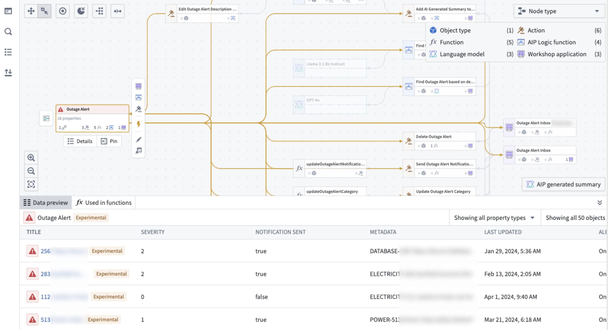

You can also view object links under the **Links** section of the **Selection details** panel. Hover over each object link to show a preview of all usages.

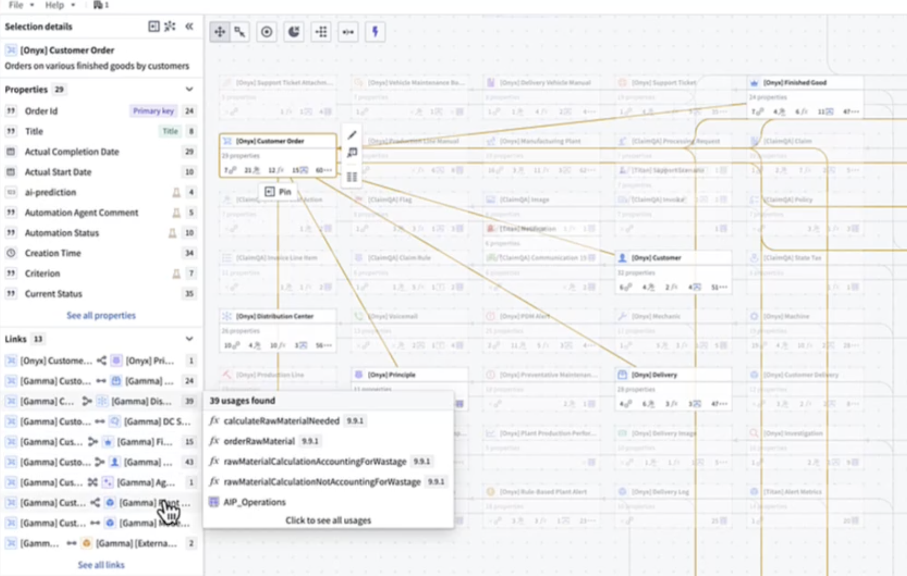

Select the link to view full details. If the link is being edited, a pen icon will appear next to the corresponding usage.

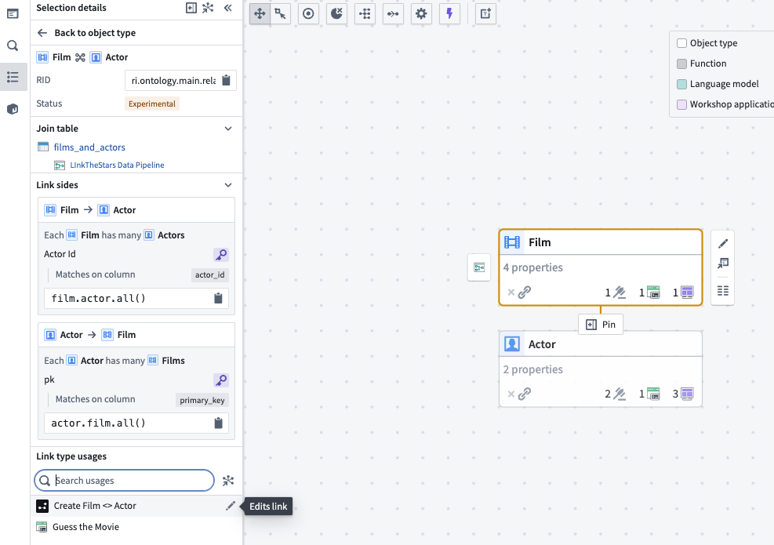

These links will also show up as dependencies in downstream resources.

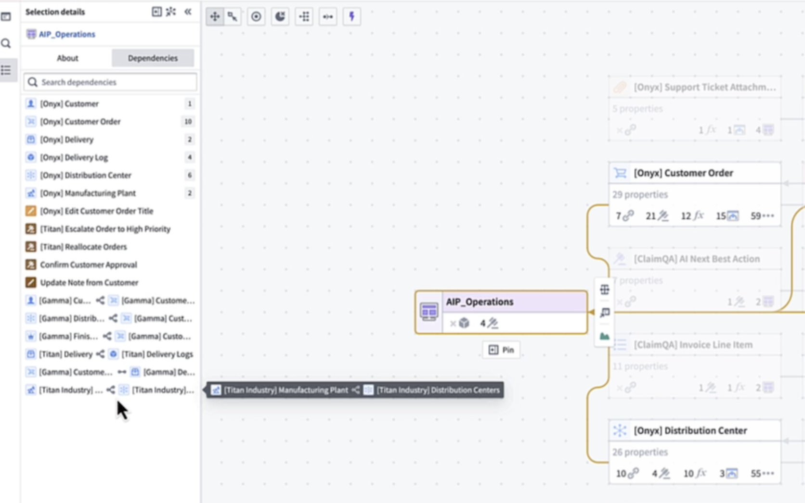

For **Automations**, you can view property usages and dependencies in the **Selection details** sidebar. Under **Condition ontology dependencies**, you can see a breakdown of the specific object properties on which the automate's condition depends. Hover over the number to view the exact property.

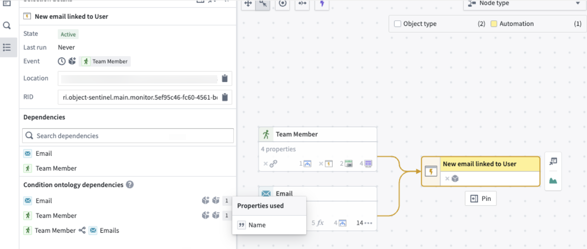

You can also toggle the purple lightning bolt button at the top left of the graph to view the actions and functions that trigger the automation.

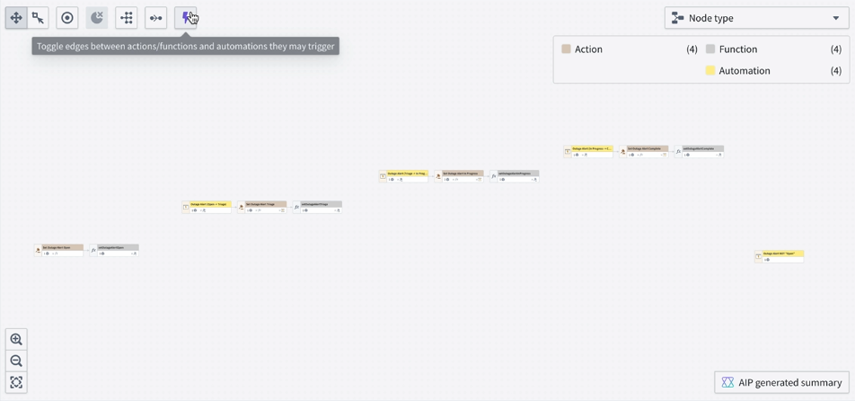

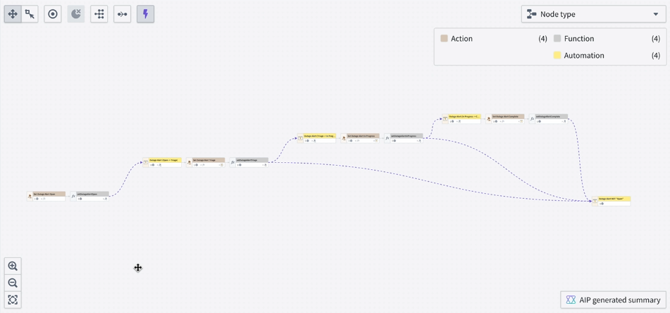

If you have an automation that triggers when a property is a specific value, Workflow Lineage will find the actions or functions that edit that property to that value and link them to the automation.

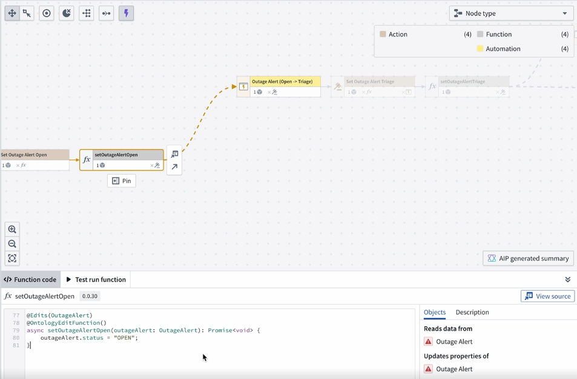

### Workshop panel

On the Workshop panel, you can select different components and view the corresponding nodes highlighted on the Workflow Lineage graph.

At the bottom of the Workshop panel, the **Entities** section shows all backing objects and actions used in the application. When you select a specific entity, you can view exactly where the entity is used throughout the Workshop application.

If you have multiple Workshop applications on your graph, you can use the dropdown menu at the top to toggle between Workshop application views.

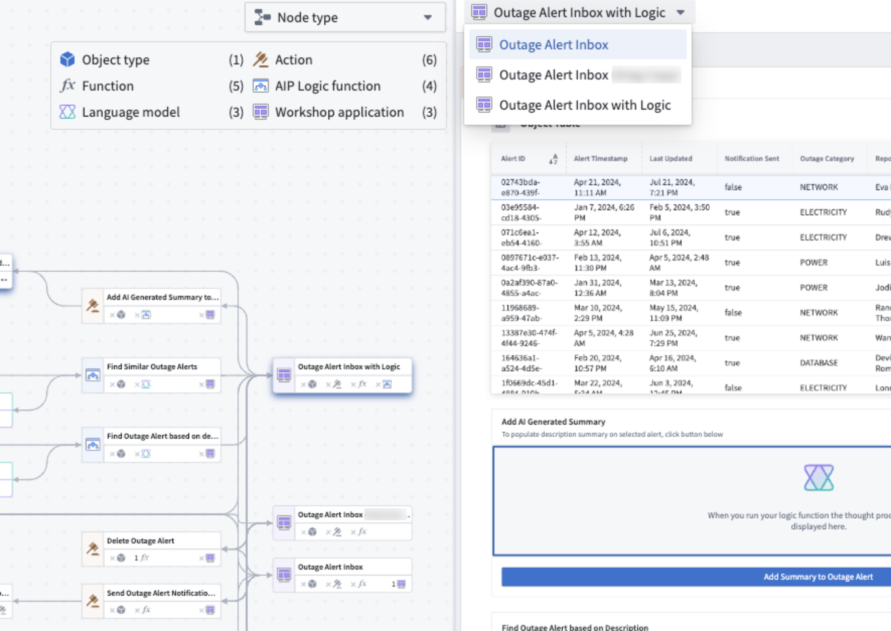

To reopen the Workshop panel, select any Workshop application on the graph and press `I`, or double-click on the node.

## Color legend options

Workflow Lineage provides a color legend system to help manage security and view metadata about specific applications. Examples of color legends are below:

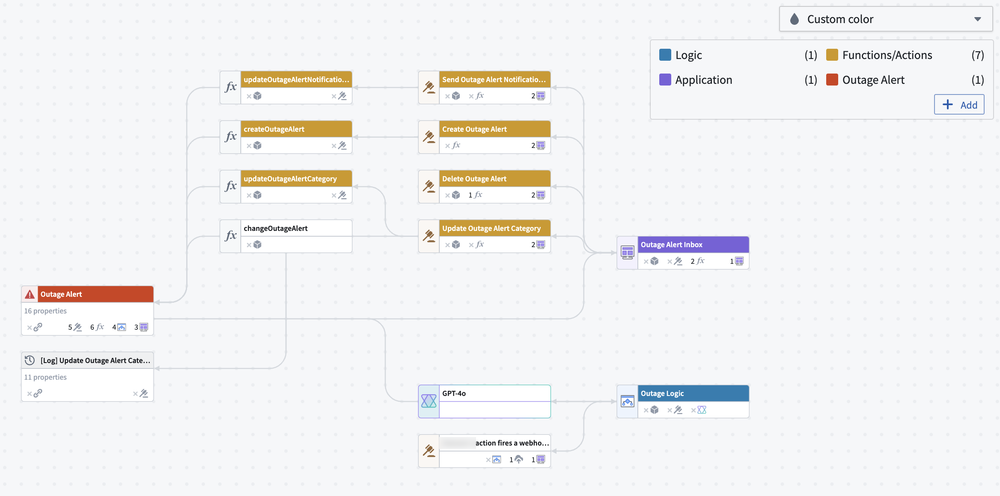

### General

* **Node type:** Shows the type of resource that each node represents on your graph.
* **Custom color:** Adds colors into the legend by right-clicking nodes to create a new color group, selecting an existing one, or dragging colors from the legend onto nodes.

### Permissions

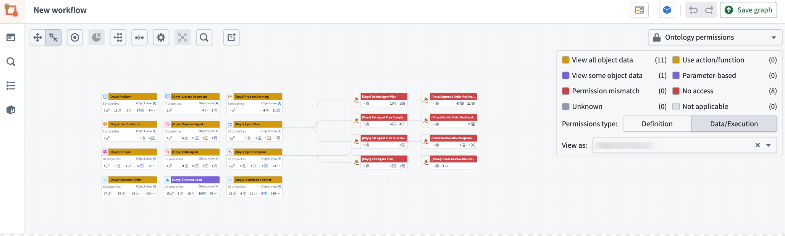

* **Ontology permissions:** Review the [managing security](/docs/foundry/workflow-lineage/manage-security/) documentation.
* **Resource permissions:** Review the [managing security](/docs/foundry/workflow-lineage/manage-security/) documentation.

### Usage

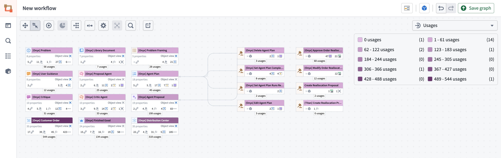

* **Usages:** Applies color to Workshop applications based on how many views that application had over the past four weeks, in both view and edit mode.
* **Out of date functions:** Review the [action-backed function upgrades](/docs/foundry/workflow-lineage/refactor-and-understand-workflows/#function-backed-action-upgrades) section.
* **Application views:** Applies color to Workshop applications based on how many views that application had over the past four weeks, in both view and edit mode.
* **Model usage:** Review the [AIP usage metrics](/docs/foundry/workflow-lineage/aip-usage-observability/#aip-usage-metrics) section.
* **Ontology status:** Applies color to nodes based on `Active`, `Experimental`, `Deprecated`, `Example`, and `Promoted` statuses.
* **Action rule:** Applies color to nodes based on whether it runs a function, creates, modifies, or deletes objects, or does a combination of any of the above.
* **Automation expiration:** Applies color to automation nodes based on their expiration date.
* **Last modified:** Applies color to nodes based on their last modified date.

### Organization

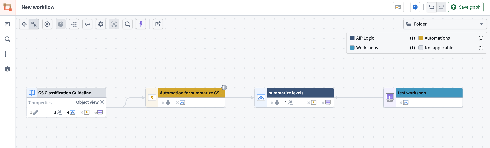

* **Folder:** Applies color to nodes based on the folder each node lives in.
* **Project:** Applies color to nodes based on the project each node lives in.
* **Portfolio:** Applies color to nodes based on the portfolio each node lives in.
* **Functions repository:** Applies color to function nodes based on the functions repository each node lives in.

## Text nodes

You can add text nodes in Workflow Lineage to help document and call attention to details in your graph. Text nodes use [Markdown syntax ↗](https://www.markdownguide.org/cheat-sheet/), and they can be colored like regular nodes. They will not be affected by layout options and are not attached to any specific node on your graph.

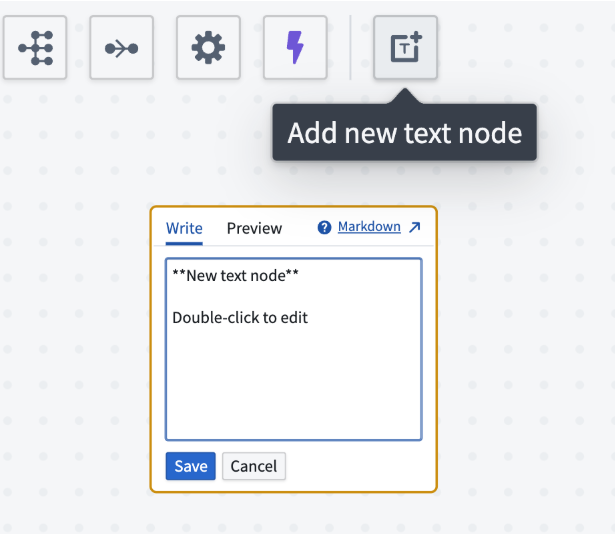

1. To add a text node to your graph, select **Text** in the top-left of the graph.
2. Double click the text node to edit and add Markdown text.
3. Select **save** when you are done.

To color a text node, right click and select **Color nodes**. Choose a color or add a new color.

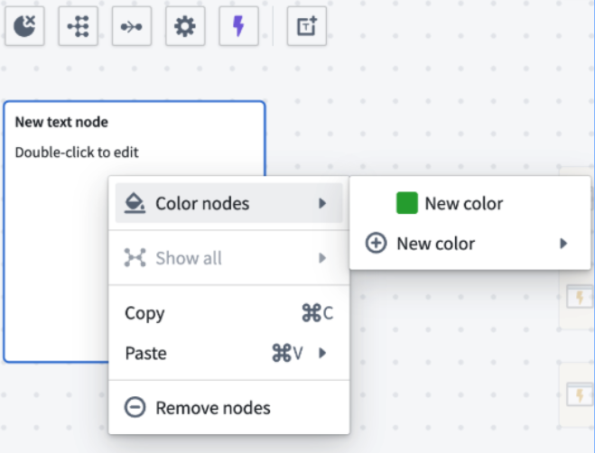

You can also resize text nodes using the three lines in the bottom right corner. If the length of your text is greater than the length of the text node, the node will automatically become scrollable.

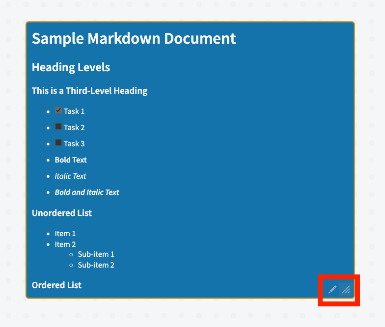

[Learn more about understanding workflows in Workflow Lineage.](/docs/foundry/workflow-lineage/refactor-and-understand-workflows/)

## Presentation mode

Presentation mode in Workflow Lineage lets you create and organize visual snapshots, or “frames”, of your graph for a seamless way to present you workflow.

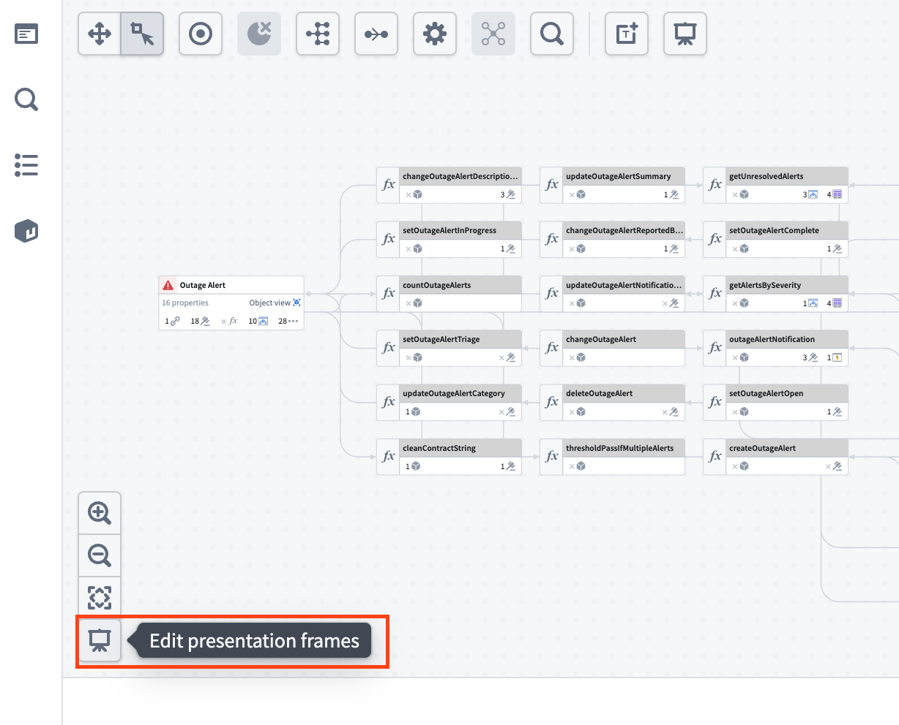

:::callout{theme="neutral"}
You must save your graph before you can use the presentation tool.
:::

To create a frame, adjust your graph to capture the desired configuration. This can include the arrangement of nodes, node colors, color mode, and zoom level. Once you are satisfied with the current view, select **Save state as new frame**.

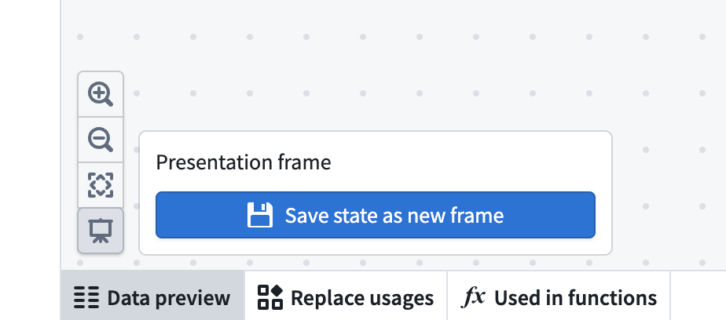

Each created frame will be given a default name such as “Frame (1),” “Frame (2),” and so on, based on the number of frames in your presentation. If you wish to rename a frame, select the pencil icon next to the frame’s name and enter your preferred title.

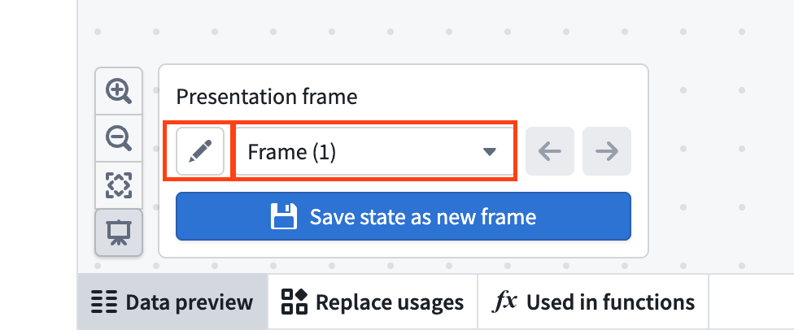

It is not currently possible to edit an existing frame directly. If you need to update a frame, adjust your graph as needed, save the new state as a new frame, and delete the old frame. To delete a frame, select the dropdown of all frames, and hover over the frame you want to delete. Then, select the red trashcan icon.

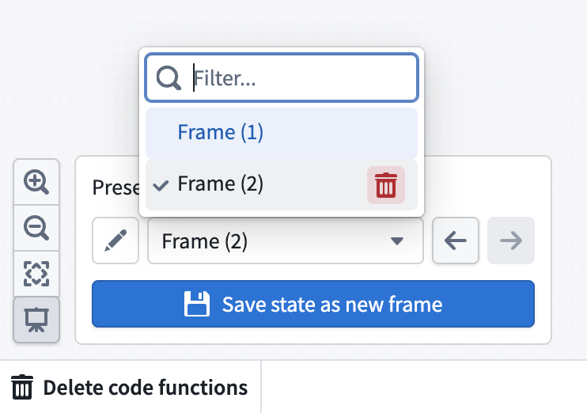

Note that presentation mode only captures the graph interface. Elements such as the Workshop side panel and the bottom and left side panels are not included in saved frames. You can use the hotkeys `,` and `.` to go backwards and forwards through your presentation frames, respectively.

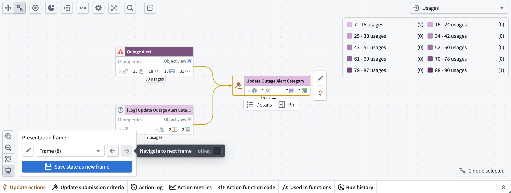

:::callout{theme="neutral"}
Tip: Use text nodes in your presentation frames. This allows you to guide viewers through each step of your workflow with custom notes or explanations.
:::
