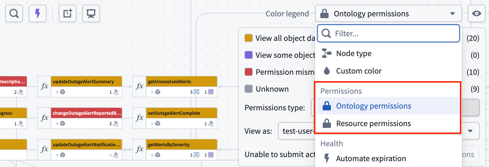
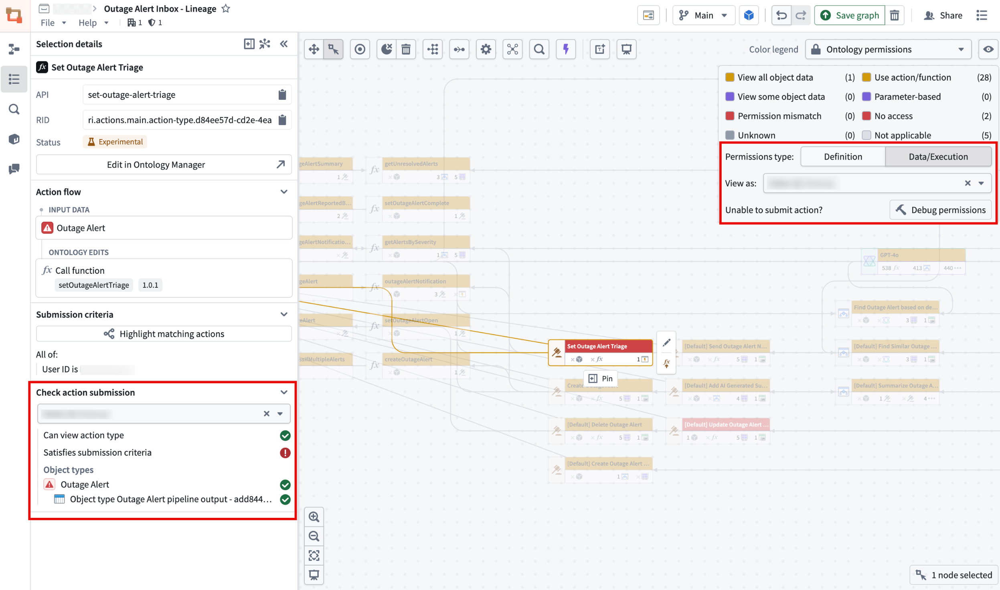
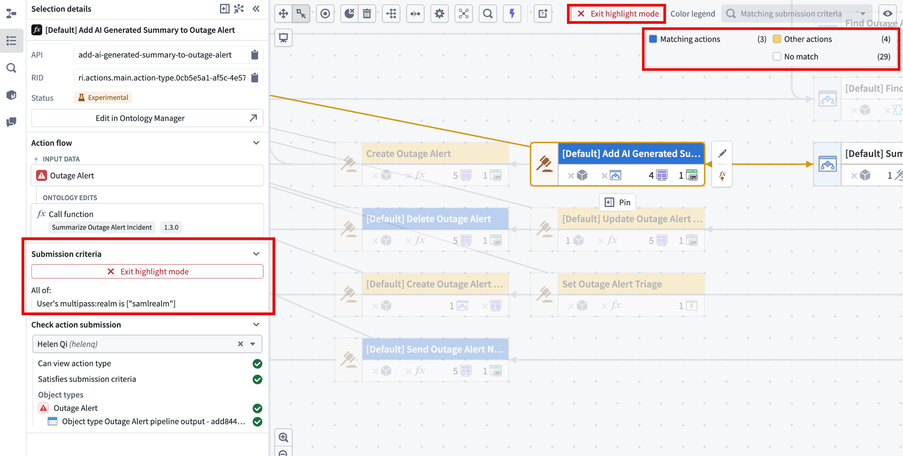
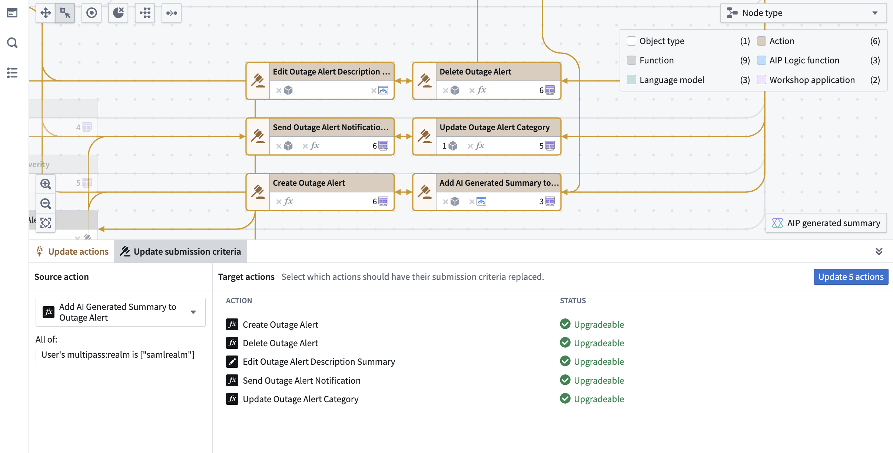
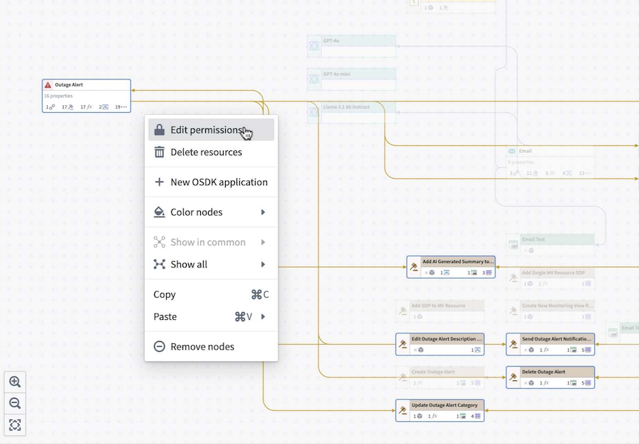
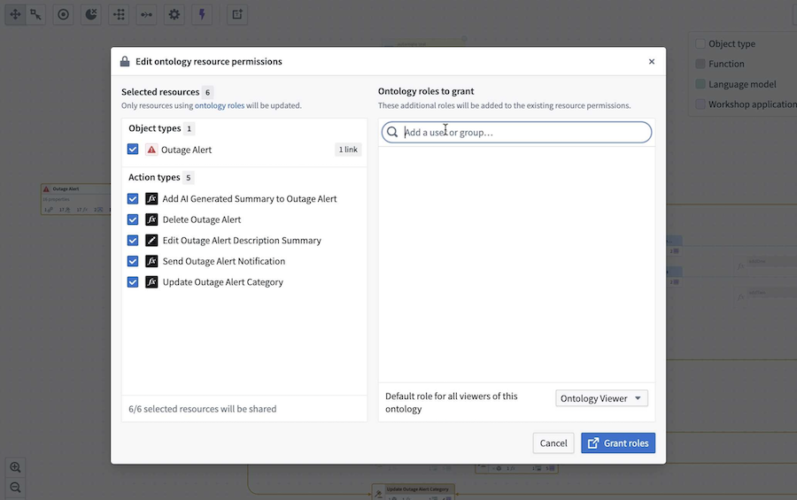
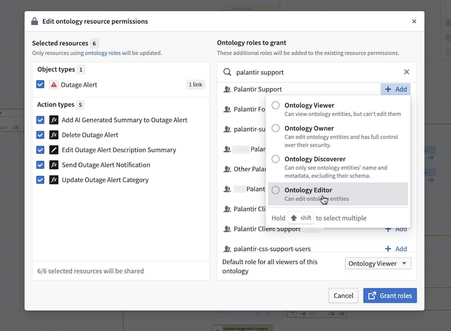
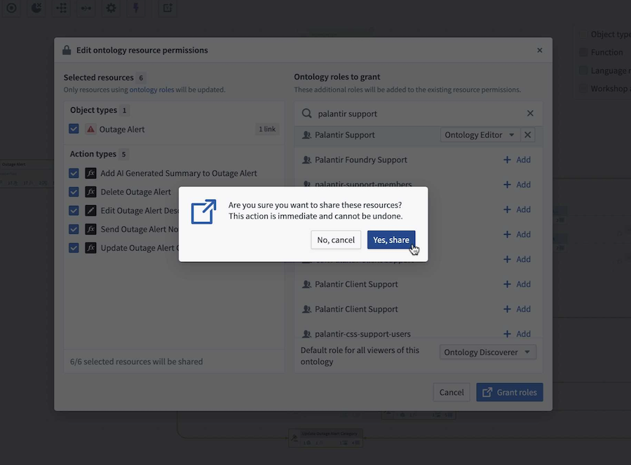
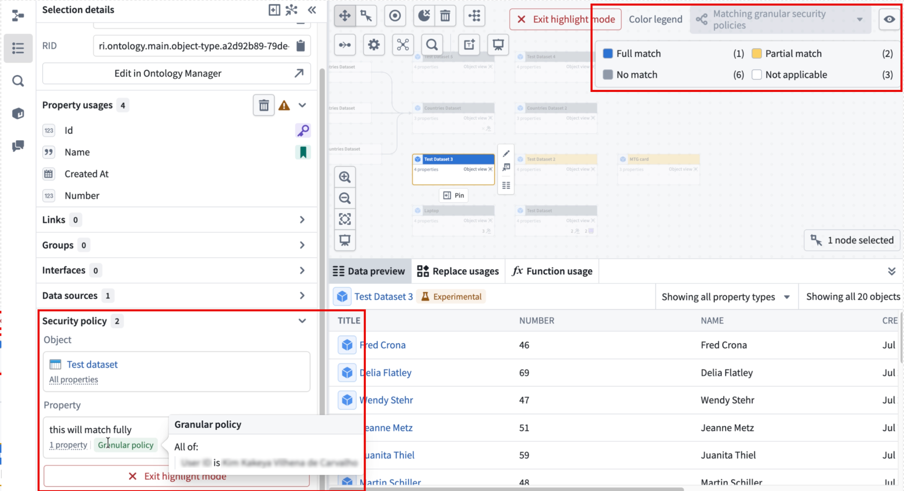

<!-- source: https://palantir.com/docs/foundry/workflow-lineage/manage-security/ · mirrored 2026-08-14 from Palantir Foundry docs -->

# Manage security

Workflow Lineage includes tools to help you understand and manage the security policies and submission criteria in your workflow.

## View permissions with color coding

The color legend in Workflow Lineage shows both **Ontology permissions** and **Resource permissions**.

There are two types of **Ontology permissions:**

* **Definition:** Whether the specified user can view or edit entity definitions.
* **Data and execution:** Whether the specified user can view object data or execute actions.

**Resource permissions** show a breakdown for that particular user: whether they are an owner, viewer, editor, discoverer, or have no access to the resource itself.

To check the access permissions of a specific user, enter their username into the **View as** dropdown menu for a preview.

## Debug why a user cannot submit an action

If you want to understand why someone cannot submit an action, use **Debug permissions** within the Ontology permissions color mode.

1. Select **Debug permissions** to open the left side panel. Alternatively, select your action first, then open the **Selection details** side panel to reach the same view.
2. Under **Check action submission**, select the user in question.
3. Review the breakdown of what is required to submit the selected action.

In the example above, the user can view the action type but does not satisfy the submission criteria.

## Highlight matching submission criteria

You can view the submission criteria for a selected action, and highlight all other actions on the graph that match those criteria.

To do this:

1. Select an action on your graph.
2. Open the **Selection details** side panel.
3. Select **Highlight matching actions** underneath **Submission criteria**.
4. View which actions match. When you are finished, select **Exit highlight mode**.

## Bulk update action submission criteria

After seeing the highlighted matching submission criteria, you can also bulk update action submission criteria to match the submission criteria of a source action. From the Workflow Lineage graph, select the actions you wish to update. Then, navigate to **Update submission criteria** from the bottom panel.

On the left side of the panel, select the source action with submission criteria that you want applied to the other actions. The submission criteria of the source action can be viewed under the selected source action.

When completed, select the blue **Update x actions** button where **x** is the number of actions that will be updated. This will create a proposal you can approve and submit for the changes to take effect.

## Bulk update ontology roles on resources

You can also bulk edit [ontology role permissions](/docs/foundry/object-permissioning/ontology-permissions-legacy/#ontology-roles) on objects and actions by following the steps below:

1. Navigate to a resource and right-click on it, then select **Edit permissions** from the context menu.

This will bring you to the **Edit ontology resource permissions** window, displaying the selected resources.

2. In the **Ontology roles to grant** section, search for the group that you want to add. After selecting the role, you should see it displayed next to the selected group.

3. Confirm the action by selecting **Grant roles** in the bottom right. A dialog will appear with the prompt, `Are you sure you want to share these resources?`.

4. Select **Yes, share** to proceed. Note that this action is immediate and cannot be undone.

## View matching object security policies

You can view an object's security policies, as well as see all other objects that match or partially match those policies.

1. Select an object on your graph.
2. Open the **Selection details** side panel and go to the **Security policy** section.
3. To view the granular policy, hover over **Granular policy**.

To see which objects on your graph fully or partially match your selected object's security policy go to the **Security policy** section in the **Selection details** side panel.

1. Select **Highlight matching actions** underneath **Security policy**.
2. View which actions match. When you are finished, select **Exit highlight mode**.
