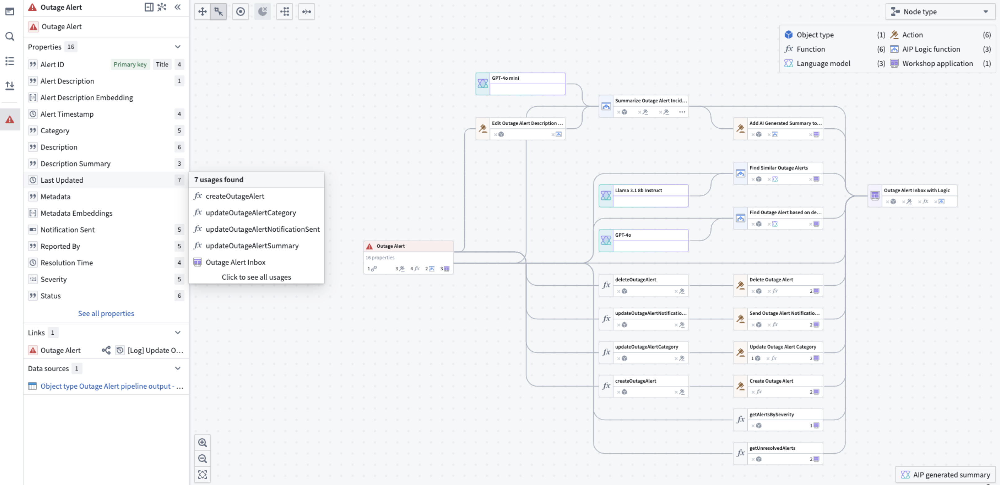
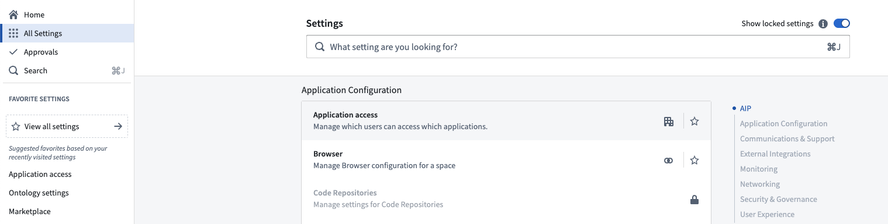
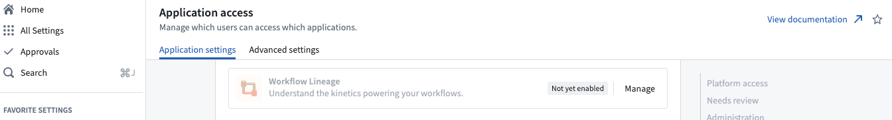
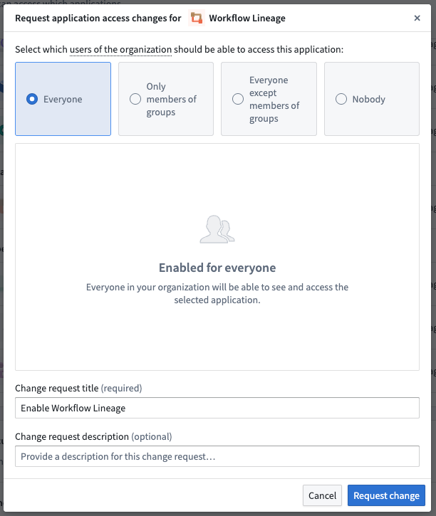

<!-- source: https://palantir.com/docs/foundry/workflow-lineage/overview/ · mirrored 2026-08-14 from Palantir Foundry docs -->

# Workflow Lineage

:::callout{theme="neutral"}
The application previously known as Workflow Builder is now called Workflow Lineage.
:::

Workflow Lineage provides an interactive workspace for understanding and managing applications and their underlying processes.

With Workflow Lineage, you can perform the following:

* Explore workflows to see details on objects, actions, functions, large language models, and applications, including:
  * API names
  * Inputs
  * Ontology edits
  * Submission criteria
  * Code snippets
* For a specific column in an object, view all usages downstream including dependent actions and Workshop applications.
* Use the color legend to easily see outdated functions, resource or Ontology permissions across all actions, application views and more.
* Bulk select actions to update the actions to a specific version simultaneously.

Workflow Lineage is particularly suitable for the following users:

* Application builders that are creating, debugging or maintaining workflows. The graph of provenance, deeper property and workshop widget/variable provenance, and upgrade tooling are all helpful when making changes to or extending a workflow.
* New builders that want to learn from existing workflows to answer the question “What parts of the Ontology are used in this workflow, and how?"
* Users that are presenting existing workflows: The graph provides a high-level overview of the Ontological resources used which can be a helpful presentation and teaching tool when sharing workflows with others.

:::callout{theme="neutral"}
To enable Workflow Lineage, contact your platform administrator to [modify application access](/docs/foundry/administration/configure-application-access/) in Control Panel.
:::

## When to use Workflow Lineage

The intent of Workflow Lineage is to help understand, manage, and debug workflows. Workflows typically span a spread of ontology resources and often flow into an application. As such, Workflow Lineage is complementary to [Pipeline Builder](/docs/foundry/pipeline-builder/overview/) and [Data Lineage](/docs/foundry/data-lineage/overview/):

* Pipeline Builder: Integrating data from raw sources into the Ontology.
* Workflow Lineage: Management of workflows built on top of the Ontology.
* Data Lineage: An end-to-end view of data flowing from source, to Ontology, through to workflow.

As an example, if you require information about the scheduling of data flowing into an object type in your workflow in Workflow Lineage, you can right-click and open the object type in Data Lineage to explore schedules.

[Learn how to get started with Workflow Lineage.](/docs/foundry/workflow-lineage/getting-started/)

## Access control

You can control which users in your organization have access to Workflow Lineage in Control Panel.

On the **Application settings** tab of **Application access**, navigate to the **Ontology** section. Select **Manage** to the right of the Workflow Lineage entry.

Select **Manage** to open up a window where you can configure your enrollment's preferences.

