<!-- source: https://palantir.com/docs/foundry/workflow-lineage/refactor-and-understand-workflows/ · mirrored 2026-08-14 from Palantir Foundry docs -->

# Perform refactors and understand your workflows

:::callout{theme="neutral"}
The application previously known as Workflow Builder is now called Workflow Lineage.
:::

To start using Workflow Lineage, open a Workshop application or functions repository and use the keyboard shortcut `Command + I` (macOS) or `Ctrl + I` (Windows) to view the relevant Workflow Lineage graph depicting the objects, actions, and functions that back the application.

You can also navigate directly to the Workflow Lineage application and manually add resources to the graph.

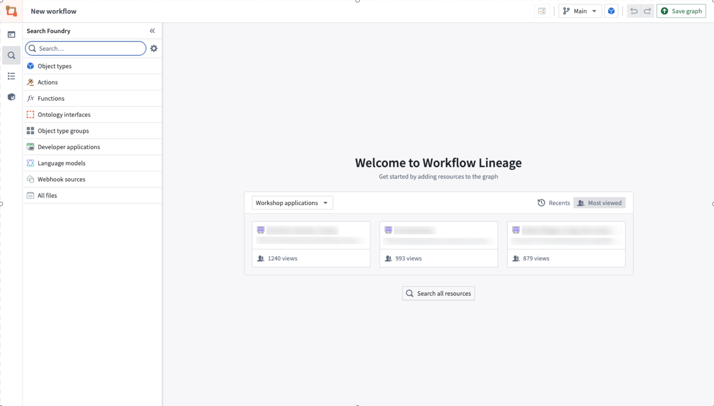

To help you understand and easily perform refactors in your workflow, Workflow Lineage provides a simple way for you to understand attached properties, update outdated variables and action-backed functions, or bulk edit submission criteria on actions.

## Property provenance

You can track the usage of each property within any object throughout your entire workflow. Select the object on the graph, and view the **Selection details** panel on the left to see where each property is being used.

The number shown next to each property refers to the amount of functions, actions, linkages, Workshop applications, and more depending on the context.

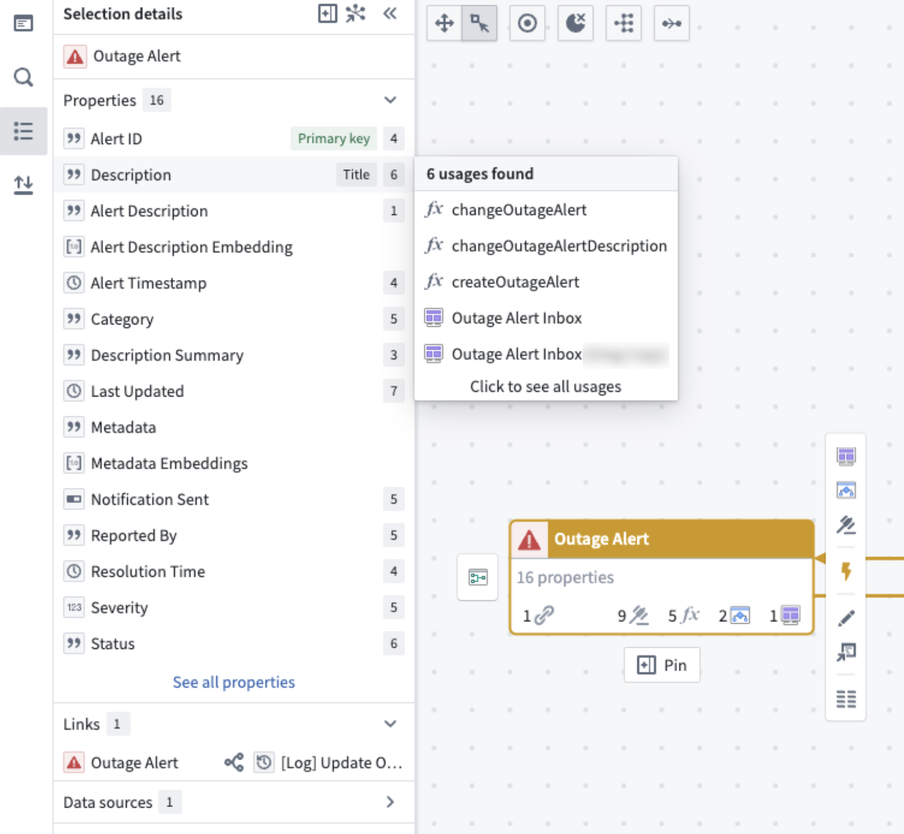

## Bulk function-backed resource upgrades

To upgrade code functions or AIP Logic functions used in actions, automations, or Workshop applications, add these function-backed resources to the graph and find the relevant upgrade tab in the bottom panel.

To identify outdated function-backed resources, navigate to the color legend. From there, select the **Out-of-date functions** option. This action will highlight all the outdated functions in red, giving you a clear visual indication. Next, choose the specific resources for which you want to upgrade the backing function. Upon selection, any outdated resources related to the function will appear in the panel located at the bottom of the screen for further action.

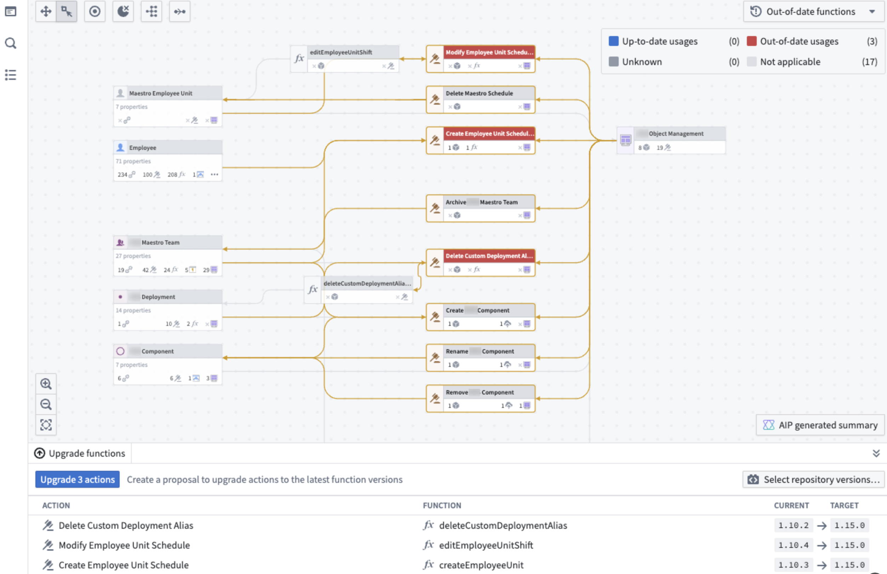

To select the desired version of the functions to be upgraded, choose **Select versions...** in the selected bottom panel tab. This will open a pop-up window where you can select the desired version for each function repository as well as the version for all functions created by AIP Logic or compute modules. If no version is specified, the repository's latest version will automatically be selected.

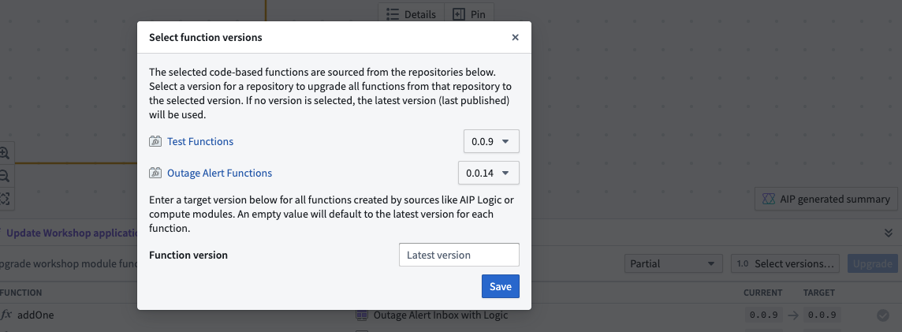

There are a few different status types you may see when upgrading functions:

* **Green:** Function can be successfully updated.
* **Gray:** Function is already up-to-date.
* **Yellow:** Function upgrade would cause a breaking change.
* **Red:** Function upgrade has errors, such as permission issues or functions not found.

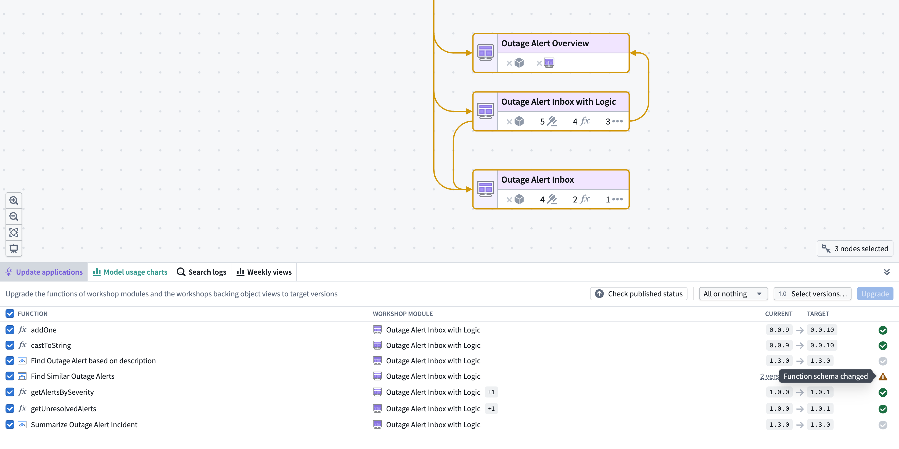

For function-backed automations and Workshop applications, there are two upgrade options:

* **All or nothing:** Upgrade the functions in the resource only if all can upgrade without breaking changes. If there are any breaking changes, nothing will be upgraded.
* **Partial:** Upgrade only the functions without breaking changes. Functions that would cause breaking changes will not be upgraded.

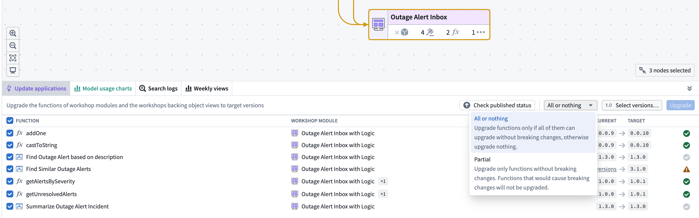

### Function-backed action upgrades

To upgrade functions used in actions, open **Update actions** on the bottom panel.

:::callout{theme="warning"}
If an action is configured with an action log and the new function version edits a new object type, that action cannot be updated in Workflow Lineage and must be upgraded in Ontology Manager.
:::

After you upgrade your actions, a proposal will be created in Ontology Manager. Here, you can ask for a review of the changes (for example, the function upgrades) and once approved, you will be able to merge the proposal.

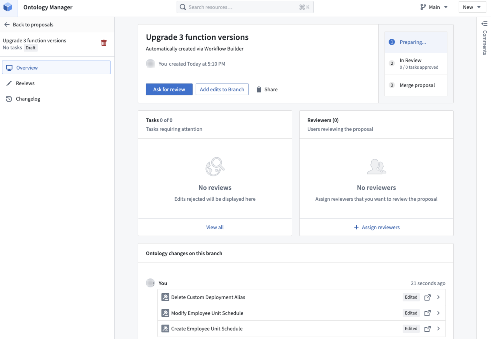

### Function-backed automation upgrades

To upgrade functions used in automations, open **Update Automations** on the bottom panel.

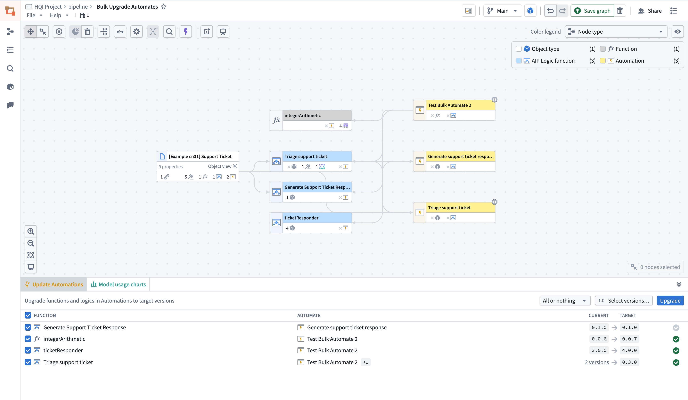

When you select the blue **Upgrade** option to upgrade your automation functions to the target versions, a pop-up will appear listing which automations will be upgraded.

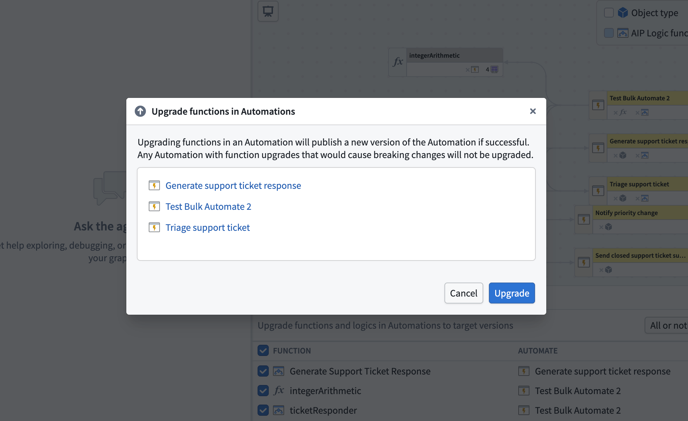

Select **Upgrade** for the changes to go into effect. A list of successfully upgraded automations and automations that failed to upgrade will appear on the pop-up.

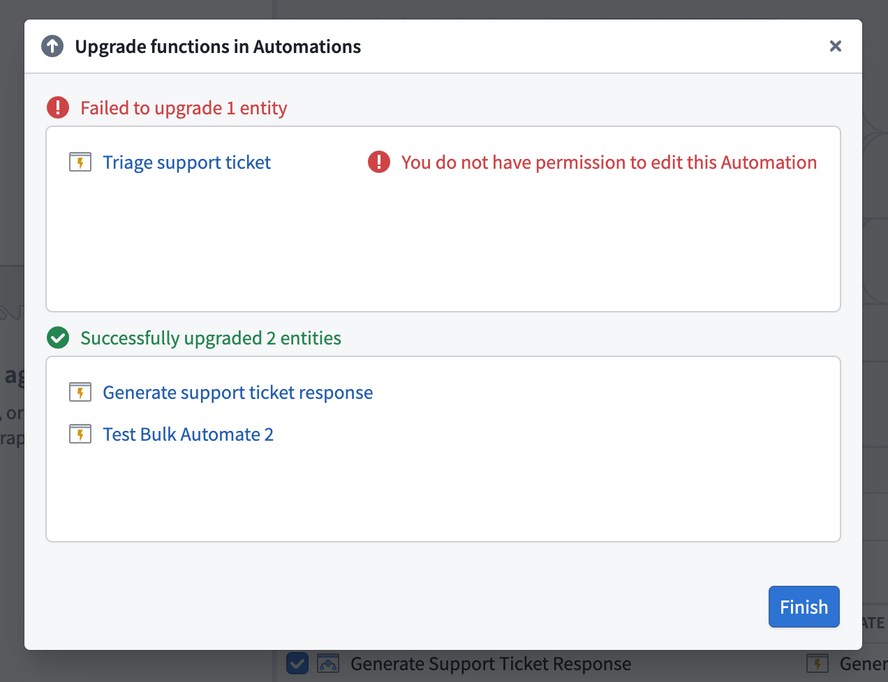

### Function-backed Workshop application upgrades

To upgrade functions used in Workshop applications, open **Update Workshop applications** on the bottom panel.

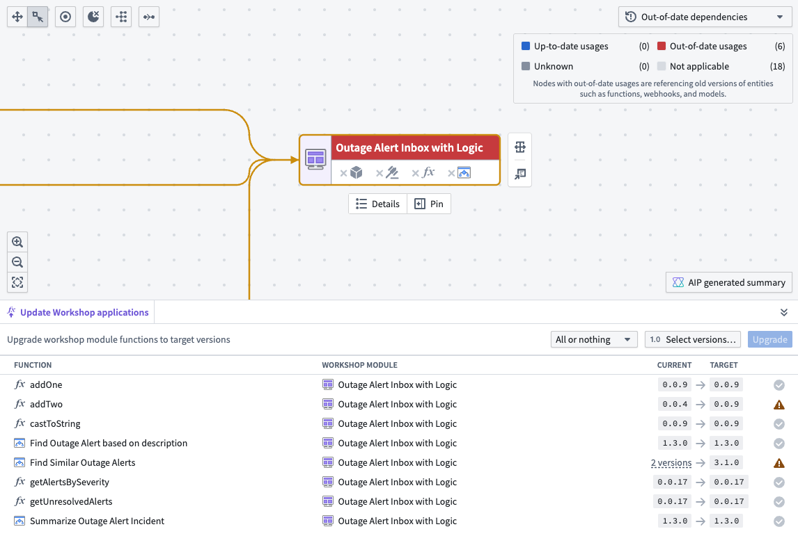

When you select the blue **Upgrade** option to upgrade your Workshop module functions to the target versions, a pop-up will appear listing which Workshop modules will be upgraded.

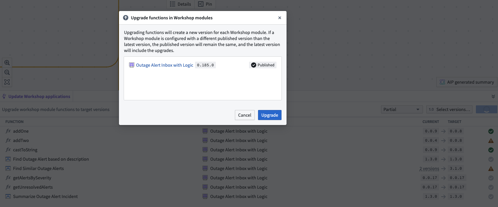

Select **Upgrade** for the changes to go into effect. The successfully upgraded Workshop application will appear on the pop-up.

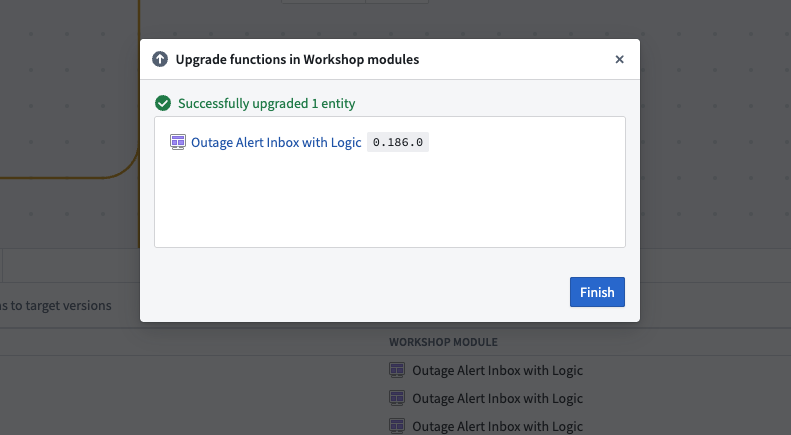

You also have the choice of bulk publishing the Workshop after the functions are updated. Learn how in the documentation on [bulk-publishing Workshop applications](#bulk-publish-workshop-applications).

## Bulk publish Workshop applications

Workshop applications can be configured to always publish the latest version; Workshop applications that do not automatically publish the latest version can be "bulk published", which will update all selected applications at once. To bulk publish Workshop applications, select the Workshop nodes, then right-click and select **Publish \[number of] Workshop modules**.

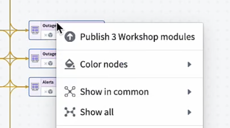

Publishing multiple Workshop modules at once will open a window displaying which of your Workshop applications are already on the latest version. If a Workshop application has a blue checkmark with either **Latest published** or **Published** next to it, the workshop is already on the latest version.

Specifically:

* **Latest published** means that Workshop always automatically publishes the latest version. This is a setting that can be toggled in the Workshop application.
* **Published** means that Workshop does not automatically publish the latest version, but the application currently has the latest version published.

For Workshop applications that are not **Published** or **Latest published**, you can select which applications you want to publish to the latest version and then select **Publish \[number of] entities**.

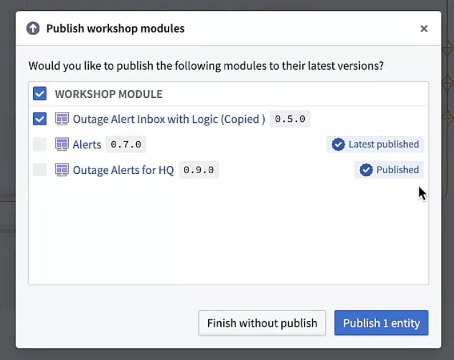

You can also bulk publish Workshop modules after updating functions in Workflow Lineage. To do so, after updating the functions, select **Continue to publish**.

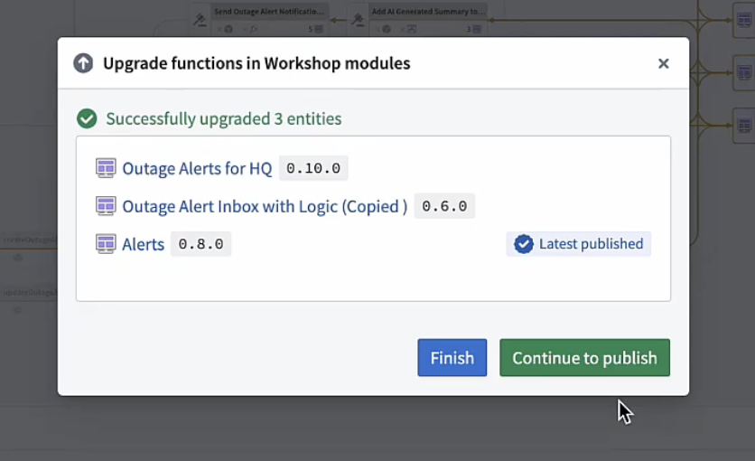

This will bring you to a page with all the Workshop modules that are not yet published to their latest version. Confirm that you want to publish the latest version for these modules and select **Publish \[number of] entities**.

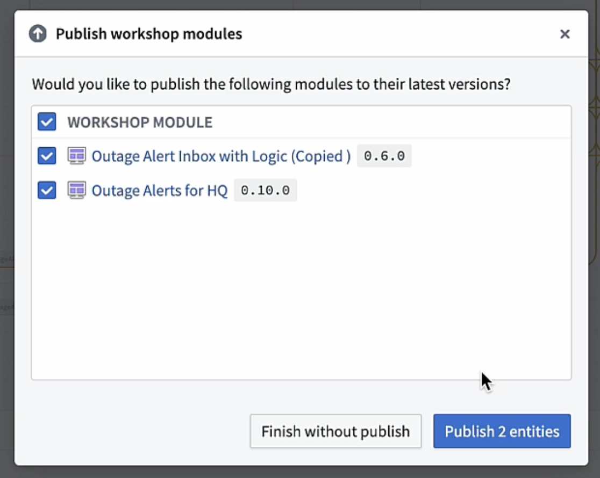

Once this has been done successfully, select **Finish**.

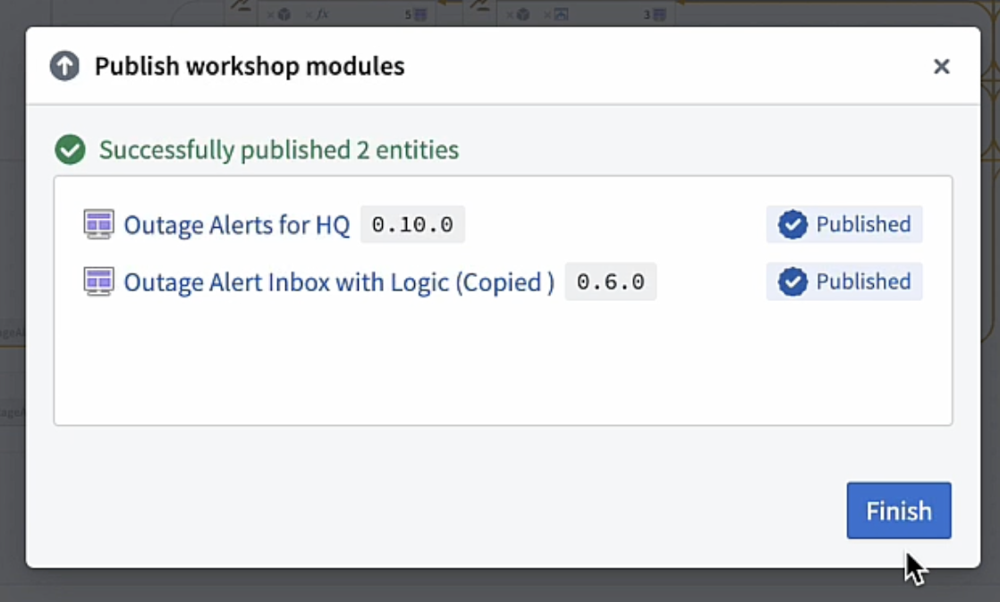

## Bulk replace models

You can replace a model used by multiple AIP Logic functions in a single action from Workflow Lineage instead of opening each function and updating the model individually. This is useful when migrating off a [deprecated model](/docs/foundry/model-catalog/model-deprecation/) or evaluating a new model across a workflow.

:::callout{theme="neutral"}
Bulk model replacement in Workflow Lineage currently supports AIP Logic nodes only. Support for additional resource types is in development.
:::

To replace a model across multiple AIP Logic functions:

1. Open your workflow in Workflow Lineage.
2. Select the language model node you want to replace on the graph.
3. Add the AIP Logic nodes you want to update to the graph if they are not already present. Select the AIP Logic icon on the model node to filter nodes that consume the selected model directly on the graph. AIP Logic nodes that are not on the graph will not appear in the **Replace model** tab.   
   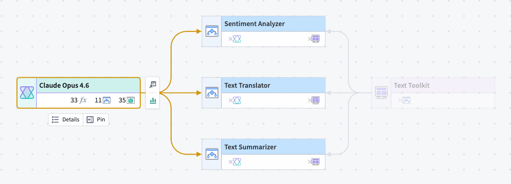   
4. Open the **Replace model** tab in the bottom panel. The source model appears on the left, and the AIP Logic functions that use it appear under **Used in** on the right.
5. Select the replacement model under **Replace with**.
6. Use the checkboxes in the **Used in** list to deselect any AIP Logic functions you want to exclude from the model replacement.   
   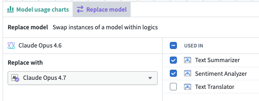   
7. Select **Replace model**.

### Considerations when replacing models in bulk

* Workflow Lineage skips AIP Logic functions you are not able to edit.
* Workflow Lineage applies the changes directly to the affected AIP Logic functions. There is no proposal or review step.
* Graph connections may take a moment to refresh after a successful replacement.
* Replacement models must be [Palantir-provided](/docs/foundry/model-catalog/overview/).

## Bulk delete objects and actions

To bulk delete objects and actions, select the nodes on the graph, right click, and select **Delete resources**.

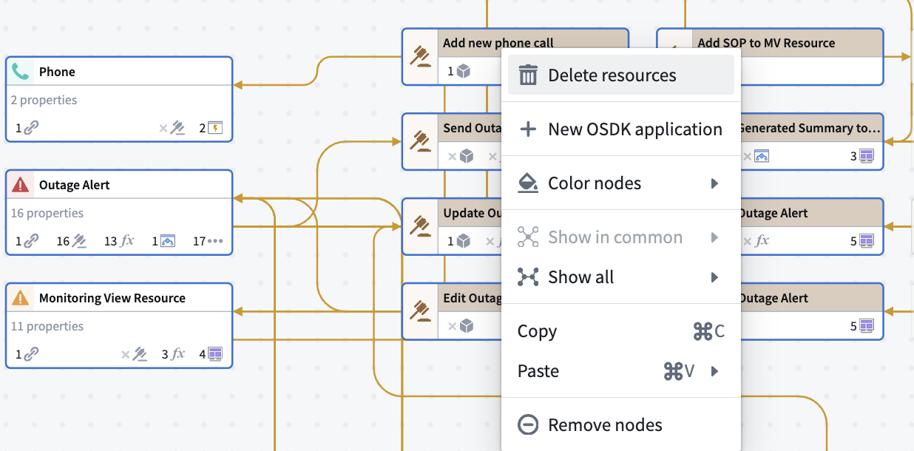

This will prompt you to create a proposal. You will also see the number of link types associated with the objects being deleted. These links will also be included in the deletion proposal.

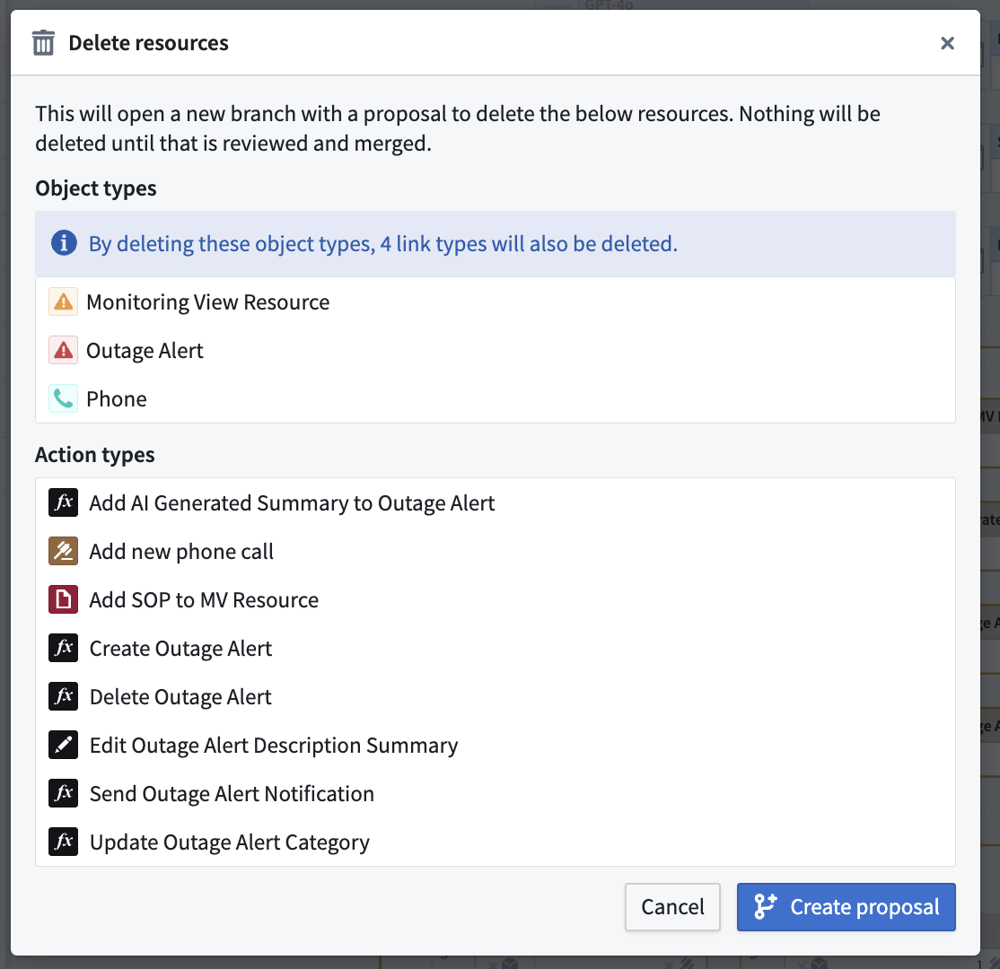

Follow the prompt in Ontology Manager to merge the proposal.

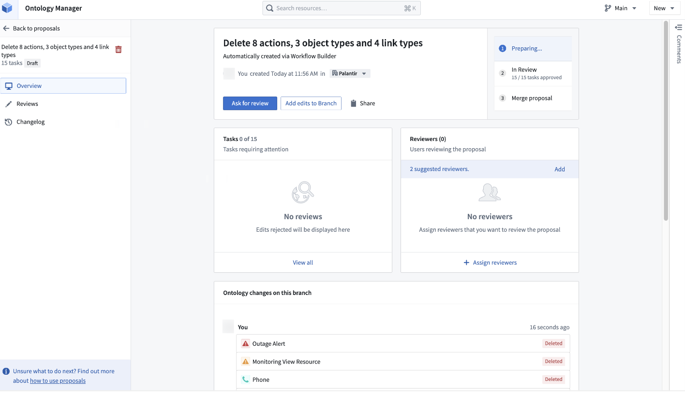

## Marketplace products

The **Marketplace products** sidebar helps you inspect and confirm that Marketplace products have the right inputs, no resources are missing, and all resources are in the expected packages. This feature is especially helpful for packages you created that are publishing elsewhere.

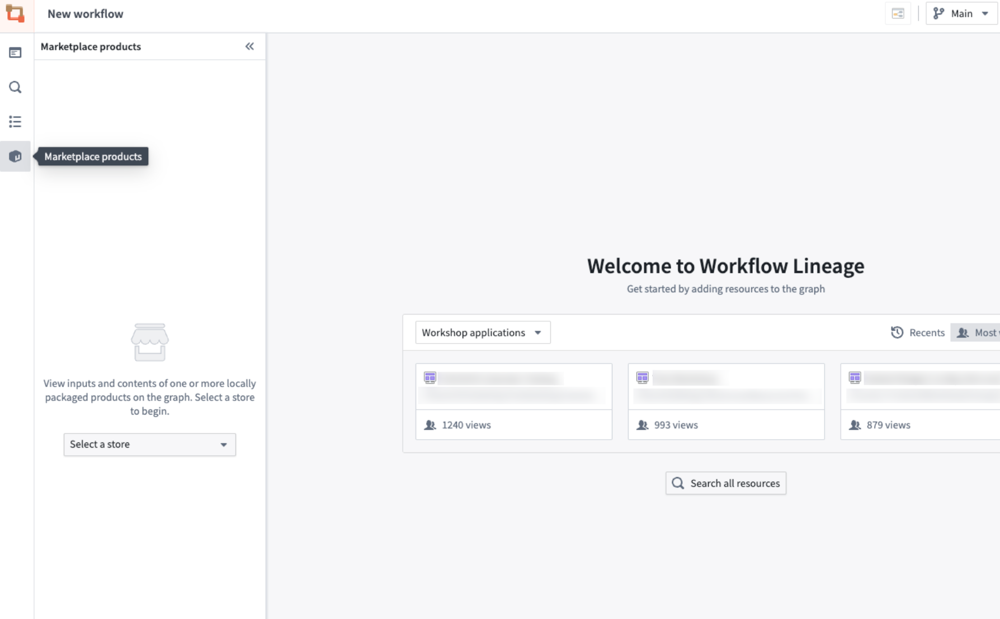

Navigate to the **Marketplace products** sidebar and choose your store in the dropdown menu. Note that the sidebar will only search local stores and not remote stores.

Select **Add a product** to add the products you wish to inspect, and add all corresponding nodes on the graph by selecting **Add all nodes to graph**.

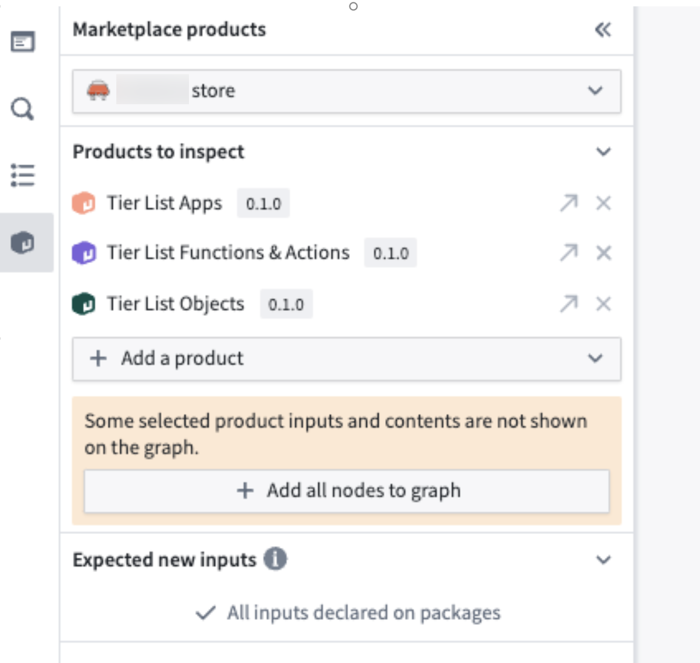

A Workflow Lineage graph will populate, colored by which package the resources are in and whether the resources are inputs to a specific package.

In the example below, the function `upsertTierListRank` is listed as an input; however, the function should be packaged because it is used in an action that is packaged. Additionally, the **\[Log] Upsert Rank** object ended up in **Tier List Functions & Actions**  instead of the **Tier List Objects**. A flag also shows that the model GPT-4o is required to use the logic function.

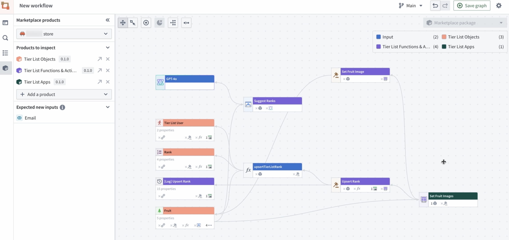

On the left panel, a list of expected new inputs to your package is displayed. In the example below, the **Email** object feeds into the **Set Fruit Images** Workshop module, so it should be included in future packages.

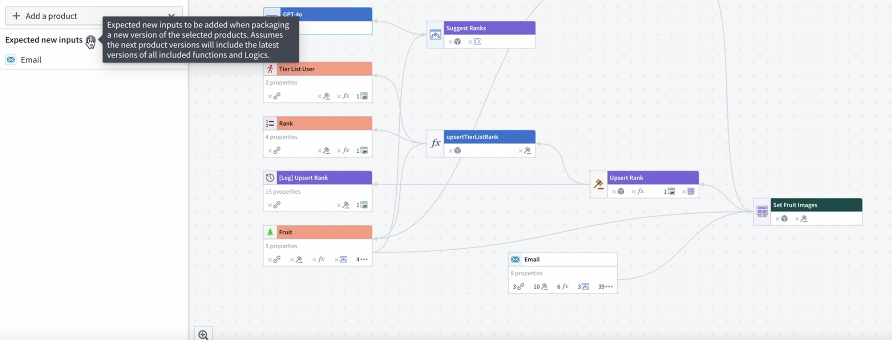

The color legend will also show package overlaps with the **Multiple packages** key.

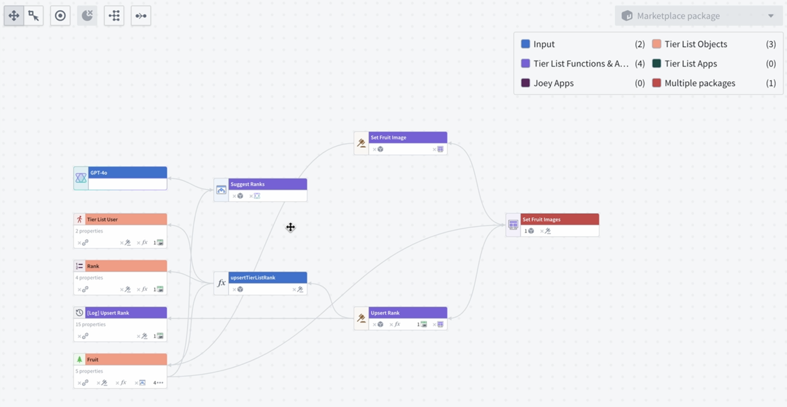

## Additional workflow updates

Aside from the various refactoring explained above, you can also perform security updates for your workflows directly from Workflow Lineage. Review our Workflow Lineage security documentation to learn how to [bulk update ontology roles on workflow resources](/docs/foundry/workflow-lineage/manage-security/#bulk-update-ontology-roles-on-resources) and [action submission criteria](/docs/foundry/workflow-lineage/manage-security/#bulk-update-action-submission-criteria).
