<!-- source: https://palantir.com/docs/foundry/workshop/application-design-best-practices/ · mirrored 2026-08-18 from Palantir Foundry docs -->

# Application design best practices

A well-designed Workshop application interface guides a user's actions and maintains their attention, ensuring they can execute workflows in an efficient, effective, and logical manner. Review the design best practices below as you create an application to ensure its visual layout and organization are intuitive for all users.

## Core design principles

* To ensure your application is **intuitive** to use, you should prioritize component clarity over complexity. [Learn how to build user-friendly interfaces to improve application adoption.](#create-intuitive-user-interfaces)
* To ensure **product unification and consistency**, you should create a cohesive experience across all applications so users feel they are working within a unified suite of tools. [Learn how to build unified Workshop applications](#build-unified-applications).

## Create intuitive user interfaces

Your Workshop application's visual hierarchy should organize interface components to draw attention to the right user areas of interaction, guiding their workflows in an effective and efficient manner. Application designs that lack a clear and logical visual hierarchy and are either *overloaded* or *overcrowded* can confuse users, blocking their application adoption and limiting its utility in support of their workflows.

To avoid overload, limit the amount of total actionable items, such as tasks, notifications, or choices, per screen. Additionally, you should avoid showing more than five primary actions in your application's top-level navigation.

To avoid overcrowding, maintain sufficient whitespace - ideally, this will comprise 30 to 40 percent of your screen. You should also limit the number of visible components to no more than ten in a single view, which includes buttons, panels, and widgets.

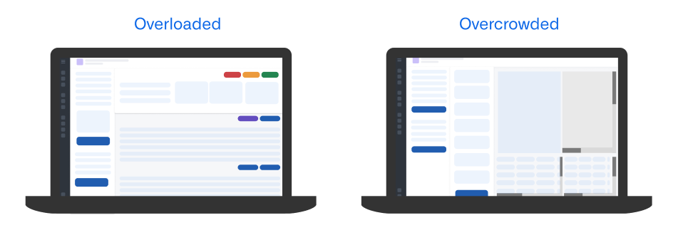

Follow the guidance in the sections below to ensure your application's visual hierarchy and layout are easy to understand and use.

### Configure a logical layout structure

Your application's layout should support natural eye tracking patterns and clearly distinguish between configuration and content sections by following an F-shaped hierarchical design pattern. In the context of application design, the F-shaped hierarchy supports common reading patterns where a user will scan content following an "F" shape, marked by horizontal scanning from the top and left corner of an application and vertical scanning down the left side of a section.

In general, your applications should leverage the layout patterns below to facilitate natural reading patterns and linear eye tracking.

* **Grid format:** Information flows horizontally from left to right.

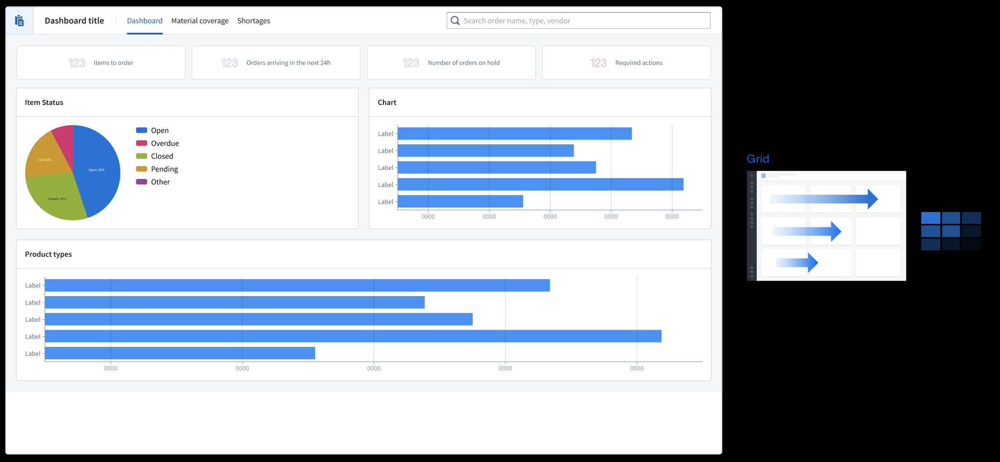

* **Column format:** Information flows vertically with important navigation elements resident at the top of each panel.

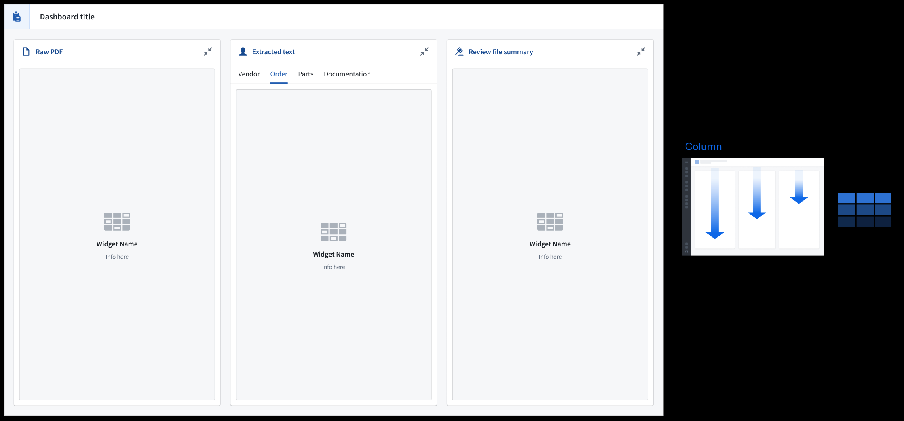

* **Row and column combination:** Anchor filters in the left-most section so the application's content flows to the right. Use the [Metric Card widget](/docs/foundry/workshop/widgets-metric-card/) to provide a holistic view of key data in your application.

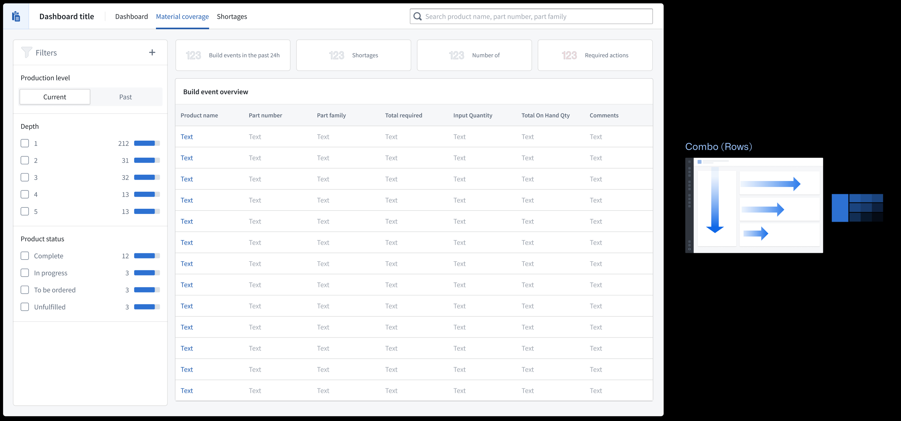

In Workshop, select **Set layout** after adding a new widget to your application. To edit the layout of an existing application, select its section on your application's canvas and scroll to the **Layout** section of the right panel. [Learn more about layouts in Workshop.](/docs/foundry/workshop/concepts-layouts/)

### Write descriptive headers

* Use a **page header** to establish your application's overarching purpose or context. All other content should relate to this primary heading, as this will be the largest text displayed.
* Use **section headers** to group and organize nested content within the page, which displays as the second largest text.
* Use **subheadings** to provide context for section headers as a rendered **Description**, as necessary.

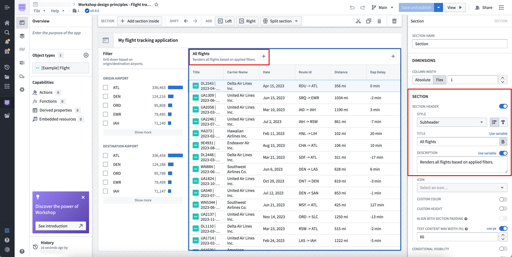

Write heading descriptions that are succinct and help a new user understand the purpose of the section within the application. To add a new header to a section, toggle on **Section header** in the **Section** panel.

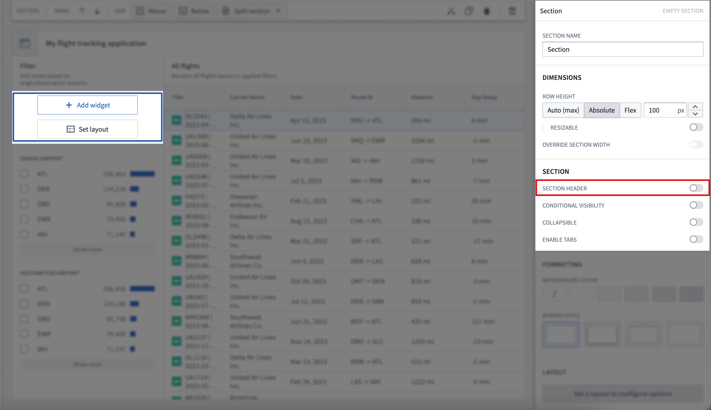

### Set section spacing and alignment

Sections properly spaced and aligned enhance user readability, reduce cognitive load, and create logical visual connections between related application elements to guide a user's eye through complex information.

In most cases, you should use **Compact** padding; however, Workshop allows you to customize padding controls. A reliable customization across application layout types is padding with 80 percent height or width and 16px spacing. [Learn more about padding controls available in Workshop.](/docs/foundry/workshop/concepts-layouts/#padding-controls)

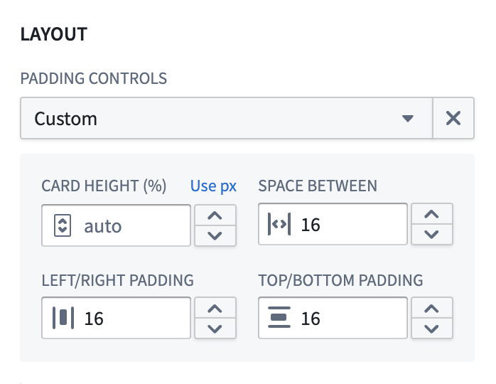

:::callout{theme="neutral"}
You should only apply shaded padding styles once per page to help maintain visual hierarchy, ensuring users can distinguish the most important elements of your application. As an example, using an outer drop shadow [border style](/docs/foundry/workshop/concepts-layouts/#border-styles) only for the main content or primary modal in which users take action draws their attention to that area of your application.
:::

To help organize sections on your application, you should use *containers* to separate distinct content groups across sections and *dividers* to separate related content within a section. Add padding between groups to help a user understand this separation.

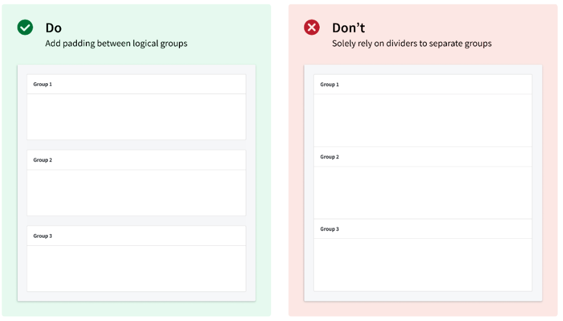

Use a combination of padding and dividers to create groupings within sections.

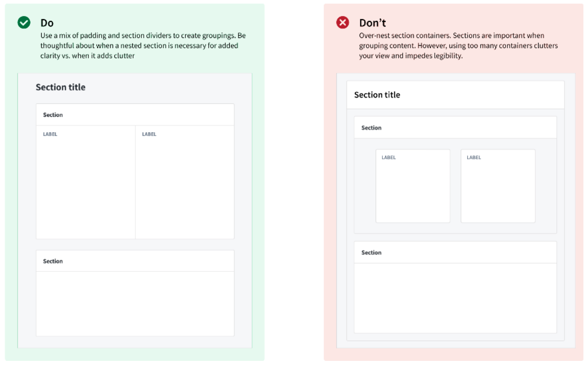

In the example application below, the **Claims** section is highlighted through padding and background color configuration, while the **Group** section distinguishes different [Object Lists](/docs/foundry/workshop/widgets-object-list/) a user can render upon selection.

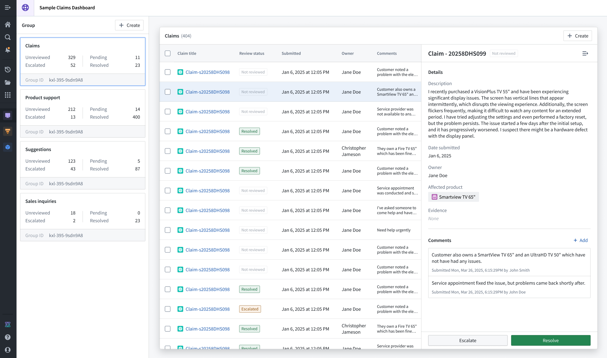

### Apply border and elevation styles

Use [borders](/docs/foundry/workshop/concepts-layouts/#border-styles) and configure their elevation levels to highlight important sections and create spatial separation. When you set a border style, you should use a drop shadow to provide an elevated appearance and signal to the user that its content is important. Use inner shadowing to denote lesser importance. When setting a background, use lighter colors to signify importance and darker colors to indicate less critical items, such as filters or collapsible panels.

## Build unified applications

A unified application follows three architectural design principles:

* The **landing or homepage** centralizes all navigation activity and provides an overview of the application's embedded modules with custom thumbnails, ensuring users can take quick action to access specifically what they need.
* A **primary header** maintains consistent logo design and global settings control across its embedded modules, most often located in the top-left and top-right corners of the page, respectively.
* **Standardized layout elements** ensure high-touch user components follow a consistent layout, such as positioning [filtering widgets](/docs/foundry/workshop/widgets-filtering/) on the left side of a page and applying the same styles to other interface components, such as tabs, [Metric Cards](/docs/foundry/workshop/widgets-metric-card/), [headers](/docs/foundry/workshop/concepts-layouts/#header), and [buttons](/docs/foundry/workshop/widgets-button-group/#button-configuration-options).

You should also consider the following best practices related to page scrolling, overlays, and typography.

### Scrolling best practices

* Avoid horizontal scrolling whenever possible, except in cases where page-wide scrolling is necessary. Instead, toggle **Fit columns horizontally** when you configure an [Object Table widget](/docs/foundry/workshop/widgets-object-table/).

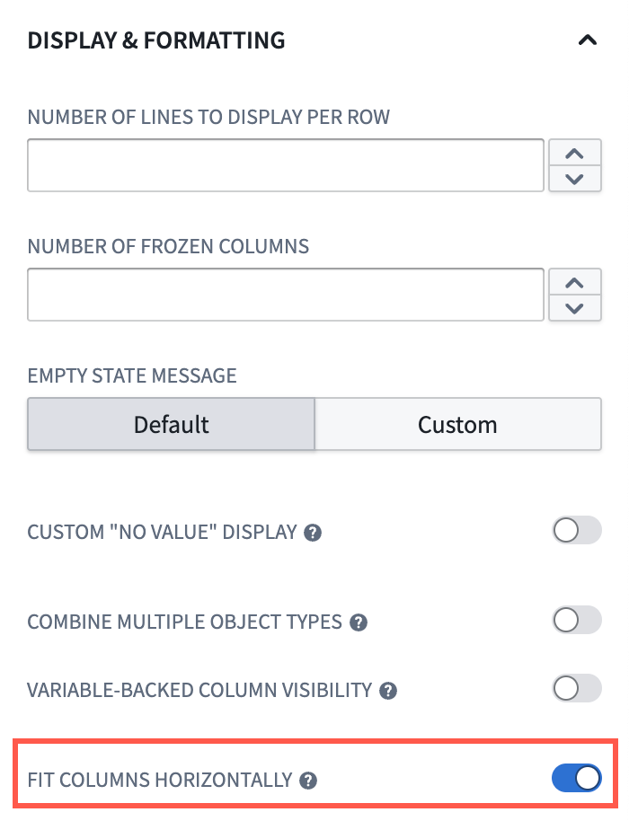

* Ensure your navigation bars and tabs are part of your primary header so that only sections that contain content in your application are sections that users can scroll. This acts as a pinning mechanism to persist navigation and tabs in a user's view.

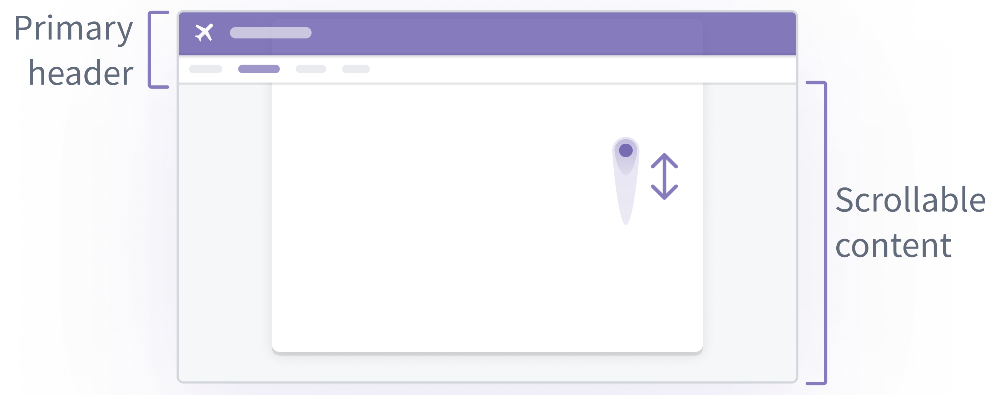

* When you enable scrolling in a section, ensure all touch targets (such as buttons), are at least 30px.

### Overlay usage best practices

* Use overlays for temporary and secondary interactions, such as completing questionnaires.
* Avoid overlays for analytical sections where users need to view multiple information layers simultaneously.
* Design your overlay workflows to account for users selecting objects before performing one or multiple actions.

A dialog prevents users from scrolling or interacting with background content. If users must reference long text while entering data, place the inputs beside the content or repeat the required content in a non-blocking area.

[Learn more about overlays in Workshop.](/docs/foundry/workshop/concepts-layouts/#overlays)

### Set module typography

To control the fonts used across a module, select the **Settings** tab and open the **Module Appearance** section. The **Typography** dropdown offers three kinds of options:

* **Default:** The default Foundry font, Source Sans Pro, is used when no other typeface is selected.
* **System fonts:** A set of common, widely available fonts such as Arial, Georgia, Helvetica, Times New Roman, and Verdana. These render consistently because they are present on most devices.
* **Custom typeface:** Renders text in a font that you specify by name.

When you select **Custom typeface**, enter the name of the font in the **Custom Typeface Name** field. Workshop applies this font only if it is already installed on the viewer's device; if the font is not installed, Workshop falls back to the default Foundry font. This means a custom typeface may render differently for different users depending on the fonts available on their systems. There is no way to upload or store a custom font file in Foundry, so to ensure consistent rendering for all users, prefer a system font over a custom typeface.

### Validate your design

As you add sections and widgets to your application, we recommend practicing the following validation methods:

* Periodically squint at your interface to help identify the most important elements based on their intended use. This helps you determine the effectiveness of your hierarchy.
* Stay closely aligned with actual user workflows so you maintain an understanding of what users want to accomplish in each section of your interface.
* Validate whether or not every element must be visible from its current location. If it does not, then you should only surface the element when a user will need to interact with and take action from the element.

[Learn more about component-specific design best practices in Workshop.](/docs/foundry/workshop/application-design-components/)
