<!-- source: https://palantir.com/docs/foundry/workshop/application-design-components/ · mirrored 2026-08-18 from Palantir Foundry docs -->

# Component-specific best practices

Review the guidance below to ensure your application's [table displays](#tables-and-lists), [button groups](#button-groups), and [search functionality](#searching-and-filtering) follow Workshop design best practices.

## Tables and lists

When adding [Object Tables](/docs/foundry/workshop/widgets-object-table/), [Object Lists](/docs/foundry/workshop/widgets-object-list/), or [Pivot Tables](/docs/foundry/workshop/widgets-pivot-table/) to your application, you should practice the following:

* Always include counts to indicate the length of tables and lists by configuring a [Metric Card](/docs/foundry/workshop/widgets-metric-card/) widget in the table's section header. Choose **Tag** as your layout style.

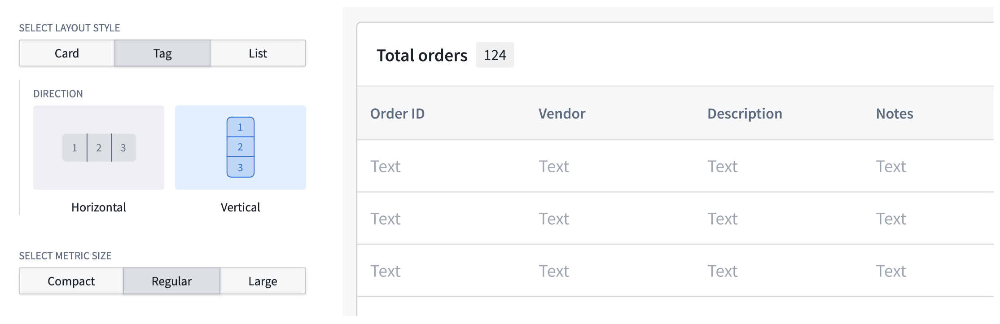

* Ensure each section renders enough information for row selection; use [collapsible detail panels](/docs/foundry/workshop/getting-started/#part-iv-configure-a-collapsible-panel-for-the-object-view) for additional data instead of overlays, which can obstruct the base layer of information.

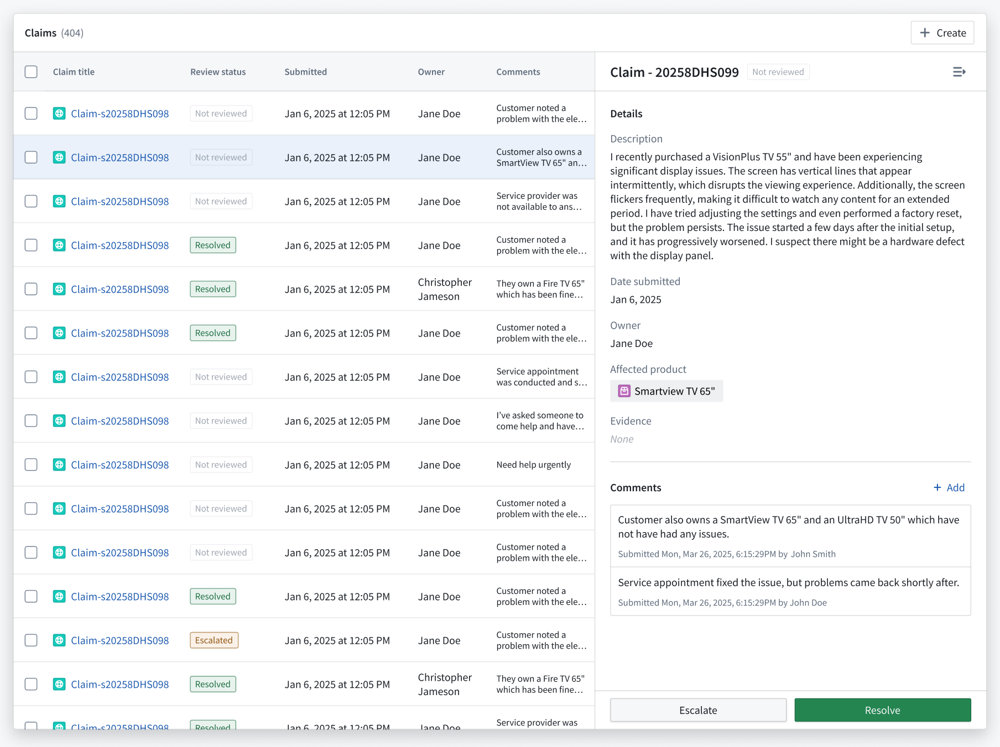

* Validate that your table or list adheres to Workshop's [scrolling best practices](/docs/foundry/workshop/application-design-best-practices/#scrolling-best-practices).
* Use the **Display & formatting** section of the **Widget setup** panel to customize your table's display.

## Button groups

When adding a [Button Group](/docs/foundry/workshop/widgets-button-group/) to your application, you should practice the following:

* Ensure each button clearly guides user actions by matching its color to the user's mental model of the accompanying action's outcome or risk. Review the available [button color options](/docs/foundry/workshop/widgets-button-group/#button-configuration-options) and apply the appropriate color based on the button's **Intent**.
  * **None:** Renders a gray hue; best used for secondary actions.
    * *Examples:* `Back`, `Skip`, or `Cancel`.
  * **Primary:** Renders a blue hue; best used as the main call to action or to advance the user's journey in your application.
    * *Examples:* `Create`, `Add new`, `Next`, or `Continue`.
  * **Success:** Renders a green hue; best used for completion actions or those denoting a positive outcome.
    * *Examples:* `Submit`, `Save`, `Complete`, `Approve`, or `Enable`.
  * **Warning:** Renders an amber hue; best used for actions that require a user's attention or awareness but are not destructive. The actions may also denote moderate risk.
    * *Examples:* `Review required`, `Pending approval`, `Archive`, or `Suspend`.
  * **Danger:** Renders a red hue; best used for destructive actions that cannot be easily undone. You can also use **Danger** for error states or critical alerts.
    * *Examples:* `Delete` or `Remove`.

* Add icons to buttons to help users understand their backing actions. Additionally, you should organize buttons from left to right based on their importance and visual load, with each button group containing a primary action. Refer to the table below for specific examples.

| Button purpose                                                                                                                                  | Best practice                                                                                                                 |
| ----------------------------------------------------------------------------------------------------------------------------------------------- | ----------------------------------------------------------------------------------------------------------------------------- |
| Use the first button in a group to denote the primary action. De-emphasize other actions with a menu to reduce visual clutter.                  | 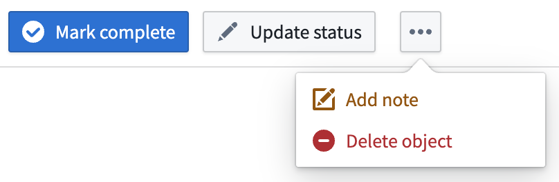                  |
| Use icons to inform a user of the button's action and what will occur after selection.                                                          | 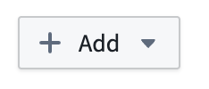                                                        |
| Apply arrow icons to show navigation to a new page/section within the module (horizontal arrow) or a new tab outside the module (angled arrow). | 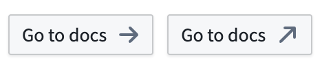                       |
| Group buttons to indicate if there are other actions related to a button (**+**) or other independent actions accessible from a menu.           | 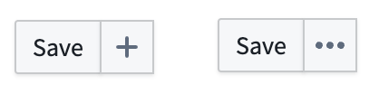 |

* Label your buttons using natural, user-friendly language in sentence case. Avoid repetitive copy when adding a Button Group to a section header where the context is clear.

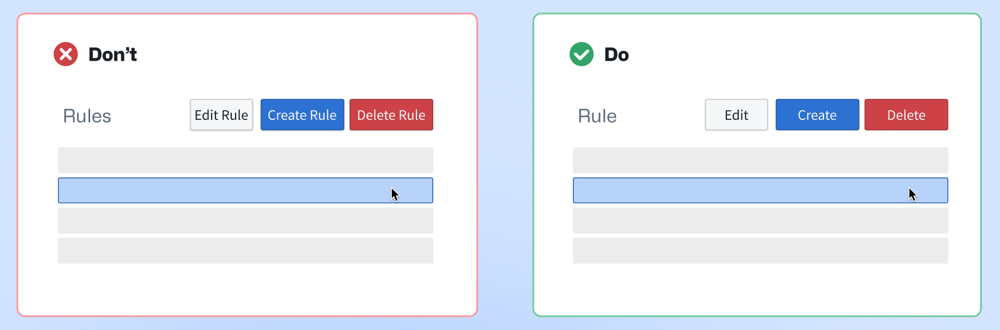

* Add buttons in close proximity to their related section or widget. As an example, if you configure two Object Table widgets which render `Equipment` and `Part` objects, then you should add buttons with their relevant actions to each Object Table's specific header.

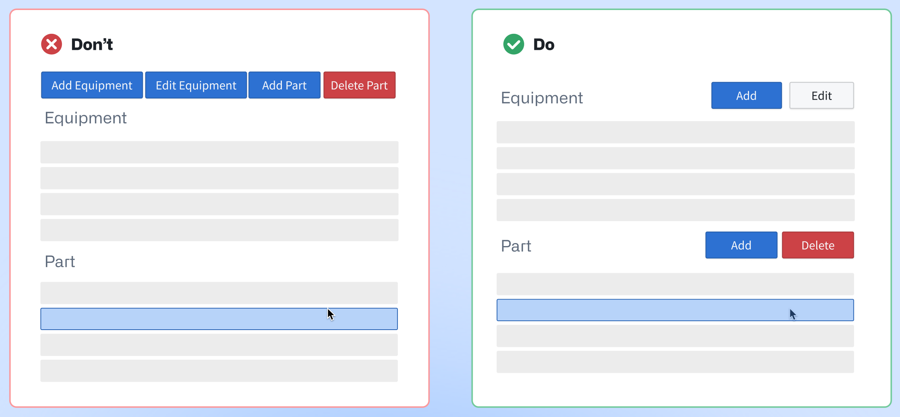

* Organize buttons hierarchically by adjusting their size, border, and color intensity in the **Display & formatting** section of the **Widget setup** panel.

* Do not apply distinct colors to *every* button, as this can create visual clutter and distract users. Instead, you should identify the primary action within a button group and assign the corresponding color.

| 🔴 Avoid multiple colors in one group                                          | 🟢 Best practice                                                                           |
| ------------------------------------------------------------------------------ | ------------------------------------------------------------------------------------------ |
| 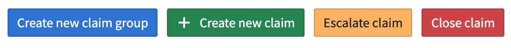  | 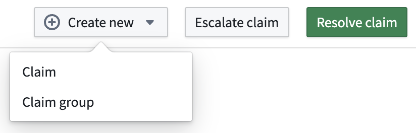 |

[Learn more about the Button Group widget.](/docs/foundry/workshop/widgets-button-group/)

## Searching and filtering

When adding [one of Workshop's filtering widgets](/docs/foundry/workshop/widgets-filtering/) to your application, such as [Filter List](/docs/foundry/workshop/widgets-filter-list/) or [Exploration Filter Pills](/docs/foundry/workshop/widgets-exploration-filter-pills/), practice the following:

* Use a Filter List's **Vertical** filter layout if the object list requires users to apply multiple filters simultaneously. This layout is also best used for complex filtering scenarios and provides a clear overview of available filtering options.

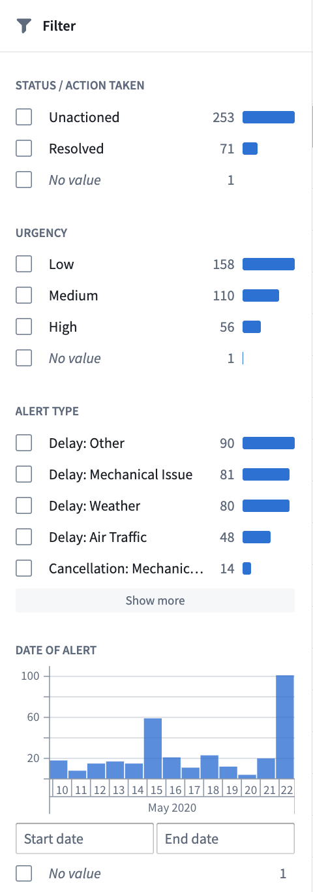

* Use a Filter List's **Pills** filter layout for compact, beginner-friendly visual filtering. The **Pills** layout is ideal for limited screen space or frequent filter changes. You can also use the Exploration Filter Pills widget for this same purpose.

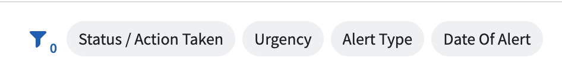

* Add an [Exploration Search Bar](/docs/foundry/workshop/widgets-exploration-search-bar/) to enable comprehensive searches with complex filtering capabilities. This is best suited for experienced users requiring detailed, precise querying functionality. The Exploration Search Bar supports keyword searches, property filtering, and complex queries.
