<!-- source: https://palantir.com/docs/foundry/workshop/branching-rebasing/ · mirrored 2026-09-04 from Palantir Foundry docs -->

# Branching Workshop modules

Workshop integrates with Global Branching so you can develop modules and their configurations safely and in isolation. This page covers how to work with Workshop modules on branches, including adding resources to a branch, resource protection and approvals, and rebasing and conflict resolution.

For general information on Global Branching concepts and workflows, refer to the [Global Branching documentation](/docs/foundry/global-branching/overview/).

## Adding Workshop modules to a branch

To add a Workshop module to a branch, use the branch selector to switch to that branch, open the module, then save any changes. The module is now a resource on the branch.

If your Workshop module contains non-Workshop elements for which Global Branching is not available, such as Quiver dashboards, these elements will not be modifiable on a branch.

## Resource protection

When on the `main` branch, protected Workshop modules show a **Save to new branch** option instead of **Save and publish**, requiring all changes to be made on a branch rather than directly to `main`.

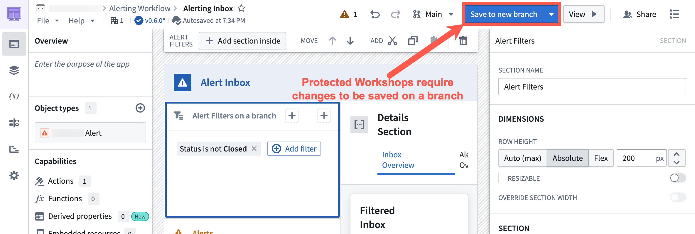

Select **Save to new branch** to open the new-branch dialog. Name the branch and select an ontology for it.

When you are ready to merge your changes to `main`, [create a proposal](/docs/foundry/global-branching/core-concepts/#create-and-prepare-a-proposal).

## Merge requirements

### Approval process

After a proposal is created, assigned reviewers are notified to review the changes. Navigating to the branched version of the Workshop module directs reviewers to the [Changelog](/docs/foundry/workshop/changelog/) tab in Workshop.

Within the Changelog tab, reviewers can see the changes made to the module. Reviewers can then approve or reject the change by selecting the appropriate **Approve** or **Reject** button on the left panel in the **Review proposed changes** section.

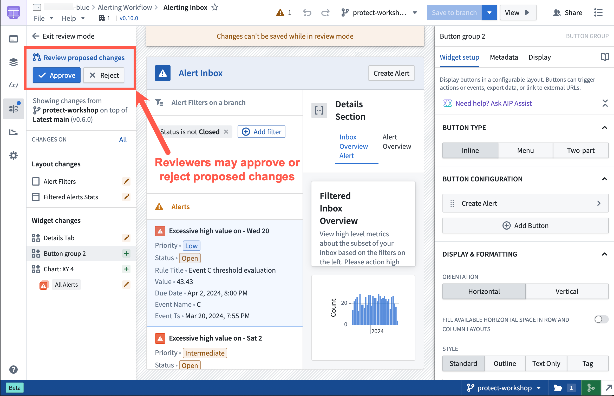

## Rebasing and conflict resolution

Workshop rebasing enables multiple builders to edit a single module at the same time without needing to worry about overriding each other's changes.

Before you merge Workshop changes on a branch into `main`, you must **rebase** if a change occurred on `main` after the module was saved on a branch.

The rebasing user interface uses the [Changelog panel](/docs/foundry/workshop/changelog/) to depict all changes made in the module.

### Start the rebase

If a rebase is required before merging, the **Changelog** panel displays a notification dot. Select the panel to show an option that begins the rebase.

:::callout{theme="warning" title="Save before rebasing"}
Unsaved Workshop edits are not preserved through a rebase. Save your changes to the branch before starting the rebase; any in-progress edits that have not been saved will be lost.
:::

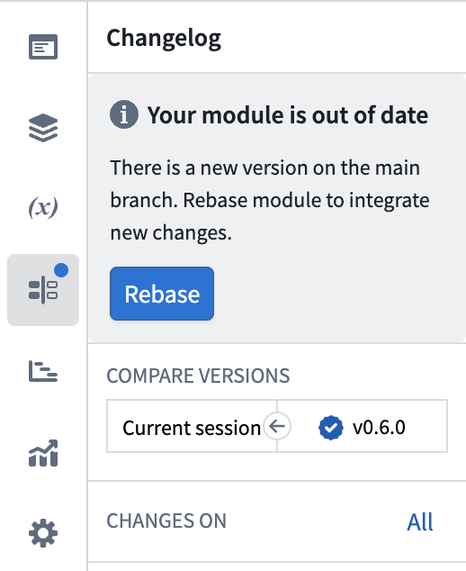

Rebasing updates your branch by applying its changes on top of the latest `main` version. The `main` branch is not modified until your branch is merged.

Select **Rebase**, then choose **Start rebasing** to accept non-conflicting changes from `main` automatically and review conflicting changes manually.

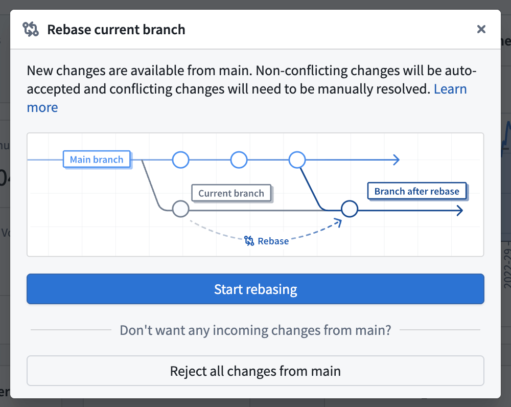

To preserve the branch version of the entire module without accepting any changes from `main`, select **Reject all changes from main**. Use this option only when the branch should replace the version on `main`. When you merge the branch, its module configuration overrides the changes on `main`.

### No conflicts found

After initiating a rebase, if the sidebar does not show any explicit conflicts, Workshop automatically accepts the non-conflicting changes from `main` and combines them with your branch's changes. In this case:

* Review the displayed changes to ensure you are satisfied with the incoming changes from `main`.
* No manual conflict resolution is needed.
* Save the module to finalize the rebased state and proceed with your merge.

### Resolve a merge conflict

A change is marked as a merge conflict when it is edited on both `main` and the branch.

Workshop merges changes to separate configuration fields automatically. For example, if `main` changes a section title and your branch changes the section color, Workshop preserves both changes. A change is flagged as a merge conflict when the same configuration field, variable definition, or layout position was edited on both `main` and your branch. For conflicting changes, you must choose a version or manually combine the changes.

Common examples of merge conflicts include:

* A widget or variable was modified on both `main` and your branch.
* A section was deleted on `main` and edited on the branch.
* A widget was moved from location `A` to `B` on `main` and from `A` to `C` on your branch.

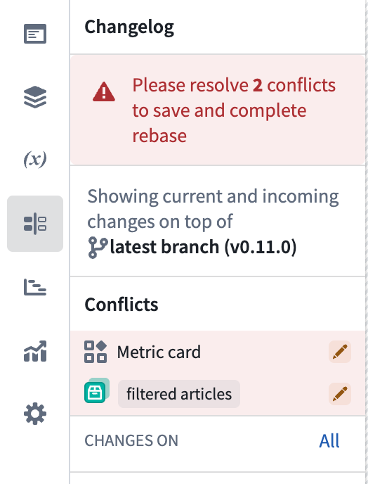

To resolve a merge conflict, switch between three states to test how each option affects the module in real time:

* **Latest main:** The configuration as it appears on `main`.
* **Current branch:** The configuration as it appears on your branch.
* **Current session:** Edits you make during the rebase, which are useful for combining changes from `main` with changes from your branch.

:::callout{theme="neutral" title="Support for granular visual changes"}
Granular visual changes only appear for widgets, sections, and variables. Layout changes and global module-level changes are only displayed in the Changelog panel.
:::

#### View widget and section configuration changes

Workshop highlights granular changes in the widget and section configuration panels. The change icon indicates how a configuration differs between `main` and your branch:

* **Conflict:** The same property of the same component was edited on both `main` and your branch.
* **Addition:** A property or component was added.
* **Modification:** A property or component was edited.
* **Deletion:** A property or component was deleted.
* **Shift:** A section or widget was moved to a different parent.
* **Branch:** A property or component was resolved as branch.

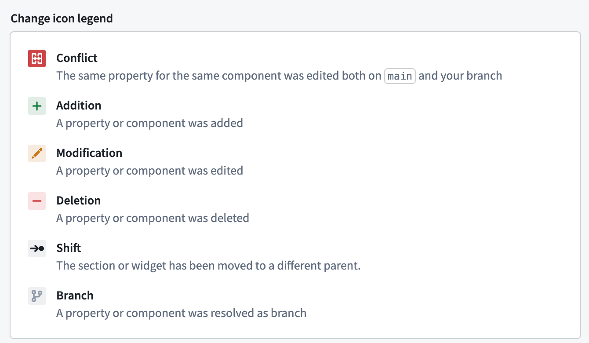

Select a change icon in the configuration panel to compare the configuration on `main` with the configuration on your branch. This will expand a side-by-side comparison that will show additional details.

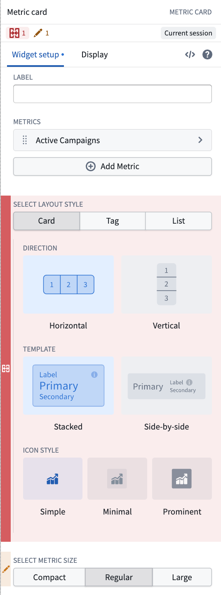

In the side-by-side comparison, select **Main branch** or **Your branch** to test that configuration in the module. You can then edit the configuration directly to combine changes from both branches. After you choose or create the configuration to keep, select **Resolve**.

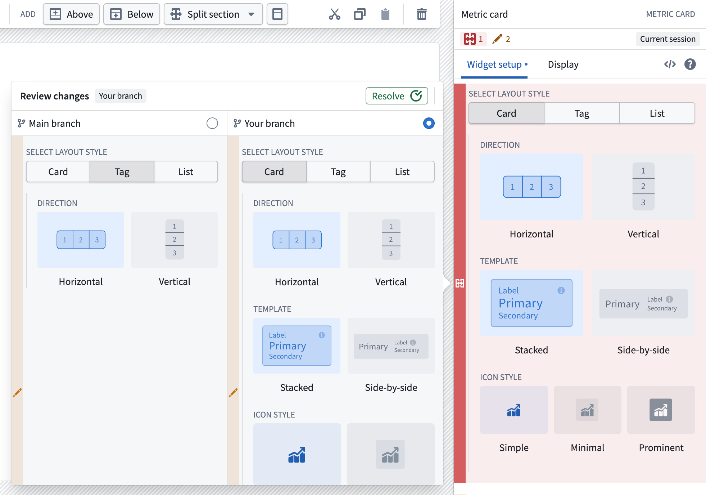

#### View variable definition changes

For a variable conflict, select the variable in the **Changelog** panel to open its editor and a side-by-side comparison. Review the complete variable definition and settings for **Main branch** and **Your branch**. You can expand the comparison if you need more space.

Select either version to test its effect on the module, or edit the variable definition to combine changes from both branches. Then select **Resolve**.

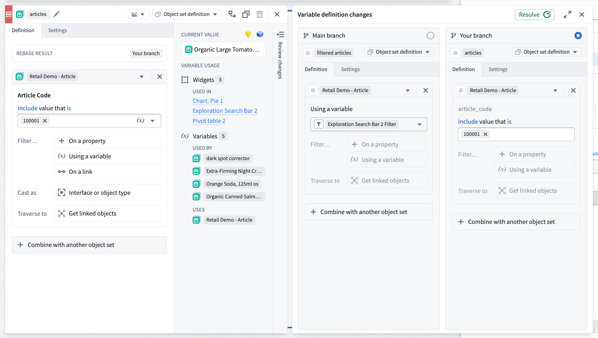

### Finish rebase

When you are satisfied with how your module looks and have resolved any merge conflicts, save the module to finish rebasing.

After this is complete, you can safely merge your Workshop changes from your branch into `main`.

### Example

In the example below, a merge conflict occurs in a metric card widget during a rebase. The current branch adds a metric named `Fiscal Week Revenue`, while `main` adds a metric named `Fiscal Week Sales Volume`.

**Current branch:**

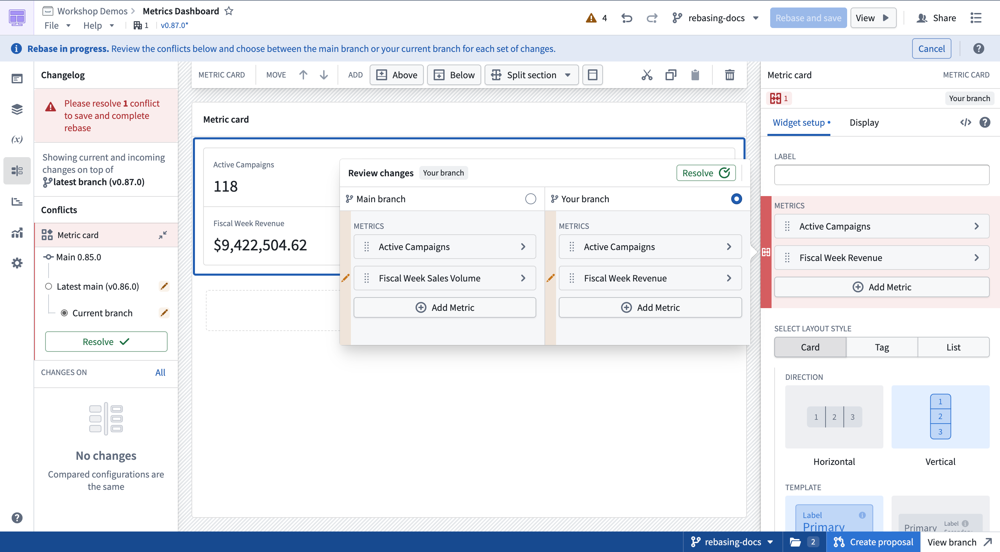

**Main:**

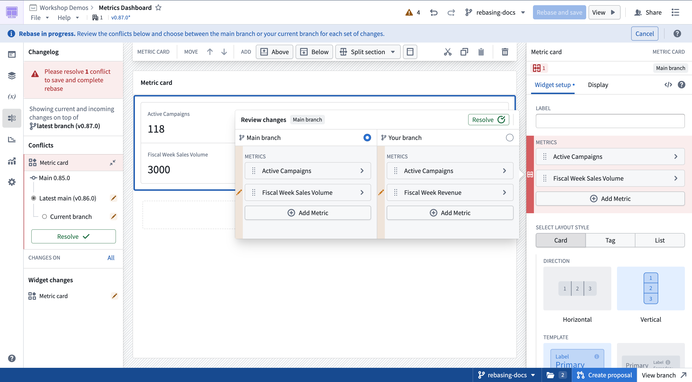

To keep both metrics, first select **Main branch**, then manually add the `Fiscal Week Revenue` metric. The comparison changes to **Current session** and shows the combined configuration. Select **Resolve** to keep it.

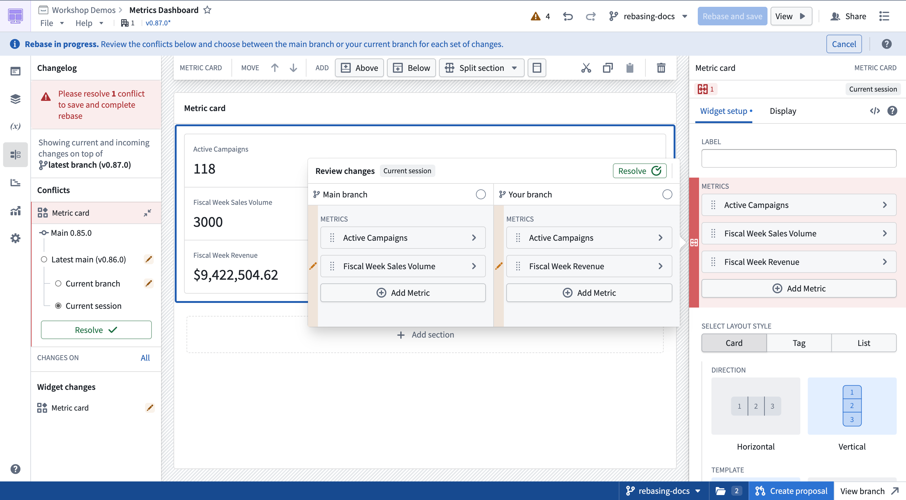
