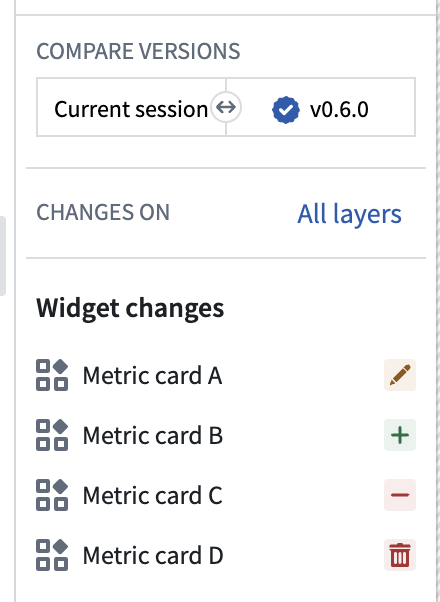
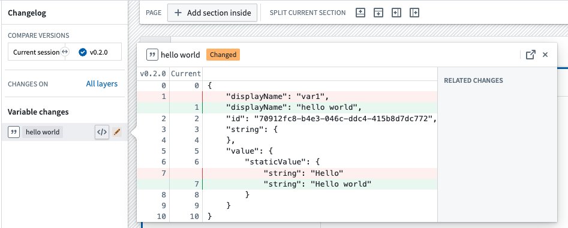
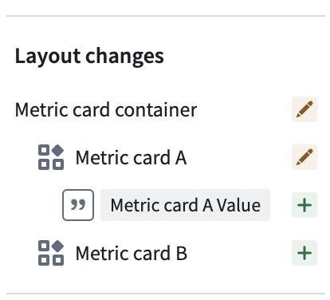

<!-- source: https://palantir.com/docs/foundry/workshop/changelog/ · mirrored 2026-08-18 from Palantir Foundry docs -->

# Changelog panel in Workshop

The Workshop Changelog Panel allows builders to visualize changes between module versions. This is useful for tracking modifications made over time and identifying which change potentially caused an issue when debugging problems with the module.

### Understanding the changelog

If changes exist for the selected module versions, the panel will be populated with changelog nodes. There are 5 different types of changes:

* **Changed:** A node has been modified (for example, the text on a button changed).
* **Addition:** A node was added to the module.
* **Deletion:** A node was removed from the module.
* **Moved:** The node was relocated (for example, moved from page 1 to page 2).
* **Made unused:** A widget was deleted but not removed from the module, moving it to `unused widgets`.

The image above conveys the following:

* Metric Card A was edited.
* Metric Card B was added to the module.
* Metric Card C was made unused.
* Metric Card D was removed from the module.

You can inspect the change node further by opening the JSON diff. Here, you can see the exact changes made to the node. In the screenshot below, we can see the variable value changed from `Hello` to `Hello world` and the variable name changed from `var1` to `hello world`.

Additionally, the Changelog Panel displays a visual hierarchy of changes. In the example below, we can infer from the hierarchy that the `Metric card container` section contains the `Metric card A` widget, and both were modified. Furthermore, we see `Metric card A value` is used within `Metric card A` and was added to the module.

### Module selection

There are two options for selecting module versions:

* **Range selection:** Choose a start and end version to see the changes between the two. For example, you can select `0.1.0` and `0.4.0` to see the changes between version `0.1.0` and `0.4.0`.

* **Single selection:** Single selection allows you to see the changes in a specific module version compared to the previous version. For example, if you select version `0.5.0`, the changelog will populate with the changes between `0.4.0` and `0.5.0`.

### Using the Changelog panel during rebasing

When rebasing is required before merging changes from a branch into `main`, the Changelog panel displays a visual notification dot and provides an option to begin the rebase.

During rebasing, the Changelog panel depicts changes being applied from your branch to the latest `main` version of the module and highlights merge conflicts. A change is marked as a conflict when it was modified both on `main` and on your branch. Common examples include:

* A widget or variable was modified on both `main` and your branch.
* A section was deleted on `main` and edited on the branch.
* A widget was moved from location `A` to `B` on `main` and from `A` to `C` on your branch.

While resolving conflicts, you can switch the module between three states to evaluate outcomes in real time:

* **Main:** The modification as it appears on `main`.
* **Branch:** The modification as it appears on your branch.
* **Modification:** Changes you make after beginning the rebase to reconcile differences.

Once conflicts are resolved and you are satisfied with the module, save to finish rebasing. You can then safely merge your branch into `main`.

For end-to-end guidance, see [Rebasing and conflict resolution](/docs/foundry/workshop/branching-integration/#rebasing-and-conflict-resolution).
