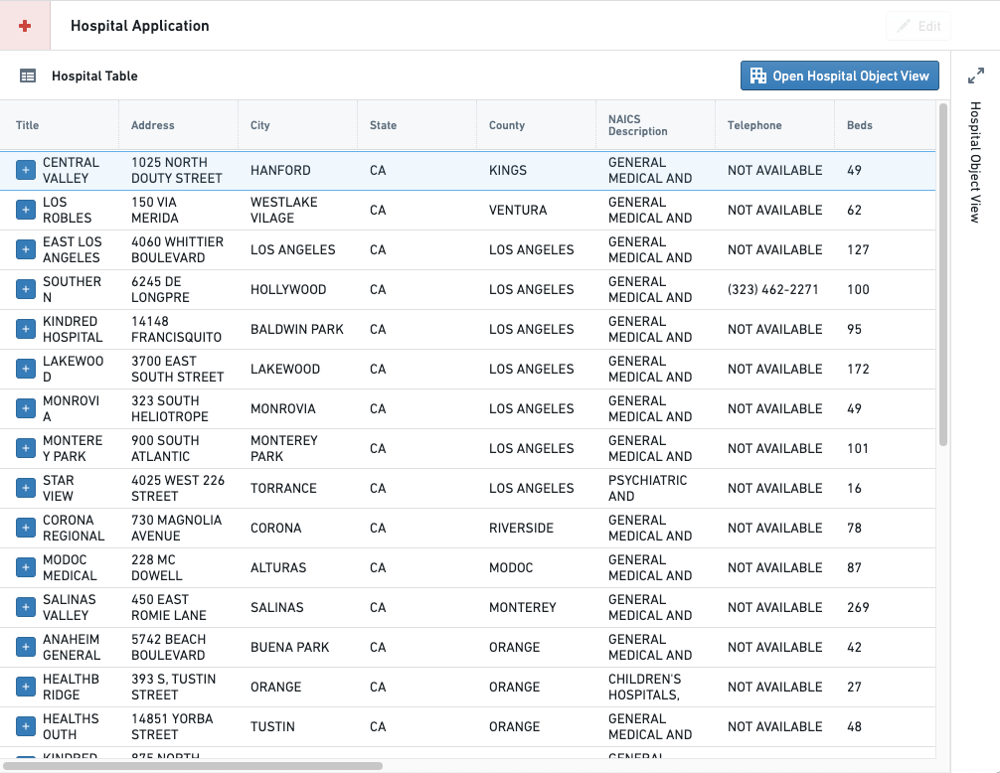
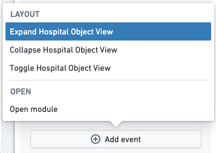
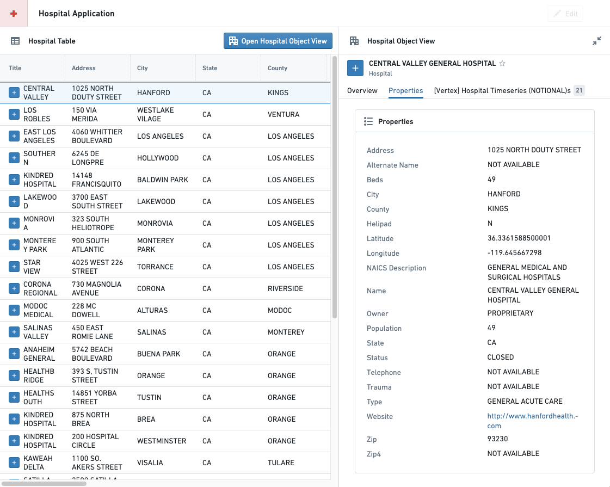
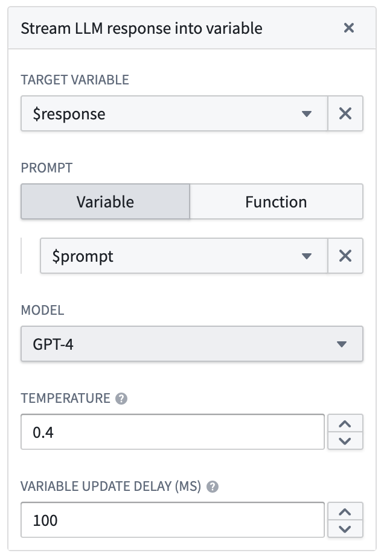
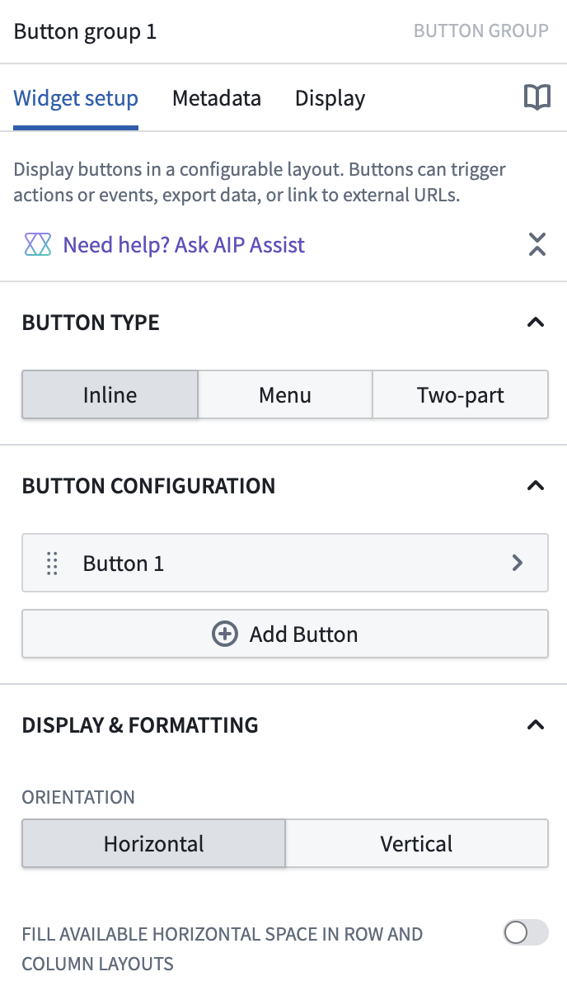
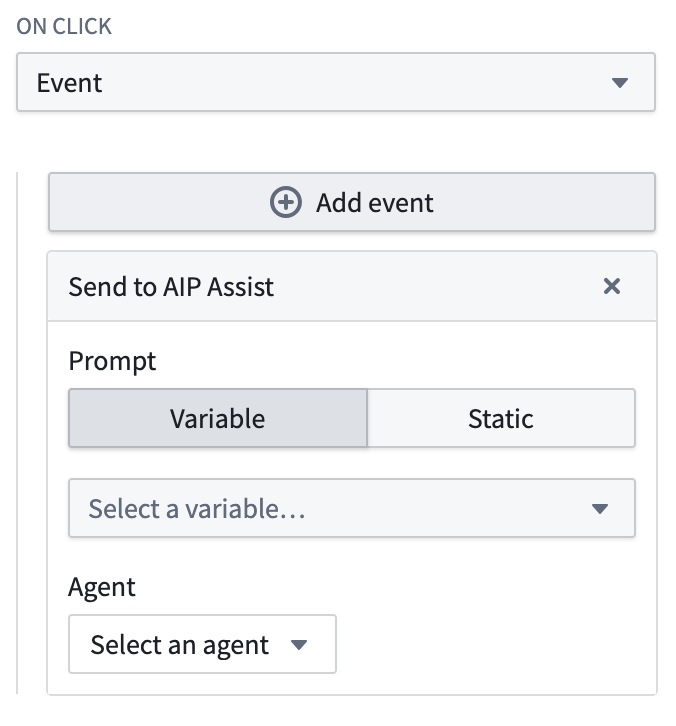
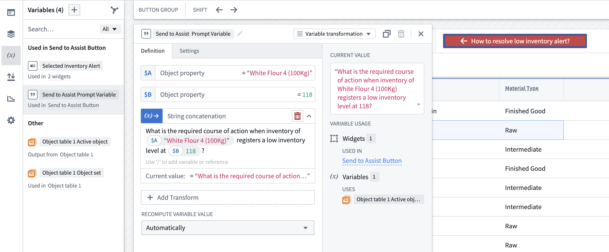

<!-- source: https://palantir.com/docs/foundry/workshop/concepts-events/ · mirrored 2026-08-18 from Palantir Foundry docs -->

# Events

Events within Workshop modules enable you to trigger specific behavior whenever a user takes a given action. Events can be triggered from many widgets, including the **Button Group**, **Object Table** on row selection, **String Dropdown** on selection or deselection, and **Tabs** widgets. Learn more in our [event-triggering and navigational widgets](/docs/foundry/workshop/widgets-event-navigational/) documentation. A full list of available events is documented below, but available event types may vary by widget.

## Event execution order

Events in Workshop execute sequentially in their configured order. To reorder two or more events on a widget, drag the event cards up or down in the configuration panel. Events do not wait for dependent computations from previous events to finish before executing.

### Key behavior

When a **Set variable value** event triggers:

* The source variable value is copied to the target variable value immediately.
* The target variable value will be up-to-date when the next configured event executes.
* Downstream variables that depend on the target variable will not be up-to-date before the next configured event executes.

This behavior is similar for other event types that update variable values.

### Limitations

Workshop does not support forcing events to wait for all downstream updates to complete before proceeding to the next event.

If your workflow requires complete propagation of downstream updates between events, separate the events into multiple user-triggered events. This allows downstream computations to complete before the next event is triggered.

## Types of events

### Layers

Layers events trigger changes in the on-screen display state of [overlays](/docs/foundry/workshop/concepts-layouts/#overlays) (drawers and modals) in a Workshop module.

#### Open/Close {overlay name}

For each overlay in the module, the following two events are available:

* **Open:** Open the overlay specified in the event name.
* **Close:** Close the overlay specified in the event name.

### Layout

Layout events trigger changes in the on-screen display within a Workshop module, such as switching the selected page, expanding or collapsing a given section, and switching the active tab in a **Tabs** layout.

#### Switch to {page name}

For each page in the module, an event is available to switch to the chosen page when the event is triggered. If the module is using a string variable for the [**Variable-Backed Page Selection**](/docs/foundry/workshop/variable-backed-layouts/#variable-backed-page-selection) option, the value of this variable will not be updated as a result of a Switch to Page event. If you wish to keep this variable value in sync with the selected page, you can use a [Set Variable Value](#set-variable-value) event instead.

The [Tabs widget](/docs/foundry/workshop/widgets-tabs/#selection-state) uses **Switch to page** events to derive its selection state.

#### Expand/Collapse/Toggle {section name}

For each collapsible section in the module, the following three events are available:

* **Expand:** Expand the section specified in the event name.
* **Collapse:** Collapse the section specified in the event name.
* **Toggle:** Expand the section specified in the event name if it is currently collapsed, or collapse the specified section if it is currently expanded.

If the specified section has a Boolean variable backing the collapse state, the value of this variable will not be updated as a result of one of these events. If you wish to keep this variable value in sync with the collapse state of the section, you can use a [Set Variable Value](#set-variable-value) event instead.

##### Example

As an example, an application builder has configured the following module displaying hospital data. The module contains an object table and an initially-collapsed object view that the builder would like to expand when the **Open Hospital Object View** button is selected.

At the bottom of a button's configuration pane for the Button Group widget, the application builder can choose to trigger a Layout event whenever the button is selected by choosing the **Event** option from the **On click** dropdown menu, then using the **Add event** button that appears to choose the desired Layout event.

Once the button and event is configured, the section containing the object view will expand whenever a user selects the **Open Hospital Object View** button in this module, as shown below:

#### Switch to {tab name}

For each **Tab** section in the module, a **Switch to {tab name}** event will be added for each tab in the section. Unlike the [**Switch to {page name}**](#switch-to-page-name), and [section collapse state](#expandcollapsetoggle-section-name) events, events that change the selected tab will also update the value of the string variable configured for **Variable-Based Tab Selection** if a variable is configured.

The [Tabs widget](/docs/foundry/workshop/widgets-tabs/#selection-state) uses **Switch to tab** events to derive its selection state.

### Variables

**Variable** events provide application builders with ways to change variable values within a Workshop module.

#### Reset {variable name} value

**Reset {variable name} value** events will set the value of the chosen variable to its default value, which is the value configured in the variable definition. This option is offered for static variables.

## Recompute {variable name}

**Recompute {variable name}** events will cause the chosen variable's value to be recomputed based on its input values and variable definition. This option is offered for non-static variable types, and is particularly useful for managing recomputes for variables without `Automatic` recompute behavior.

#### Set variable value

The **Set variable value** event will assign the current value of the chosen source variable to the value of the chosen target variable.

##### Configuration options

* **Source variable:** This is the variable value that will be copied immediately when the **Set variable value** event is triggered, without waiting for potential recomputation of its input variables from other events that are started at the same time.
* **Target variable:** This variable value will be overwritten with the **Source variable**'s value

#### Stream LLM response into variable

The **Stream LLM response into variable** event enables displaying the response of an LLM in real time within a Workshop module.

##### Configuration options

* **Target variable:** The string variable to stream the response into.
* **Prompt:** The prompt to send to the LLM. This can be a string variable or a function that returns a string.
* **Model:** The language model to use. Three OpenAI models are supported: GPT-3, GPT-4, and GPT-4 32K.
* **Temperature:** The temperature to use with the model, a number between `0` and `1`. Higher values, like `0.8`, will make the output more random, while lower values, like `0.2`, will make the output more focused and deterministic.
* **Variable update delay:** How frequently the variable will update, in milliseconds.

The screenshot below, which can be found within the event configuration, shows an example configuration with the supplied parameters described above.

### AIP Assist

The `Send to AIP Assist` event offers a way to send a prompt as static text or as a string variable to AIP Assist and automatically run the query. When this event is triggered, the AIP Assist sidebar will automatically open if it is not already open. To further customize the user experience, builders can also provide a default chatbot, an LLM-powered assistant that is equipped with enterprise-specific knowledge, to answer queries about custom operational topics. AIP Assist chatbots use custom content as their search context, and can be configured in [Chatbot Studio](/docs/foundry/chatbot-studio/overview/) (formerly known as Agent Studio) \[Beta].

A default AIP Assist chatbot can be selected during event configuration, allowing builders to choose the appropriate chatbot for the given context. Chatbots can be given access to custom content, such as documentation about the application being used or other operational processes to provide targeted assistance at relevant times. Selecting a chatbot is optional, and users can also select a dedicated chatbot in the AIP Assist sidebar. By selecting a default chatbot, builders can be sure that the correct chatbot for the task has been chosen without relying on end-users for manual selection. Prompts sent in the event can be static text or dynamic variables, allowing  builders to tailor the user experience as they see fit based on the prompt and the receiving agent.

#### Configuration

The `Send to AIP Assist` event can be added using the [Button Group widget](/docs/foundry/workshop/widgets-button-group/). The following is a walkthrough of `Send to AIP Assist` event creation using a Button Group widget. This widget will open the AIP Assist sidebar and send a configured prompt when selected.

1. Add a Button Group widget by selecting **+ Add widget** and selecting **Button group** from the list of widgets.

2. Configure the button's name, icon, and description as desired under the **Button Configuration** section.

    

3. In the **On Click** section of the button configuration panel, select **Event** from the drop down.

4. Select **+Add event** and choose **Send to AIP Assist** from the list of options.

    

5. Configure the event by choosing whether the prompt should be **Static** text or a computed **Variable**.
   * **Static:** For this option, simply input the prompt text. This text will be sent to AIP Assist as a prompt when the button is selected. For example: “What threshold does the Inventory Management Application use to determine when to create a ‘Low Inventory Alert’?"
   * **Variable:** For this option, you must [configure a string type variable](#variable-configuration) to be used for the `Send to AIP Assist` event and select it using the **Select a variable** dropdown.

6. (Optional) Select the agent that will be used by default when the event is triggered. This functionality enables builders to select the appropriate AIP Assist Agent for the given context. Note that this step can have a significant impact on user experience, as users can also select a dedicated agent in the AIP Assist sidebar, but selecting a default during configuration ensures that the correct agent for the task has been chosen without relying on end-users for manual selection. This option may give users access to an agent with access to custom content.

For more information on AIP Assist Agent configuration, refer to the AIP Assist Agent [documentation](/docs/foundry/assist/agents-in-aip-assist/).

##### Variable configuration

When configuring a variable for the `Send to AIP Assist` event, ensure that your variable value is up to date before using it. There are a number of possible variable configurations, but it is worth noting that the **String → Variable Transformation** type enables the configuration of complex, dynamic prompts based on the active state of the Workshop application. The following is a sample configuration for a series of connected variables that programmatically change based on Workshop's active state. In this example, the selected `Inventory Material` object from the active object table is **String concatenation Variable Transform**, combined with free text to form a prompt that can be sent to AIP Assist.

### Applications

The following events provide a way to open other Foundry resources in a new browser tab. If the Workshop module is in a Carbon workspace, using these events will open the target resource in a new Carbon tab.

* **Open Workshop module:** This event will allow an application builder to select a Workshop module and map variables from the current module to [module interface variables](/docs/foundry/workshop/module-interface/) from the selected module.
* **Open Quiver analysis:**
* **Open Object view:**
* **Open Object Explorer:**
* **Open Notepad document (read-only):**
* **Open Vertex exploration:**

### Data staleness

The **Refresh data in module** event allows all data in the module to be reloaded when this event is triggered.

### Module state

Module state events allow users to control certain module-level behaviors during their session.

#### Enable or disable auto-refresh updates

You can let users pause or resume the application of auto-refresh updates during a session by configuring Workshop events, such as through a Button Group widget:

* **Enable auto-refresh updates:** Allows updates from auto-refresh to take effect.
* **Disable auto-refresh updates:** Prevents updates from auto-refresh from taking effect.

Learn more about [auto-refresh in Workshop](/docs/foundry/workshop/auto-refresh/).

### Module appearance

The **Toggle between light and dark mode** event allows the theme of the module to be changed by the user when this event is triggered.
