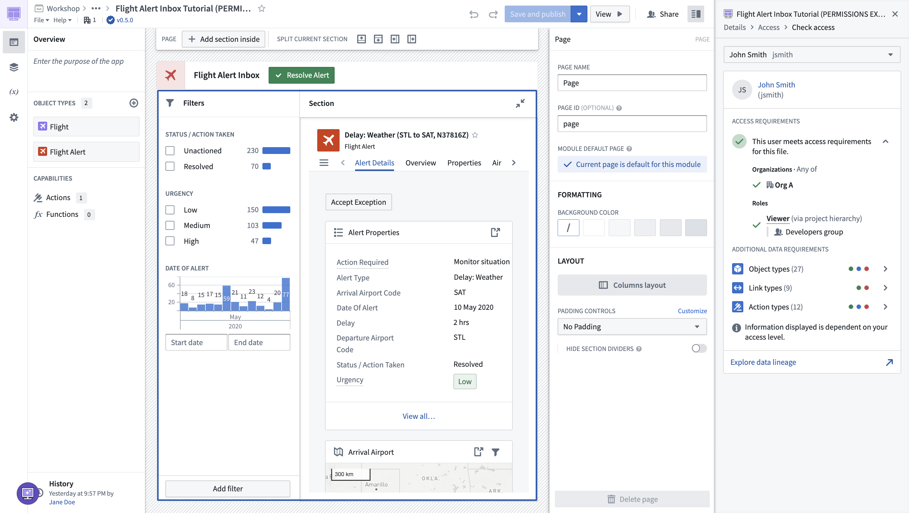

<!-- source: https://palantir.com/docs/foundry/workshop/concepts-permissions/ · mirrored 2026-09-04 from Palantir Foundry docs -->

# Permissions in Workshop

The ability to open or edit a Workshop module is derived from a user's permissions on the Workshop module. This means that a user must satisfy the [Organization](/docs/foundry/security/orgs-and-spaces/) and [Marking](/docs/foundry/security/markings/) requirements and also have a role on the module (directly, via a group, or a default role). By default, users need the Viewer role to open a Workshop module, and the Editor role to edit it.

Note that the ability to open or edit a Workshop module is separate from the ability to access the data, actions, or functions which may be needed to fully use a Workshop module.

The data, actions, or functions used or contained in a Workshop module are permissioned separately from the Workshop module. For more information, see the documentation on [Object permissioning](/docs/foundry/object-permissioning/overview/), [Action type permissions](/docs/foundry/action-types/permissions/), and [Function permissions](/docs/foundry/functions/permissions/).

:::callout{theme="warning" title="Read-time enforcement only"}
Row and column access controls (including [restricted views](/docs/foundry/security/restricted-views/), [object security policies](/docs/foundry/object-permissioning/object-security-policies/), and [property security policies](/docs/foundry/security/property-security-markings/)) filter what a user can see in a Workshop module. Widgets can never display data the user is not authorized to read. These controls do not extend to widget exports, Action writes, or downstream functions. To keep data protected as it flows downstream, pair these controls with a [marking](/docs/foundry/security/markings/) or [Classification-based Access Control](/docs/foundry/security/classification-based-access-controls/). For the full model, see [Access control propagation](/docs/foundry/security/access-control-propagation/).
:::

## Checking permissions

You can use the [Check access panel](/docs/foundry/security/checking-permissions/) in the sidebar to easily check a user's access on a Workshop module. This will show if they meet the access requirement on the Workshop module, as well as additional data requirements to see object types, link types, action types, and functions.

