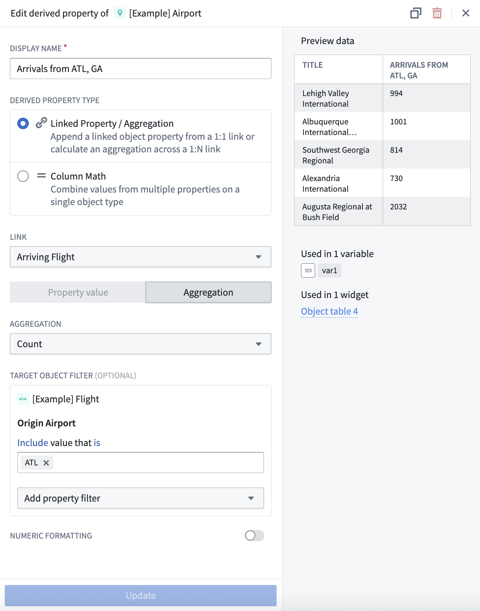
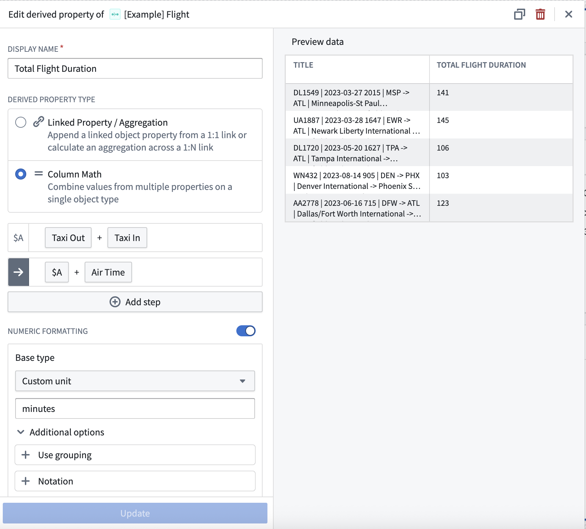
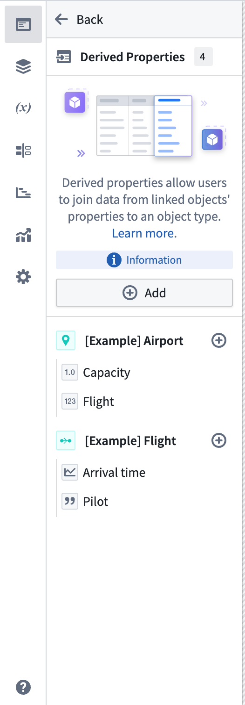

<!-- source: https://palantir.com/docs/foundry/workshop/derived-properties/ · mirrored 2026-08-18 from Palantir Foundry docs -->

# Derived properties in Workshop

[Derived properties](/docs/foundry/ontology/derived-properties/) are properties that are calculated at runtime based on the values of other properties or links on objects. They allow builders to perform complex operations like linked aggregations and operations between columns directly in Workshop. Derived properties are defined at the module level and per object type.

Derived properties are compatible with a broader set of widgets than [function-backed columns](/docs/foundry/workshop/widgets-object-table/#sorting-on-function-backed-properties), including pivot tables where they can be used for aggregation.

:::callout{theme="neutral"}
Derived properties are supported for [a subset of widgets and features](#limitations). Contact Palantir Support to discuss expanded support.
:::

## Configuration

In the **Overview** tab, select **Derived properties** from the **Capabilities** section. You can also select the object type from the **Object types** section and add a derived property on the next screen.

### Derived property types

* **Linked property/aggregation:** Select a linked object property to display from a 1:1 link or calculate aggregations across a 1:N link. Aggregations may only be calculated on the linked object type's native properties. Statically defined object property filters on the linked object type may optionally be applied.

* **Column math:** Combine values from multiple properties on a single object type. Both the object type's native properties and aggregation type derived properties may be used and referenced. Note that other column math type derived properties may not be used.

## Performance considerations

Derived properties are computed on the fly, which may result in longer module computation times for users. This is an important consideration when using derived properties in performance-critical applications and workflows.

## Limitations

### Supported widgets

Derived properties support a subset of Workshop widgets, including the Object Table, Pivot Table, and Waterfall widgets. Hover over the **Derived properties** information icon for the complete list.

Contact Palantir Support if you need expanded support.

### Performance

Derived properties are computed in real time, so consider the impact on module loading times in performance-critical applications.

### Saved states

Saved states do not support object sets that reference derived properties.

### Link traversal

Workshop runtime derived properties support only a single link traversal. If you need derived properties that span multiple links, consider using a [function-backed column](/docs/foundry/workshop/widgets-object-table/#sorting-on-function-backed-properties) with custom traversal logic, or restructure your data pipeline to make the required properties available within one hop.

### Sorting limitations

When sorting object sets that use derived properties, the object set size is limited to 200 rows. For larger object sets that require sorting, consider expressing the derived property logic as a [function-backed column](/docs/foundry/workshop/widgets-object-table/#sorting-on-function-backed-properties) instead. Function-backed columns support end-user sorting for tables containing up to 10,000 objects. For tables exceeding 10,000 objects, end users cannot sort on the column, and a default sort on the function-backed column will only sort each page of objects as they are loaded.
