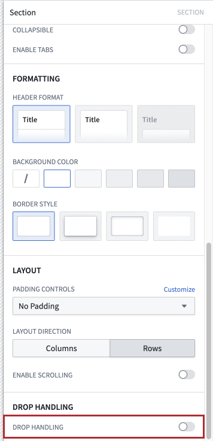
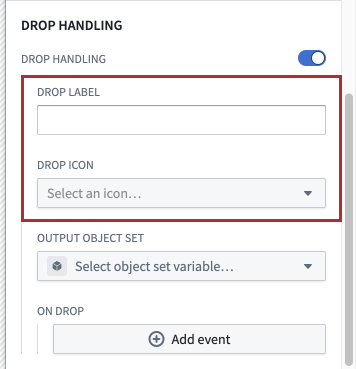
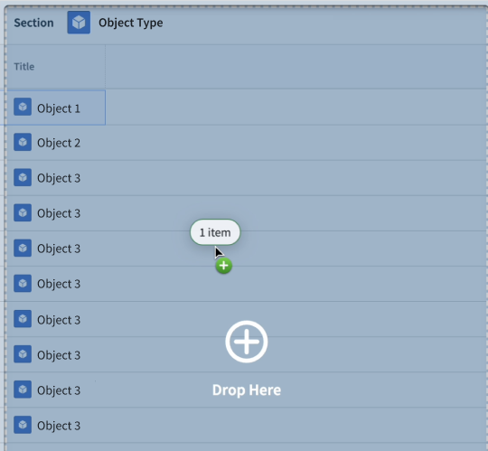
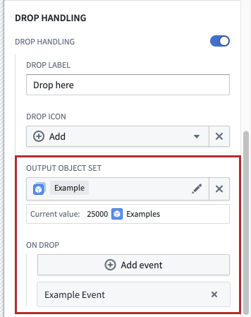
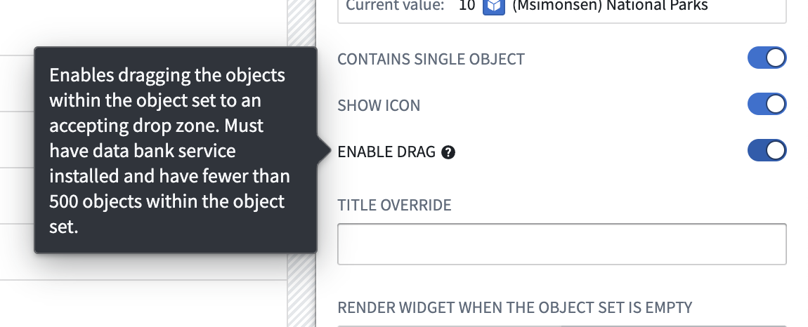
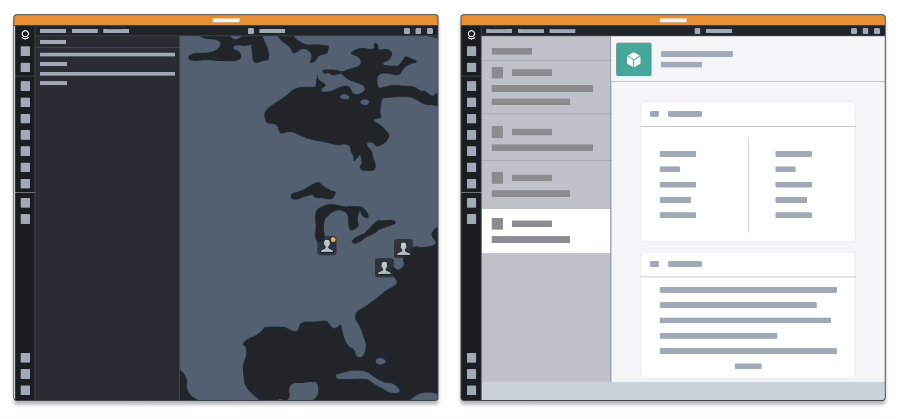
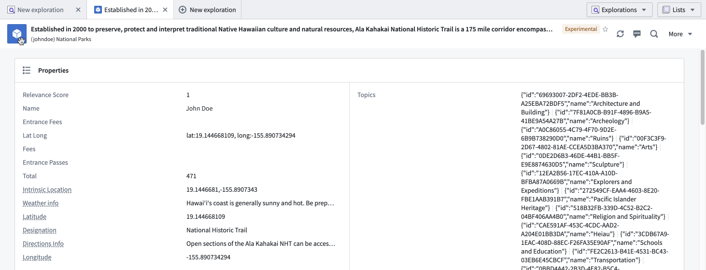

<!-- source: https://palantir.com/docs/foundry/workshop/drag-and-drop/ · mirrored 2026-08-18 from Palantir Foundry docs -->

# Drag and drop in Workshop

Drag-and-drop functionality allows users to easily move data between applications by dragging it from one application to another. Refer to [the drag-and-drop documentation](/docs/foundry/cross-app-interactivity/drag-and-drop-overview/) for more information.

In Workshop, multiple components enable drag-and-drop actions for [cross-application interactivity](/docs/foundry/cross-app-interactivity/overview/) and interactions between widgets. These components and interactions are detailed below.

## Workshop drop zones

Drop zones are interactive components that allow users to transfer data by "dropping" it on the element. The following are Workshop components that can be configured as drop zones, refer to the [drop zone documentation](/docs/foundry/cross-app-interactivity/drag-and-drop-overview/#drop-zones) to learn more.

### Section drop zone

The [section](/docs/foundry/workshop/concepts-layouts/#sections) component can be configured to receive drag payloads.

1. To turn the section component into a drop zone, select the relevant section and toggle **Drop Handling** in the section configuration panel to the right.   
      

   :::callout{theme="neutral"}
   If the drop handling toggle is not displayed, contact your platform administrator to enable this feature.
   :::

2. When drop handling is enabled, additional configurations will appear below the toggle. These configurations define the appearance of the drop zone when a drag payload is dragged over it:   
      

   The **Drop label** and **Drop icon** settings determine the text and icon that will appear on the drop zone, respectively.

   For example, if **Drop label** is configured as "Drop here" and the plus icon is selected as the **Drop icon**, the drop zone might look as follows when a user drags a payload over:   
      

3. Lastly, configure what happens to dropped data with the  **Output object set** and **On drop** settings.   
      

   Select the object set variable that the dropped data should be written to. This can be used to populate an object table, for example. An event can also be configured to fire after the drop.

#### Section drop zone usage

After the section component has been configured as a drop zone, users can drag and drop objects onto the section. Using [enrichment](/docs/foundry/cross-app-interactivity/enrichment-reference/), users can drag both Gotham and Foundry objects onto this drop zone.

This drop zone accepts the [Foundry object RID](/docs/foundry/cross-app-interactivity/objects/#foundry-object-resource-identifiers) and the [Foundry object set](/docs/foundry/cross-app-interactivity/object-sets/#foundry-object-set) media type. Refer to the [media types documentation](/docs/foundry/cross-app-interactivity/drag-and-drop-overview/#media-types) for more information.

## Drag zones

Drag zones are interactive elements that allow users to "grab" data and transfer it by dragging it onto a drop zone. The following are Workshop components than can be configured as drag zones. Refer to the [drag zone documentation](/docs/foundry/cross-app-interactivity/drag-and-drop-overview/#drag-zones) to learn more.

The following drag zones can be dragged onto both Gotham and Foundry drop zones that accept object media types using [enrichment](/docs/foundry/cross-app-interactivity/enrichment-reference/). Note that without enrichment, these drag zones can only transfer data to drop zones that accept their specific media type.

### Object set title drag zone

To configure the [object set title](/docs/foundry/workshop/widgets-object-set-title/) component as a drag zone, select the component and toggle **Enable drag** in the configuration panel to the right. This drag zone can be used to transport Foundry object set RIDs.

When this is enabled, the component can be dragged onto compatible drop zones to transfer data. Without enrichment, this component can only be dragged onto drop zones that accept the [Foundry object set](/docs/foundry/cross-app-interactivity/object-sets/#foundry-object-set) media type. Refer to the [media types documentation](/docs/foundry/cross-app-interactivity/drag-and-drop-overview/#media-types) for more information.

### Object table cell drag zone

Cells in an [object table](/docs/foundry/workshop/widgets-object-table/) can be dragged onto compatible drop zones to transfer data. Without enrichment, this drag zone can be dragged onto drop zones that accept the [Foundry object RID](/docs/foundry/cross-app-interactivity/objects/#foundry-object-resource-identifiers) media type. Refer to the [media types documentation](/docs/foundry/cross-app-interactivity/drag-and-drop-overview/#media-types) for more information.

### Object view drag zone

The icon in the [object view widget](/docs/foundry/workshop/widgets-object-view/) header can be dragged onto compatible drop zones. Without enrichment, this drag zone is compatible with drop zones that accept the [Foundry object RID](/docs/foundry/cross-app-interactivity/objects/#foundry-object-resource-identifiers) media type. Refer to the [media types documentation](/docs/foundry/cross-app-interactivity/drag-and-drop-overview/#media-types) for more information.

## Reordering within widgets

Some Workshop widgets provide drag-and-drop interactions that stay within the widget itself rather than transferring data to drop zones. The [Object List widget](/docs/foundry/workshop/widgets-object-list/), for example, can be configured to let users reorder items by dragging object cards.

When reordering is enabled in the Object List:

* Reordering is supported within a single Object List widget
* Reordering in a grid layout is not supported
* The widget displays only the first 500 objects

Learn more about this configuration in the [Object List documentation](/docs/foundry/workshop/widgets-object-list/#reordering-configuration).
