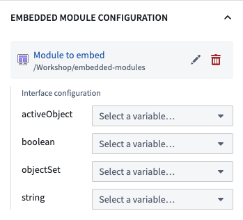

<!-- source: https://palantir.com/docs/foundry/workshop/embedded-modules/ · mirrored 2026-08-18 from Palantir Foundry docs -->

# Workshop: Embedded module widget

This page discusses Workshop's **Embedded Module** widget. For an overview of Workshop embedding features, see the [embedding overview page](/docs/foundry/workshop/embedding-workshop-modules-overview/).

## Configuration

The **Embedded Module** widget configuration allows a builder to select a module to embed, and define a mapping of variables in
the current module to module interface variables of the embedded module.

### Module selection

To configure the embedded module widget, first select a child module to be embedded via the Compass resource selector. The published version of the child module will always be used when embedding.

### Interface configuration

Once a child module is selected, the [module interface](/docs/foundry/workshop/module-interface/) for the child module will be shown in the widget configuration panel. This allows you to map parent module variables to child module interface variables. The parent module's variable definitions will be used to back variables that are fully shared between the parent and child modules. Any change to a variable value in either the child or parent module (for example, from a widget output or set variable value event) will be reflected in all modules where the variable is mapped.

Use mapped interface variables to [communicate across embedded modules](/docs/foundry/workshop/embedding-workshop-modules-overview/#communicating-across-embedded-modules), enabling shared state such as a selected object, a selected tab, or whether an overlay is shown.

Since the child module's variable definitions are not used for mapped variables, default variable values of mapped variables defined in the child module will not be used. Similarly, this means that any variable recalculation behaviors of mapped variables defined in the child module's variable definitions (such as usage of a function to back a variable value or variable transformations) will not be used. In the case of a [reset variable value event](/docs/foundry/workshop/concepts-events/#variables), the variable's value will be reset to the default value set in the parent module's variable definition.

Select **Open referenced module** from the **Embedded Module** widget to edit a child module with the current values of mapped module interface variables. This matches view mode and lets you debug the child module with the values mapped from its parent.
