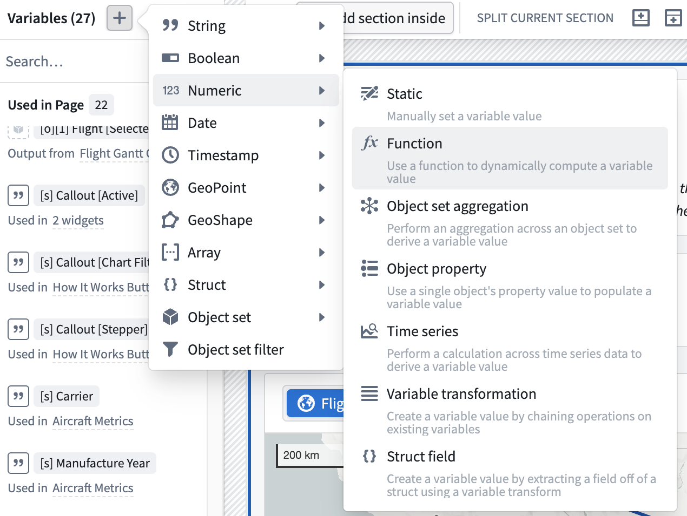
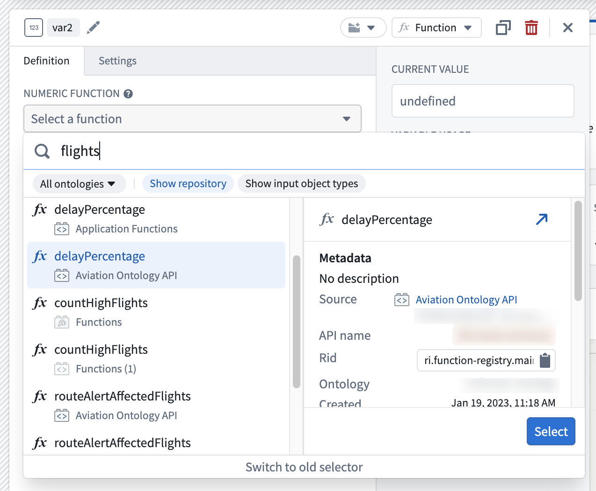
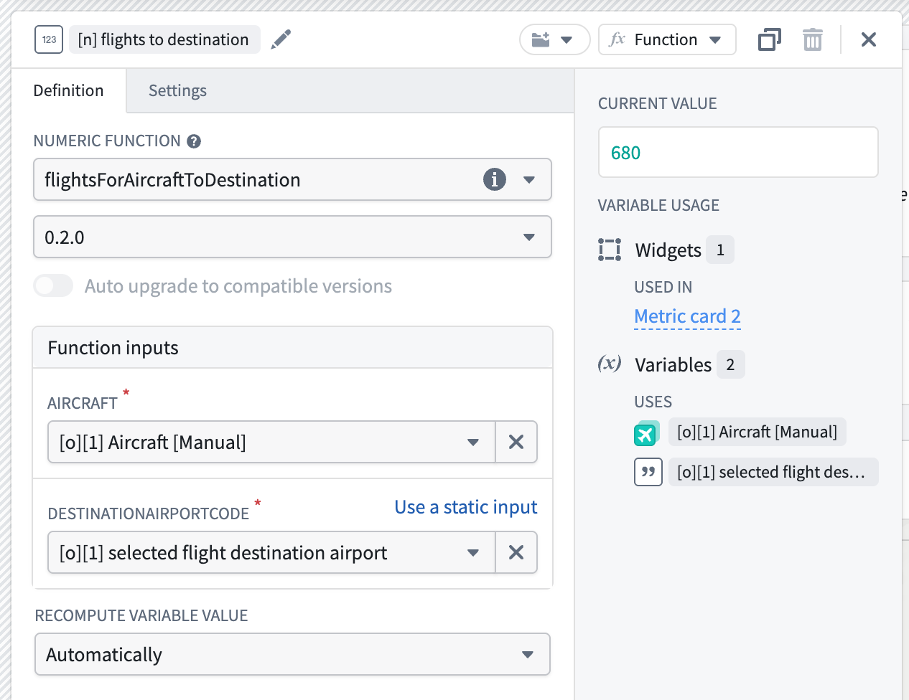
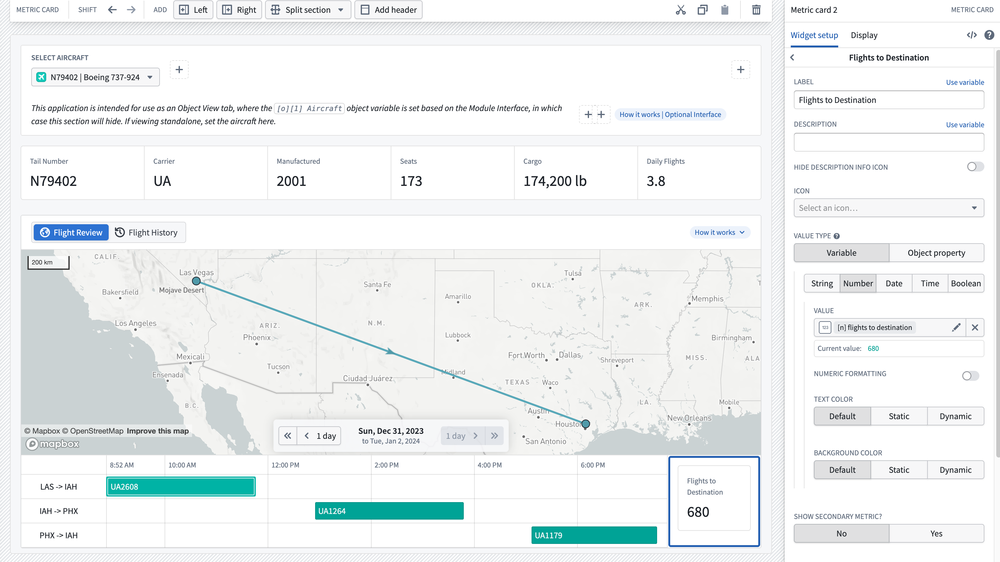

<!-- source: https://palantir.com/docs/foundry/workshop/functions-use/ · mirrored 2026-08-18 from Palantir Foundry docs -->

# Use Functions in Workshop

Within a Workshop module, functions can be used in a variety of ways. Function-backed actions enable modules to trigger complex sets of object edits and writeback. Widgets such as Metric Cards can display the output of functions in-module to help guide user decisions.

## Function-backed actions in Workshop

When defining a new action type in the Ontology Manager, a function can be used as part of the rules logic of the action type. This is generally helpful to enable more complex writeback in an action type than the built-in options of Add Object, Delete Object, Modify Object, Add Link, or Delete Link. [Learn more about how to define a function-backed action type.](/docs/foundry/action-types/function-actions-getting-started/)

Once a function-backed action type is defined, it can be used in Workshop like any other action type. [Learn more about how to expose an action type in Workshop.](/docs/foundry/workshop/actions-use/#use-an-action-within-workshop)

## Function-backed variables in Workshop

Functions can also be used in Workshop to populate the value of a variable in your module. The following example walks you through how to create a numeric variable and populate it with the output of a function that calculates the number of flights an aircraft has to a given airport.

:::callout{theme="neutral"}
Note that this example is illustrative and you may not be able to complete every step as written. Since your Foundry ontology is custom to your organization, you may not have access to the ontology objects required to complete the tutorial.
:::

First, take a look at the function that we will be calling from within our Workshop module. As seen below, the function is called `flightsForAircraftToDestination`. It accepts an `ExampleAircraft` object and a string representing the destination airport’s three-letter airport code as inputs, and then returns the count of flights that aircraft has to the target airport.

```typescript
@Function()
public flightsForAircraftToDestination(aircraft: ExampleAircraft, destinationAirportCode: string): Integer {
    return aircraft.flights.all()
    .filter(flight => flight.destinationAirport === destinationAirportCode)
    .length
}
```

Next, begin the process of wiring up this function in your Workshop module. The aim is to pass in the function inputs from the module and then display the function output within a widget.

Start by creating a new numeric variable from the **Variables** menu at the top left of the screen. Use the **+** option next to the **Variables** title to create a new variable, select **Numeric**, and then select **Function** as seen below.



Next, find and select the function to use for this variable. Use the function picker to search for your function. Note that the function must be tagged with a release version to appear in this list. Learn more about [function versioning](/docs/foundry/functions/functions-versioning/).



After selecting your desired function, configure its inputs. In the example below, the `aircraft` input is populated by the currently selected aircraft object in the module, and the `destinationAirportCode` input is populated by a variable that captures the selected flight’s destination airport elsewhere in the application. Make sure to name your variable and place it in a variable folder for easier discovery.



:::callout{theme="warning"}
Function-backed variables cache their results. If an identical input is provided to a function, the result in Workshop will be from a cache and not from a new computation. If you require the value to be recomputed, use a [set variable value](/docs/foundry/workshop/concepts-events/#set-variable-value) event in Workshop. You can also configure the [recompute behavior](/docs/foundry/workshop/concepts-variables/#recompute-variable-value) of the variable to control when it recomputes.
:::

:::callout{theme="warning" title="OAuth-backed functions"}
Functions that call a source configured with an [OAuth 2.0 outbound application](/docs/foundry/administration/configure-outbound-applications/) cannot trigger the interactive authorization prompt when used directly in Workshop, including as function-backed variables or to populate widget content. If the user has not already authorized the outbound application, the function will fail. To use OAuth-backed sources from Workshop, wrap the function in a [function-backed action](/docs/foundry/action-types/function-actions-overview/) instead, which can display the authorization prompt as part of action execution.
:::

To display the output of this function to a user, use the Metric Card widget described below.

## Metric Card with functions

The Metric Card widget gives builders a way to display key information in their module. It can be helpful for the statistic displayed here to be generated by a function. Within the Metric Card configuration, set a given metric to populate from the function-backed numeric variable that you defined in the steps above.

The screenshot below shows the resulting module with our function-backed Metric Card on the right. As a user changes their selection on the Gantt chart on the left to different flights, the Metric Card dynamically updates to display the total number of flights for the selected aircraft to the destination airport. In this case, there are 680 total flights for this aircraft to Houston (IAH).


