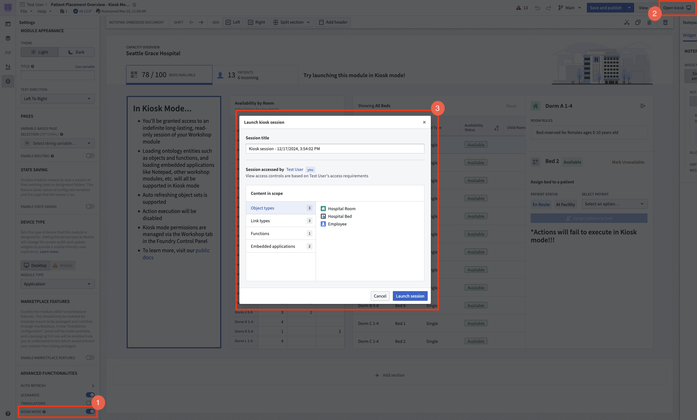

<!-- source: https://palantir.com/docs/foundry/workshop/kiosk-mode/ · mirrored 2026-08-18 from Palantir Foundry docs -->

# Kiosk mode

Kiosk mode gives builders the ability to enable long-lived, restricted sessions for Workshop applications, allowing them to be safely displayed for extended periods of time.

Kiosk mode sessions are read-only, meaning that Ontology write backs such as object edits and creations may not be triggered, and have scoped down permissions limiting the content viewable within a session. Details on what entities are included in a Kiosk mode session's scope are available [here](#kiosk-mode-session-scope).

:::callout{theme="neutral"}
Kiosk mode restricts permissions and limits content access. If you want to visually hide data for screenshots or screen sharing without changing permissions, see [redact mode](/docs/foundry/workshop/redact-mode/) instead.
:::

## Configure kiosk mode for a Workshop module

Kiosk mode settings can be configured and managed per [Organization](/docs/foundry/security/orgs-and-spaces/) from [Control Panel](/docs/foundry/administration/configure-workshop/).

Once a module has been added to the kiosk mode setting’s allowlist, builders with permissions to launch kiosk mode sessions can do so by navigating to the **Advanced Functionalities** section of the module’s **Settings** panel and enabling the **Kiosk Mode** toggle. The **Open kiosk** button will appear in the top right corner of the module. Selecting this button opens a modal that outlines the contents of the currently published version of the module that will be visible for the duration of the session. This includes object types, link types, functions, and other embedded Foundry applications. After reviewing the scope of the module’s content, select **Launch session** to start a kiosk mode session.

After kiosk mode has been configured and enabled for a module in both Control Panel and Workshop, you can also launch a kiosk mode session in view mode by selecting **Open kiosk**.

You can end a kiosk mode session by selecting **Exit kiosk mode**. Active kiosk mode sessions can also be ended by Administrators from the **Session Launch History** table found in the [kiosk mode settings section of Control Panel](/docs/foundry/administration/configure-workshop/).

## Kiosk mode session scope

Permissions will be scoped down for a module in kiosk mode to limit the content that is viewable in an active session. As a result, the content you can view when a module is in kiosk mode may differ from the content you can view when in view or edit mode.

Content that will be viewable and in the scope of a kiosk mode session will be displayed in the **Content in scope** section of the **Launch kiosk session** modal. Note that nested entities from embedded Workshop modules will be automatically included and viewable in a kiosk mode session. However, nested entities from other embedded Foundry applications will be not automatically included.

Here are two examples to illustrate how Kiosk mode scopes down entity permissions to limit the content viewable in a session:

* A Vertex Graph embedded via the Vertex Graph widget may reference an object type that is not directly present within the Workshop module. This means that when a Kiosk mode session is launched, that object type will not be included in the session’s scope and will not be viewable when in Kiosk mode.
* A function that executes search around on an object type within a module may fail in Kiosk mode if the corresponding link type is not present within the Workshop module.

You can use the **Launch kiosk session** to determine which entities will be present or missing in kiosk mode. To include a missing entity in a kiosk mode session's scope, you can add a direct reference to the entity somewhere within the module.

## Limitations

* Object types that are backed by a restricted view data source are not supported in kiosk mode.
* All embedded Slate applications are disabled for security purposes due to their ability to write back to the Ontology.
* When developing OSDK applications, it is the application builder's responsibility to ensure that the iframe's content manages authorization or tokens appropriately so the authorization remain valid for the entire duration of the kiosk session. Review [refreshing an access token](/docs/foundry/platform-security-third-party/writing-oauth2-clients/#refreshing-an-access-token) for more information.
* The standard inactivity timeout dialog still appears in kiosk mode sessions. While kiosk sessions are designed to be long-lived, they follow the platform's session timeout policies for security reasons.
