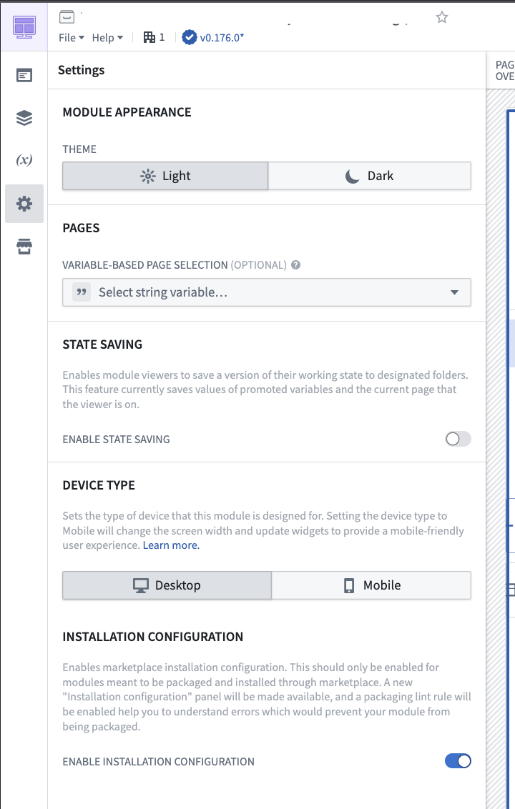
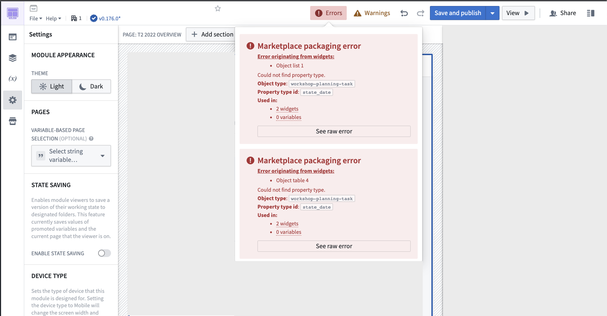
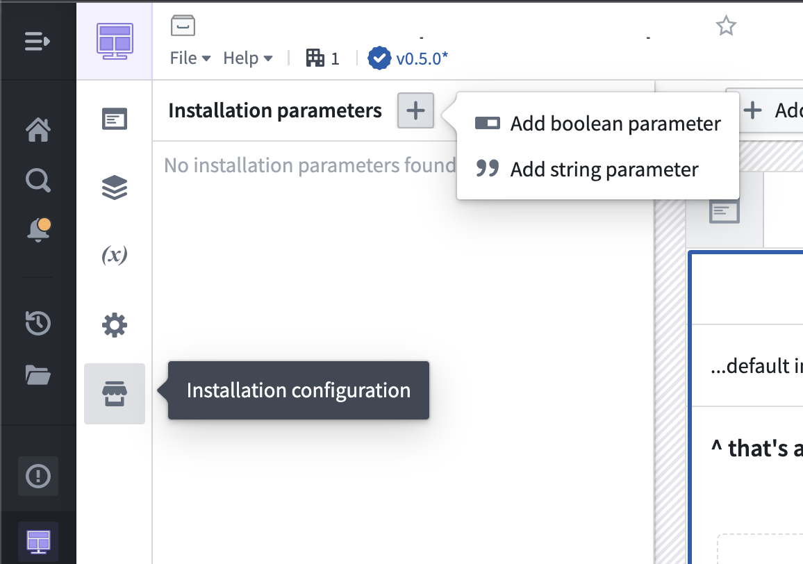
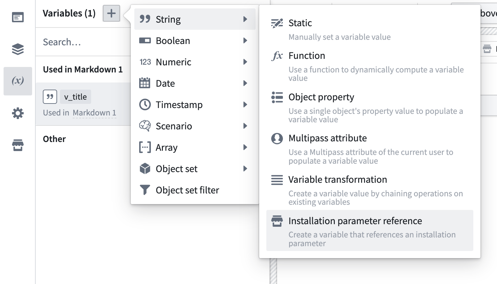
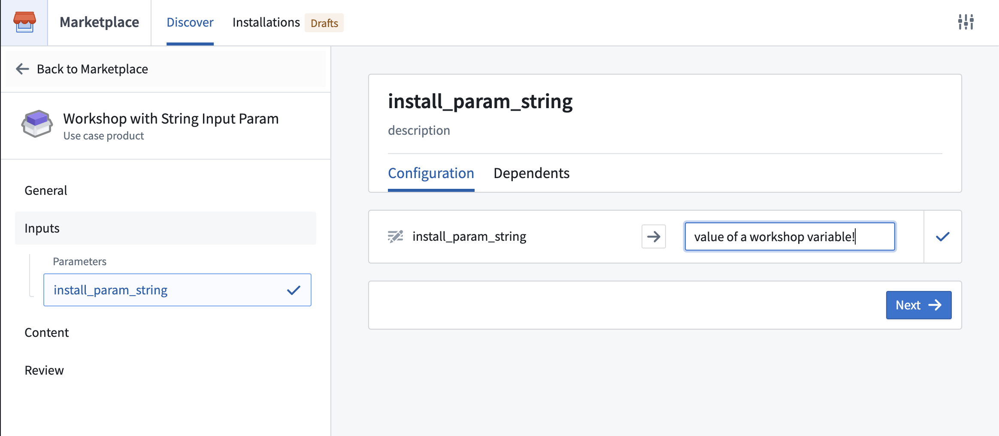

<!-- source: https://palantir.com/docs/foundry/workshop/marketplace-workshop/ · mirrored 2026-08-18 from Palantir Foundry docs -->

# Add Workshop application to a Marketplace product

Use [Foundry DevOps](/docs/foundry/devops/overview/) to include your Workshop applications in [Marketplace products](/docs/foundry/devops/core-concepts/#product) for other users to install and reuse. [Learn how to create a Marketplace product.](/docs/foundry/foundry-devops/create-products/).

## Supported features

All generally available Workshop features are supported for packaging, with the exception of static/object-backed scenarios.

## Adding Workshop applications to products

To add a Workshop application to a product, first [create a product](/docs/foundry/foundry-devops/create-products/), then [add outputs](/docs/foundry/foundry-devops/create-products/#add-outputs). Choose the **Add files** option to navigate to the Workshop application from within the [Compass](/docs/foundry/compass/overview/) filesystem and add it to your product.

Once you select your application, if you receive any error messages, visit the [packaging error linter](#packaging-error-linter) for more information. We recommend enabling the linter before attempting to package your application.

## Installation configuration

If you have created a Workshop application that you would like to include as part of a Marketplace product, enable **Installation configuration** in the Workshop settings as below, which provides additional features for [debugging packaging errors](#packaging-error-linter) when [creating your product](/docs/foundry/foundry-devops/create-products/) and creating [**Installation parameters**](#installation-parameters) to expose during installation.

## Packaging error linter

To successfully package a Workshop application, DevOps must be able to successfully identify all application dependencies, such as the object types that are used in the application. Once you have enabled **Installation configuration**, any errors will be surfaced in the top right corner of your application next to warnings.

:::callout{theme="neutral"}
Some Foundry enrollments enable Marketplace linting by default for all users. When enabled, Marketplace provides linting feedback for every Workshop module, including modules that you do not intend to package. Use this feedback to identify packaging issues during development.
:::

Note that there may be some (~5-10 seconds) latency for errors to appear depending on the size of your application. If no errors are present, nothing will appear.

It is generally a best practice to enable the linter and check for errors before attempting to package your application in DevOps. If you attempt packaging before enabling the linter, you will be directed to use the linter if there are any unresolved issues.

Common errors that are surfaced by the linter include:

* Your application references a property of an object type variable that cannot be resolved due to new features that are not fully integrated with Marketplace. To resolve this error, you can manually designate the object type using the variable's [Module Interface](/docs/foundry/workshop/module-interface/) setting.

* Your application references a property or object type that has since been deleted or had its primary key renamed. To resolve this issue, replace the property or object type reference with the new property or object type, or delete the reference if it is no longer needed.

* Your application uses a custom widget that has not yet been configured for packaging. Contact your Palantir representative for further assistance.

* Your application uses the Resource List widget to reference Compass resources. The Resource List widget does not support automatic detection of Compass resources as inputs for Marketplace packaging. Applications using this widget require manual configuration of dependencies during deployment.

## Installation parameters

After enabling **Installation configuration**, a new panel will appear under **Settings**. Two types of installation parameters are configurable from this panel: `string` and `boolean` parameters.

Use `string` parameters to allow for customization of content like application titles at installation time. For example, you can use a `string` parameter to allow installers to customize the application with their organization’s name when installing your product.

Use `boolean` parameters to show/hide content based on installer preferences. For example, you can use a `boolean` parameter to allow installers to show a specific chart in the application when relevant.

Once you’ve created your installation parameters, you can connect the parameters to Workshop variables.

When other users install your product, these parameters will be surfaced as [inputs](/docs/foundry/marketplace/install-product/#inputs).

