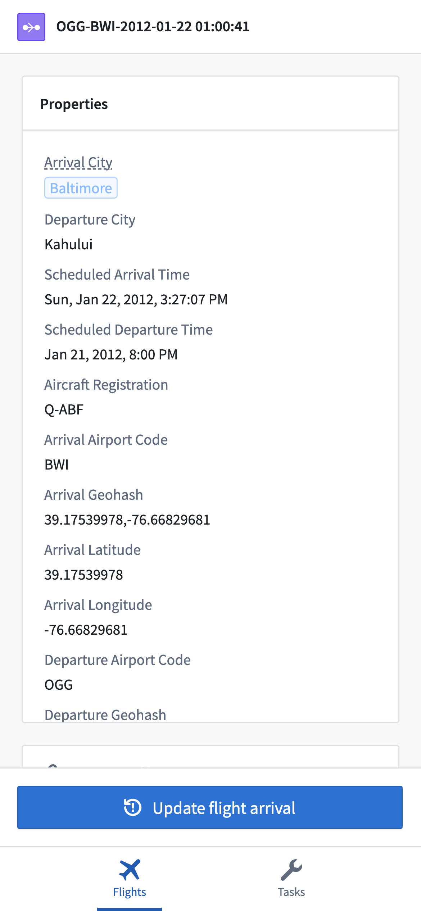
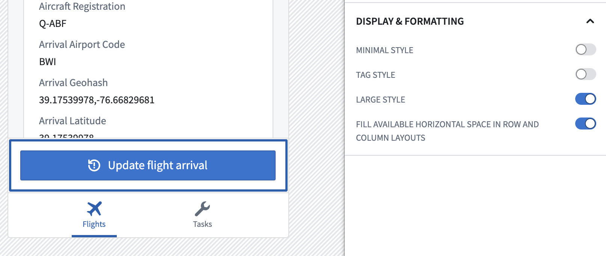
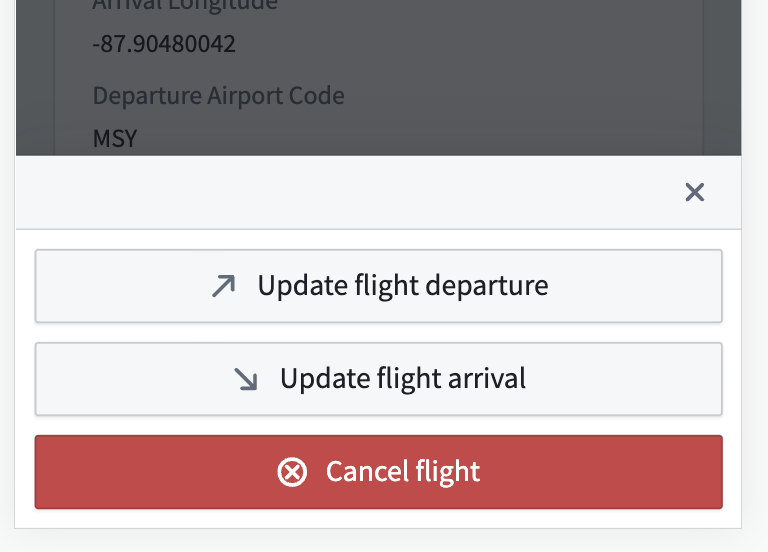
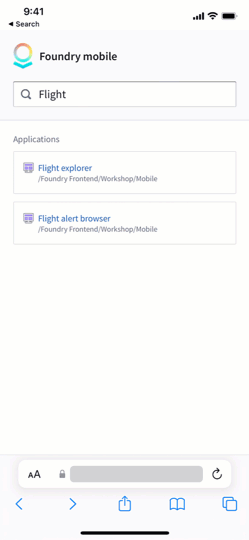
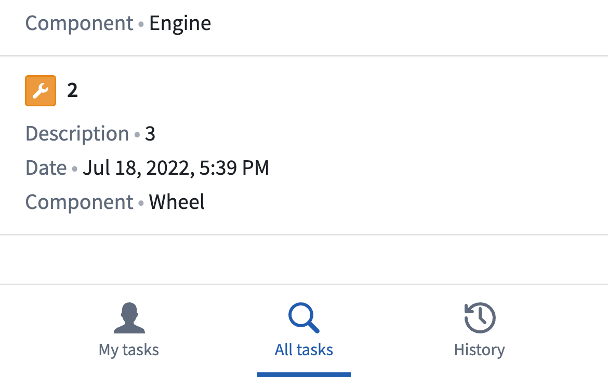

<!-- source: https://palantir.com/docs/foundry/workshop/mobile-design/ · mirrored 2026-08-18 from Palantir Foundry docs -->

# Design best practices

Designing for interactions on mobile devices requires a different set of considerations than for users on desktop devices. Screen viewports are a different size, users are likely using a touchscreen to interact with components, and users implicitly expect different types of interactions on mobile devices. Additionally, you should be mindful of how your application may be used across a range of operating systems, such as iOS and Android.

Although Workshop attempts to tailor widgets in mobile applications to provide a mobile-friendly user experience, the responsibility for creating a smooth experience for users is ultimately up to you. This page describes a range of best practices for mobile application design, and details how you can achieve a high-quality user experience using the concepts available in Workshop, including by using [Layouts](/docs/foundry/workshop/concepts-layouts/) and [Widgets](/docs/foundry/workshop/concepts-widgets/) properly.

We recommend the following best practices for mobile design:

* [Avoid collapsible sections, and favor letting users scroll through content](#favor-scrollable-content)
* [Use large buttons to ensure mobile-friendly tap targets](#ensure-mobile-friendly-tap-targets)
* [Use drawers for complex data entry](#data-entry-in-drawers)
* [Navigate to subpages to enable multi-step interactions](#use-subpages-for-multi-step-interactions)
* [Scale your application using the Navigation Bar, or split it into multiple applications](#scale-your-application-using-the-navigation-bar)

## Favor scrollable content

A common pattern in desktop applications is to use collapsible panels (or sidebars) on the left and right side of your application. These are typically used to show configurable filters or details about an item in a table or list.

Collapsible sections are problematic on mobile devices for a few reasons. It can be difficult to locate and tap on the control to toggle the section, and there usually isn't enough screen real estate available for collapsible sections to provide a natural user experience.

Instead, try using a [Flow layout](/docs/foundry/workshop/concepts-layouts/#section-layouts) to show a series of widgets that users can scroll through. Vertical scrolling is a natural way to show a large amount of content on a mobile device, and users can easily scroll through a range of widgets to find the information they need.

If you need to keep some summary information or action buttons always available on screen, use either a Toolbar or Rows layout that contains a Flow within it. This enables you to have certain widgets always visible at either the top or bottom of the screen, while keeping the ability for users to scroll through the main body of content, as in the example below.

For a step-by-step guide to setting up a page like this, refer to the tutorial section on [creating an object view](/docs/foundry/workshop/mobile-getting-started/#part-3-add-selected-object-view).

## Ensure mobile-friendly tap targets

Users on desktop devices typically use a mouse and keyboard to interact with your application. Using a mouse allows users to click on buttons and other controls with precision. On mobile devices with a touchscreen, however, users may struggle to interact with a button that was originally sized for use on desktop.

When adding a Button Group widget in a mobile application, we recommend selecting the **Large style** option in most cases to ensure the button is easily selectable on a touchscreen. Where appropriate, we also recommend enabling the **Fill available horizontal space** option to further increase the size of the control target.

When you need to display multiple button options to an end user, configure your Button Group to have a Menu button type. In a mobile application, this shows a top-level button which will open a bottom drawer to let the user select one of the nested buttons you've configured.

## Data entry in drawers

Desktop applications often have plenty of screen real estate available to show multiple input components, using widgets such as the Text input, Numeric input, or Filter list. Sometimes, these components are nested within a collapsible section for cleanliness and organization.

In a mobile application, we recommend using a [drawer](/docs/foundry/workshop/concepts-layouts/#drawers) layout to provide a focused data entry experience. This conforms to the iOS design guideline of using [modality ↗](https://developer.apple.com/design/human-interface-guidelines/patterns/modality/) to help users focus on a scoped or complex task.

Mobile Workshop applications automatically show Action forms within a drawer for this reason. When you add a [Button Group widget](/docs/foundry/workshop/widgets-button-group/), the widget it will show up in a full-page drawer when selected.

Beyond Action forms, you should consider adding a drawer in Workshop when users need to input multiple pieces of information. A common example is when users need to customize multiple filters that apply to a set of objects that they are looking at. You can create a drawer containing a Filter list widget to let users configure their filters, then add a Button Group widget that opens the drawer.

For a step-by-step guide to setting up a drawer, refer to the tutorial section on [adding a filter drawer](/docs/foundry/workshop/mobile-getting-started/#part-2-add-filtering).

## Use subpages for multi-step interactions

Building on the best practices described above, when you need users to examine a specific object to view details or take action, you should create a new [page](/docs/foundry/workshop/concepts-layouts/#pages) that shows the full details about the object. Workshop applications opened in the [mobile app launcher](/docs/foundry/workshop/mobile-app-launcher/) support browser-level Forward and Back interactions to let users navigate into and out of subpages, which provides a natural experience across Android and iOS.

To set up this pattern, create a page in your Workshop application, add widgets to show relevant information, and use an [event](/docs/foundry/workshop/concepts-events/) to navigate to that page. Then, end users will be able to navigate back to your initial page using the web browser, as shown below.

For a step-by-step guide to creating this workflow, refer to the last step of the tutorial section on [configuring an object view](/docs/foundry/workshop/mobile-getting-started/#part-3-add-selected-object-view).

## Scale your application using the Navigation Bar

In desktop applications, it's common to use a tabbed layout to include many different pieces of functionality in a single interface. The combination of tabs and collapsible sections can be used to create complex, data-rich interfaces that enable open-ended analysis and show lots of information on the screen.

Mobile applications should usually be more tailored to the specific needs of your target user group than desktop applications. As a result, each top-level page in your mobile application should be fairly simple, typically just allowing users to browse and filter a set of objects, then navigate to another page to view details and take action.

As your application becomes more complex and includes multiple workflows for a user group, you should use the [Mobile Navigation Bar](/docs/foundry/workshop/widgets-mobile-navbar/) to surface multiple pages that users can access. Each navigation item can take users to a different top-level page, typically used to show different types of objects, or to provide multiple ways to search the same set of objects.

For example, in an application used to surface tasks for a technician, one tab called "My tasks" could show all active tasks assigned to the current user, another tab called "Task search" could enable searching for tasks across all technicians, and a final tab called "History" could show a record of tasks the user has previously completed.

For details on how to configure the Navigation Bar, refer to the [Navigation Bar Widget](/docs/foundry/workshop/widgets-mobile-navbar/#navigation-bar-setup) page.

The Navigation Bar supports showing up to four tabs at the bottom of the screen, and you can show additional navigation items using submenus. However, if your application has reached a point of having several tabs, you should consider splitting this functionality into multiple applications. Users can navigate across applications using the [app launcher](/docs/foundry/workshop/mobile-app-launcher/), and having a single, targeted purpose for each application can help keep functionality simple and ensure that your application remains performant.
