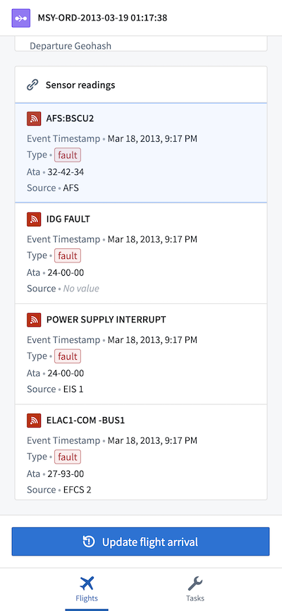
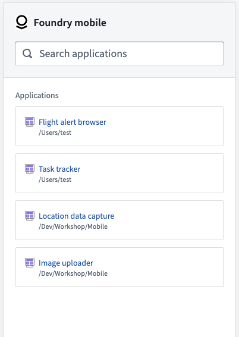

<!-- source: https://palantir.com/docs/foundry/workshop/mobile-overview/ · mirrored 2026-08-18 from Palantir Foundry docs -->

# Workshop mobile

Workshop's **mobile** support allows you to build web applications optimized for use on mobile devices, especially for phone form factors.

:::callout{theme="neutral"}
Mobile access to Workshop is a limited access feature and may not be available in your enrollment. If you are interested in using this feature, contact Palantir Support.
:::

Configuring a Workshop module for mobile use automatically updates many widgets to be more mobile-friendly, such as making form inputs more usable on touchscreens. Additionally, a range of mobile-specific widgets are made available, as documented below. Some widgets that are intended for use on desktop devices — including the Object Table, Chart, and Map — are disabled in mobile modules.

End users access mobile Workshop applications by navigating to the dedicated **mobile app launcher**, available at `https://{your-foundry-url}/workspace/m/`. This streamlined launcher allows users to easily browse, search for, and open mobile Workshop applications. Opening a mobile Workshop application in the launcher also enables users to navigate intuitively using the browser's back and forward interactions. [Learn more about the mobile application launcher.](/docs/foundry/workshop/mobile-app-launcher/)

Get started by [building your first mobile Workshop application](/docs/foundry/workshop/mobile-getting-started/), or learn more about mobile application design patterns and the available widgets:

* [Design best practices](/docs/foundry/workshop/mobile-design/)
* [Network access and authentication](/docs/foundry/workshop/mobile-access/)
* [Widget: Mobile Navigation Bar](/docs/foundry/workshop/widgets-mobile-navbar/)
* [Widget: QR Code Reader](/docs/foundry/workshop/widgets-qr-reader/)
* [Widget: Current Location Manager](/docs/foundry/workshop/widgets-current-location/)
