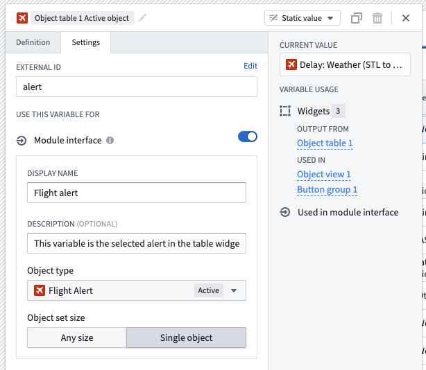

<!-- source: https://palantir.com/docs/foundry/workshop/module-interface/ · mirrored 2026-08-18 from Palantir Foundry docs -->

# Module interface

The module interface is the set of variables that are able to be mapped to variables from a parent module when [embedded](/docs/foundry/workshop/embedding-workshop-modules-overview/), and initialized from the URL. You can think of the module interface as the API for a Workshop module.

:::callout{theme="neutral"}
Module interface variables are different from [ontology interfaces](/docs/foundry/interfaces/interface-overview/), which define shared properties and links across object types. Module interface variables define the inputs and outputs of a Workshop module for embedding and URL initialization.
:::

To add a variable to the module interface, navigate to the **Settings** panel for a variable, add an external ID, and make sure the toggle for module interface is enabled. Optionally, you can give a module interface variable a display name and description, which will be shown when the module is embedded or used in an [Open Workshop module event](#open-workshop-module-event).

## Embedded module interface

When embedding a module, the module interface variables for that module will be available to map parent module variables to child module interface variables. You can read more about this in [interface configuration](/docs/foundry/workshop/embedded-modules/#interface-configuration) within the embedded modules documentation.

Use module interface variables to communicate between a parent and child module or between sibling embedded modules. These shared interface variables can back shared state, such as a selected object, a selected tab, or whether an overlay is shown. For more details on controlling layout state with variables, see [variable-backed layouts](/docs/foundry/workshop/variable-backed-layouts/). Embedded modules may modify the value of interface variables through events, allowing other places that reference these variables to respond to the updated value. Learn more in [Communicating across embedded modules](/docs/foundry/workshop/embedding-workshop-modules-overview/#communicating-across-embedded-modules).

:::callout{theme="neutral"}
When an interface variable is mapped between a parent and an embedded child module, Workshop uses the parent module's variable definition and ignores the embedded module's own interface variable definition. See the [embedded modules interface configuration](/docs/foundry/workshop/embedded-modules/#interface-configuration) for details.
:::

## Open Workshop module event

The Open Workshop module event can be used to avoid manually creating a URL, as described below. The selected module's interface will appear, allowing variable values to be passed from the current module to the chosen module's interface variables. When the event is called, the URL uses the current value to open the selected module.

In edit mode, when you open a module from a module reference (for example, opening an embedded child module in its own editor), the module opens with the current values of any module interface variables that were passed from the source module. This allows you to debug the opened module using the same state that was present where it was referenced.

## Create a URL with module interface variables

Outside of the Open Workshop module event, a URL can manually be dynamically generated to allow sharing custom links to an application state using URL query parameter values for module interface variables. To do so, follow the steps below:

1. Log in to your Workshop app.
2. Copy the URL from your browser. Make sure to be in view mode and not edit mode. This URL is fixed, so you can share it with other users who hold the correct permissions.
3. Now, return to edit mode.
4. Select the **Variables** menu located in the left sidebar.
5. Create a **New variable > String > Static**.
6. Go to the variable **Settings** tab, and add an external ID.
7. Append `?` to the URL from step 2, followed by the external ID, `=`, and the value you would like to set. For instance, `?interfaceVariable=123`. You can add other module interface variables by adding an ampersand `&` followed by an additional external ID, equals `=` the value.

:::callout{theme="neutral"}
Module interface variables are initialized from URL parameters when the module is first loaded. Changing the URL after the module has loaded does not dynamically update variable values. To update variable values at runtime, use Workshop events such as the **Set variable value** event or the **On module load** event.
:::

The link is now ready to be used and will define the module interface variable as the value set in the URL. This link may be generated dynamically by using [variable transformations](/docs/foundry/workshop/variable-transformations/), with values coming from action forms, functions, or other variable transformations.

For testing purposes, you can change the `/latest/` to `/dev/` in the URL, and the link will now redirect to the last saved version of the Workshop application instead of the last published version.

## Carbon navigation

Read about [using module interface variables with Carbon navigation here](/docs/foundry/carbon/modules-navigation/#workshop-module-interface). Note there are several limitations on types of variables that Carbon supports, and that external IDs must be prefixed with `variable.` when configuring parameters for a Carbon module tab.

Carbon supports object set filter variables when you navigate between Workshop module tabs, so you can pass filter values between tabs.
