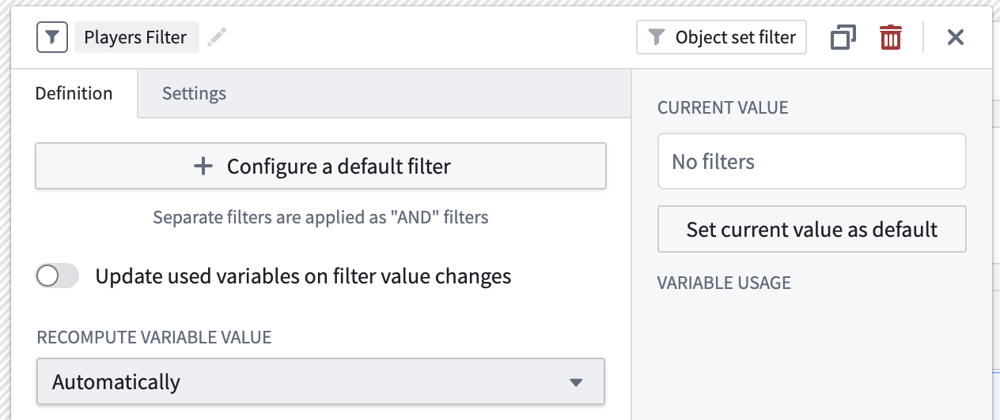
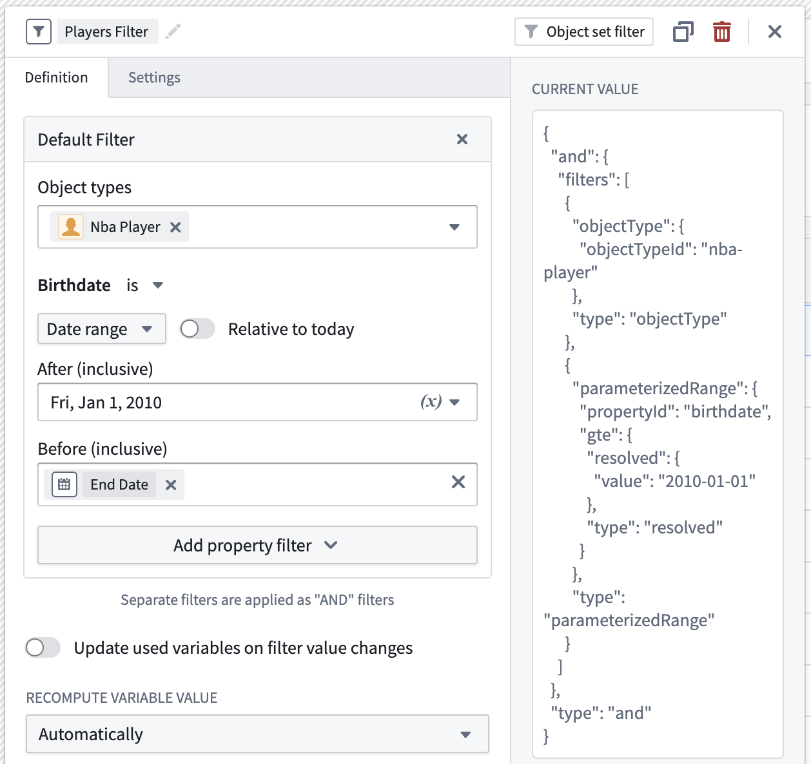
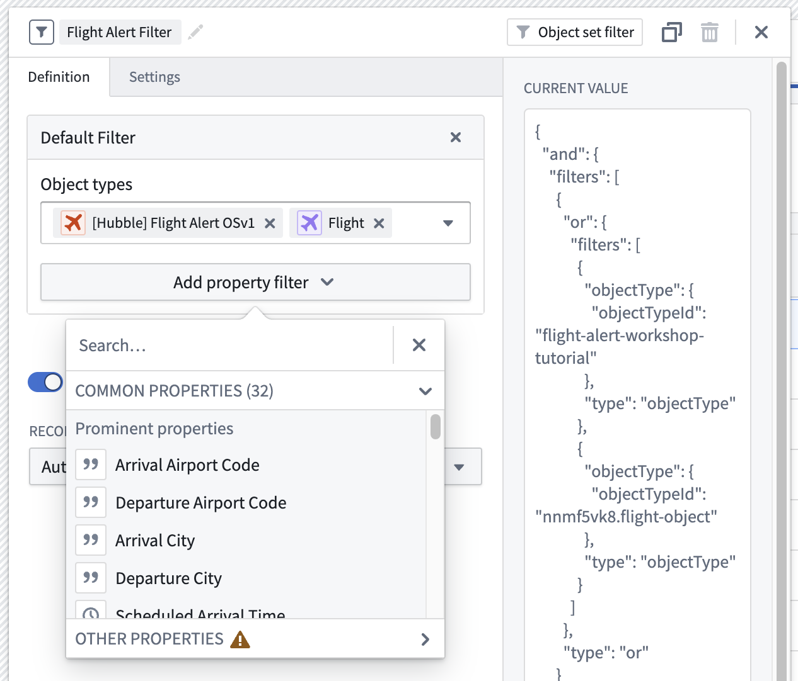
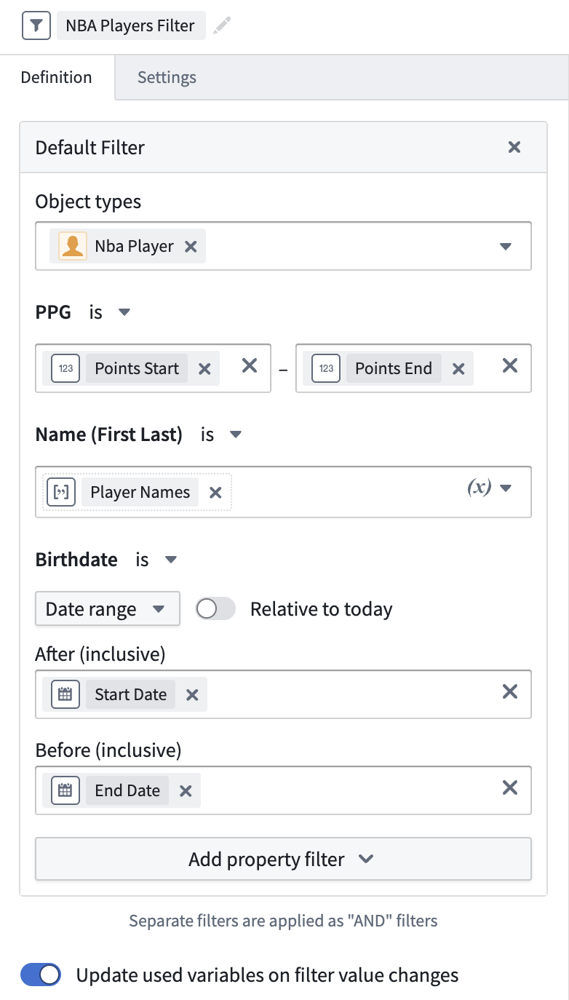
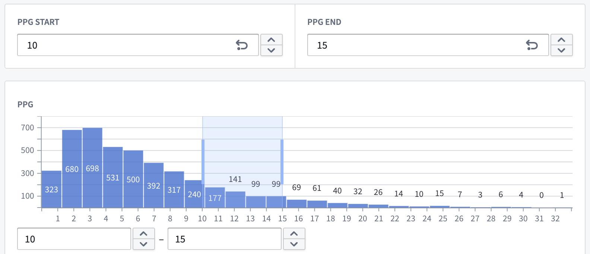

<!-- source: https://palantir.com/docs/foundry/workshop/object-set-filter-variables/ · mirrored 2026-08-18 from Palantir Foundry docs -->

# Object set filter variables

An **object set filter variable** is used to track the filter state of an object set, often output by widgets such as the [Filter List](/docs/foundry/workshop/widgets-filter-list/), [XY Chart](/docs/foundry/workshop/widgets-chart/), [Vega Chart](/docs/foundry/workshop/widgets-vega-chart/#selection-parameters-vega-lite-only) or [Pivot Table](/docs/foundry/workshop/widgets-pivot-table/) widgets. Object set filters can then be applied to object set variables, or used to filter object sets in widget configurations.

## Create an object set filter variable

An object set filter variable can be created as an empty variable and then used in widget configurations to capture widget selections.

A default state for the filter can also be specified by selecting object types, property types, and values for those property types. The values can be specified inline, or as variables.

If you select multiple object types, it is recommended that you filter on properties that are shared by all object types. Failure to do so may result in unexpected behavior, especially if deploying the module from Marketplace.

You can also remove the specified object types once your properties are specified if you want to make your filter object type agnostic. Note that you cannot add additional property filters, or select variables for property values, unless at least a single object type is specified.

## Supported starting filters

The initial state of object sets can also be defined through object set filter variables. Currently, you can filter through or filter out from initial filters in the following ways:

* `IS`: This will return objects that have a property value that matches exactly with the filter query.
* `NULL`: This will return objects that have a property value that is null.
* `CONTAIN`: This will return objects that have a property that contains the filter query. For example, if a property value is `id000123` and the filter query is `id0001`, this will be considered a match. This matching behavior is currently limited to prefixes; matching arbitrary portions of strings is not currently supported. For instance, if the property value is `id000123` and the filter query is `d0001`, this will not be considered a match.

## Filter value extraction

For some workflows, it may be helpful to extract specific filtered values from an object set filter to use them elsewhere in your module. Here are some sample use cases where this may be valuable:

1. You want to extract and translate a user's filtered values from an initial object type to a secondary object type with a different data model. For example, if a user is initially filtering on the `Email Date` property on an `Email` object, and you want to translate that filter to also work on the `Call Date` property of a `Phone Call` object.
2. A user filters to a given alert type in the Filter List widget, and you want to extract their chosen alert type into a string variable to then use it to pre-fill a `Create New Alert` Action.
3. A user has filtered down to certain properties in the Exploration Search Bar widget, and you want to extract and save their filter state using [module interface variables](/docs/foundry/workshop/module-interface/) as dynamic URL parameters so that the module can be re-loaded with those same selections.

To accomplish this, you can specify a default filter variable state using variables for property values, and turn on **Update used variables on filter value changes**.

When the filter value is updated to a filter that matches the shape of the default filter, the value for each variable in the configured default will be updated to the extracted value from the filter.

Using the filter above, when a range of points-per-game is selected in the filter list, the numeric inputs that are backed by these extraction variables will be updated.

Only the following value types can be extracted:

* Numeric ranges
* Date/Time ranges
* String terms
  * An array variable should be configured to extract multiple values. If a non-array variable is configured, only the first filtered value will be extracted.

### Limitations

The filter value must match the shape of the default filter in order for extraction to occur. Review some known cases where this may happen:

* Deeply nested or disjoint range filters, like those that can be output by the pivot table or certain chart selections, do not support extraction or may behave in unexpected ways.
* The current filter value must match the inclusive less than or equal to (LTE), or greater than or equal to (GTE) behavior offered by the object set filter variable definition.
* Negated filter values must also be negated in the filter variable's default configuration.
* The [XY Chart widget](/docs/foundry/workshop/widgets-chart/) with a numerical axis does not currently support extraction.
