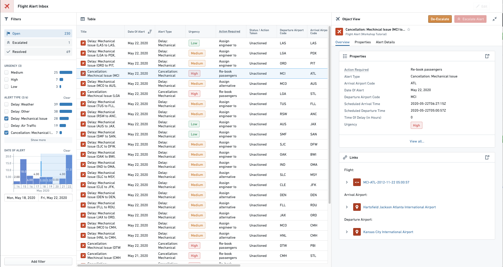

<!-- source: https://palantir.com/docs/foundry/workshop/overview/ · mirrored 2026-08-18 from Palantir Foundry docs -->

# Workshop

**Workshop** enables application builders to create interactive and high-quality applications for operational users.

Workshop follows three key principles:

* **Object data**

  * Workshop reduces the barrier to entry for application builders by using the Object layer as the primary building block. All data in a Workshop Application is read from the Object Data Layer, allowing application creators to take advantage of rich characteristics such as links between object types. Workshop leverages [Actions](/docs/foundry/workshop/actions-use/) for writeback to object data, [Functions](/docs/foundry/workshop/functions-use/) for business logic on object data, and [Derived properties](/docs/foundry/workshop/derived-properties/) for runtime-calculated values based on linked objects and aggregations.
* **Consistent design**
  * All Workshop components follow a unified design system and are built to interact cleanly, have a consistent look and feel, and provide a high-quality end-user experience.
* **Interactivity and complexity**
  * Applications built in Workshop are more dynamic and interactive than typical dashboards created in other point-and-click tools. By leveraging high-quality [Layouts](/docs/foundry/workshop/concepts-layouts/) and an easy-to-use but sophisticated [Events system](/docs/foundry/workshop/concepts-events/), Workshop applications aim to be as user-friendly and high-quality as custom React applications.

Workshop is a flexible application builder that supports a wide range of possible use cases. Some common application patterns supported by Workshop include:

* **Inbox Alert and Task Management**
  * Inboxes are commonly used to enable operational users to triage, prioritize and complete tasks. For instance, you might use a Workshop application to categorize new incoming warranty claims, or to triage and investigate alerts.
* **Common Operational Pictures (COPs)**
  * A common operational picture (COP) is a display of relevant operational information shared across multiple organizations to facilitate awareness and collaboration. For example, you might build a Workshop application to serve as an “on-the-wall”, big-screen view of the current situation, containing a map, relevant statistics and charts, ways to filter or drill down on data, and connections to other views or workflows.

## Cross-application interactivity

Workshop supports data sharing across applications. Use [drag and drop](/docs/foundry/workshop/drag-and-drop/) and the [App Pairing widget](/docs/foundry/workshop/widgets-app-pairing/) to integrate your Workshop module with other Palantir applications. Use [Commands](/docs/foundry/workshop/commands/) to execute actions and operations across applications.

[Learn more about cross-application interactivity.](/docs/foundry/cross-app-interactivity/overview/)

:::callout{theme="success" title="Palantir Learning portal"}
Try our ["Deep dive: Building your first application" course on learn.palantir.com ↗](https://learn.palantir.com/deep-dive-building-your-first-application).
:::
