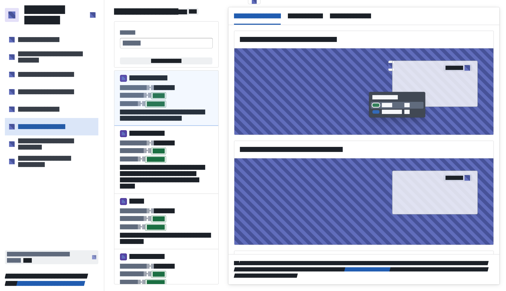

<!-- source: https://palantir.com/docs/foundry/workshop/redact-mode/ · mirrored 2026-08-18 from Palantir Foundry docs -->

# Redact mode

Redact mode visually obfuscates the visible content of a Workshop application so you can share the layout and structure of a module without exposing the underlying data. Use redact mode when you take screenshots or share your screen and want to hide the underlying data. Redact mode differs from [kiosk mode](/docs/foundry/workshop/kiosk-mode/), which restricts permissions; redact mode does not.

:::callout{theme="warning"}
Redact mode is a visual aid only and is not a security feature. Workshop still loads and processes the underlying data; redact mode only changes how the page renders. Do not rely on redact mode to protect sensitive information from a determined viewer with access to your browser session.
:::

## Enable redact mode

Append the query parameter `?workshop_enableRedactMode=true` to the URL of any Workshop module to enable redact mode. The parameter persists in the URL across in-application navigation, so reloading the page or copying the URL preserves the redacted state.

## What redact mode changes

When redact mode is on, Workshop changes how the page renders in the following ways:

* Workshop renders all text in a custom font that replaces each character with an obfuscated glyph, preserving the approximate length and shape of words.
* Workshop replaces icons and chart plot areas with a diagonal striped background.
* Workshop hides images, SVGs, canvases, videos, audio elements, and embedded iframes.

Module behavior does not change otherwise. Variables, events, actions, and data fetches run normally, and you can navigate, filter, and interact with the module as you would in any other session — only the page rendering changes.
