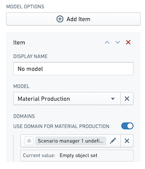
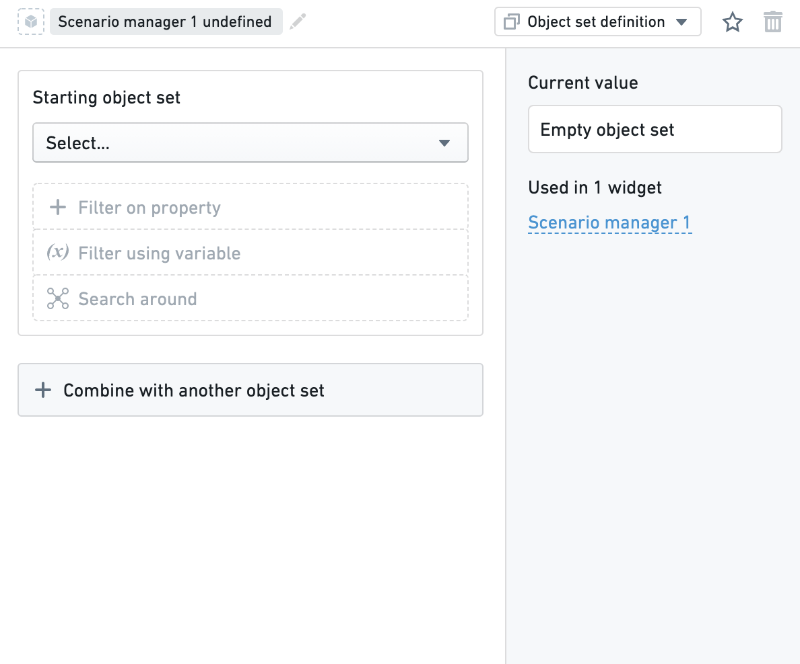

<!-- source: https://palantir.com/docs/foundry/workshop/scenarios-configure-domain/ · mirrored 2026-08-18 from Palantir Foundry docs -->

# Configure a domain

A [Domain](/docs/foundry/workshop/scenarios-concepts/#domains) describes the valid set over which a [Model](/docs/foundry/workshop/scenarios-concepts/#models) can be evaluated. It is important to define a domain for the model if you choose to use a model for your Scenario. Within the Scenario manager, you can select your model and define your domain.

For the **Model**, the core configuration options are the following:

* **Display name:** Title of the model.
* **Model:** Select the model to associate with the associated Scenario.
* **Domain:** Select the object set and filter criteria for the domain of the model. Note that the domain object type should match the object type shown in the selector.

Learn more about [Modeling in Foundry.](/docs/foundry/model-integration/overview/)

